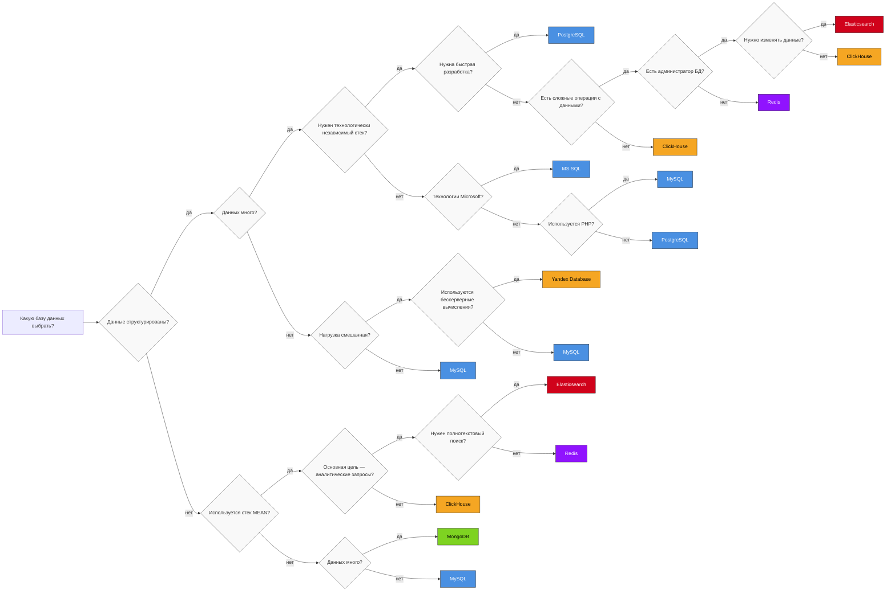

---
aliases:
  - выбрать базу данных
  - выбрать бд
  - какую базу выбрать
---

гайд по выбору базы

duarbility в распределенных базах

| База данных | Транзакционная поддержка (ACID) | Журналирование (WAL/Binary Logs) | Контрольные суммы       | Репликация             | Идемпотентность        | Eventual Consistency |
| ----------- | ------------------------------- | -------------------------------- | ----------------------- | ---------------------- | ---------------------- | -------------------- |
| PostgreSQL  | Да                              | Да (WAL)                         | Да                      | Синхронная/асинхронная | Нет                    | Нет                  |
| Cassandra   | Lightweight Transactions        | Нет                              | Да (на уровне хранения) | Асинхронная            | Да (через конфликты)   | Да                   |
| MongoDB     | На уровне документа             | Нет                              | Нет                     | Асинхронная            | Да (через поля версий) | Да                   |
| Oracle      | Да                              | Да                               | Да                      | Синхронная             | Да                     | Нет                  |
| MySQL       | Да (InnoDB)                     | Да (Binary Logs)                 | Нет                     | Асинхронная            | Нет                    | Нет                  |
| ClickHouse  | Нет                             | Нет                              | Да                      | Асинхронная            | Да                     | Да                   |