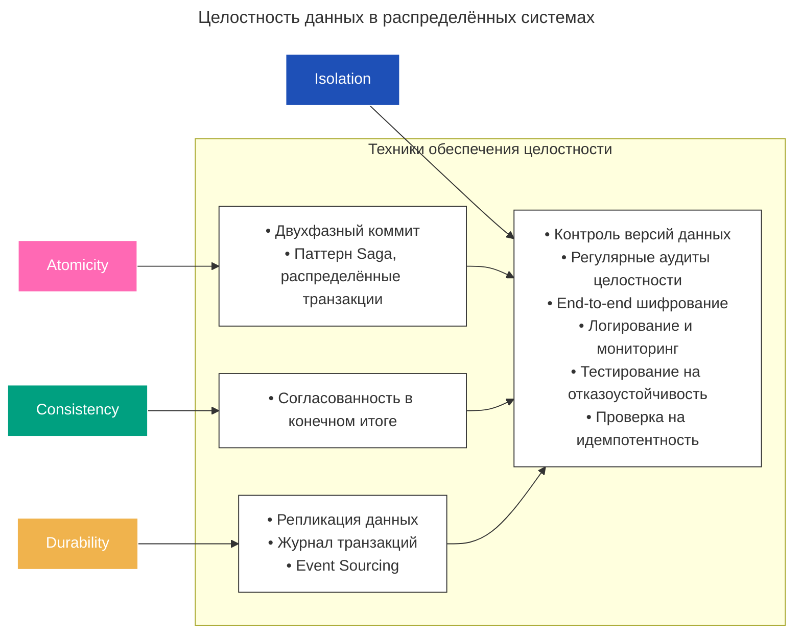
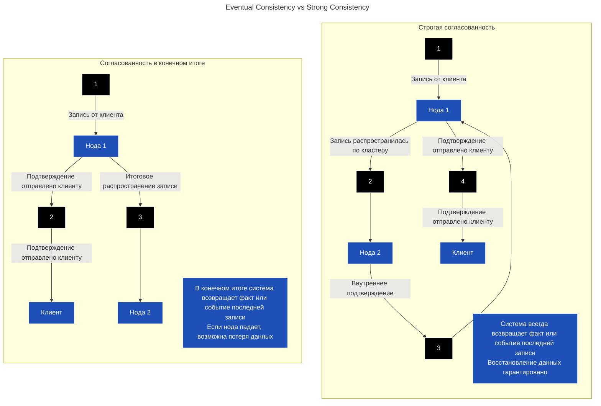

---
aliases:
  - Распределённые транзакции
  - микросервисы
  - Распределенные информационные системы
  - Распределенные информационные базы
---
Целостность данных в распределённых системах

# Распределенные информационные системы

Главная проблема распределенных информационных систем – [CAP-теорема](CAP-теорема.md)

При проектировании распределенной информационной системы приходится выбирать компромисс. Главная дилемма компромисса состоит в том, что для улучшения доступности системы, приходится снижать требования на к целостности и надежности. 
В частности принимать
* Eventual Consistency модель вместо Strong Consiostency
* Принимать механизмы допускающие потеряю данных
	* например LWW `Last write wins` как способ разрешения конфликтов

**Eventual Consistency vs Strong Consistency**

# Распределённые транзакции

Когда операции охватывают несколько сервисов, обеспечение согласованности и целостности данных требует управления распределёнными транзакциями. Распределённые транзакции сложны из-за необходимости поддерживать свойства [[ACID]] (Atomicity, Consistency, Isolation, Durability) в различных сервисах.

Распределённые транзакции координируют выполнение операций в нескольких сервисах, чтобы гарантировать, что все части транзакции либо зафиксируются, либо откатятся вместе. Для решения этих задач существуют разные подходы

Паттерны распределенных транзакций
* Способы обеспечить атомарность распределенных транзакций:
	* [[saga]]
	* [[two-phase-commit]]
* Способы компенсировать отсутствие атомарности для распределенных транзакций
	* [[Event Sourcing]]
	* [[CQRS]]

# Принцип нулевой потери данных
**Принцип нулевой потери данных** предполагает, что данные ни при каких обстоятельствах не должны теряться или повреждаться. В контексте требований [[ACID]] эту концепцию можно связать с устойчивостью (Durability)