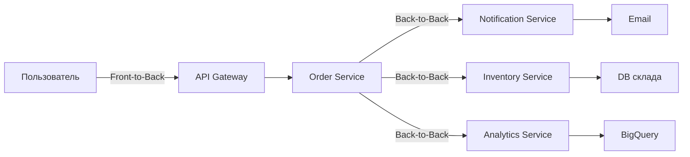
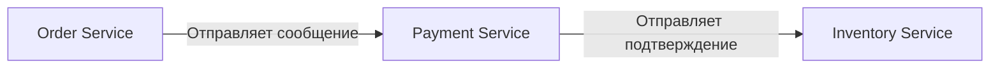
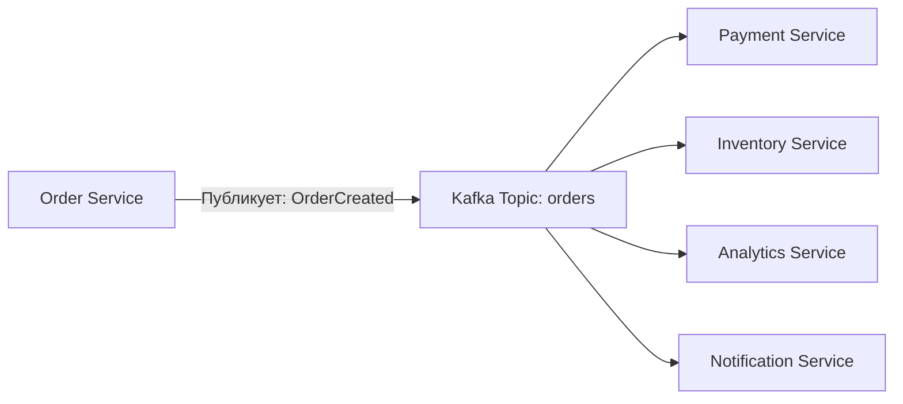
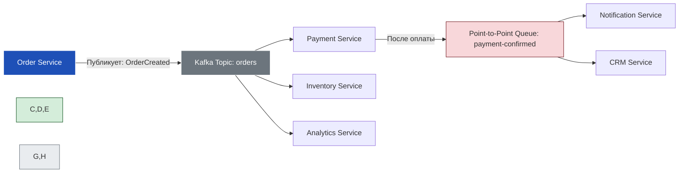
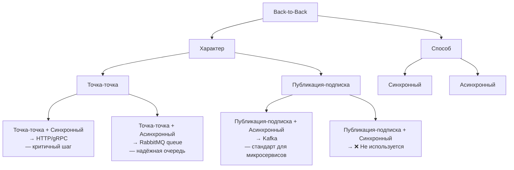

---
aliases:
  - Front-to-Back
  - Back-to-Back
---
Отличный вопрос!  
Термины **Front-to-Back** и **Back-to-Back** — не стандартные в общем контексте, но **в системах распределённой обработки данных, микросервисах и архитектуре потоков** они используются для описания **направления передачи данных между компонентами**.

---

## ✅ Определения (в контексте систем и архитектуры)

| Термин            | Значение                               | Объяснение                                                    |
| ----------------- | -------------------------------------- | ------------------------------------------------------------- |
| **Front-to-Back** | Данные идут **от фронтенда к бэкенду** | Клиент (браузер, мобильное приложение) → API → Бэкенд-сервисы |
| **Back-to-Back**  | Данные идут **между бэкенд-сервисами** | Сервис A → Сервис B → Сервис C (внутри бэкенда)               |

---

## ✅ Подробное объяснение

---

### 🔹 **Front-to-Back (Фронтенд → Бэкенд)**

> Это **классический HTTP-запрос от пользователя**.

#### 💬 Пример:
```text
Пользователь (фроненд) 
    → нажимает "Заказать" 
    → отправляет POST /orders 
    → API Gateway 
    → Order Service 
    → Payment Service 
    → Inventory Service 
    → возвращает ответ пользователю
```

#### ✅ Характеристики:
- **Протокол**: HTTP/HTTPS (REST, GraphQL)
- **Инициатор**: Клиент (пользователь, мобильное приложение)
- **Цель**: Выполнить действие пользователя
- **Типичные операции**: Создание заказа, авторизация, загрузка файла
- **Задержка**: Критична — пользователь ждёт ответа
- **Типичные инструменты**: Nginx, API Gateway, REST, JWT, OAuth

#### 📌 Где используется:
- Веб-приложения
- Мобильные приложения
- Любой интерфейс, где пользователь взаимодействует с системой

> 💬 _“Front-to-back — это когда пользователь говорит: ‘Сделай это!’”_

---

### 🔹 **Back-to-Back (Бэкенд → Бэкенд)**

> Это **внутренняя коммуникация между сервисами**, без участия пользователя.

#### 💬 Пример:
```text
Order Service (после создания заказа)
    → публикует событие "OrderCreated" в Kafka
    → Notification Service подписался → отправляет email
    → Analytics Service → записывает событие в BigQuery
    → Inventory Service → уменьшает остаток
```

#### ✅ Характеристики:
- **Протокол**: Kafka, gRPC, RabbitMQ, gRPC, HTTP (внутренний)
- **Инициатор**: Сервис (не пользователь)
- **Цель**: Синхронизация, аудит, уведомления, обработка событий
- **Типичные операции**: Обновление кеша, генерация отчётов, рассылка уведомлений
- **Задержка**: Менее критична — можно асинхронно
- **Типичные инструменты**: Kafka, RabbitMQ, Event Sourcing, CQRS, Debezium

#### 📌 Где используется:
- Микросервисные архитектуры
- Событийно-ориентированные системы
- ETL-процессы
- Интеграции между системами

> 💬 _“Back-to-back — это когда система говорит: ‘А я всё равно должен что-то сделать!’”_

---

## ✅ Сравнение: Front-to-Back vs Back-to-Back

| Критерий | **Front-to-Back** | **Back-to-Back** |
|----------|-------------------|------------------|
| **Инициатор** | Пользователь (фронтенд) | Сервис (бэкенд) |
| **Цель** | Выполнить действие пользователя | Выполнить внутреннюю логику |
| **Протокол** | HTTP/REST/GraphQL | Kafka, gRPC, RabbitMQ, HTTP (внутренний) |
| **Задержка** | Критична (пользователь ждёт) | Некритична (можно асинхронно) |
| **Надёжность** | Высокая (клиент может повторить) | Очень высокая (требуется exactly-once) |
| **Масштабируемость** | Горизонтальная (много клиентов) | Горизонтальная (много сервисов) |
| **Типичный паттерн** | Request-Response | Event-Driven / Pub/Sub |
| **Пример** | Пользователь оформляет заказ | После заказа — отправляется email и обновляется склад |
| **Логирование** | Логи запросов, трассировка (OpenTelemetry) | Логи событий, трассировка по ID события |
| **Безопасность** | Аутентификация (JWT, OAuth) | Межсервисная аутентификация (mTLS, API ключи) |

---

## ✅ Визуализация: Как они связаны



> 🔁 **Front-to-Back** — начало цепочки.  
> 🔁 **Back-to-Back** — продолжение, реакция на событие.


✅ Почему это важно?

| Ситуация                                                | Что будет, если перепутать?                             |
| ------------------------------------------------------- | ------------------------------------------------------- |
| ❌ Использовать HTTP для back-to-back                    | Слишком много соединений, медленно, не надёжно          |
| ❌ Использовать Kafka для front-to-back                  | Пользователь не получит мгновенный ответ — плохо для UX |
| ✅ Правильно: Front-to-Back = HTTP, Back-to-Back = Kafka | Система масштабируется, надёжна, отзывчива              |


✅ Финальный вывод

| | **Front-to-Back** | **Back-to-Back** |
|--|-------------------|------------------|
| **Кто инициирует?** | Пользователь | Сервис |
| **Цель** | Ответить пользователю | Выполнить бизнес-логику |
| **Протокол** | HTTP/REST/GraphQL | Kafka, gRPC, RabbitMQ |
| **Задержка** | Низкая (важна для UX) | Высокая (допустима) |
| **Типичный паттерн** | Request-Response | Event-Driven |
| **Пример** | “Закажи пиццу” | “После заказа — отправить email” |

> 💬 _“Front-to-back is for users. Back-to-back is for systems.”_

---


Отлично!  
Вы хотите глубоко разобрать **паттерн `Back-to-Back`** — то есть **внутреннюю коммуникацию между бэкенд-сервисами**, и его два ключевых подтипа:

- ✅ **Точка-точка (Point-to-Point)**  
- ✅ **Публикация-подписка (Publish-Subscribe)**

Эти паттерны лежат в основе **микросервисных архитектур**, **систем событий** и **асинхронной обработки данных**.

---

## ✅ Что такое **Back-to-Back**?

> **Back-to-Back** — это **внутренняя передача данных между сервисами бэкенда**, **без участия клиента**.  
> Это **не запрос от пользователя**, а **реакция системы на событие**.

### 💬 Пример:
```text
Order Service создал заказ → 
    → уведомляет Payment Service → 
    → Payment Service успешно обработал платёж → 
    → уведомляет Inventory Service → 
    → Inventory Service уменьшил остаток → 
    → уведомляет Notification Service → 
    → Notification Service отправил email
```

Все эти шаги — **Back-to-Back**.

---

## ✅ 1. **Точка-точка (Point-to-Point)**

> Сервис **отправляет сообщение напрямую одному другому сервису** — один отправитель, один получатель.

### 🔧 Как работает:


- **Одно сообщение → одному получателю**
- Часто используется **очереди сообщений** (например, RabbitMQ queues)

### ✅ Плюсы:
- ✅ **Гарантированная доставка** — очередь сохраняет сообщение, пока получатель не обработает
- ✅ **Последовательная обработка** — сообщения обрабатываются по очереди
- ✅ **Простота** — понятная логика: “кто отправил — кому должен ответить”

### ❌ Минусы:
- ❌ **Жёсткая связь** — если получатель упал, сообщение может потеряться (если нет retry)
- ❌ **Нет масштабирования по получателям** — нельзя послать одному сообщению нескольким сервисам
- ❌ **Сложно добавлять новые потребители** — нужно менять логику отправителя

### 📌 Где используется:
- **Задачи в очереди**: оплата заказа, отправка email, генерация PDF
- **Рабочие процессы с последовательными шагами**
- Пример:  
  `OrderCreated → Payment → Inventory → Notification`

> 💬 _“Point-to-point — это как передать письмо руками одному человеку.”_

---

## ✅ 2. **Публикация-подписка (Publish-Subscribe)**

> Сервис **публикует событие** — и **любой сервис, который на него подписан**, получает его.

### 🔧 Как работает:


- Один источник → много получателей
- Используются **брокеры событий**: Kafka, RabbitMQ (с exchange), NATS, Pulsar

### ✅ Плюсы:
- ✅ **Слабая связанность** — сервисы не знают друг о друге
- ✅ **Легко добавлять новых потребителей** — просто подпишитесь на топик
- ✅ **Масштабируемость** — можно запустить несколько экземпляров одного сервиса
- ✅ **Поддержка Event Sourcing и CQRS** — основа современных архитектур

### ❌ Минусы:
- ❌ **Сложнее отлаживать** — кто получил событие? Почему?
- ❌ **Риск дублирования** — если не настроить exactly-once delivery
- ❌ **Нет гарантии порядка** — если не использовать partitioning и key-based routing

### 📌 Где используется:
- Событийно-ориентированные системы
- Микросервисы с разрозненной логикой
- Пример:  
  `OrderCreated` →  
  → Payment Service (оплачивает)  
  → Inventory Service (снижает остаток)  
  → Analytics (записывает в BigQuery)  
  → Notification (шлёт email)  
  → Search Index (обновляет Elasticsearch)

> 💬 _“Pub/Sub — это как выложить объявление в газету: все, кто заинтересован, прочитают.”_

---

## ✅ Сравнение: Point-to-Point vs Pub/Sub

| Критерий | **Point-to-Point** | **Publish-Subscribe** |
|----------|---------------------|------------------------|
| **Количество получателей** | 1 | Много |
| **Связанность** | Высокая (жёсткая) | Низкая (слабая) |
| **Масштабируемость** | ❌ Плохо | ✅ Отлично |
| **Добавление нового потребителя** | ❌ Нужно менять отправителя | ✅ Просто подпишитесь |
| **Надёжность** | ✅ Высокая (очередь) | ✅ Высокая (при правильной настройке) |
| **Порядок сообщений** | ✅ Гарантирован | ⚠️ Зависит от топика/партиций |
| **Используется в** | Рабочие процессы (workflow) | Event Sourcing, CQRS, микросервисы |
| **Инструменты** | RabbitMQ (queues), SQS | Kafka, NATS, Pulsar, RabbitMQ (topic exchange) |
| **Пример** | “Заказ → Оплата → Отправка” | “Заказ создан → обновить склад, email, аналитику” |

---

## ✅ Когда что использовать?

| Ваша задача | Рекомендация |
|-------------|--------------|
| ✅ Последовательная цепочка действий: A → B → C | ➤ **Point-to-Point** |
| ✅ Один тип события → несколько сервисов должны отреагировать | ➤ **Pub/Sub** |
| ✅ Нужно добавить новый сервис без изменения существующих | ➤ **Pub/Sub** |
| ✅ Нужна гарантия, что каждое сообщение обработается ровно один раз | ➤ **Point-to-Point** (с ACK) |
| ✅ Система растёт — появляются новые потребители событий | ➤ **Pub/Sub** |
| ✅ Вы строите систему с Event Sourcing | ➤ **Pub/Sub** |

---

## ✅ Визуализация: Как они работают вместе



> 🔁 **Pub/Sub** — для широкой рассылки событий  
> 🔁 **Point-to-Point** — для последовательной обработки

---

## ✅ Финальный вывод

| Паттерн | Что делает | Аналогия |
|--------|------------|----------|
| **Point-to-Point** | Один сервис → один сервис | Передача письма через курьера |
| **Pub/Sub** | Один сервис → много сервисов | Публикация в газете — все, кто читает, получают |

> 💬 _“Point-to-point is for workflows. Pub/sub is for reactions.”_

---

## 📚 Где учиться дальше?

- Book: *“Designing Data-Intensive Applications”* — Martin Kleppmann  
- YouTube: *“Kafka vs RabbitMQ”* — TechWorld with Nana  
- [Kafka Docs: Producer/Consumer](https://kafka.apache.org/documentation/)  
- [RabbitMQ Tutorials](https://www.rabbitmq.com/getstarted.html)

---

✅ **Теперь вы знаете:**  
- Когда использовать **точку-точку** (для цепочек)  
- Когда использовать **публикацию-подписку** (для реакций)  
- Как они дополняют друг друга в реальных системах

📌 Сохраните эту таблицу — она станет основой вашей **архитектуры микросервисов и событийных систем**.

Отлично!  
Вы хотите **глубоко разобрать паттерн `Back-to-Back`** — внутреннюю коммуникацию между бэкенд-сервисами — по двум ключевым осям:

1. **Характер взаимодействия** → *Точка-точка* vs *Публикация-подписка*  
2. **Способ взаимодействия** → *Синхронный* vs *Асинхронный*

Это **фундаментальная матрица**, которая помогает выбрать правильный паттерн для любой микросервисной системы.

---

## ✅ Что такое **Back-to-Back**?

> **Back-to-Back** — это **внутренняя передача данных между сервисами бэкенда**, **без участия клиента**.  
> Это **не HTTP-запрос от пользователя**, а **реакция системы на событие**.

Пример:  
`OrderService` создал заказ → уведомляет `PaymentService` → тот обрабатывает платёж → уведомляет `InventoryService` → тот обновляет склад.

---

## ✅ 1. Характер взаимодействия

### 🔹 1.1 **Точка-точка (Point-to-Point)**

> **Один отправитель → один получатель**.  
> Сообщение направлено **конкретному сервису**, и ожидается его обработка.

#### 💬 Пример:
```text
OrderService → [очередь "payment-requests"] → PaymentService
```

- PaymentService — единственный потребитель очереди.
- Если он упал — сообщение остаётся в очереди до восстановления.
- После обработки — сообщение удаляется.

#### ✅ Когда использовать:
- Последовательные рабочие процессы (workflows)
- Где важно: **один раз, точно, в порядке**
- Примеры: оплата → отправка → уведомление

#### 📌 Характеристики:
| Характеристика | Значение |
|----------------|----------|
| Получателей | 1 |
| Связанность | Высокая (жёсткая) |
| Масштабируемость | Низкая (нельзя добавить второго потребителя без изменений) |
| Надёжность | Высокая (очередь + ACK) |
| Используется в | RabbitMQ queues, SQS, Kafka (с consumer group) |

> 💬 _“Point-to-point — это как передать письмо конкретному человеку.”_

---

### 🔹 1.2 **Публикация-подписка (Publish-Subscribe)**

> **Один отправитель → множество получателей**.  
> Сервис **публикует событие** — и **все подписчики** получают его.

#### 💬 Пример:
```text
OrderService → [топик "order.created"] → 
    → PaymentService  
    → InventoryService  
    → AnalyticsService  
    → NotificationService
```

- Все сервисы подписались на топик `order.created`
- Каждый обрабатывает событие по-своему
- Новый сервис? Просто подпишитесь — не меняя отправителя!

#### ✅ Когда использовать:
- Реакция на одно событие несколькими сервисами
- Event Sourcing, CQRS, микросервисы
- Примеры: после заказа — обновить склад, отправить email, записать в аналитику

#### 📌 Характеристики:
| Характеристика | Значение |
|----------------|----------|
| Получателей | Много |
| Связанность | Низкая (слабая) |
| Масштабируемость | Высокая (можно добавить новых подписчиков без изменений) |
| Надёжность | Высокая (при настройке exactly-once) |
| Используется в | Kafka, NATS, RabbitMQ (topic exchange), Pulsar |

> 💬 _“Pub/Sub — это как выложить объявление в газету: все, кто заинтересован, прочитают.”_

---

## ✅ 2. Способ взаимодействия

### 🔹 2.1 **Синхронный (Synchronous)**

> Отправитель **ждёт ответа** от получателя, прежде чем продолжить.

#### 💬 Пример:
```http
POST /orders HTTP/1.1
→ OrderService вызывает PaymentService: POST /pay
→ PaymentService отвечает: { "status": "success" }
→ OrderService сохраняет заказ
```

- Используется **HTTP/REST**, **gRPC**
- Отправитель **блокируется**, пока получатель не ответит

#### ✅ Плюсы:
- ✅ Простота логики
- ✅ Гарантия результата сразу
- ✅ Легко отлаживать

#### ❌ Минусы:
- ❌ **Высокая задержка** — ждёте ответа
- ❌ **Риск цепной нестабильности** — если PaymentService упал → весь процесс падает
- ❌ **Нет масштабирования** — каждый вызов требует ресурсов

#### 📌 Где использовать:
- Когда **результат критичен для продолжения**
- Пример: оплата перед созданием заказа

> 💬 _“Синхронный — это как спросить у коллеги: ‘Ты сделал?’, и ждать ответа.”_

---

### 🔹 2.2 **Асинхронный (Asynchronous)**

> Отправитель **не ждёт ответа** — он просто отправляет сообщение и идёт дальше.

#### 💬 Пример:
```text
OrderService → публикует событие "OrderCreated" в Kafka → сразу возвращает 201 клиенту
PaymentService → подписался → обрабатывает в фоне
InventoryService → тоже подписался → обрабатывает в фоне
```

- Используется **Kafka, RabbitMQ, gRPC streaming**
- Отправитель **не знает**, когда и как получатель обработает

#### ✅ Плюсы:
- ✅ **Низкая задержка** — клиент получает ответ мгновенно
- ✅ **Высокая отказоустойчивость** — если сервис упал — сообщение ждёт
- ✅ **Масштабируемость** — можно запустить 10 экземпляров одного сервиса
- ✅ **Слабая связанность** — сервисы не зависят друг от друга

#### ❌ Минусы:
- ❌ **Сложнее отлаживать** — нет прямого ответа
- ❌ **Нужно отслеживать состояние** — “А обработалось ли?”
- ❌ **Риск потери данных** — если не настроить persistence и ACK

#### 📌 Где использовать:
- Когда **результат не критичен для немедленного ответа**
- Пример: отправка email, обновление аналитики, кеш

> 💬 _“Асинхронный — это как отправить SMS: ‘Сделал, как только смогу’.”_

---

## ✅ Комбинации: 4 типа взаимодействия

| Характер | Способ | Пример | Когда использовать |
|----------|--------|--------|---------------------|
| **Точка-точка + Синхронный** | `OrderService → HTTP → PaymentService` | Платёж перед созданием заказа | Критичный бизнес-процесс, где нужен мгновенный результат |
| **Точка-точка + Асинхронный** | `OrderService → RabbitMQ queue → PaymentService` | Очередь оплаты | Надёжно, но не ждём ответа — можно отложить |
| **Публикация-подписка + Синхронный** | ❌ **Редко** | Нет типичных примеров | Практически не используется — противоречит сути pub/sub |
| **Публикация-подписка + Асинхронный** | `OrderService → Kafka → Payment, Inventory, Analytics` | Обработка события в фоне | **Стандарт современных микросервисов** — рекомендуемый паттерн |

> ⚠️ **Синхронный Pub/Sub — почти не используется**, потому что:  
> - Pub/Sub предполагает **множество получателей**  
> - А синхронность — **ожидание одного ответа**  
> → Это конфликт. Лучше использовать **асинхронный**.

---

## ✅ Финальная матрица: Как выбрать?

| Ваша цель | Характер | Способ | Рекомендация |
|-----------|----------|--------|--------------|
| ✅ **Один сервис должен обработать запрос, и результат критичен** | Точка-точка | Синхронный | `HTTP/gRPC` → ждём ответ |
| ✅ **Один сервис должен обработать запрос, но можно отложить** | Точка-точка | Асинхронный | `RabbitMQ queue` → обработает позже |
| ✅ **Несколько сервисов должны реагировать на событие** | Публикация-подписка | Асинхронный | `Kafka` — лучший выбор |
| ✅ **Нужно сразу узнать результат от нескольких сервисов** | ❌ Нет стандартного решения | — | Пересмотрите архитектуру — возможно, нужно объединить события |

> 💡 **Золотое правило:**  
> **“Публикация-подписка + асинхронный” — это стандарт для масштабируемых систем.**  
> **“Точка-точка + синхронный” — только для критичных шагов, где нужен мгновенный результат.**

---

## ✅ Визуализация: Все 4 комбинации



---

## ✅ Финальный вывод

| Паттерн | Когда использовать |
|--------|---------------------|
| **Точка-точка + Синхронный** | Когда **нужен мгновенный ответ** и **только один получатель** (например, оплата перед созданием заказа) |
| **Точка-точка + Асинхронный** | Когда **нужна надёжность**, но **не нужен мгновенный ответ** (очередь задач) |
| **Публикация-подписка + Асинхронный** | Когда **одно событие должно вызвать несколько реакций** (обновление склада, email, аналитика) — **основной паттерн современных систем** |
| **Публикация-подписка + Синхронный** | ❌ Не используйте — противоречит логике |

> 💬 _“Синхронность — для связи. Асинхронность — для масштаба.  
> Точка-точка — для порядка. Публикация-подписка — для гибкости.”_

---

## 📚 Где учиться дальше?

- Book: *“Designing Data-Intensive Applications”* — Martin Kleppmann  
- YouTube: *“Microservices Communication Patterns”* — TechWorld with Nana  
- [Kafka Docs: Producer/Consumer](https://kafka.apache.org/documentation/)  
- [RabbitMQ Tutorials](https://www.rabbitmq.com/getstarted.html)

---

✅ **Теперь вы можете выбрать правильный паттерн** для любого сценария внутри бэкенда.  
📌 Сохраните эту матрицу — она станет вашей **архитектурной заповедью**.