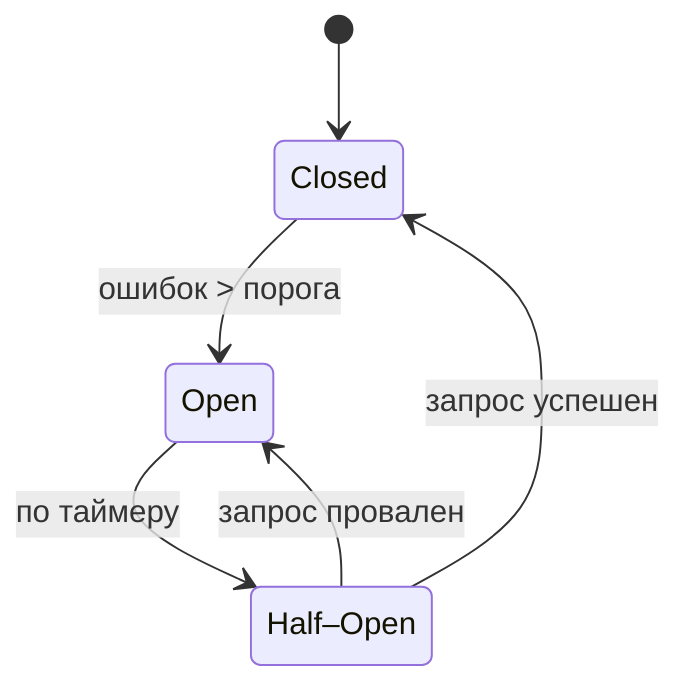

**Circuit Breaker (предохранитель)** — это **ключевой паттерн устойчивости (resilience)** в распределённых системах. Он защищает приложение от **каскадных сбоев**, когда один медленный или недоступный сервис может "завалить" всю систему.

> 💡 Аналогия: как **электрический предохранитель** в доме — при перегрузке он **отключает цепь**, чтобы не сгорела проводка.

---

## 🔥 Проблема, которую решает Circuit Breaker

Представьте: ваш сервис **вызывает внешний API** (платёжный шлюз, email-сервис и т.д.).

Без Circuit Breaker:
1. Внешний сервис **падает или отвечает за 30 секунд**.
2. Ваш сервис **ждёт ответа** (блокирующий вызов или таймаут).
3. Пока он ждёт — **его потоки/ресурсы заняты**.
4. При высокой нагрузке — **все потоки исчерпаны** → ваш сервис **недоступен**, даже если другие функции работают.

👉 Это **каскадный отказ (cascading failure)**.

---

## 🛡️ Как работает Circuit Breaker

Предохранитель имеет **три состояния**:

1. **Closed (Закрыт) — нормальная работа**
	- Запросы проходят к внешнему сервису.
	- Считается количество **ошибок** (исключения, таймауты).
	- Если ошибок **меньше порога** — всё ок.

2. **Open (Открыт) — отказ**
	- Если ошибок **больше порога за окно времени** → предохранитель **"срабатывает"**.
	- Все новые запросы **немедленно отклоняются** (без вызова внешнего сервиса!).
	- Возвращается **fallback-ответ** (кэш, заглушка, ошибка).
	- Это **освобождает ресурсы** и даёт внешнему сервису **время на восстановление**.

3. **Half-Open (Полуоткрыт) — проверка**
	- Через **задержку (timeout)** предохранитель переходит в Half-Open.
	- **Один запрос** пропускается к внешнему сервису.
	- Если **успешен** → состояние возвращается в **Closed**.
	- Если **ошибка** → снова **Open**, и таймер сбрасывается.



---

## 📊 Параметры Circuit Breaker

| Параметр | Описание | Пример |
|---------|----------|--------|
| **Failure Threshold** | Доля ошибок, при которой срабатывает | 50% ошибок за 10 сек |
| **Timeout** | Время в состоянии Open перед проверкой | 30 секунд |
| **Minimum Requests** | Минимум запросов для оценки | 10 запросов за окно |
| **Sliding Window** | Тип окна: count-based или time-based | последние 10 сек или 20 запросов |

---

## 💡 Пример на Java (с Resilience4j)

Resilience4j — современная библиотека для Java (легковесная, функциональная).

1. Зависимость
```xml
<dependency>
    <groupId>io.github.resilience4j</groupId>
    <artifactId>resilience4j-circuitbreaker</artifactId>
</dependency>
```

2. Настройка
```java
CircuitBreakerConfig config = CircuitBreakerConfig.custom()
    .failureRateThreshold(50) // >50% ошибок → Open
    .waitDurationInOpenState(Duration.ofSeconds(30))
    .slidingWindow(10, 10, CircuitBreakerConfig.SlidingWindowType.COUNT_BASED)
    .build();

CircuitBreaker circuitBreaker = CircuitBreaker.of("paymentService", config);
```

3. Использование
```java
Supplier<String> paymentCall = () -> externalPaymentService.process();

// Декорируем вызов
Supplier<String> decorated = CircuitBreaker
    .decorateSupplier(circuitBreaker, paymentCall);

// Выполняем с fallback
String result = Try.ofSupplier(decorated)
    .recover(throwable -> "Платёж временно недоступен") // fallback
    .get();
```

4. Состояние в логах (при срабатывании)
```
CircuitBreaker 'paymentService' changed state from CLOSED to OPEN
```

---

## 🧩 Circuit Breaker + другие паттерны

Часто комбинируется с:

| Паттерн      | Роль                                                      |
| ------------ | --------------------------------------------------------- |
| **Retry**    | Повторить запрос до срабатывания предохранителя           |
| **Timeout**  | Ограничить время ожидания (иначе CB не сработает)         |
| **Bulkhead** | Ограничить количество потоков на вызов (изолировать сбой) |
| **Fallback** | Вернуть альтернативный результат при срабатывании         |

> 🔌 В Resilience4j и Hystrix все эти паттерны интегрированы.

---

## 🆚 Circuit Breaker vs Timeout

| Подход              | Плюсы                            | Минусы                                                                 |
| ------------------- | -------------------------------- | ---------------------------------------------------------------------- |
| **Только Timeout**  | Простота                         | Потоки заняты до таймаута → при высокой нагрузке — исчерпание ресурсов |
| **Circuit Breaker** | Быстрый отказ, экономия ресурсов | Сложнее настроить, нужен fallback                                      |

> ✅ **Идеально: Timeout + Circuit Breaker**  
> Таймаут ограничивает время одного запроса, а CB — общее количество неудач.

---

## 🌐 Реальные примеры fallback

| Сценарий | Fallback-действие |
|---------|-------------------|
| Платёжный сервис | Сохранить заказ в статусе "ожидает оплаты" |
| Email-сервис | Отложить отправку, логировать |
| Каталог товаров | Вернуть кэшированный список |
| Рекомендации | Вернуть популярные товары |

---

## ⚠️ Важные нюансы

1. **Не делайте CB глобальным** — на каждый внешний сервис свой предохранитель.
2. **Мониторинг обязателен**: логируйте переходы состояний, стройте дашборды.
3. **Тестируйте**: используйте chaos engineering (например, Chaos Monkey) для проверки.
4. **Избегайте "thrashing"**: если Half-Open слишком короткий → CB будет дёргаться между Open/Closed.

---

## 🎯 Итог

> **Circuit Breaker — это страховка от каскадных сбоев.**  
> Он:
> - Быстро отклоняет запросы к "больному" сервису
> - Экономит ресурсы приложения
> - Даёт время на восстановление
> - Позволяет грациозно деградировать функциональность (через fallback)
