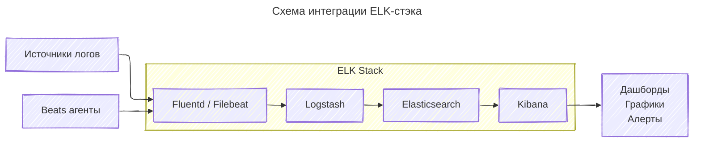
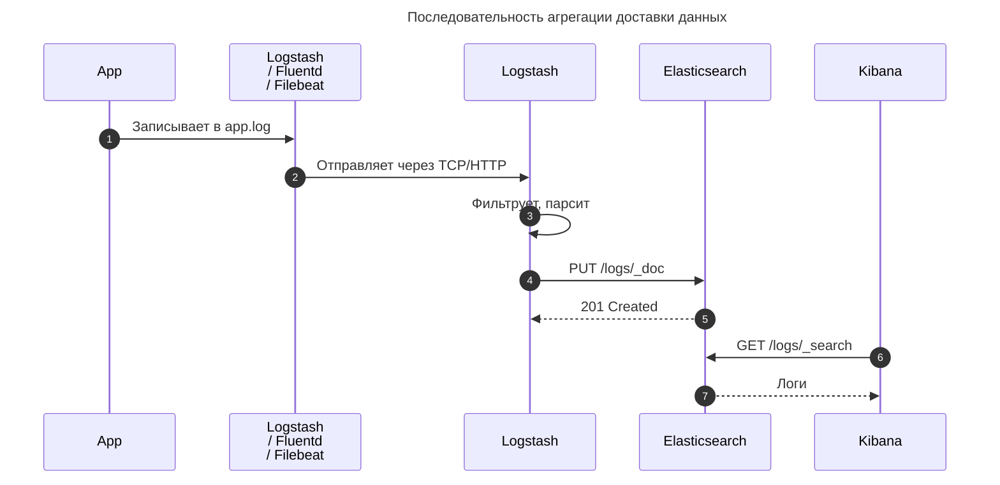

---
aliases:
  - ELK
  - Elastic Stack
  - ELK‑стек
---
## ELK‑стек: что это и как работает

**ELK‑стек** (теперь чаще называют **Elastic Stack**) — набор инструментов с открытым исходным кодом для сбора, хранения, анализа и визуализации логов и других данных. Название складывается из первых букв трёх основных компонентов: **[[Elasticsearch]]**, **[[Logstash]]**, **[[Kibana]]**. Позже к ним добавился **Beats** — лёгкий агент сбора данных.

Схема интеграции

Доставка логов

### Состав стека

1. **[[Elasticsearch]]**
	- **Что это**: распределённая поисковая и аналитическая база данных в реальном времени.
	- **Функции**:
	- хранение и индексация данных;
	- быстрый поиск по большим объёмам;
	- агрегация и анализ (суммы, средние, процентили);
	- масштабирование через шардирование и репликацию.

2. **[[Logstash]]**
	- **Что это**: конвейер обработки данных (pipeline).
	- **Функции**:
	- приём данных из разных источников (логи, базы, API);
	- фильтрация и преобразование (очистка, парсинг, обогащение);
	- отправка в Elasticsearch или другие системы.
	- **Пример**: читает файл `access.log`, выделяет IP, метод запроса, код ответа, отправляет в ES.

3. **[[Kibana]]**
	- **Что это**: веб‑интерфейс для визуализации и анализа.
	- **Функции**:
	- дашборды с графиками, таблицами, картами;
	- поиск и фильтрация по данным;
	- алерты и отчёты;
	- машинное обучение (аномалии, прогнозы).

4. **Beats** (семейство агентов)
	- **Что это**: лёгкие сборщики данных, работающие на клиентах.
	- **Основные виды**:
	- *Filebeat* — логи из файлов;
	- *Metricbeat* — метрики системы (CPU, память, сеть);
	- *Packetbeat* — сетевой трафик;
	- *Winlogbeat* — события Windows;
	- *Auditbeat* — аудит безопасности.
	- **Особенности**: малый расход ресурсов, шифрование, буферизация при потере связи.

### Как работает ELK‑стек (поток данных)

1. **Сбор данных**
 - Beats на серверах/устройствах собирают логи/метрики.
 - Или внешние системы отправляют данные в Logstash.

2. **Обработка**
 - Logstash парсит, фильтрует, обогащает данные (например, определяет гео‑IP).
 - При необходимости применяет преобразования (Grok, JSON, CSV).

3. **Хранение и индексация**
 - Данные отправляются в Elasticsearch, где индексируются для быстрого поиска.

4. **Визуализация и анализ**
 - Kibana подключается к Elasticsearch, строит графики, дашборды, ищет аномалии.

5. **Алерты и действия**
 - Kibana или сторонние инструменты отправляют уведомления при триггерах.

### Типичные сценарии использования

- **Анализ логов приложений**
- поиск ошибок, трассировка запросов, аудит безопасности.
- **Мониторинг инфраструктуры**
- CPU, память, диск, сеть; алерты на аномалии.
- **Безопасность (SIEM)**
- обнаружение вторжений, анализ событий Windows/Linux.
- **Бизнес‑аналитика**
- анализ пользовательского поведения, конверсий, транзакций.
- **Сетевая аналитика**
- трассировка трафика, выявление узких мест.

### Плюсы ELK‑стека

- **Открытость**: бесплатный core‑продукт (Elasticsearch, Logstash, Kibana, Beats).
- **Масштабируемость**: работает с петабайтами данных.
- **Гибкость**: поддержка разных форматов (JSON, CSV, syslog).
- **Богатая экосистема**: плагины, интеграционные шаблоны, сообщество.
- **Реальное время**: анализ данных с задержкой в секунды.

### Минусы и ограничения

- **Сложность настройки**: требует знаний Elasticsearch, Logstash‑конфигураций.
- **Ресурсоёмкость**: Elasticsearch нуждается в оперативной памяти и CPU.
- **Безопасность «из коробки»**: базовые функции бесплатны, продвинутые (шифрование, RBAC) — в платных версиях.
- **Задержка обработки**: Logstash может стать узким местом при высоких нагрузках.

### Альтернативы

- **Grafana Loki** — легковесный аналог для логов (меньше ресурсов, но слабее аналитика).
- **Splunk** — коммерческое решение с расширенной аналитикой.
- **Graylog** — открытая платформа для логов с веб‑интерфейсом.
- **AWS CloudWatch + Athena** — облачное решение от Amazon.

### Версии и развёртывание

- **Elastic Stack OSS** — открытая версия (бесплатно).
- **Elastic Stack Enterprise** — платная версия с дополнительными функциями (SIEM, машинное обучение, поддержка).
- **Развёртывание**: Docker, Kubernetes, облачные сервисы (Elastic Cloud), bare metal.

### Пример рабочего процесса

1. Установить Beats на сервера для сбора логов Apache.
2. Настроить Logstash для парсинга логов (выделение IP, URL, кода ответа).
3. Отправить данные в Elasticsearch.
4. В Kibana создать дашборд:
 - график запросов по часам;
 - таблица топ‑ошибок (5xx);
 - карта по IP‑геолокации.
5. Настроить алерты: «>100 ошибок 5xx за 5 мин → Slack».

### Итог

ELK‑стек — это **универсальная платформа для работы с данными**, особенно логами и метриками. Он позволяет:
- собирать данные из разнородных источников;
- преобразовывать и обогащать их;
- хранить и индексировать для быстрого поиска;
- визуализировать и анализировать через Kibana;
- реагировать на инциденты через алерты.