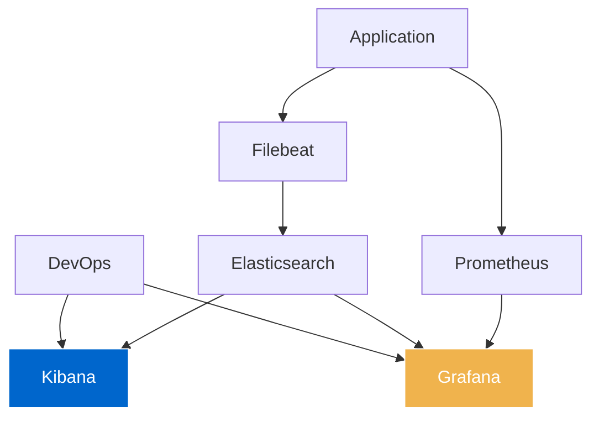
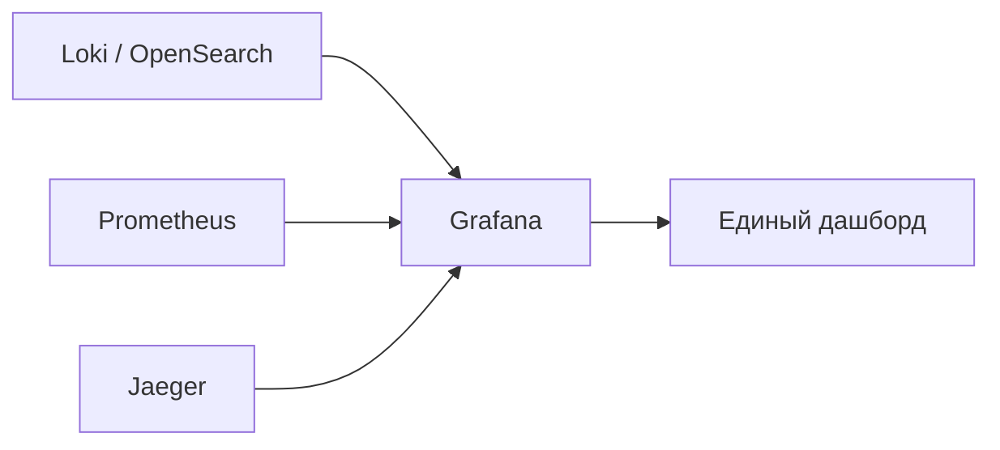

**Kibana** и **[[Grafana]]** — это два популярных инструмента визуализации, но они созданы для разных целей.  

## ✅ Краткий ответ:

| Характеристика               | **Kibana**                                       | **Grafana**                                                                 |
| ---------------------------- | ------------------------------------------------ | --------------------------------------------------------------------------- |
| **Основное назначение**      | Поиск и анализ логов                             | Визуализация метрик и мониторинг                                            |
| **Ядро**                     | [[Elasticsearch]] / OpenSearch                   | Любой источник (Prometheus, InfluxDB, MySQL)                                |
| **Лучше всего подходит для** | Текст, логи, full-text search                    | Графики, дашборды, алерты по метрикам                                       |
| **Источники данных**         | Только Elastic/OpenSearch                        | Prometheus, Graphite, Loki, Influx, MySQL, PostgreSQL, AWS CloudWatch и др. |
| **Аналитика логов**          | ✅ Отлично                                        | ❌ Слабее                                                                    |
| **Метрики (CPU, Memory)**    | Можно                                            | ✅ Идеально                                                                  |
| **Поиск по тексту**          | ✅ Очень мощный                                   | ⚠️ Только если используется Loki или OpenSearch                             |
| **Гибкость источников**      | ❌ Только Elastic-экосистема                      | ✅ Поддерживает 50+ источников                                               |
| **UI / UX**                  | Сложнее, зато гибче                              | Простое, красивое, понятное                                                 |
| **Стоимость**                | Бесплатная версия + платные фичи (Elastic Cloud) | Grafana Cloud — Freemium                                                    |
| **Open Source**              | Да, но Elastic изменила лицензию (SSPL)          | Да — Apache 2.0                                                             |

> 🔑 **Kibana = "Найти любой лог"**  
> **Grafana = "Покажи мне графики CPU, latency, ошибки"**

---

## ✅ 1. Что такое Kibana?

> **Kibana** — это **визуализационный интерфейс для Elasticsearch** (или OpenSearch).  
> Создана компанией Elastic, как часть **[[ELK]]-стека**:  
> `Elasticsearch` → `Logstash/Filebeat` → `Kibana`

### 💡 Основные возможности:
- Full-text search по логам
- Анализ JSON-логов
- Создание сложных запросов (`query`, `aggregations`)
- Мониторинг производительности через APM
- Security & SIEM (обнаружение угроз)
- Machine Learning (аномалии)

### 📊 Где используется?
- [[DevOps]], [[SRE]]
- Поиск ошибок в микросервисах
- Безопасность ([[SIEM]]): поиск атак
- Аудит: кто, когда и что делал

---

## ✅ 2. Что такое Grafana?

> **Grafana** — это **платформа для визуализации и анализа метрик**.  
> Работает с **любым источником данных**.

### 💡 Основные возможности:
- Потрясающие графики и дашборды
- Поддержка: [[Prometheus]], Loki, InfluxDB, MySQL, [[PostgreSQL]], CloudWatch, Azure Monitor
- Alerting: настройка тревог
- Templating: динамические дашборды
- Multi-source: один дашборд → из 3 источников

### 📊 Где используется?
- Мониторинг [[software-engineer/технологии/kubernetes/Kubernetes]] (CPU, memory, pod restarts)
- Наблюдаемость ([[Observability]])
- CI/CD pipeline dashboards

---

## 🆚 Подробное сравнение

| Критерий | **Kibana** | **Grafana** |
|----------|-----------|------------|
| **Цель** | Логи, события, security | Метрики, графики, мониторинг |
| **Источник данных** | Только Elasticsearch / OpenSearch | Prometheus, InfluxDB, MySQL, Loki, AWS, Google Cloud |
| **Гибкость** | Низкая (привязана к Elastic) | Высокая (подключай что угодно) |
| **Поиск по логам** | ✅ Отличный (Lucene) | Зависит от источника (Loki — хуже) |
| **Визуализация метрик** | Делает, но не главная цель | ✅ Главная специализация |
| **Alerting** | Есть (Elastalert, Watcher) | ✅ Очень продвинутый (Contact Points, Templates) |
| **Шаблоны (Templating)** | Есть | ✅ Гораздо гибче |
| **Простота установки** | Требует Elasticsearch | Может работать с любым DB |
| **Кросс-источник** | Ограничен внутри стека | ✅ Да — можно совмещать Prometheus + MySQL + Loki |
| **Cost** | Elastic Cloud — дорого | Grafana Cloud — дешевле, open source бесплатно |
| **Лицензия** | SSPL (ограничения на SaaS) | Apache 2.0 — полностью open source |

---

## ✅ Пример: DevOps использует оба

→ **Kibana** — для поиска ошибок в логах  
→ **Grafana** — для просмотра нагрузки, p95, CPU

---

## ✅ Когда использовать Kibana?

| Сценарий                           | Рекомендация                     |
| ---------------------------------- | -------------------------------- |
| ✅ У вас уже есть Elasticsearch     | ➤ Kibana идеальна                |
| ✅ Нужен full-text search           | ➤ Kibana                         |
| ✅ SIEM, безопасность               | ➤ Kibana, встроенная защита      |
| ✅ Вам нужна аналитика по логам     | ➤ Kibana: Aggregations, Discover |
| ✅ Вы хотите просто UI для ES       | ➤ Kibana                         |
| ✅ Мониторинг Kubernetes            | ➤ Grafana + Prometheus           |
| ✅ Несколько источников данных      | ➤ Grafana                        |
| ✅ Красивые дашборды для CEO        | ➤ Grafana                        |
| ✅ Алерты по SLI/SLO                | ➤ Grafana Alertmanager           |
| ✅ Вы не хотите зависеть от Elastic | ➤ Grafana + OpenSearch/Loki      |

---

## ✅ Современные гибриды: **Grafana + OpenSearch**

> Многие компании используют:
- **Grafana** как **единую точку визуализации**
- **OpenSearch** (форк ES) как **поиск по логам**
- **Loki** — для логов без индексации
- **Prometheus** — для метрик

→ **Один интерфейс — все данные**

---

## ✅ Финальный вывод

|                     | **Kibana**                | **Grafana**              |
| ------------------- | ------------------------- | ------------------------ |
| **Что?**            | Логи, события             | Метрики, графики         |
| **Какой источник?** | Только Elastic/OpenSearch | Любая база               |
| **UI**              | Мощный, но сложный        | Чистый, простой, быстрый |
| **Для DevOps**      | ✅ Для логов               | ✅ Для метрик             |
| **Для SRE**         | ✅ SIEM                    | ✅ Observability          |
| **Для Product**     | ❌                         | ✅ Дашборды, аналитика    |
| **Best for**        | Поиск в логах             | Мониторинг и алерты      |

> 💬 _“Use Kibana when you need to find a needle in the haystack.”_  
> _“Use Grafana when you want to see the health of the entire stack.”_

---

✅ **Не выбирайте “один или другой”.**  
Выбирайте **по задаче**.

> 🔹 **Kibana — ваш детектив.**  
> 🔹 **Grafana — ваш доктор.**

