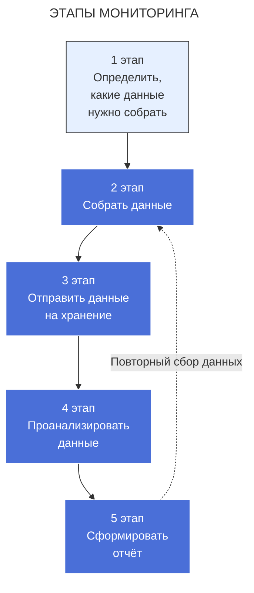

---
aliases:
  - Monitoring
  - Мониторинг
---
# Мониторинг информационных систем

## Что такое мониторинг?

**Мониторинг** — это непрерывный процесс сбора, анализа и использования информации для отслеживания состояния компонентов информационной системы с целью обеспечения их нормального функционирования и своевременного выявления проблем.

## Основные цели мониторинга

### **Операционные цели**
- Обнаружение сбоев и проблем в реальном времени
- Обеспечение доступности сервисов
- Снижение времени простоя (MTTR)
- Автоматическое оповещение ответственных лиц

### **Аналитические цели**
- Анализ производительности системы
- Планирование мощностей (capacity planning)
- Выявление тенденций и закономерностей
- Оптимизация ресурсов

### **Бизнес-цели**
- Выполнение [[SLI|SLA]] (Service Level Agreement)
- Обеспечение качества обслуживания
- Снижение операционных затрат

## Уровни мониторинга

### 1. **Инфраструктурный мониторинг**
```
Компоненты:
├── Серверы (CPU, RAM, Disk, Network)
├── Сетевые устройства
├── Системы хранения данных
├── Виртуализация
└── Контейнеры
```

**Метрики**:
- Загрузка процессора (>80% - предупреждение)
- Использование памяти (>90% - критично)
- Дисковое пространство и IOPS
- Сетевая задержка и пакетная потеря

### 2. **Мониторинг приложений**
```
Компоненты:
├── Веб-серверы (Nginx, Apache)
├── Базы данных (MySQL, PostgreSQL)
├── Кэши (Redis, Memcached)
├── Очереди сообщений (Kafka, RabbitMQ)
└── Микросервисы
```

**Метрики**:
- Время ответа приложения
- Количество ошибок
- Пропускная способность
- Количество активных соединений

### 3. **Мониторинг бизнес-логики**
```
Показатели:
├── Количество пользователей
├── Количество транзакций
├── Успешность операций
├── Бизнес-метрики (конверсия, доход)
└── Ключевые пользовательские сценарии
```

## Ключевые метрики мониторинга

### **Метрики доступности**
```bash
# Формула доступности
Availability = (Total_Time - Downtime) / Total_Time * 100%

# Уровни доступности:
- 99%    = 3.65 дней простоя в год
- 99.9%  = 8.76 часов простоя в год  
- 99.99% = 52.56 минут простоя в год
- 99.999% = 5.26 минут простоя в год
```

### **Метрики производительности**
```yaml
response_time:
  p50: 100ms    # Медиана
  p95: 300ms    # 95% запросов быстрее
  p99: 500ms    # 99% запросов быстрее
  
throughput: 1000 RPS    # Запросов в секунду
error_rate: 0.1%        # Процент ошибок
```

## Архитектура систем мониторинга

### **Компоненты системы**
```
┌─────────────────┐    ┌──────────────────┐    ┌──────────────────┐
│   Агенты и      │    │   Система        │    │   Визуализация   │
│   экспортеры    │───▶│   сбора и        │───▶│   и оповещения   │
│                 │    │   хранения       │    │                  │
├─────────────────┤    ├──────────────────┤    ├──────────────────┤
│ • Node          │    │ • Prometheus     │    │ • Grafana        │
│   Exporter      │    │ • InfluxDB       │    │ • Alertmanager   │
│ • Application   │    │ • Elasticsearch  │    │ • PagerDuty      │
│   Metrics       │    │ • Time series DB │    │ • Slack Webhooks │
└─────────────────┘    └──────────────────┘    └──────────────────┘
```

## Популярные инструменты мониторинга

### **Open Source решения**
```yaml
time_series:
  - Prometheus + Grafana
  - InfluxDB + Telegraf + Grafana
  - Zabbix
  - Nagios

logs:
  - ELK Stack (Elasticsearch, Logstash, Kibana)
  - Graylog
  - Loki

tracing:
  - Jaeger
  - Zipkin
```

### **Коммерческие решения**
```yaml
full_stack:
  - Datadog
  - New Relic
  - Dynatrace
  - Splunk

cloud_native:
  - AWS CloudWatch
  - Google Stackdriver
  - Azure Monitor
```

## Лучшие практики мониторинга

### **Принципы эффективного мониторинга**
1. **Мониторинг "снизу вверх"**: От инфраструктуры к приложениям
2. **Использование автоматизации**: Infrastructure as Code
3. **Согласованные метрики**: Единые стандарты именования
4. **Минимальный шум**: Настраивайте осмысленные алерты
5. **Документация**: Описание всех алертов и процедур

### **Паттерны настройки алертов**
```yaml
# Хороший алерт
alert: HighErrorRate
expr: rate(http_requests_total{status=~"5.."}[5m]) > 0.01
for: 5m
labels:
  severity: critical
annotations:
  summary: "High error rate on {{ $labels.instance }}"

# Плохой алерт (слишком шумный)
alert: AnyCPUPeak
expr: node_cpu_seconds_total > 90
```

## Мониторинг в DevOps культуре

### **Shift-Left мониторинг**
- Внедрение мониторинга на этапе разработки
- Мониторинг в тестовых средах
- Интеграция с CI/CD пайплайнами

### **GitOps подход**
```bash
# Хранение конфигураций мониторинга в Git
monitoring/
├── dashboards/
├── alert-rules/
├── service-discovery/
└── documentation/
```

## Проблемы и вызовы

### **Распространенные проблемы**
1. **Алертная усталость**: Слишком много ложных срабатываний
2. **Сложность масштабирования**: Рост объема метрик
3. **Фрагментация данных**: Разрозненные системы мониторинга
4. **Навыки команды**: Недостаток экспертизы

### **Решение проблем**
```python
# Пример борьбы с алертной усталостью
def optimize_alerts():
    implement_alert_suppression()
    use_meaningful_thresholds()
    apply_machine_learning_for_anomalies()
    create_runbooks_for_each_alert()
```

Мониторинг является фундаментальной практикой для обеспечения надежности и производительности современных информационных систем, позволяя проактивно обнаруживать и решать проблемы до их влияния на пользователей.

## Monitoring vs [[Observability]]

> **Monitoring отвечает на вопрос: «Что сломалось?»**  
> **Observability отвечает на вопрос: «Почему сломалось?»**

В современных распределённых системах без Observability вы **слепы** — вы видите симптомы, но не видите корневую причину.

> 🌟 **Monitoring — это фонарик. Observability — это рентген.**

___
## Этапы мониторинга


