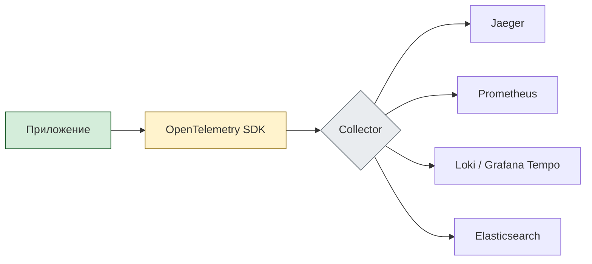

---
aliases:
- OpenTelemetry
- OTel
---
## ✅ Что такое OpenTelemetry?

> **OpenTelemetry** — это **открытый фреймворк**, созданный [[CNCF]] (Cloud Native Computing Foundation), чтобы объединить:
- Логи
- Метрики
- Трассировку
в единую систему под названием **[[Observability]]**

> 🔥 Это **следующее поколение мониторинга** после Prometheus + Jaeger + Fluentd.

---

## 🔄 Основные компоненты OpenTelemetry

| Компонент | Роль|
| ----------- | ------------------------------------------------------------- |
| **Traces**| Путь запроса через микросервисы |
| **Metrics** | Производительность: CPU, RPS, latency |
| **Logs**| События и ошибки|
| **Baggage** | Данные, передаваемые между сервисами (`user_id`, `tenant_id`) |

Все три — **поддерживают единый контекст** → вы можете перейти от трейса к логам и метрикам одним кликом.

---

## 🧩 Архитектура OpenTelemetry



### 🔹 Как работает:

1. **SDK** (в коде) собирает данные:
 - `tracing`: `start span` → `end span`
 - `metrics`: `counter.inc()`, `histogram.observe()`
 - `logs`: структурированные JSON-логи

2. **Collector** — центральный агент:
 - Принимает данные
 - Обрабатывает
 - Отправляет в бэкенд (Jaeger, Prometheus и др.)

3. **Backends**:
 - Traces → [[Jaeger]], Zipkin
 - Metrics → Prometheus, Datadog
 - Logs → Loki, Elasticsearch

---

**✅ Преимущества OpenTelemetry**

| Плюс| Объяснение |
| ----------------------------------- | -------------------------------------------------------- |
| ✅ **Единый стандарт** | Заменяет старые системы (OpenTracing + OpenCensus) |
| ✅ **Язык-нейтральный**| Поддержка: Java, Python, Go, JS, .NET, Rust|
| ✅ **Автоматическая инструментация** | Можно внедрить без изменения кода|
| ✅ **Контекст распространяется** | `trace_id`, `span_id`, `baggage` → сквозной анализ |
| ✅ **Гибкая экспортировка**| OTLP → Prometheus, Jaeger, AWS X-Ray, Google Cloud Trace |
| ✅ **Бесплатно и open source** | Apache 2.0 → можно использовать где угодно |

---

 **🆚 Было vs Стало**

| До| После|
| ------------------------------------- | -------------------------------------------------------- |
| Разные SDK для логов, метрик, трейсов | Один SDK — всё вместе|
| Сложная интеграция| Простая настройка Collector'а|
| Нет связи между логом и trace’ом| `trace_id` в логах → легко найти всё по одной транзакции |

---

 **✅ Инструменты OpenTelemetry**

| Тип | Примеры|
| ------------- | ------------------------------------------ |
| **SDK** | Для всех языков: Java, Python, Node.js, Go |
| **Collector** | `otel-collector` — промежуточный агент |
| **Exporters** | Jaeger, Prometheus, OTLP, AWS, GCP |
| **Backends**| Grafana Tempo, Jaeger, Prometheus, Loki|
| **UI**| Grafana, Jaeger UI, Zipkin |

---

 **✅ Когда использовать OpenTelemetry?**

| Сценарий| Рекомендация|
| --------------------------------------------- | ----------------------------------- |
| ✅ Микросервисы| ✅ Да — обязательно|
| ✅ Хотите единый подход к observability| ✅ Да|
| ✅ Переходите с OpenTracing/OpenCensus | ✅ Да|
| ✅ Вам нужна совместимость с W3C Trace Context | ✅ Да|
| ✅ Простой монолит | ⚠️ Не нужно — пока не масштабируете |

---

> 💬 _“If you're not using OpenTelemetry — you're behind.”_

# OTLP/gRPC (порт 4317): что это и зачем нужно

**OTLP** (OpenTelemetry Protocol) — стандартный протокол для передачи телеметрических данных (трассировок, метрик, логов) в экосистеме OpenTelemetry. **OTLP/gRPC** — его реализация поверх gRPC, использующая порт 4317 по умолчанию.

### Ключевые компоненты

1. **OpenTelemetry** — вендор‑независимый стандарт для сбора и экспорта телеметрии.

2. **gRPC** — высокопроизводительный фреймворк удалённого вызова процедур (RPC) от Google, работающий поверх HTTP/2 и использующий Protocol Buffers (protobuf) для сериализации.

3. **OTLP** — определяет:
	- форматы данных (схемы protobuf);
	- эндпоинты и методы gRPC;
	- семантику передачи (например, повторные попытки, сжатие).

### Как работает

1. **Сбор данных**
	- SDK OpenTelemetry в приложении собирает трассировки, метрики, логи.
	- Данные упаковываются в формат OTLP (protobuf).
2. **Передача через gRPC**
	- Клиент (SDK или коллектор) устанавливает gRPC‑соединение с сервером (коллектором) на порт 4317.
	- Используются бинарная сериализация (protobuf) и мультиплексирование HTTP/2 — это снижает задержки и нагрузку.
3. **Приём и обработка**
	- Сервер (например, OpenTelemetry Collector) принимает данные через gRPC‑эндпоинты OTLP.
	- Данные могут:
	- сохраняться в хранилище (Prometheus, Jaeger, Elasticsearch);
	- преобразовываться (фильтрация, обогащение);
	- пересылаться в другие системы.

### Основные эндпоинты OTLP/gRPC

Протокол определяет отдельные сервисы для разных типов данных:
- `/v1/traces` — передача трассировок;
- `/v1/metrics` — передача метрик;
- `/v1/logs` — передача логов.

Каждый эндпоинт реализует методы вроде `Export` (отправка данных) и `Check` (проверка доступности).

### Почему именно gRPC (а не HTTP/JSON)

- **Производительность**:
- бинарная сериализация (protobuf) компактнее JSON;
- HTTP/2 поддерживает мультиплексирование (множество запросов в одном соединении).
- **Строгая схема**: protobuf гарантирует совместимость форматов.
- **Потоковая передача**: gRPC поддерживает streaming — можно отправлять данные пакетами без перезапросов.
- **Встроенные механизмы**: повторные попытки, таймауты, аутентификация (TLS, OAuth).
- **Низкие задержки**: меньше накладных расходов на парсинг и передачу.

### Порт 4317: зачем и как использовать

- **4317** — стандартный порт для OTLP/gRPC (зарегистрирован в IANA).
- Используется по умолчанию в:
- OpenTelemetry Collector;
- SDK OpenTelemetry (при настройке экспортера);
- совместимых бэкендах (Tempo, Prometheus, Jaeger).
- В продакшене часто закрывают прямой доступ к порту из интернета — используют:
- VPN/VPC;
- обратные прокси (Envoy, NGINX);
- сетевые политики (Kubernetes NetworkPolicies).

### Пример конфигурации (OpenTelemetry Collector)

В конфигурационном файле коллектора (`otelcol.yaml`) указывается приём через OTLP/gRPC:

yaml

```yaml
receivers:
otlp:
protocols:
grpc:
endpoint: 0.0.0.0:4317
```

SDK (например, Java) настраивается так:

java

```java
OtlpGrpcSpanExporter.builder()
.setEndpoint("http://collector:4317")
.build();
```

### Преимущества OTLP/gRPC

- **Единообразие**: один протокол для трассировок, метрик и логов.
- **Масштабируемость**: подходит для высоконагруженных систем.
- **Совместимость**: поддерживается всеми основными инструментами OpenTelemetry.
- **Безопасность**: встроенная поддержка TLS, аутентификации.
- **Гибкость**: можно комбинировать с другими протоколами (OTLP/HTTP, Jaeger Thrift).

### Ограничения

- **Сложность отладки**: бинарные данные труднее анализировать, чем JSON.
- **Зависимость от gRPC**: требует поддержки HTTP/2 и protobuf на клиенте и сервере.
- **Порт 4317**: может быть заблокирован корпоративными фаерволами (требуется согласование).

### Когда использовать

- **Микросервисы**: для централизованного сбора телеметрии из десятков сервисов.
- **Облачные среды**: Kubernetes, serverless — где важна производительность и низкая задержка.
- **Гибридные архитектуры**: когда данные идут в разные бэкенды (Prometheus + Jaeger + Loki).
- **Высоконагруженные системы**: где HTTP/JSON создаёт избыточные накладные расходы.

### Итог

**OTLP/gRPC на порту 4317** — это:

- **стандартный канал** для передачи телеметрии в OpenTelemetry;
- **высокопроизводительная альтернатива** HTTP/JSON благодаря gRPC и protobuf;
- **основа** для построения наблюдаемости (observability) в распределённых системах.

Используйте его, если:

- внедряете OpenTelemetry;
- нуждаетесь в эффективной передаче больших объёмов трассировок/метрик;
- хотите унифицировать сбор данных из разнородных сервисов.

# OTel Data model

OpenTelemetry Data Model — это унифицированная и гибкая модель данных, которая позволяет стандартизированно представлять, собирать и передавать телеметрическую информацию в современных распределенных системах. Она служит связующим звеном между инструментированием приложения и системами хранения, обеспечивая согласованность и корреляцию между различными сигналами наблюдаемости.

### 🏗️ Три взаимосвязанные модели

Модель данных OpenTelemetry можно представить как поток, состоящий из трех взаимосвязанных уровней.

#### События (Event Model)
На этом уровне инструменты в коде приложения записывают исходные измерения (например, время начала HTTP-запроса или количество ошибок). Эти события являются сырыми фактами, которые еще не агрегированы для эффективной передачи.

#### Потоки данных (Data Stream Model / OTLP)
Это центральная часть модели, реализованная в протоколе OTLP (OpenTelemetry Protocol). На этом этапе сырые события агрегируются в непрерывные потоки предварительно обработанных данных. Модель поддерживает семантически сохраняющие преобразования для управления стоимостью и надежностью:
* **Временная повторная агрегация**: данные, собранные с высокой частотой, могут быть пересчитаны в интервалы подлиннее.
* **Пространственная повторная агрегация**: метрики с нежелательными атрибутами могут быть переагрегированы с меньшим набором атрибутов для снижения кардинальности.
* **Преобразование временнóй характеристики**: поддержка как дельта- (изменение за период), так и кумулятивного (общее накопление) способов передачи данных, что позволяет перекладывать состояние с клиента на сервер.

#### Временные ряды (Timeseries Model)
Это конечное представление данных, оптимизированное для хранения в бэкенд-системах (например, в Prometheus). Временной ряд определяется:
* **Именем метрики**
* **Атрибутами (измерениями)**
* **Типом значения** (целое число, число с плавающей точкой и др.)
* **Единицей измерения**

### 📢 Три сигнала наблюдаемости

Модель данных OpenTelemetry охватывает три основных типа телеметрии, которые вместе обеспечивают полную наблюдаемость системы.

#### Трасси (Traces)
Трасси представляют собой путь выполнения одного запроса через распределенную систему. Они помогают визуализировать и понять, как запрос проходит через различные сервисы, и идентифицировать узкие места.

* **Ключевой элемент: Span ( Span )**. Каждый Span представляет собой отдельную логическую операцию в рамках запроса (например, вызов API или запрос к базе данных). Span содержат такую информацию, как идентификатор операции, временные метки начала и окончания, атрибуты и ссылки на другие Span.
* **Структура**: Traces представляют собой ориентированный ациклический граф (DAG) из Span, где связи между ними (например, `ChildOf` или `FollowsFrom`) показывают вложенность и последовательность операций.

#### Метрики (Metrics)
Метрики — это числовые данные, которые измеряются в течение периода времени и используются для мониторинга здоровья и производительности систем.

В OpenTelemetry существует несколько основных типов инструментов для записи метрик:

| **Тип метрики** | **Описание** | **Пример использования** |
| :--- | :--- | :--- |
| **Счетчик (Counter)** | Измеряет монотонно возрастающие значения. | Количество HTTP-запросов, количество ошибок. |
| **Измеритель (Gauge)** | Измеряет значение, которое может произвольно увеличиваться и уменьшаться, в определенный момент времени. | Использование памяти, количество активных соединений. |
| **Гистограмма (Histogram)** | Выборка наблюдений (например, длительностей) и подсчет их в настраиваемых корзинах (buckets). | Распределение времени ответа сервера, размер ответа. |

#### Логи (Logs)
Логи — это записи с временной меткой о событиях, произошедших в системе. Модель OpenTelemetry привносит в логи структуру и единый стандарт.

Запись лога (LogRecord) в OpenTelemetry содержит следующие ключевые поля:
* **Timestamp**: Время, когда событие произошло.
* **Body**: Основное содержимое сообщения.
* **SeverityNumber** и **SeverityText**: Уровень серьезности события (например, ERROR, INFO).
* **Attributes**: Набор пар ключ-значение для машиночитаемого контекста.
* **TraceId** и **SpanId**: Связывают лог с конкретным Trace и Span, что является ключом к эффективной отладке в микросервисной архитектуре.

### 💡 Ключевые компоненты и принципы работы

* **Семантические соглашения (Semantic Conventions)**: Чтобы данные из разных источников были согласованными и интероперабельными, OpenTelemetry определяет общие имена для атрибутов (например, `http.method` для HTTP-метода или `service.name` для имени сервиса).
* **Контекст и распространение (Context Propagation)**: Для объединения Span в единую трассировку при распространении запроса между сервисами используется механизм распространения контекста. Такие данные, как `TraceId`, передаются через сетевые границы с помощью специальных заголовков (например, W3C TraceContext).
* **Агрегация и семплирование**: Для снижения нагрузки OpenTelemetry SDK может агрегировать данные на стороне приложения, а также применять семплирование — процесс выбора репрезентативного подмножества трассировок для экспорта, что позволяет контролировать объем данных и затраты.

Надеюсь, это объяснение помогло вам получить структурированное представление о модели данных OpenTelemetry. Если вас интересуют более глубокие детали по конкретному аспекту, например, по семантическим соглашениям или работе с гистограммами, обращайтесь.