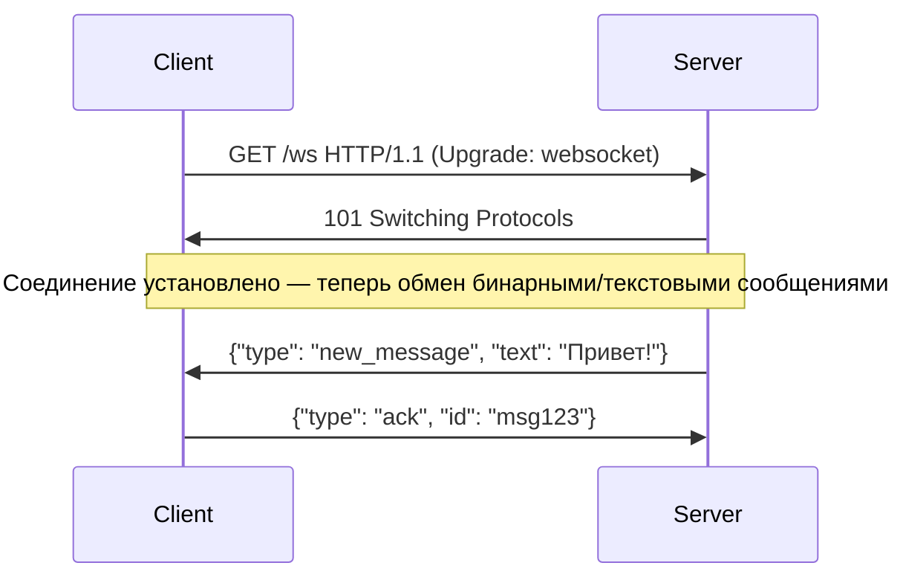

---
aliases:
  - WebSocket
  - GraphQL Subscriptions
  - SSE
  - Server-Sent Events
  - Server Push
---
Отлично!  
Вот **полное, структурированное и понятное объяснение** паттерна **Server Push** — когда **сервер сам отправляет данные клиенту**, без запроса. Это **противоположность Client Pull** (опросу).

---

## ✅ Что такое Server Push?

> **Server Push** — это модель, при которой **сервер инициирует отправку данных клиенту в реальном времени**, как только они появляются.  
> Клиент **не спрашивает** — он **ждёт**, пока сервер "позвонит".

### 🔁 Противоположность:  
- **[[Client pull]]**: *«Есть ли новые данные?»* → опрос  
- **Server Push**: *«Вот новые данные — держи!»* → уведомление

---

## ✅ 1. WebSocket

> **WebSocket** — это **двустронний, постоянный TCP-канал** между клиентом и сервером.  
> После установки соединения — обе стороны могут **слать любые данные в любое время**.

### 🔧 Как работает:


### ✅ Плюсы:
- ✅ **Настоящий двусторонний обмен** (клиент может отправлять тоже)
- ✅ **Очень низкая задержка** — миллисекунды
- ✅ **Бинарные данные** — идеально для видео, игр, чатов
- ✅ **Работает поверх TCP** — надёжно

### ❌ Минусы:
- ❌ Сложнее настраивать (нужен WebSocket-сервер)
- ❌ Не работает через старые прокси/CDN
- ❌ Не кэшируется (не HTTP)
- ❌ Требует поддержки на клиенте (JS, iOS, Android)

### 📌 Где используется:
- Чаты (Telegram, Slack, Discord)
- Онлайн-игры
- Реальные дашборды (биржи, трейдинг)
- Коллаборативные редакторы (Google Docs)

> 💡 **WebSocket — это "телефонный разговор"**: вы можете говорить и слушать одновременно.

---

## ✅ 2. SSE (Server-Sent Events)

> **SSE** — это **односторонняя** технология: **сервер отправляет данные клиенту** по протоколу HTTP.  
> Клиент **не может отправлять данные** — только получать.

### 🔧 Как работает:
```http
GET /events HTTP/1.1
Accept: text/event-stream
```

Сервер отвечает:
```http
HTTP/1.1 200 OK
Content-Type: text/event-stream
Connection: keep-alive

data: {"type": "new_order", "id": "123"}
data: {"type": "status", "message": "Оплата прошла"}
```

Клиент (браузер) слушает событие:
```javascript
const eventSource = new EventSource('/events');
eventSource.onmessage = (e) => {
  console.log(JSON.parse(e.data));
};
```

### ✅ Плюсы:
- ✅ **Простой** — работает на HTTP/1.1
- ✅ **Автоматическое переподключение** при обрыве
- ✅ **Поддержка в браузерах** (все современные)
- ✅ **Легко логировать и кэшировать** (это HTTP)
- ✅ **Меньше ресурсов**, чем WebSocket

### ❌ Минусы:
- ❌ **Только сервер → клиент** (клиент не может отправить данные)
- ❌ **Только текст** (JSON, не бинарные данные)
- ❌ **Не подходит для двустороннего обмена**

### 📌 Где используется:
- Уведомления (новые сообщения, статус заказа)
- Финансовые котировки (цены акций)
- Логи в реальном времени (мониторинг)
- Live-обновления в UI (например, "ещё 3 человека смотрят этот товар")

> 💡 **SSE — это "радио": вы слушаете, но не можете говорить.**

---

## ✅ 3. GraphQL Subscriptions

> **GraphQL Subscriptions** — это **подписка на события** в рамках GraphQL API.  
> Это **не отдельный протокол**, а **функция GraphQL**, реализуемая поверх WebSocket или SSE.

### 🔧 Как работает:

1. Клиент отправляет **подписку**:
```graphql
subscription {
  newOrder {
    id
    amount
    status
  }
}
```

2. Сервер поддерживает соединение (обычно через WebSocket)
3. Когда появляется новое событие — сервер отправляет:
```json
{
  "data": {
    "newOrder": {
      "id": "123",
      "amount": 1500,
      "status": "PAID"
    }
  }
}
```

### ✅ Плюсы:
- ✅ **Точная фильтрация** — подписываетесь только на нужные поля
- ✅ **Интегрирован в GraphQL** — единый API для запросов, мутаций и подписок
- ✅ **Типизированные данные** (GraphQL Schema)
- ✅ Поддерживает **множественные подписки** одновременно

### ❌ Минусы:
- ❌ **Зависит от реализации** — обычно требует WebSocket
- ❌ **Сложнее настраивать** — нужно поддерживать и сервер, и клиент
- ❌ Не поддерживается в старых клиентах

### 📌 Где используется:
- Чаты в GraphQL-приложениях
- Реальные обновления в админ-панелях
- Системы с динамическими данными (например, "кто сейчас онлайн")

> 💡 **GraphQL Subscriptions — это "SSE + GraphQL"**: вы подписываетесь на конкретные данные, а не на весь поток.

---

## ✅ Сравнение: WebSocket vs SSE vs GraphQL Subscriptions

| Критерий | **WebSocket** | **SSE** | **GraphQL Subscriptions** |
|----------|---------------|---------|----------------------------|
| **Направление** | ✅ Двусторонний | ❌ Только сервер → клиент | ❌ Только сервер → клиент |
| **Протокол** | TCP (с Upgrade) | HTTP/1.1 | Обычно поверх WebSocket |
| **Формат данных** | Бинарный / текст | Только текст (JSON) | Только JSON (GraphQL) |
| **Автоматическое переподключение** | ❌ Нет (нужно самому) | ✅ Да | ✅ Зависит от реализации |
| **Кэширование** | ❌ Нет | ✅ Да | ❌ Нет |
| **Фильтрация данных** | ❌ Нет | ❌ Нет | ✅ Да (по запросу) |
| **Сложность** | Высокая | Низкая | Средняя |
| **Поддержка браузеров** | ✅ Все | ✅ Все | ✅ (если WebSocket) |
| **Использование** | Чат, игры, реальное взаимодействие | Уведомления, логи, котировки | GraphQL-приложения, дашборды |

---

## ✅ Когда что использовать?

| Ваша задача | Рекомендация |
|-------------|--------------|
| ✅ **Чат, онлайн-игра, совместный редактор** | ➤ **WebSocket** |
| ✅ **Уведомления, статус заказа, котировки** | ➤ **SSE** |
| ✅ **Вы используете GraphQL и хотите обновления в реальном времени** | ➤ **GraphQL Subscriptions** |
| ✅ **Нужна простота и совместимость** | ➤ **SSE** |
| ✅ **Нужен двусторонний обмен и бинарные данные** | ➤ **WebSocket** |
| ✅ **Вы хотите точную фильтрацию и типизацию** | ➤ **GraphQL Subscriptions** |

---

## ✅ Финальный вывод

| Тип | Что это? | Аналогия |
|-----|----------|----------|
| **WebSocket** | Двусторонний канал | Телефонный разговор |
| **SSE** | Односторонний поток | Радио-эфир |
| **GraphQL Subscriptions** | Умное радио с выбором станции | "Включите мне только новости о ценах на нефть" |

> 💬 _“WebSocket is a phone. SSE is a radio. GraphQL Subscriptions are smart radio with filters.”_

---

## 📚 Где учиться дальше?

- Book: *“Designing Web APIs”* — Brenda Jin  
- YouTube: *“SSE vs WebSocket vs GraphQL Subscriptions”* — The Net Ninja  
- [MDN: Server-Sent Events](https://developer.mozilla.org/en-US/docs/Web/API/Server-sent_events)  
- [GraphQL Subscriptions Docs](https://www.apollographql.com/docs/apollo-server/data/subscriptions/)

---

✅ **Теперь вы знаете:**  
- Когда использовать **реальный push**, а не опрос  
- Как выбрать между WebSocket, SSE и GraphQL Subscriptions  
- Почему **SSE — лучший выбор для уведомлений**, а **WebSocket — для чатов**

📌 Сохраните эту таблицу — она станет основой вашей стратегии **реального времени**.