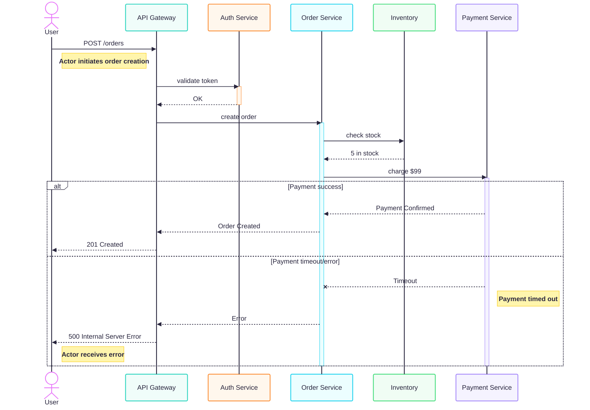

---
aliases:
- Трейсинг
- Tracing
- распределённая трассировка
---
### Tracing – распределённая трассировка

**Tracing** — это метод мониторинга и анализа выполнения запросов в распределённых системах (микросервисах, облачных архитектурах), позволяющий увидеть **полный путь запроса** через множество компонентов и выявить узкие места.

> **Tracing** — это сбор и анализ **пути запроса (request flow)** от начала до конца в сложной архитектуре.

**Tracing показывает:**
- Какой сервис сколько времени работал
- Где была задержка
- Какие ошибки возникли

**Ключевые понятия**

- **Trace (трассировка)** — полный путь запроса через систему (совокупность спанов).
- **Span (спан)** — единица работы внутри сервиса (например, вызов БД, HTTP‑запрос).
- **Context propagation** — передача `trace_id` и других метаданных между сервисами.
- **Sampling** — выборка части трассировок для снижения нагрузки (например, 1 % всех запросов).

___


**🔄 Пример: Запрос с трассировкой**


> → Без трассировки вы видите только `500`
> → С трассировкой — знаете: **ошибка в Payment, время = 3**

___

**Как работает**

1. **Генерация Trace ID**
	 - При поступлении запроса создаётся уникальный идентификатор трассировки (`trace_id`).
	 - Он передаётся между сервисами через HTTP‑заголовки, сообщения очередей и т. п.

2. **Создание спанов (spans)**
	 - Каждый сервис, обрабатывающий запрос, создаёт **span** — запись о своей работе.
	 - Span содержит:
		 - `span_id` (уникальный ID этапа);
		 - время начала и длительности;
		 - имя операции (например, `get_user_data`);
		 - метаданные (HTTP‑метод, код ответа, параметры);
		 - ссылки на родительский и дочерние спаны.

3. **Агрегация данных**
	 - Спаны отправляются в **коллектор трассировки** (например, Jaeger, Zipkin).
	 - Там они объединяются в единую трассировку по `trace_id`.

4. **Визуализация**
	 - Трассировки отображаются в интерфейсе как:
		 - **дерево вызовов** (иерархия сервисов);
		 - **временная шкала** (длительность каждого спана);
		 - **[[Gantt diagram|диаграмма Ганта]]** (перекрытие операций).

**Что можно анализировать**

- **Задержки**: какой сервис или операция занимает больше времени.
- **Ошибки**: где именно возникает исключение (и какие параметры его вызывают).
- **Зависимости**: какие сервисы вызываются при обработке запроса.
- **Параллелизм**: какие операции выполняются одновременно.
- **Нагрузка**: частота вызовов конкретных сервисов.

**Пример сценария**

Пользователь отправляет запрос на `/api/order`:
1. API‑сервис создаёт `trace_id=123` и вызывает сервис аутентификации.
2. Сервис аутентификации создаёт span `auth_span` (длительность: 50 мс).
3. API‑сервис вызывает сервис корзины (`cart_span`, 100 мс).
4. Сервис корзины обращается к БД (`db_span`, 200 мс).
5. Все спаны отправляются в Jaeger, где выстраиваются в цепочку:
 ```
 API → Auth (50 мс) → Cart (100 мс) → DB (200 мс)
 ```
6. Аналитик видит, что основная задержка — в запросе к БД.

**Лучшие практики**

1. Используйте **OpenTelemetry SDK** для автоматического сбора трассировок.
2. Настройте **разумный sampling** (например, 10 % запросов или 100 % ошибок).
3. Добавляйте **полезные теги** в спаны (user_id, request_id, feature_flag).
4. Интегрируйте с **мониторингом** ([[Grafana]], [[Prometheus]]) для корреляции с метриками.
5. Ограничьте **срок хранения** трассировок (например, 7–30 дней).
6. Защищайте **конфиденциальные данные** (маскируйте токены, номера карт).

**Итог**
Tracing — это **ключевой инструмент для отладки микросервисов**, который:
- превращает «чёрные ящики» в прозрачные процессы;
- сокращает время на поиск проблем;
- помогает оптимизировать производительность.

Без трассировки поддержка сложных распределённых систем становится хаотичной и затратной.

### Реализация

Записи о пройденных этапах (Trace ID, Span, метрики запроса) попадают в систему централизованного хранения через несколько этапов, включающих генерацию данных, их передачу между сервисами и экспорт в коллектор или хранилище. Основные механизмы и технологии, используемые для этого, включают:

1. **Генерация Trace ID и Span ID**:
   - При поступлении запроса генерируется уникальный Trace ID, который связывает все спаны, относящиеся к этому запросу. [```1```](https://signoz.io/comparisons/opentelemetry-trace-id-vs-span-id/)
   - Каждый сервис, обрабатывающий запрос, создаёт Span с уникальным Span ID, который включает информацию о времени выполнения, метаданные (например, HTTP-метод, код ответа) и ссылки на родительский и дочерние спаны. [```1```](https://signoz.io/comparisons/opentelemetry-trace-id-vs-span-id/)[```4```](https://last9.io/blog/traces-spans-observability-basics/)

2. **Передача контекста между сервисами**:
   - Trace ID и Span ID передаются между сервисами через HTTP-заголовки, сообщения очередей или другие протоколы (например, W3C Trace-Context, B3 Zipkin Propagator). [```4```](https://last9.io/blog/traces-spans-observability-basics/)
   - Это позволяет сохранить целостность трассировки при переходе запроса через несколько компонентов системы.

3. **Сбор и экспорт данных**:
   - Для сбора трассировочных данных используются инструменты и SDK, такие как OpenTelemetry, Jaeger, Zipkin. Они предоставляют API и библиотеки для инструментирования кода. [```2```](https://habr.com/ru/companies/slurm/articles/574322/)[```5```](https://sky.pro/wiki/analytics/opentelemetry-kompleksnoe-reshenie-dlya-monitoringa-prilozhenij/)
   - OpenTelemetry, например, позволяет собирать данные о трассировке, метриках и логах, а затем экспортировать их в различные бэкенды через экспортеры (например, OTLPTraceExporter для отправки данных в коллектор). [```5```](https://sky.pro/wiki/analytics/opentelemetry-kompleksnoe-reshenie-dlya-monitoringa-prilozhenij/)

4. **Обработка и хранение данных**:
   - Коллекторы (например, OpenTelemetry Collector, Jaeger Collector) получают данные от агентов или напрямую от приложений, обрабатывают их и отправляют в хранилище. [```2```](https://habr.com/ru/companies/slurm/articles/574322/)[```11```](https://bigdataschool.ru/blog/cdiscount-case-with-kafka-jaeger-elasticsearch-and-opentelemetry/)
   - В качестве хранилищ часто используются NoSQL-СУБД (Elasticsearch, Cassandra), ClickHouse или другие системы, поддерживающие масштабируемое хранение и быстрый поиск. [```11```](https://bigdataschool.ru/blog/cdiscount-case-with-kafka-jaeger-elasticsearch-and-opentelemetry/)[```16```](http://am-docs.astra.ru/0.10.0/monitoring/traces/index.html)
   - Некоторые системы, например, Jaeger, могут использовать промежуточный слой (например, Apache Kafka) для буферизации данных перед их сохранением в хранилище. [```11```](https://bigdataschool.ru/blog/cdiscount-case-with-kafka-jaeger-elasticsearch-and-opentelemetry/)

5. **Визуализация и анализ**:
   - Данные из хранилища извлекаются через сервисы запросов (например, Jaeger Query) и визуализируются в пользовательских интерфейсах (например, Jaeger UI, Grafana) для анализа. [```2```](https://habr.com/ru/companies/slurm/articles/574322/)

### Технологии для реализации

| Технология | Описание |
|------------|----------|
| **OpenTelemetry** | Универсальный стандарт для сбора, обработки и экспорта телеметрических данных. Поддерживает интеграцию с различными бэкендами и инструментами. [```5```](https://sky.pro/wiki/analytics/opentelemetry-kompleksnoe-reshenie-dlya-monitoringa-prilozhenij/) |
| **Jaeger** | Открытый инструмент распределённой трассировки, разработанный Uber. Включает компоненты для сбора, хранения и визуализации данных. [```2```](https://habr.com/ru/companies/slurm/articles/574322/) |
| **Zipkin** | Инструмент для сбора и анализа трассировочных данных, изначально разработанный Twitter. [```2```](https://habr.com/ru/companies/slurm/articles/574322/) |
| **Elastic APM** | Часть Elastic Stack, поддерживает сбор трассировок, метрик и логов. Интегрируется с Elasticsearch для хранения данных. [```15```](https://kauri.io/collections/Monitoring%20Kubernetes%20with%20Elastic%20Stack/%2855%29-collect-traces-with-elastic-apm-for-monitori/) |
| **Grafana Tempo** | Открытый бэкенд для распределённой трассировки, интегрируется с Grafana для визуализации данных. [```3```](https://www.techtarget.com/searchitoperations/feature/5-distributed-tracing-tools-to-ease-application-monitoring) |
| **AWS X-Ray**, **Google Cloud Trace**, **Azure Application Insights** | Облачные решения для распределённой трассировки от соответствующих провайдеров. [```2```](https://habr.com/ru/companies/slurm/articles/574322/) |

### Дополнительные аспекты

- **Семплирование (Sampling)**: для снижения нагрузки на систему часто используется семплирование — сбор только части трассировок. Стратегии включают head-based (решение о сборе принимается в начале запроса), tail-based (после завершения запроса) и приоритетное семплирование. [```4```](https://last9.io/blog/traces-spans-observability-basics/)
- **Автоматизированная инструментиризация**: многие инструменты (например, OpenTelemetry) предоставляют библиотеки для автоматического сбора данных без необходимости вручную модифицировать код. [```8```](https://capgemini.github.io/development/Distributed-Tracing-with-OpenTelemetry-And-Jaeger/)
- **Интеграция с CI/CD**: рекомендуется внедрять инструментиризацию в процессе развёртывания новых версий приложений, чтобы обеспечить непрерывный мониторинг. [```5```](https://sky.pro/wiki/analytics/opentelemetry-kompleksnoe-reshenie-dlya-monitoringa-prilozhenij/)

Выбор конкретной технологии зависит от требований к системе, используемой инфраструктуры и предпочтений команды разработки. OpenTelemetry часто рассматривается как современный стандарт, обеспечивающий гибкость и интеграцию с различными бэкендами.