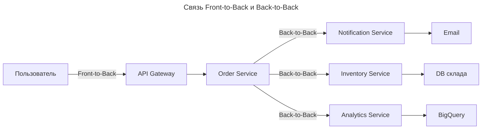
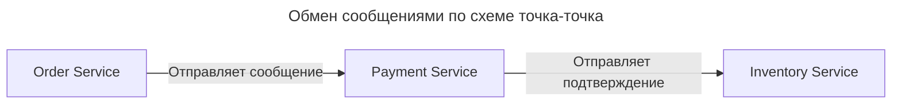
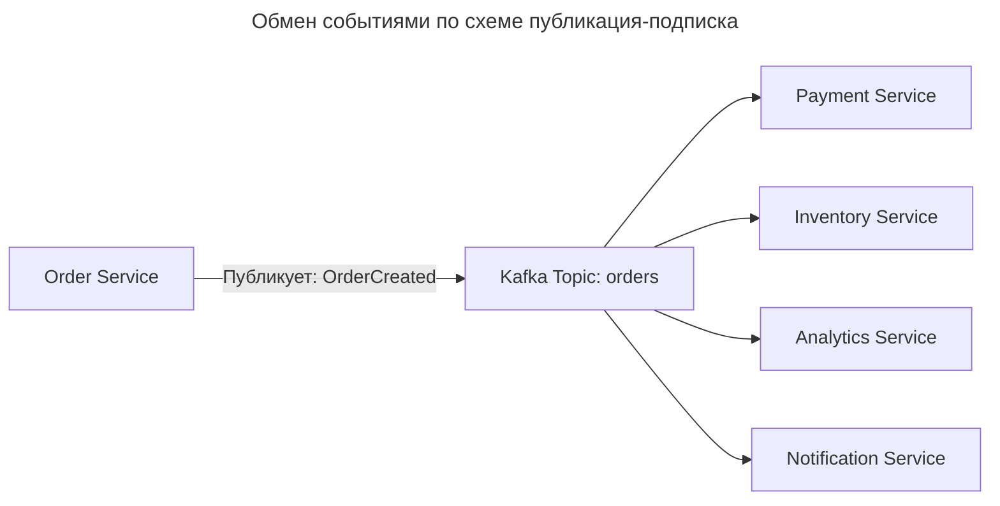
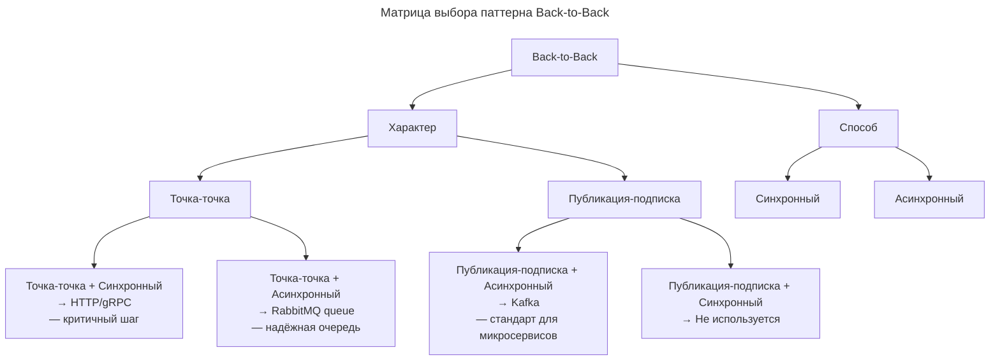

---
aliases:
  - Back-to-Back
  - Event-Driven
  - Front-to-Back
  - Kafka
  - Point-to-Point
  - Pub/Sub
  - Publish-Subscribe
  - RabbitMQ
  - публикация-подписка
  - точка-точка
---

**Back-to-Back** — это **внутренняя передача данных между сервисами бэкенда**, без участия клиента. Это **не запрос от пользователя**, а **реакция системы на событие**.

Термины **Front-to-Back** и **Back-to-Back** не являются стандартными в общем контексте, но в системах распределённой обработки данных, микросервисах и архитектуре потоков они используются для описания **направления передачи данных между компонентами**.

| Термин | Значение | Объяснение |
|--------|----------|------------|
| **Front-to-Back** | Данные идут **от фронтенда к бэкенду** | Клиент (браузер, мобильное приложение) → API → бэкенд-сервисы |
| **Back-to-Back** | Данные идут **между бэкенд-сервисами** | Сервис A → Сервис B → Сервис C (внутри бэкенда) |

Пары внутри Back-to-Back описываются по двум осям:

1. **Характер взаимодействия** → _точка-точка_ vs _публикация-подписка_.
2. **Способ взаимодействия** → _синхронный_ vs _асинхронный_.

## Front-to-Back (фронтенд → бэкенд)

Это **классический HTTP-запрос от пользователя**.

**Пример:**

```text
Пользователь (фронтенд)
    → нажимает "Заказать"
    → отправляет POST /orders
    → API Gateway
    → Order Service
    → Payment Service
    → Inventory Service
    → возвращает ответ пользователю
```

**Характеристики:**

- **Протокол**: HTTP/HTTPS (REST, GraphQL)
- **Инициатор**: клиент (пользователь, мобильное приложение)
- **Цель**: выполнить действие пользователя
- **Типичные операции**: создание заказа, авторизация, загрузка файла
- **Задержка**: критична — пользователь ждёт ответа
- **Типичные инструменты**: Nginx, API Gateway, REST, JWT, OAuth

**Где используется:** веб-приложения, мобильные приложения, любой интерфейс, где пользователь взаимодействует с системой.

> _Front-to-back — это когда пользователь говорит: «Сделай это!»_

## Back-to-Back (бэкенд → бэкенд)

Это **внутренняя коммуникация между сервисами**, без участия пользователя.

**Пример:**

```text
Order Service (после создания заказа)
    → публикует событие "OrderCreated" в Kafka
    → Notification Service подписался → отправляет email
    → Analytics Service → записывает событие в BigQuery
    → Inventory Service → уменьшает остаток
```

**Характеристики:**

- **Протокол**: Kafka, gRPC, RabbitMQ, HTTP (внутренний)
- **Инициатор**: сервис (не пользователь)
- **Цель**: синхронизация, аудит, уведомления, обработка событий
- **Типичные операции**: обновление кеша, генерация отчётов, рассылка уведомлений
- **Задержка**: менее критична — можно асинхронно
- **Типичные инструменты**: Kafka, RabbitMQ, Event Sourcing, CQRS, Debezium

**Где используется:** микросервисные архитектуры, событийно-ориентированные системы, ETL-процессы, интеграции между системами.

> _Back-to-back — это когда система говорит: «А я всё равно должен что-то сделать!»_

## Сравнение: Front-to-Back vs Back-to-Back

| Критерий | Front-to-Back | Back-to-Back |
|----------|---------------|--------------|
| **Инициатор** | Пользователь (фронтенд) | Сервис (бэкенд) |
| **Цель** | Выполнить действие пользователя | Выполнить внутреннюю логику |
| **Протокол** | HTTP/REST/GraphQL | Kafka, gRPC, RabbitMQ, HTTP (внутренний) |
| **Задержка** | Критична (пользователь ждёт) | Некритична (можно асинхронно) |
| **Надёжность** | Высокая (клиент может повторить) | Очень высокая (требуется exactly-once) |
| **Масштабируемость** | Горизонтальная (много клиентов) | Горизонтальная (много сервисов) |
| **Типичный паттерн** | Request-Response | Event-Driven / Pub/Sub |
| **Пример** | Пользователь оформляет заказ | После заказа — отправляется email и обновляется склад |
| **Логирование** | Логи запросов, трассировка (OpenTelemetry) | Логи событий, трассировка по ID события |
| **Безопасность** | Аутентификация (JWT, OAuth) | Межсервисная аутентификация (mTLS, API-ключи) |

Почему это важно:

| Ситуация | Что будет, если перепутать? |
|----------|------------------------------|
| ❌ Использовать HTTP для back-to-back | Слишком много соединений, медленно, ненадёжно |
| ❌ Использовать Kafka для front-to-back | Пользователь не получит мгновенный ответ — плохо для UX |
| ✅ Правильно: Front-to-Back = HTTP, Back-to-Back = Kafka | Система масштабируется, надёжна, отзывчива |

## Визуализация: как они связаны



**Front-to-Back** — начало цепочки. **Back-to-Back** — продолжение, реакция на событие.

## Характер взаимодействия: Point-to-Point vs Publish-Subscribe

**Пример** цепочки Back-to-Back:

```text
Order Service создал заказ →
    → уведомляет Payment Service →
    → Payment Service успешно обработал платёж →
    → уведомляет Inventory Service →
    → Inventory Service уменьшил остаток →
    → уведомляет Notification Service →
    → Notification Service отправил email
```

### Точка-точка (Point-to-Point)

Сервис **отправляет сообщение напрямую одному другому сервису** — один отправитель, один получатель.



- **Одно сообщение → одному получателю**.
- Часто используются **очереди сообщений** (например, RabbitMQ queues).

**Плюсы:**

- ✅ **Гарантированная доставка** — очередь сохраняет сообщение, пока получатель не обработает.
- ✅ **Последовательная обработка** — сообщения обрабатываются по очереди.
- ✅ **Простота** — понятная логика: «кто отправил — кому должен ответить».

**Минусы:**

- ❌ **Жёсткая связь** — если получатель упал, сообщение может потеряться (если нет retry).
- ❌ **Нет масштабирования по получателям** — нельзя послать одному сообщению нескольким сервисам.
- ❌ **Сложно добавлять новые потребители** — нужно менять логику отправителя.

**Где используется:** задачи в очереди (оплата заказа, отправка email, генерация PDF), рабочие процессы с последовательными шагами. Пример: `OrderCreated → Payment → Inventory → Notification`.

> _Point-to-point — это как передать письмо руками одному человеку._

### Публикация-подписка (Publish-Subscribe)

Сервис **публикует событие** — и **любой сервис, который на него подписан**, получает его.



- Один источник → много получателей.
- Используются **брокеры событий**: Kafka, RabbitMQ (с exchange), NATS, Pulsar.

**Плюсы:**

- ✅ **Слабая связанность** — сервисы не знают друг о друге.
- ✅ **Легко добавлять новых потребителей** — просто подпишитесь на топик.
- ✅ **Масштабируемость** — можно запустить несколько экземпляров одного сервиса.
- ✅ **Поддержка Event Sourcing и CQRS** — основа современных архитектур.

**Минусы:**

- ❌ **Сложнее отлаживать** — кто получил событие? Почему?
- ❌ **Риск дублирования** — если не настроить exactly-once delivery.
- ❌ **Нет гарантии порядка** — если не использовать partitioning и key-based routing.

**Где используется:** событийно-ориентированные системы, микросервисы с разрозненной логикой. Пример: `OrderCreated` → Payment Service (оплачивает) → Inventory Service (снижает остаток) → Analytics (записывает в BigQuery) → Notification (шлёт email) → Search Index (обновляет Elasticsearch).

> _Pub/Sub — это как выложить объявление в газету: все, кто заинтересован, прочитают._

### Сравнение: Point-to-Point vs Pub/Sub

| Критерий | Point-to-Point | Publish-Subscribe |
|----------|----------------|-------------------|
| **Количество получателей** | 1 | Много |
| **Связанность** | Высокая (жёсткая) | Низкая (слабая) |
| **Масштабируемость** | Плохо | Отлично |
| **Добавление нового потребителя** | Нужно менять отправителя | Просто подпишитесь |
| **Надёжность** | Высокая (очередь) | Высокая (при правильной настройке) |
| **Порядок сообщений** | Гарантирован | Зависит от топика/партиций |
| **Используется в** | Рабочие процессы (workflow) | Event Sourcing, CQRS, микросервисы |
| **Инструменты** | RabbitMQ (queues), SQS | Kafka, NATS, Pulsar, RabbitMQ (topic exchange) |
| **Пример** | «Заказ → Оплата → Отправка» | «Заказ создан → обновить склад, email, аналитику» |

## Способ взаимодействия: синхронный vs асинхронный

### Синхронный (Synchronous)

Отправитель **ждёт ответа** от получателя, прежде чем продолжить.

```http
POST /orders HTTP/1.1
→ OrderService вызывает PaymentService: POST /pay
→ PaymentService отвечает: { "status": "success" }
→ OrderService сохраняет заказ
```

- Используются **HTTP/REST**, **gRPC**.
- Отправитель **блокируется**, пока получатель не ответит.

**Плюсы:**

- ✅ Простота логики.
- ✅ Гарантия результата сразу.
- ✅ Легко отлаживать.

**Минусы:**

- ❌ **Высокая задержка** — ждёте ответа.
- ❌ **Риск цепной нестабильности** — если PaymentService упал, весь процесс падает.
- ❌ **Нет масштабирования** — каждый вызов требует ресурсов.

**Где использовать:** когда **результат критичен для продолжения**. Пример: оплата перед созданием заказа.

> _Синхронный — это как спросить у коллеги: «Ты сделал?», и ждать ответа._

### Асинхронный (Asynchronous)

Отправитель **не ждёт ответа** — он просто отправляет сообщение и идёт дальше.

```text
OrderService → публикует событие "OrderCreated" в Kafka → сразу возвращает 201 клиенту
PaymentService → подписался → обрабатывает в фоне
InventoryService → тоже подписался → обрабатывает в фоне
```

- Используются **Kafka, RabbitMQ, gRPC streaming**.
- Отправитель **не знает**, когда и как получатель обработает.

**Плюсы:**

- ✅ **Низкая задержка** — клиент получает ответ мгновенно.
- ✅ **Высокая отказоустойчивость** — если сервис упал, сообщение ждёт.
- ✅ **Масштабируемость** — можно запустить 10 экземпляров одного сервиса.
- ✅ **Слабая связанность** — сервисы не зависят друг от друга.

**Минусы:**

- ❌ **Сложнее отлаживать** — нет прямого ответа.
- ❌ **Нужно отслеживать состояние** — «А обработалось ли?».
- ❌ **Риск потери данных** — если не настроить persistence и ACK.

**Где использовать:** когда **результат не критичен для немедленного ответа**. Пример: отправка email, обновление аналитики, кеш.

> _Асинхронный — это как отправить SMS: «Сделал, как только смогу»._

## Комбинации: 4 типа взаимодействия

| Характер | Способ | Пример | Когда использовать |
|----------|--------|--------|---------------------|
| **Точка-точка + Синхронный** | `OrderService → HTTP → PaymentService` | Платёж перед созданием заказа | Критичный бизнес-процесс, где нужен мгновенный результат |
| **Точка-точка + Асинхронный** | `OrderService → RabbitMQ queue → PaymentService` | Очередь оплаты | Надёжно, но не ждём ответа — можно отложить |
| **Публикация-подписка + Синхронный** | Редко | Нет типичных примеров | Практически не используется — противоречит сути pub/sub |
| **Публикация-подписка + Асинхронный** | `OrderService → Kafka → Payment, Inventory, Analytics` | Обработка события в фоне | **Стандарт современных микросервисов** — рекомендуемый паттерн |

**Синхронный Pub/Sub почти не используется**, потому что Pub/Sub предполагает **множество получателей**, а синхронность — **ожидание одного ответа**. Это конфликт, лучше использовать **асинхронный**.

Как выбрать:

| Ваша задача | Рекомендация |
|-------------|--------------|
| ✅ Последовательная цепочка действий: A → B → C | ➤ **Point-to-Point** |
| ✅ Один тип события → несколько сервисов должны отреагировать | ➤ **Pub/Sub** |
| ✅ Нужно добавить новый сервис без изменения существующих | ➤ **Pub/Sub** |
| ✅ Нужна гарантия, что каждое сообщение обработается ровно один раз | ➤ **Point-to-Point** (с ACK) |
| ✅ Система растёт — появляются новые потребители событий | ➤ **Pub/Sub** |
| ✅ Вы строите систему с Event Sourcing | ➤ **Pub/Sub** |
| ✅ Один сервис должен обработать запрос, и результат критичен | Sync + HTTP/gRPC |
| ✅ Один сервис должен обработать запрос, но можно отложить | Async + RabbitMQ queue |
| ✅ Несколько сервисов должны реагировать на событие | Async + Kafka |

**Золотое правило:**

- **«Публикация-подписка + асинхронный» — это стандарт для масштабируемых систем.**
- **«Точка-точка + синхронный» — только для критичных шагов, где нужен мгновенный результат.**

## Визуализация: все 4 комбинации



Pub/Sub — для широкой рассылки событий, Point-to-Point — для последовательной обработки.

| Паттерн | Когда использовать |
|---------|--------------------|
| **Точка-точка + Синхронный** | Когда **нужен мгновенный ответ** и **только один получатель** (например, оплата перед созданием заказа) |
| **Точка-точка + Асинхронный** | Когда **нужна надёжность**, но **не нужен мгновенный ответ** (очередь задач) |
| **Публикация-подписка + Асинхронный** | Когда **одно событие должно вызвать несколько реакций** (обновление склада, email, аналитика) — **основной паттерн современных систем** |
| **Публикация-подписка + Синхронный** | ❌ Не используйте — противоречит логике |

> _Синхронность — для связи. Асинхронность — для масштаба. Точка-точка — для порядка. Публикация-подписка — для гибкости._
