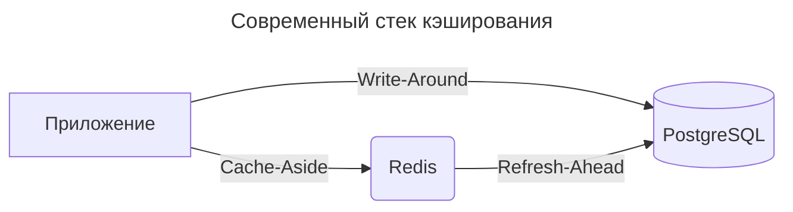

---
aliases:
  - Adaptive Replacement Cache
  - ARC
  - Belady
  - Bélády
  - Cache eviction
  - Cache invalidation
  - Cache-ahead
  - Cache-and-database sharding
  - Cache-aside
  - FIFO
  - First In First Out
  - Lease-based Caching
  - Least Frequently Used
  - Least Recently Used
  - LFU
  - LRU
  - Most Recently Used
  - MQ
  - MRU
  - Multi Queue
  - PLRU
  - Pre-fetching
  - Pseudo LRU
  - Random Replacement
  - Read Patterns
  - Read-through
  - Refresh-ahead
  - RR
  - Segmented LRU
  - SLRU
  - TTL-based
  - Write Patterns
  - Write-around
  - Write-back
  - Write-behind
  - Write-through
  - Инвалидация кэша
  - Кэширование
  - Политики вытеснения кэша
---
## Cache Patterns

Cache Patterns — это архитектурные шаблоны, используемые для оптимизации доступа к данным через промежуточный слой кэша. Они снижают нагрузку на основное хранилище (БД, API и т.д.), ускоряют отклик и повышают масштабируемость системы.

**Группы паттернов управления кэшем**

1. **Read Patterns** (шаблоны чтения)
   - Фокусируются на эффективном получении данных из кэша.
2. **Write Patterns** (шаблоны записи)
   - Шаблоны синхронизации кэша с основным хранилищем при изменении данных.
3. Cache Eviction policies
   - Шаблоны политик вытеснения кэша — автономного процесса.
4. Cache Invalidation policies
   - Шаблоны политик удаления кэша — ручного процесса.

**Cache Patterns по группам**

- Read Patterns
  - Cache-aside / Lazy Loading Read-through
  - Read-through
  - Cache-ahead / Pre-fetching
- Write Patterns
  - Write-through
  - Write-behind / Write-back
  - Refresh-ahead
  - Write-around
- Cache Eviction policies
  1. LRU — Least Recently Used
  2. LFU — Least Frequently Used
  3. FIFO — First In First Out
  4. TTL-based
  5. RR — Random Replacement
  6. Специальные стратегии вытеснения
     - MRU — Most Recently Used
     - Segmented LRU
     - Pseudo LRU
     - MQ — Multi Queue
     - ARC — Adaptive Replacement Cache
     - Belady cache eviction algorithm — идеальный алгоритм
- Cache Invalidation policies
  1. Explicit delete
  2. Write-through
  3. Tag-based invalidation
  4. Event-driven

---

## Cache eviction policies

> Политики вытеснения из кэша

**Суть**
автоматическое удаление элементов из кэша **по правилам вытеснения** при нехватке места или по таймеру, *независимо от актуальности данных*.

> 💡 Цель: вытеснить **наименее полезную** запись.

---

## Cache invalidation policies

> Политики инвалидации кэша

**Суть**
**принудительное удаление или обновление** элементов кэша **в ответ на изменение данных в источнике**.

**Когда применяется**

- Данные в БД/сервисе обновились.
- Требуется гарантированная актуальность кэша.
- Пользователь явно запросил обновление.

**Методы аннулирования**

1. **Explicit delete** — удаление ключа по событию (например, после UPDATE в БД).
2. **Write-through** — запись в кэш сразу при обновлении источника.
3. **Tag-based invalidation** — аннулирование групп ключей по тегу.
4. **Event-driven** — срабатывание по сообщению из очереди (например, Kafka).

### Cache eviction vs invalidation

Это два разных механизма управления кэшем, решающих **одну задачу** — поддержание актуальности данных, но разными методами.

| Критерий                  | Cache Eviction                | Cache Invalidation                       |
| ------------------------- | ----------------------------- | ---------------------------------------- |
| **Инициатор**             | Система (по ресурсам/таймеру) | Внешнее событие (изменение данных)       |
| **Цель**                  | Управление ресурсами          | Поддержание актуальности                 |
| **Зависимость от данных** | Нет (удаляет по правилам)     | Да (реагирует на изменения)              |
| **Гарантия актуальности** | Нет                           | Да (при корректной реализации)           |
| **Сложность**             | Низкая (встроенные стратегии) | Высокая (нужна логика обработки событий) |
| **Примеры**               | LRU, TTL, FIFO                | Delete-on-update, write-through          |

Часто используют **оба механизма вместе**:

1. Eviction — для фонового управления ресурсами (LRU + TTL).
2. Invalidation — для мгновенного обновления при критических изменениях.

---

## Cache-aside / Lazy Loading Read-through

- **Принцип**
  1. Приложение сначала проверяет кэш.
  2. При отсутствии — запрашивает данные из основного хранилища и сохраняет их в кэше.
- **Схема**

```text
Client → Cache (miss) → DB → Cache (store) → Client
```

**Особенности**

- ✅ Простота, низкая нагрузка на кэш.
- ❌ Возможные «холодные старты» (первый запрос медленный).

**Пример**: получение профиля пользователя.

---

## Read-through

При запросе на чтение данных:

- Если cache-miss → дата-сервис обращается в БД.

**Особенности**

- ✅ Возвращаемые данные всегда актуальны.
- ❌ Производительность чтения зависит от качества настройки политики вытеснения кэша (cache eviction).

**Пример**: Redis с плагином для автоподгрузки.

---

## Cache-ahead / Pre-fetching

При запросе на изменение данных:

- Клиент всегда получает ответ только из кэша.
- Если cache-miss → ошибка или null.
- Обновление данных кэша происходит автономно асинхронно.

**Особенности**

- ❌ Возвращаемые данные могут быть неактуальны.
- ✅ Производительность чтения высокая.

**Пример**: кэширование топ-10 новостей утром.

---

## Write-through

При запросе на изменение данных:

- Вначале меняется кэш, затем хранилище.
- Обновление данных происходит синхронно.

**Особенности**

- ✅ Данные в кэше и в БД всегда актуальны.
- ❌ Производительность записи низкая.

**Пример**: обновление баланса счёта.

---

## Write-behind / Write-back

Клиент дата-сервиса не знает о существовании кэша.

При запросе на изменение данных:

- Вначале меняется только кэш.
- Обновление данных БД происходит автономно асинхронно.

**Особенности**

- ❌ Данные в БД могут быть неактуальны.
- ✅ Данные в кэше всегда актуальны.
- ✅ Производительность записи высокая.

**Пример**: логирование действий пользователя.

---

## Write-around

При запросе на изменение данных:

- Вначале меняется только состояние БД.
- Обновление данных в кэше происходит автономно асинхронно.

**Особенности**

- ✅ Данные в БД всегда актуальны.
- ❌ Данные в кэше могут быть неактуальны.
- ❌ Производительность записи средняя.

---

## Refresh-ahead

- **Принцип**: кэш автоматически обновляет данные до истечения срока годности кэша.
- **Особенности**
  - ✅ Минимизация «холодных» запросов.
  - ❌ Повышенная нагрузка на хранилище.
- **Пример**: кэширование курсов валют с предзагрузкой.

---

## ARC — Adaptive Replacement Cache eviction policy

> Adaptive Replacement Cache — адаптивная замена

**Принцип**
**балансирует между LRU и LFU**, динамически подстраиваясь под паттерны доступа.

**Как работает**

- Поддерживает два списка: недавно использованные (LRU-подобные) и часто используемые (LFU-подобные).
- Адаптивно регулирует размер каждого списка на основе статистики обращений.
- При вытеснении выбирает элемент из списка, который в данный момент менее актуален.

---

## MQ — Multi Queue eviction policy

> Multi Queue, многопоточный кэш

**Принцип**
учитывает **разную «стоимость» элементов** (время получения, размер, актуальность) и управляет ими раздельно.

**Как работает**

- Элементы группируются по категориям (например, дорогие/дешёвые, большие/маленькие).
- Для каждой категории может быть своя стратегия вытеснения.
- При переполнении сначала удаляются элементы из «менее ценных» категорий.

---

## PLRU — Pseudo LRU eviction policy

> Pseudo Least Recently Used

**Принцип**
упрощённая версия LRU для **кэшей с высокой ассоциативностью** (много каналов).

**Как работает**

- Для каждого элемента хранится **один бит** («возраст»).
- При доступе бит инвертируется.
- При вытеснении выбирается элемент с определённым значением бита (например, 0).

**Пример**: аппаратные кэши процессоров.

---

## SLRU — Segmented LRU eviction policy

> Segmented LRU

**Принцип**
кэш делится на **два сегмента** — «пробный» и «защищённый».

**Как работает**

- Новые элементы попадают в «пробный» сегмент.
- При повторном обращении элемент перемещается в «защищённый» сегмент.
- При переполнении сначала вытесняются элементы из «пробного» сегмента (по принципу LRU).
- Если «защищённый» сегмент переполнен, его последний элемент возвращается в «пробный».

**Пример**: СУБД, файловые кэши.

---

## Lease-based Caching

- **Принцип**
  - Клиент получает данные *и* «аренду» на их использование.
  - По истечении аренды — проверка актуальности.
- **Особенности**
  - ✅ Снижение нагрузки на хранилище.
  - ❌ Требует сложной координации.
- **Пример**: распределённые системы с долгоживущими данными.

---

## Bélády cache eviction algorithm

> Алгоритм Белади — оптимальный алгоритм предвидения

**Принцип**
теоретически идеальный алгоритм — удалять элемент, который **понадобится позже всех**.

**Особенности**

- На практике **нереализуем**, так как требует знания будущего.
- Используется как эталон для сравнения эффективности других алгоритмов.

---

**💡 Пример: современный стек**



---
