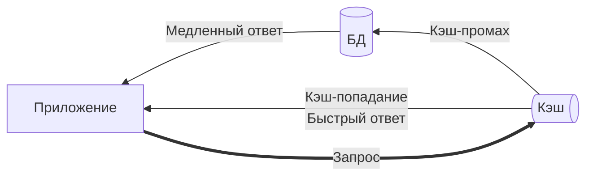

---
aliases:
  - кэширование
  - caching
  - cache
  - Cache
  - Кэш
  - cache-hit
  - cache-miss
  - Invalidation
  - Инвалидация
---
## Кэширование

**Кэширование — это временное хранение данных, чтобы избежать повторного выполнения дорогой операции** (например, запроса к базе данных, HTTP-вызова, вычисления).

**Главная цель**:  
✅ **Уменьшить latency** (время ответа)  
✅ **Снизить нагрузку** на медленные системы (БД, API, файловую систему)





> **Кэширование — это искусство баланса между скоростью и согласованностью.**  
> Правильно настроенный кэш:
> - Ускоряет ответы в **10–1000 раз**
> - Снижает нагрузку на БД на **90%+**
> - Позволяет масштабироваться **линейно**

---
🧠 Основные понятия

| Термин                                         | Описание                                                    |
| ---------------------------------------------- | ----------------------------------------------------------- |
| **Кэш (Cache)**                                | Быстрое хранилище (оперативная память, SSD, Redis и т.д.)   |
| **Источник правды (Source of Truth)**          | Надёжное, но медленное хранилище (PostgreSQL, внешний API)  |
| **Кэш-попадание (Hit)**                        | Данные найдены в кэше → быстрый ответ                       |
| **Кэш-промах (Miss)**                          | Данные **не** найдены в кэше → нужно обратиться к источнику |
| **TTL (Time-To-Live)**                         | Время жизни записи в кэше (после истечения — удаляется)     |
| **Инвалидация (Invalidation)**                 | Принудительное удаление/обновление данных в кэше            |
| **[[client caching\|Клиентcкое кэширование]]** | Делегирование хранения кэша клиенту                         |
| Серверное кэширование                          | Общий случай кэшированмия                                   |

---

📦 Где можно кэшировать?

| Уровень                        | Примеры                                                       |
| ------------------------------ | ------------------------------------------------------------- |
| **[[client caching\|Клиент]]** | Браузер (кэш изображений, JS, CSS), мобильное приложение      |
| **Сеть**                       | [[CDN]] (Cloudflare, Akamai) — кэширует статику по всему миру |
| **Приложение**                 | Внутренний кэш (Caffeine, Guava), Redis, Memcached            |
| **База данных**                | Query cache в MySQL (устарел), кэш буферов в PostgreSQL       |

> 💡 Лучшие результаты даёт **многоуровневое кэширование** (клиент + CDN + приложение + БД).

---

Система кэширования состоит из частей
1. Метод чтения кэша
2. Метод обновления кэша
3. Cache eviction policy
4. Cache invalidation policy

🔁 Основные стратегии использования кэша – **[[cache patterns]]**
1. Read Patterns
	* Cache-aside
	* Read-through
	* Cache-ahead / Pre-fetching
2.  Write Patterns
	* Write-through
	* Write-behind / Write-back
	* Refresh-ahead
3. [[cache patterns|Cache eviction]] policy
	1. LRU – Least Recently Used
	2. LFU – Least Frequently Used
	3. FIFO – First In First Out
	4. TTL‑based
	5. RR – Random Replacement
4. [[cache patterns|Cache invalidation]] policy
	1. Explicit delete — удаление ключа по событию в системе (eg. после UPDATE в БД).  
	2. Event‑driven — срабатывание по сообщению из очереди (eg, Kafka).  
	3. Write‑through — запись в кэш сразу при обновлении источника.  
	4. Tag‑based invalidation — аннулирование групп ключей по тегу.  

 **⚙️ Популярные кэш-системы**

| Тип                          | Примеры                                             | Использование                     |
| ---------------------------- | --------------------------------------------------- | --------------------------------- |
| **In-memory (в памяти JVM)** | Caffeine, Guava Cache                               | Локальный кэш в микросервисе      |
| **Сетевой (распределённый)** | Redis, Memcached                                    | Общий кэш для кластера            |
| **HTTP-кэш**                 | CDN, Nginx, Varnish                                 | Кэширование статики и API-ответов |
| **БД-кэш**                   | PostgreSQL shared_buffers, MySQL InnoDB buffer pool | Внутренний кэш СУБД               |

> 💡 **Redis** — де-факто стандарт для распределённого кэширования (поддержка структур данных, TTL, pub/sub).

---

🧪 Пример: кэширование в Spring Boot

```java
@Service
public class UserService {

    @Cacheable("users") // Кэширует результат по id
    public User findById(String id) {
        return userRepository.findById(id); // вызывается только при промахе
    }

    @CacheEvict(value = "users", key = "#user.id") // Инвалидация при записи
    public User update(User user) {
        return userRepository.save(user);
    }
}
```

→ Spring Cache абстрагирует кэш-провайдер (Caffeine, Redis и др.).

---

 ⚠️ Главные проблемы кэширования

1. **Несогласованность данных**  
   → Решение: короткий TTL + инвалидация при записи.

2. **Каскадный промах (Cache Stampede)**  
   При истечении TTL тысячи запросов одновременно идут в БД.  
   → Решение: **Refresh-Ahead** (обновление до истечения TTL).

3. **Засорение кэша**  
   Хранение редко используемых данных.  
   → Решение: **LFU/LRU eviction policies**.

4. **Сложность отладки**  
   → Решение: мониторинг hit/miss rate, логирование.

---

🌐 Реальные примеры

| Система                   | Как кэширует                                |
| ------------------------- | ------------------------------------------- |
| **Facebook**              | Memcached для миллиардов запросов в секунду |
| **Twitter**               | Redis для ленты пользователей               |
| **Amazon**                | CDN + локальный кэш для каталога товаров    |
| **Ваш блог на WordPress** | WP Super Cache + Cloudflare                 |

---

Но помните:  
> **«There are only two hard problems in Computer Science: cache invalidation and naming things.»**  
> — Phil Karlton #👨 

___