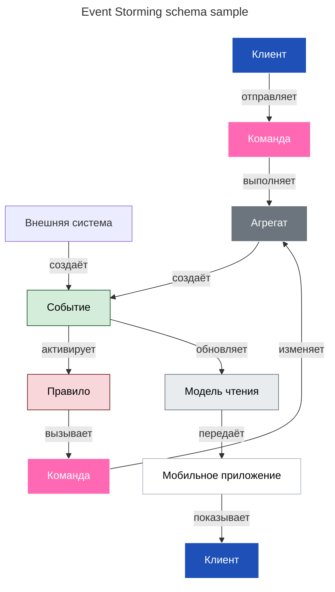

## Event Storming в контексте Event‑Driven Architecture (EDA)

**Event Storming** — это коллаборативная методика моделирования бизнес‑процессов, которая особенно эффективна при проектировании **событийно‑ориентированных систем** ([[Event-Driven Architecture]]). Метод помогает визуализировать поток событий в системе и понять, как они влияют на бизнес‑процессы.
### Суть подхода

В EDA система строится вокруг **событий** (*events*) — необратимых фактов о том, что что‑то произошло. Event Storming позволяет:
* выявить ключевые события в бизнес‑процессе;
* понять их причинно‑следственные связи;
* определить, какие компоненты системы должны реагировать на события;
* спроектировать архитектуру, основанную на событиях.

### Как проходит сессия Event Storming

**Участники:** команда из 5–10 человек (разработчики, аналитики, бизнес‑эксперты, владельцы продукта).

**Материалы:** стикеры разных цветов, большая стена/доска, маркеры.

**Этапы:**

1. **Выявление событий**  
   Участники записывают на оранжевые стикеры ключевые события в бизнесе (например, *«Заказ оформлен»*, *«Оплата прошла»*, *«Товар отправлен»*). События формулируются в прошедшем времени.

2. **Определение команд**  
   На синие стикеры записывают команды — действия, которые инициируют события (например, *«Оформить заказ»*, *«Провести оплату»*).

3. **Добавление агрегатов**  
   Жёлтые стикеры обозначают агрегаты (сущности, которые обрабатывают команды и генерируют события — например, *«Заказ»*, *«Корзина»*).

4. **Указание внешних систем**  
   Зелёные стикеры показывают внешние системы, участвующие в процессе (платежные системы, CRM, склад).

5. **Прорисовка логики**  
   Участники располагают стикеры в хронологическом порядке, рисуют стрелки, показывающие причинно‑следственные связи.

6. **Обсуждение и уточнение**  
   Команда обсуждает граничные случаи, исключения, альтернативные сценарии.

### Связь с Event‑Driven Architecture

Event Storming напрямую поддерживает принципы EDA:

* **Децентрализация.** Каждый агрегат (жёлтый стикер) может стать отдельным микросервисом, реагирующим на события.
* **Асинхронность.** События (оранжевые стикеры) — это сообщения, которые могут обрабатываться асинхронно.
* **Слабая связанность.** Компоненты системы взаимодействуют через события, а не прямые вызовы.
* **Масштабируемость.** Можно независимо масштабировать сервисы, обрабатывающие разные типы событий.
* **Отказоустойчивость.** Если один компонент «падает», события могут накапливаться в очереди и обрабатываться позже.

### Практическая польза для EDA

1. **Проектирование событийной модели**  
   Получаем чёткий список событий, которые должна поддерживать система.

2. **Определение границ сервисов**  
   Агрегаты помогают выделить микросервисы и их зоны ответственности.

3. **Понимание потоков данных**  
   Видно, как события распространяются по системе и какие данные они несут.

4. **Выявление интеграционных точек**  
   Внешние системы (зелёные стикеры) показывают, где нужны адаптеры/коннекторы.

5. **Документация архитектуры**  
   Результат сессии — визуальная карта системы, понятная всем участникам.

### Пример из практики

**Сценарий:** интернет‑магазин.

**События (оранжевые):**  
* Заказ оформлен  
* Оплата подтверждена  
* Товар зарезервирован  
* Отправка подготовлена  
* Заказ доставлен

**Команды (синие):**  
* Создать заказ  
* Оплатить заказ  
* Подтвердить отправку

**Агрегаты (жёлтые):**  
* Заказ  
* Корзина  
* Платёжный модуль  
* Склад

**Внешние системы (зелёные):**  
* Платёжная система  
* Служба доставки  
* CRM
### Итоги

Event Storming — мощный инструмент для:
* совместного понимания бизнес‑процессов;
* проектирования событийной модели в EDA;
* выявления ключевых компонентов системы;
* создания общей «карты» архитектуры, понятной всем участникам проекта.

Метод сокращает разрыв между бизнесом и разработкой, позволяя создавать системы, которые точно отражают реальные процессы.

___

