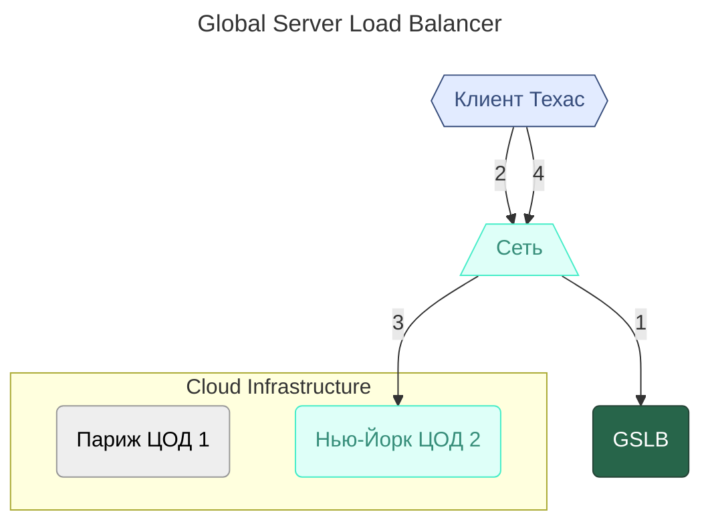

---
aliases:
  - Failover
  - Failover Strategy
  - Cold Standby
  - Warm Standby
  - Active-Standby
  - GSLB
  - Global Server Load Balancer
  - Redudncy
---
# Failover Strategy

Фейловер-стратегия (Failover Strategy) — это механизм обеспечения высокой доступности приложения, в рамках которого «основная» система в случае сбоя может быть заменена «резервной». 

Это совокупности механизмов и подходов, которые обеспечивают переключение на резервную (redundant) систему, когда основная (primary) система выходит из строя.

Cтратегии отказоустойчивости
1. **Active-Passive(Active-Standby)**
	* В рамках стратегии Active-Standby мы подразумевали, что всё это время резервный узел находится в рабочем состоянии, но на него не поступает трафик (**Warm Standby**)
	* При **Cold Standby**, в случае сбоя основного узла, потребуется сначала его развернуть и только затем направить на него трафик.
2. **Active-Active**
3. **Geo-Redundancy** - Гео-избыточность
	1. GSLB – Global Server Load Balancer


**✅ Рекомендации по выбору стратегии**

| Ваша система | Рекомендуемая стратегия |
|--------------|--------------------------|
| ✅ **Локальный сервис** (внутренняя CRM, ERP) | **Active-Passive** — просто, дешево, надёжно |
| ✅ **Веб-приложение** (SaaS, API, микросервисы) | **Active-Active** — масштабируемо, без простоя |
| ✅ **Глобальный сервис** (международный SaaS, интернет-магазин) | **Geo-Redundancy + Active-Active** — максимальная доступность |
| ✅ **База данных** (PostgreSQL, MySQL) | **Active-Passive** с **синхронной репликацией** |
| ✅ **Кэш / Очереди** (Redis, Kafka) | **Active-Active** с **репликацией между узлами** |
| ✅ **Файловое хранилище** (MinIO, S3) | **Geo-Redundancy** с **репликацией между регионами** |


# Active-Passive (Активно-Пассивная)

* **Один активный узел** обрабатывает все запросы.  
* **Один (или несколько) пассивных узлов** — **ждут в режиме ожидания**.
* При сбое активного — пассивный **автоматически становится активным**.
```
[Active Node] ← обрабатывает трафик
      │
      └───[Passive Node] ← синхронизируется, но НЕ обрабатывает запросы
```
> **Пассивный узел** — это резервная копия.
> Он **не потребляет ресурсы** на обработку, только на синхронизацию.  
> Переключение называется **failover**.


**Плюсы / минусы:**

✅ Простота – Легко настроить и понять
✅ Нет конфликтов – Только один узел пишет — нет риска повреждения данных
✅ Экономия ресурсов – Пассивный узел не нагружает систему
✅ Подходит для БД – Идеально для PostgreSQL, MySQL, Oracle
❌ Низкая эффективность – Пассивный узел простаивает — 50% ресурсов "в воздухе" 
❌ Время переключения – Failover занимает **несколько секунд** → пользователи видят ошибки 
❌ Риск потери данных – Если синхронизация не **синхронная** — последние транзакции могут пропасть

---

# Active-Active (Активно-Активная)

**Все узлы активны** — **все обрабатывают запросы одновременно**.  
Данные синхронизируются между узлами в **реальном времени**.

```
[Active Node 1] ← обрабатывает запросы
[Active Node 2] ← обрабатывает запросы
[Active Node 3] ← обрабатывает запросы
        │
        └─── Все синхронизируют данные между собой
```
> ✅ **Нет "резервных" узлов** — все равноправны.  
> ✅ **Балансировщик** (например, Ingress, LoadBalancer) распределяет трафик между всеми.


**🔧 Как синхронизировать данные?**  
- Для **баз данных** — используются **многописьменные СУБД**:  
	- **CockroachDB**, **TiDB**, **YugabyteDB** — распределённые SQL-базы  
- Для **кэша** — **Redis Cluster**  
- Для **файлов** — **MinIO (S3-совместимый)**  
- Для **очередей** — **Kafka с репликацией**

**Плюсы/минусы:**

| Плюс                         | Объяснение                                                                                  |
| ---------------------------- | ------------------------------------------------------------------------------------------- |
| ✅ Нет простоя                | Если один узел упал — остальные продолжают работать без переключения                        |
| ✅ Высокая производительность | Трафик распределён — система масштабируется горизонтально                                   |
| ✅ Максимальная доступность   | Даже при падении 2 из 3 узлов — система работает                                            |
| ✅ Экономия на ресурсах       | Нет "молчащих" узлов — все работают на полную мощность                                      |
| ❌ Сложность                  | Требует **специализированного ПО** для синхронизации данных                                 |
| ❌ Конфликты                  | Возможны **конфликты записей** (например, два пользователя изменили одно поле одновременно) |
| ❌ Стоимость                  | Распределённые базы (CockroachDB) дороже в обслуживании                                     |
| ❌ Сложная отладка            | Трудно отследить, где и почему произошёл сбой                                               |

**📌 Когда использовать?**
- ✅ **API-сервисы** (REST, gRPC) — они stateless
- ✅ **Веб-приложения** (React, Vue, Spring Boot)
- ✅ **Сервисы с высоким трафиком** (Netflix, Uber, TikTok)
- ✅ **Системы, где 99.99% доступности критичны**

> 💡 Пример:  
> **YouTube** — если один сервер упал — пользователь переключается на другой — **не замечает**.

---

# Geo-Redundancy – Гео-репликация

 **Размещение копий системы в разных географических регионах** (дата-центры, облака, страны).
 Цель: **выжить при катастрофе** — пожар, землетрясение, отключение электричества, сбой провайдера.
```
[Region: US-East] ← активный
[Region: EU-West] ← резервный (или активный)
[Region: AP-South] ← резервный
```

> Каждый регион имеет **свой кластер Kubernetes**, свои базы, свои DNS.  
> Трафик направляется к **ближайшему региону** через **DNS-балансировку** (например, AWS Route53, Cloudflare).  
> Данные реплицируются **асинхронно** между регионами.


При георезервировании возникает вопрос маршрутизации трафика за пределами одной площадки. Для решения этой проблемы в первую очередь поможет DNS. А также максимально эффективным инструментом считается GSLB.

**GSLB (Global Server Load Balancer)** — это балансировщик нагрузки, который способен направлять трафик между несколькими центрами обработки данных. В то время как обычный балансировщик распределяет трафик по серверам, расположенным в одном ЦОД.




**📌 Пример:**
```yaml
# В US-East — кластер с Ingress и сервисами
# В EU-West — такой же кластер, с репликой базы данных

# DNS: cinemaabyss.com →
#   - если пользователь в Европе → направляет на EU-West
#   - если в США → на US-East
#   - если EU-West упал → автоматически переключает на US-East
```

> 🔧 **Инструменты**:  
> - **Cloudflare Load Balancing**  
> - **AWS Route53 + Health Checks**  
> - **Global Load Balancer** (GCP, Azure)  
> - **Multi-cluster Kubernetes** (Anthos, Rancher, OpenShift)

Плюсы/минусы

| Плюс                         | Объяснение                                                                   |
| ---------------------------- | ---------------------------------------------------------------------------- |
| ✅ Высшая доступность         | Даже при **полном отключении региона** — система работает                    |
| ✅ Низкая задержка            | Пользователи подключаются к ближайшему дата-центру → быстрее                 |
| ✅ Соответствие законам       | Данные могут храниться в нужной юрисдикции (GDPR, CCPA)                      |
| ✅ Устойчивость к катастрофам | Землетрясение, пожар, война — не остановят систему                           |
| ❌ Очень высокая сложность    | Нужно синхронизировать **данные, конфиги, DNS, сети, секреты**               |
| ❌ Очень высокая стоимость    | Дублирование кластеров — в 2–3 раза дороже                                   |
| ❌ Задержки синхронизации     | Асинхронная репликация → **последние данные могут быть не синхронизированы** |
| ❌ Трудно тестировать         | Невозможно локально воспроизвести гео-сценарии                               |
**📌 Когда использовать?**
- ✅ **Глобальные сервисы** (Spotify, Netflix, Airbnb, Uber)
- ✅ **Финансовые системы** (банки, биржи)
- ✅ **Государственные системы** (электронное правительство)
- ✅ **Системы с требованиями SLA 99.999% ("пять девяток")**

> 💡 Пример:  
> **Amazon** — если упал дата-центр в Вирджинии — пользователи в Европе продолжают покупать, переключившись на Франкфурт.


