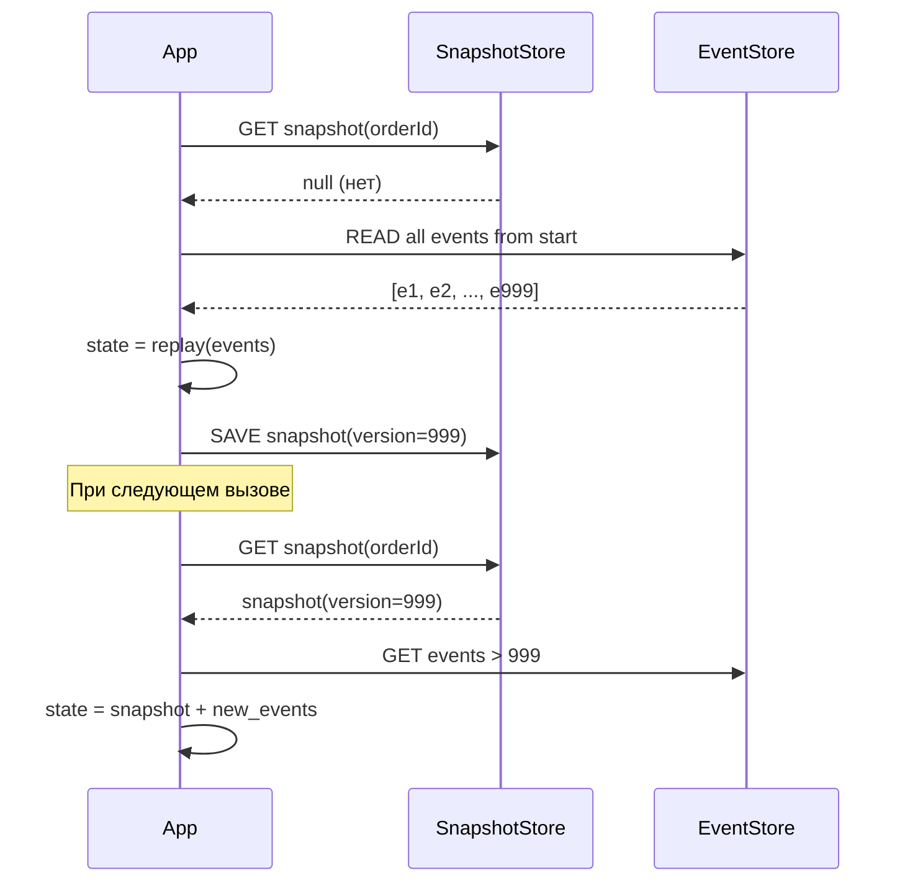

Отлично!  
**Snapshotting (снимки состояния)** — это **ключевой паттерн в системах с Event Sourcing**, который позволяет **ускорить восстановление агрегата**, не пересчитывая все события с самого начала.

---

## ✅ Проблема: Почему нужен Snapshotting?

Представьте, что у вас есть заказ:
- Создан → 10 событий
- Изменён адрес → 20
- Оплата → 30
- Отмена → 40
- Возврат средств → 50

Чтобы получить текущее состояние заказа `Order #123`, нужно:
```text
Event 1: OrderCreated
Event 2: AddressUpdated
...
Event 999: RefundProcessed
→ Только после этого вы знаете: "Заказ закрыт"
```

> ❌ Это **очень медленно** при большом числе событий

---

## ✅ Решение: Snapshotting

> **Создавайте «снимок» каждые N событий**

Например:
```text
[SNAPSHOT] Order #123 at version 500:
{
  status: "shipped",
  total: 99.99,
  items: [...]
}
```

Теперь:
- Начинаете не с версии 1
- А с **снимка на версии 500**
- Затем применяете только **события с 501 до 999**

→ Скорость ростёт в разы

---

## 🔧 Как работает?



---

## ✅ Преимущества Snapshotting

| Плюс | Объяснение |
|------|------------|
| ✅ **Быстрое восстановление** | Не нужно читать 10K событий |
| ✅ **Масштабируемость** | Даже для старых заказов |
| ✅ **Гибкость** | Можно делать каждые 100/500/1000 событий |
| ✅ **Поддержка CQRS** | Проекции строятся быстрее |

---

## ⚠️ Ограничения

| Минус | Решение |
|-------|--------|
| ❌ Нужно хранить два источника | Event Store + Snapshot DB |
| ❌ Устаревший снимок → ошибка | Валидируйте по версии |
| ❌ Сложность согласованности | Используйте один источник идентичности |

---

## ✅ Где используется?

| Технология | Поддержка |
|-----------|----------|
| **Axon Server** | ✅ Да — встроено |
| **EventStoreDB** | ✅ Да |
| **Custom Event Sourcing** | ✅ Реализуется вручную |

---

## 🔄 Когда делать снимок?

| Критерий | Пример |
|---------|--------|
| По количеству событий | Каждые 100 событий |
| По времени | Каждые 24 часа |
| По размеру | Если > 1MB событий |
| При изменении статуса | После `OrderShipped` |

---

## ✅ Пример: Java + Axon Framework

```java
@Aggregate(snapshotTriggerDefinition = "snapshotTrigger")
public class Order {
    @AggregateIdentifier
    private String orderId;

    public void handle(CreateOrderCommand cmd) { /* */ }

    @EventSourcingHandler
    public void on(OrderCreatedEvent event) { /* */ }
    
    @EventSourcingHandler
    public void on(PaymentReceivedEvent event) { /* */ }
}

// Автоматически делает снимок
@ScheduledSnapshotTriggerDefinition(
    triggerInterval = 100
)
private SnapshotTriggerDefinition snapshotTrigger;
```

---

## ✅ Финальный вывод

| Без Snapshotting | Со Snapshotting |
|------------------|-----------------|
| Медленное чтение | Быстрое |
| Пересчёт всех событий | Старт с последнего снимка |
| Для новых объектов | Для старых и больших |

> 💬 _“If you don’t use snapshots — your aggregates will grow old and slow.”_

---

## 📚 Где учиться дальше?

- Book: *“Domain-Driven Design”* — Eric Evans
- Book: *“Implementing Domain-Driven Design”* — Vaughn Vernon
- [Axon Docs](https://docs.axoniq.io/)
- YouTube: *“Event Sourcing with Snapshots”* — Greg Young

---

✅ **Snapshotting — это как сохранение игры в видеоигре.**  
Вы не начинаете с уровня 1 — вы загружаетесь из последнего save’а.

📌 Сохраните эту информацию — она станет основой вашей производительной системы.