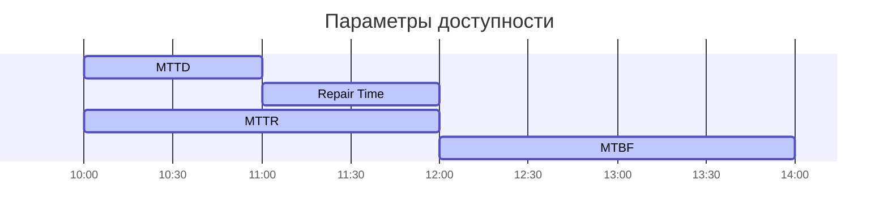

---
aliases:
  - метрики доступности
  - reliability metrics
  - метрики доступности системы
---
Конечно! Эти метрики используются в инженерии надёжности (SRE — Site Reliability Engineering), технической поддержке и управлении инцидентами, чтобы измерять эффективность реагирования на сбои, устойчивость систем и общую надёжность. Вот объяснение каждой из них:
$$
\text{Доступность} = \frac{\text{Согласованное время обслуживания – Время простоя}}{\text{Согласованное время обслуживания * 100}}
$$

---

### **3. MTTR — Mean Time to Recovery / Mean Time to Resolve (Среднее время восстановления)**
⚠️ **Важно**: MTTR — термин с **несколькими значениями**, в зависимости от контекста:
- **Mean Time to Recovery** — чаще используется в SRE: время от начала сбоя до полного восстановления работы системы.
- **Mean Time to Resolve** — в ITIL и некоторых практиках: время от обнаружения до полного устранения (включая постинцидентные действия, например, применение патча).

Но чаще всего в инженерии надёжности:
- **MTTR = Mean Time to Recovery** = время от **начала сбоя до полного восстановления сервиса** (включает обнаружение, диагностику, устранение и проверку).
- **Формула**:  
$$
\text{MTTR} = \frac{\text{Общее время восстановления всех инцидентов}}{\text{Количество инцидентов}}
$$
- **Пример**: Сбой начался в 10:00, сервис восстановлен в 10:45 → MTTR = 45 минут.

---

#### **2. MTTD — Mean Time to Detect (Среднее время до обнаружения)**
- **Определение**: Среднее время между началом инцидента (сбоя) и его обнаружением (системой мониторинга, пользователем или инженером).
- **Цель**: Показывает, насколько быстро система или команда замечает проблему.
- **Формула**:  
  $$
  \text{MTTD} = \frac{\text{Общее время от начала сбоев до их обнаружения}}{\text{Количество инцидентов}}
- $$
- **Пример**: Сбой начался в 10:00, обнаружен в 10:15 → MTTD для этого инцидента = 15 минут.
___

#### **1. Repair Time (Время ремонта)**
- **Определение**: Время, затраченное непосредственно на устранение неисправности после её обнаружения.
- **Примечание**: Иногда используется как синоним MTTR, но строго говоря, Repair Time — это только активная фаза исправления, без учёта времени обнаружения или восстановления после.
- **Пример**: Если инженер тратит 20 минут на замену сломанного диска — это Repair Time.

---

### **4. MTBF — Mean Time Between Failures (Среднее время между отказами)**
- **Определение**: Среднее время **между двумя последовательными сбоями** в системе. Используется для **восстанавливаемых систем**.
- **Цель**: Показывает **надёжность системы** — чем больше MTBF, тем надёжнее система.
- **Формула**:  
  $$
  \text{MTBF} = \frac{\text{Общее время работы (без простоев)}}{\text{Количество сбоев}}
  $$
- **Пример**: За месяц (720 часов) система сломалась 3 раза → MTBF ≈ 720 / 3 = 240 часов.

> ❗ MTBF **не включает** время простоя! Только время **работы** между сбоями.

---

### Сравнение и взаимосвязь:

| Метрика | Что измеряет? | Включает ли время обнаружения? | Включает ли время ремонта? |
|--------|----------------|-------------------------------|-----------------------------|
| **MTTD** | Время до обнаружения | Да (это его суть) | Нет |
| **Repair Time** | Только активное устранение | Нет | Да |
| **MTTR** | Полное время восстановления | Да | Да |
| **MTBF** | Время **работы** между сбоями | Нет | Нет (исключает простои) |

---

### Практическое значение:
- **Низкий MTTD** → хорошая система мониторинга и алертинга.
- **Низкий MTTR** → эффективные процессы реагирования и автоматизация восстановления.
- **Высокий MTBF** → надёжное оборудование/ПО, меньше сбоев.

Эти метрики помогают командам улучшать надёжность систем, оптимизировать процессы и снижать воздействие инцидентов на пользователей.

Если нужно — могу привести пример расчёта по реальным данным или показать, как их использовать в SLI/SLO/SLA.
