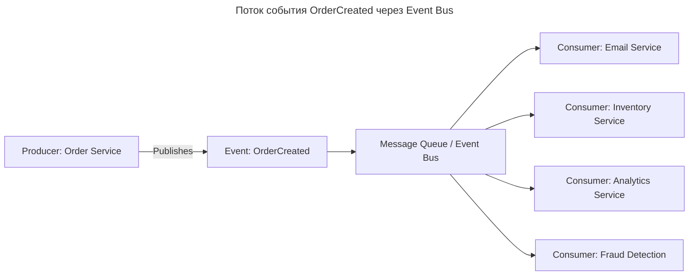
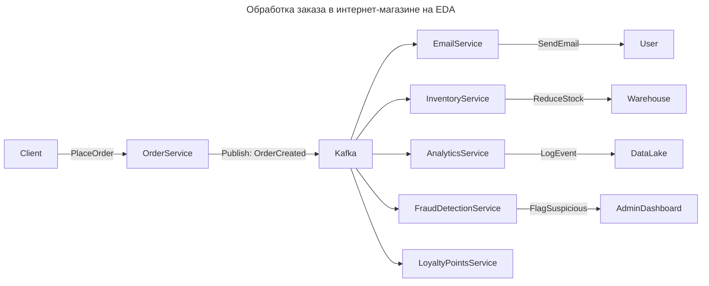

---
aliases:
  - AWS EventBridge
  - Azure Event Hubs
  - CQRS
  - Distributed Tracing
  - EDA
  - Event Bus
  - Event Consumer
  - Event Driven Architecture
  - Event Producer
  - Event Sourcing
  - Event Store
  - Event-Driven Architecture
  - Event‑Driven Architecture
  - Google Pub/Sub
  - Kafka
  - Message Queue
  - NATS
  - Pub/Sub
  - Publish-Subscribe
  - RabbitMQ
  - Redis Streams
  - Saga
  - Schema Registry
  - Архитектура, основанная на событиях
  - Шина событий
---

## Событийная архитектура (Event-Driven Architecture)

**EDA — Event-Driven Architecture (Архитектура, основанная на событиях)** — это один из самых мощных и современных подходов к построению **масштабируемых, гибких и отказоустойчивых распределённых систем**. Он лежит в основе таких гигантов, как **Netflix, Uber, Amazon, LinkedIn**, и становится стандартом де-факто в cloud-native-средах.

**Определение**

> **Event-Driven Architecture (EDA)** — это архитектурный стиль, в котором **системы взаимодействуют через генерацию, обнаружение и реакцию на события** — а не через прямые вызовы (например, HTTP/REST или RPC).

> 💡 **Событие** — это *неизменяемый факт* о том, что что-то произошло:
> `"OrderPlaced"`, `"PaymentApproved"`, `"InventoryUpdated"`, `"UserLoggedIn"`.

**Ключевая идея**

> **Компоненты системы не вызывают друг друга напрямую — они “слушают” события и реагируют на них.**

Это похоже на **жизнь в городе**:

- Не нужно звонить соседу, чтобы он убрал мусор;
- вместо этого: **когда мусор появился** → сработал датчик → пришла команда уборщику → тот пришёл и убрал;
- все действуют **независимо**, реагируя на **события**, а не на команды.

---

## EDA vs традиционные подходы

| Характеристика | **Традиционный (Request-Response / Synchronous)** | **Event-Driven Architecture (EDA)** |
| ---------------------- | ---------------------------------------------------------------------------------- | ---------------------------------------------------------------------------------- |
| **Взаимодействие** | Прямые вызовы (HTTP, gRPC) — клиент ждёт ответ | Асинхронная отправка событий — никто не ждёт |
| **Зависимости** | Жёсткие: A → B → C (цепочка вызовов) | Слабые: A публикует событие → B, C, D слушают и реагируют |
| **Производительность** | Блокирующие вызовы — медленнее при нагрузке | Неблокирующие — высокая пропускная способность |
| **Надёжность** | Если B упал — A тоже падает | Если C упал — A продолжает работать, событие ждёт в очереди |
| **Масштабируемость** | Сложно масштабировать цепочки | Легко: можно запустить 10 потребителей одного события |
| **Гибкость** | Добавление нового сервиса требует изменений в A | Добавляется новый слушатель — без изменений в источнике |
| **История изменений** | Обычно нет — только текущее состояние | Полная история событий (можно восстановить любое состояние) |
| **Пример** | `POST /order` → вызывает `payment-service` → `inventory-service` → `email-service` | `OrderCreated` → email-service, inventory-service, analytics-service — все слушают |

---

## Как работает EDA



1. **Order Service** создаёт заказ → генерирует событие `OrderCreated`.
2. Это событие отправляется в **Event Bus** (Kafka, RabbitMQ, AWS EventBridge).
3. **Все заинтересованные сервисы** (Email, Inventory и т.д.) **слушают** этот топик/очередь.
4. Каждый получает копию события и делает свою работу **независимо**.
5. Ни один сервис **не знает** о других — они связаны только через событие.

> ✅ **Никаких прямых вызовов. Только публикация и подписка.**

---

## Ключевые компоненты EDA

| Компонент | Описание |
| ---------------------------------------------- | ------------------------------------------------------------------------------------------------------------------------------ |
| **Event Producer** | Сервис, который **генерирует событие** (например, платёжный сервис после успешной оплаты). |
| **Event** | Неизменяемый объект, описывающий факт: `{ "type": "PaymentCompleted", "orderId": "123", "amount": 99.99, "timestamp": "..." }` |
| **[[publish-subscribe|Publish-subscribe]] / [[message-broker|Message broker]]** | Центральный канал для передачи событий: **Kafka, RabbitMQ, AWS EventBridge, Azure Event Hubs, Google Pub/Sub**. |
| **Event Consumer** | Сервис, который **реагирует на событие** (например, отправляет email, обновляет инвентарь, пишет в аналитику). |
| **Event Store** | (Опционально) База данных, хранящая все события — основа для **Event Sourcing**. |
| **Schema Registry** | (Опционально) Хранит схемы событий (например, [[avro|Avro]], Protobuf), чтобы обеспечить совместимость. |

---

## Преимущества EDA

| Преимущество | Почему важно |
| ------------------------------------------- | ----------------------------------------------------------------------------------------------------------------------------------------- |
| **Высокая отказоустойчивость** | Если один сервис упал — другие продолжают работать. События накапливаются в очереди. |
| **Масштабируемость** | Можно добавить 100 потребителей одного типа — они будут обрабатывать события параллельно. |
| **Декуплинг (Decoupling)** | Сервисы не зависят друг от друга — их можно менять, переписывать, обновлять независимо. |
| **Параллелизм и асинхронность** | Нет блокировок — система работает быстрее, особенно при долгих операциях (email, PDF, внешние API). |
| **Поддержка микросервисов** | Идеально подходит для разрозненных, независимых сервисов. |
| **Полная история изменений** | Все события хранятся — можно восстановить состояние системы на любой момент (Audit, Debug, Replay). |
| **Лёгкое внедрение новых функций** | Добавление новой функции → запускается новый consumer, который слушает нужное событие — **никаких изменений в существующих сервисах**. |
| **Поддержка [[CQRS|CQRS]] и [[event-sourcing|Event sourcing]]** | EDA — естественная основа для этих паттернов. |

---

## Недостатки и сложности EDA

| Проблема | Объяснение |
| ----------------------------- | --------------------------------------------------------------------------------------------------------------------------------- |
| **Сложность отладки** | Трассировка запроса через несколько сервисов сложнее, чем в синхронных вызовах. Решение: **[[distributed-tracing|Distributed Tracing]]** ([[open-telemetry|OpenTelemetry]]). |
| **Сложность согласованности** | Если два сервиса обрабатывают одно событие, как гарантировать целостность? Решение: **Saga Pattern**, idempotent consumers. |
| **Порядок событий** | В некоторых системах (например, Kafka) порядок гарантируется только внутри partition. |
| **Дублирование событий** | Из-за at-least-once доставки могут прийти дубликаты → нужны **идемпотентные потребители**. |
| **Операционная сложность** | Нужно мониторить lag, DLQ, схемы, репликацию, производительность брокера. |
| **Задержки** | Асинхронность = задержка между событием и реакцией (миллисекунды — секунды). Не подходит для HFT. |
| **Не для всех задач** | Для простых CRUD-операций (например, `/login`) EDA — избыточна. |

---

## Архитектурный пример: интернет-магазин на EDA

### Синхронный подход (устаревший)

```plaintext
Клиент → [CreateOrder] → [PaymentService] → [InventoryService] → [EmailService] → Ответ клиенту
```

→ Если EmailService упал — весь процесс проваливается.

→ Пользователь видит ошибку, хотя заказ создан и оплачен.

### Событийный подход (EDA)



**Как это работает:**

1. Пользователь создаёт заказ → `OrderService` сохраняет его и **публикует событие `OrderCreated`**.
2. **Немедленно возвращает ответ пользователю**: *"Заказ принят!"*.
3. **Все остальные сервисы** — независимо — начинают свою работу:
   - `EmailService` → отправляет подтверждение;
   - `InventoryService` → уменьшает остатки;
   - `FraudDetection` → проверяет на мошенничество;
   - `Analytics` → записывает событие в [[OLAP|BigQuery]];
   - `Loyalty` → начисляет бонусы.

> ✅ **Если EmailService упал — он просто не получит событие до восстановления. Но заказ уже создан, и пользователь ничего не потерял.**

---

## EDA + CQRS + Event Sourcing

EDA часто сочетается с другими паттернами:

| Паттерн | Роль в EDA |
| ---------------------- | ----------------------------------------------------------------------------------------------------------------------------- |
| **[[CQRS|CQRS]]** | Разделение чтения и записи: <br> • Запись — через события <br> • Чтение — через материализованные представления (Read Models) |
| **[[event-sourcing|Event sourcing]]** | Хранение всего состояния как последовательности событий — **EDA — это транспорт событий**, ES — это хранилище |
| **[[saga|Saga]] Pattern** | Управление распределёнными транзакциями: если один шаг упал — выполняются компенсирующие действия (например, `RefundPayment`) |

> ✅ Эти три паттерна вместе образуют **мощнейшую архитектуру для сложных бизнес-систем**.

---

## Технологии реализации EDA

| Инструмент | Тип | Особенности |
| -------------------- | ------------------------------ | ----------------------------------------------------------------------------------------------------- |
| **Apache Kafka** | Event Bus | Высокопроизводительный, масштабируемый, хранит события часами/днями, поддерживает потоковую обработку |
| **RabbitMQ** | Message Queue | Подходит для P2P и Pub/Sub, проще в освоении, но менее масштабируем |
| **AWS EventBridge** | Managed Event Bus | Полностью управляемый сервис AWS, интегрируется с Lambda, SNS, SQS |
| **Google Pub/Sub** | Managed Pub/Sub | Аналог EventBridge в GCP |
| **Azure Event Hubs** | Масштабируемый event-ingestion | Для больших потоков данных |
| **NATS** | Лёгкий брокер | Быстрый, для IoT и microservices |
| **Redis Streams** | In-memory stream | Очень быстро, но менее надёжен без persistence |

> ✅ **[[kafka|Kafka]] — de facto стандарт** для enterprise EDA.

---

## Когда использовать EDA

| ✅ Подходит, если: | ❌ Не подходит, если: |
| -------------------------------------------------------------- | ---------------------------------------------------------- |
| Нужны **высокая доступность** и **отказоустойчивость** | Система — маленький MVP с двумя сервисами |
| Есть **долгие или внешние операции** (email, SMS, внешние API) | Нужен **< 10 мс отклик** (HFT, трейдинг) |
| Строится **микросервисная архитектура** | Все компоненты живут в одном процессе |
| Нужна **гибкость** — легко добавлять новые функции | Нет готовности к сложности отладки и мониторинга |
| Нужна **полная история изменений** | Не важна аудиторская прослеживаемость |
| Используются **CQRS / Event Sourcing** | Работа с простыми CRUD-операциями |
| Система развёрнута в **облаке** (AWS/Azure/GCP) | Legacy-системы без возможности модернизации |

---

## Реальные примеры использования EDA

| Компания | Применение EDA |
| ------------ | ------------------------------------------------------------------------------------------------- |
| **Netflix** | При просмотре видео → событие `VideoPlayed` → обновление рекомендаций, аналитика, реклама |
| **Uber** | Заказ автомобиля → `RideRequested` → поиск водителя → назначение → оплата → отзыв → статистика |
| **Amazon** | Клиент покупает товар → `OrderPlaced` → обновление склада, логистика, email, налоги, рекомендации |
| **LinkedIn** | Пользователь лайкает пост → `PostLiked` → обновление ленты, уведомления, аналитика |
| **Spotify** | Песня проиграна → `SongPlayed` → сбор данных, рекомендации, лицензионные выплаты |

> 💬 **Все эти компании используют EDA — потому что без неё они не смогли бы масштабироваться до миллиардов событий в день.**

---

## Лучшие практики EDA

| Практика | Объяснение |
| --------------------------------------------------------------- | ------------------------------------------------------------------------------------------------------- |
| **События — неизменяемые** | Никогда не меняйте содержимое события — создавайте новое (`OrderCancelled`, а не `OrderStatusChanged`). |
| **Имя события — в прошедшем времени** | `OrderCreated`, `PaymentApproved`, `ShipmentDelivered` — так понятнее. |
| **Idempotent consumers** | Потребители должны быть готовы к повторным вызовам — потому что события могут приходить дважды. |
| **Используйте схемы (Avro / Protobuf)** | Чтобы не было поломок при изменении формата. |
| **Мониторьте [[message-queueing#Dead Letter Queue (DLQ)|lag и DLQ]]** | Это ваши «индикаторы здоровья» системы. |
| **Используйте [[distributed-tracing|Distributed tracing]]** | OpenTelemetry + Jaeger/Zipkin — чтобы отслеживать события через сервисы. |
| **Начинайте с простого** | Не стройте всю систему на EDA сразу — выделите один критичный путь (например, email-уведомления). |

**Финальный вывод**

| Традиционный подход | EDA |
| --------------------------------- | ------------------------------------------------- |
| **«Я хочу, чтобы ты сделал это»** | **«Что-то случилось — пусть каждый делает своё»** |
| Синхронный вызов | Асинхронная реакция |
| Жёсткая зависимость | Слабая связь |
| «Цепочка» | «Сеть» |
| Уязвимость к сбоям | Устойчивость к сбоям |

> 🔥 **EDA — это архитектура будущего.**
> Она позволяет системам расти, как живые организмы:
> — один орган реагирует на сигнал → другие — автоматически адаптируются.
> — если один орган болеет — остальные продолжают работать.
