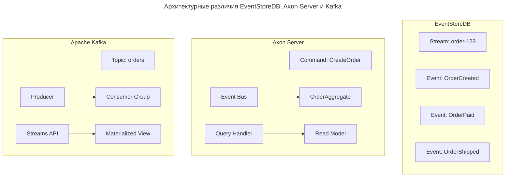

---
aliases:
  - Aggregate
  - Apache Kafka
  - Axon Server
  - CQRS
  - Event Bus
  - Event Sourcing
  - Event Store
  - EventStoreDB
  - Kafka
  - Saga
  - Событийная архитектура
  - Событийное хранилище
---

В событийной архитектуре применяются три ключевых решения для сравнения:

- **EventStoreDB**
- **Axon Server**
- **Apache Kafka**

Ниже — что общего, чем отличаются, и когда что использовать.

## Сравнение

| Критерий                        | **EventStoreDB**                  | **Axon Server**                  | **Apache Kafka**              |
| ------------------------------- | --------------------------------- | -------------------------------- | ----------------------------- |
| **Тип**                         | Специализированная БД             | Event-driven платформа (CQRS/ES) | Распределённый лог сообщений  |
| **Основное назначение**         | Хранение и восстановление событий | CQRS + Event Sourcing            | Поток данных между сервисами  |
| **События как источник правды** | ✅ Да                              | ✅ Да                             | ❌ Не изначально               |
| **Гарантии согласованности**    | ✅ Высокие                         | ✅ Очень высокие                  | ⚠️ Зависит от приложения      |
| **Поддержка Event Sourcing**    | ✅ Встроено                        | ✅ Ядро архитектуры               | ❌ Нужно реализовывать вручную |
| **Модель данных**               | События → потоки → проекции       | Command, Query, Events           | Простые сообщения             |
| **Интеграция с DDD / CQRS**     | ✅ Легко                           | ✅ Глубоко интегрировано          | ⚠️ Только через паттерны      |
| **API / SDK**                   | .NET, Java, Python                | Java, Spring                     | Все языки                     |
| **UI / Dashboard**              | ✅ Есть                            | ✅ Есть                           | ❌ Требует Kafdrop, AKHQ       |

## Подробное сравнение

### EventStoreDB

> **EventStoreDB** — это **специализированная база данных**, созданная для хранения событий.

**Особенности**

- ✅ Оптимизирована под события
- ✅ Поддержка `stream per entity`
- ✅ Автомасштабирование
- ✅ История по ID: `GET /streams/order-123`
- ✅ Можно выполнять запросы: "показать все заказы за сегодня"
- ❌ Меньше community
- ❌ Менее универсален
- ❌ Может быть дороже

**Когда использовать**

- Строите систему на **Event Sourcing**
- Хотите «базу для событий»
- Работаете с .NET или Java

---

### Axon Server

> **Axon Server** — это **платформа для CQRS и Event Sourcing**, часть экосистемы [[axon-framework|Axon Framework]]

**Особенности**

- ✅ Полная поддержка **Command Model**
- ✅ Встроенные механизмы:
  - `@Aggregate`, `@Saga`
  - `Event Bus`, `Query Bus`
- ✅ Управление жизненным циклом команд
- ✅ Отлично работает с **Spring Boot**
- ❌ Привязка к **Java/Spring**
- ❌ Сложнее вне Axon Framework
- ❌ Меньше гибкости

**Когда использовать**

- У вас **много бизнес-логики**
- Вы используете **DDD**
- Нужна строгая архитектура CQRS

---

### Apache Kafka

> **Kafka** — это **распределённый журнал сообщений**, но его часто используют как основу для событийных систем.

**Особенности**

- ✅ Очень высокая пропускная способность (миллионы сообщений/сек)
- ✅ Отказоустойчивость
- ✅ Широкое сообщество
- ✅ Поддержка всех языков
- ✅ Интеграция с [[realtime-highload|Flink]], Spark, Debezium
- ❌ По умолчанию — **не event sourcing**
- ❌ Нет встроенной поддержки `aggregate` или `saga`
- ❌ Сообщения = сырые данные → нужно обрабатывать

**Когда использовать**

- Вам нужна **производительность**
- Уже используете Kafka
- Хотите **гибкую инфраструктуру**

---

## Архитектурные различия

## Как выбрать

| Ваша цель | Рекомендация |
|----------|--------------|
| ✅ Чистый Event Sourcing | ➤ **EventStoreDB** |
| ✅ CQRS + DDD | ➤ **Axon Server** |
| ✅ High-throughput, real-time | ➤ **Kafka** |
| ✅ Вы не хотите зависеть от фреймворка | ➤ **Kafka + ручная реализация** |
| ✅ У вас .NET / Spring | ➤ **EventStoreDB / Axon** |
| ✅ MVP | ➤ **Kafka** |
| ✅ Enterprise-scale DDD | ➤ **Axon Server** |

**Финальный вывод**

| | **EventStoreDB** | **Axon Server** | **Kafka** |
|--|----------------|----------------|----------|
| **Что?** | Событийная БД | CQRS-платформа | Message broker |
| **События** | Первичная модель | Ядро системы | Данные в топиках |
| **Sagas** | Через клиент | ✅ Встроено | Ручная реализация |
| **Производительность** | Хорошая | Хорошая | ✅ Отличная |
| **Простота внедрения** | Средняя | Высокая (в Java) | Высокая |
| **Лучше всего для** | Event Sourcing | DDD, микросервисы | Streaming, [[ETL|ETL]] |

> *“Kafka is a pipe. EventStoreDB and Axon are architectures.”*

> *“Use Kafka for plumbing. Use EventStore/Axon for thinking.”*
