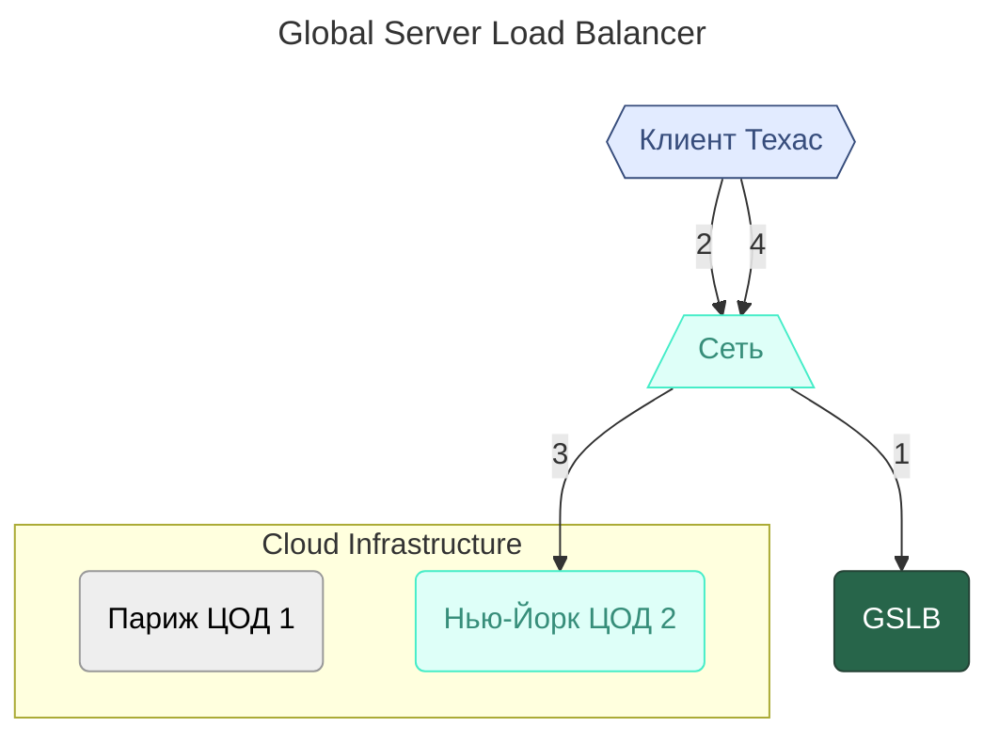

---
aliases:
  - Active-Active
  - Active-Standby
  - Cold Standby
  - Failover
  - Failover Strategy
  - Geo-Redundancy
  - Global Server Load Balancer
  - GSLB
  - Redundancy
  - Warm Standby
  - отказоустойчивость
  - фейловер
---

## Failover Strategy

Фейловер-стратегия (Failover Strategy) — это механизм обеспечения высокой доступности приложения, в рамках которого «основная» система в случае сбоя может быть заменена «резервной».

Это совокупность механизмов и подходов, которые обеспечивают переключение на резервную (redundant) систему, когда основная (primary) система выходит из строя.

### Стратегии отказоустойчивости

1. **Active-Passive (Active-Standby)**
    - В рамках стратегии Active-Standby резервный узел находится в рабочем состоянии, но на него не поступает трафик (**Warm Standby**).
    - При **Cold Standby**, в случае сбоя основного узла, потребуется сначала его развернуть и только затем направить на него трафик.
2. **Active-Active**
3. **Geo-Redundancy** — гео-избыточность
    - GSLB — Global Server Load Balancer

**Рекомендации по выбору стратегии**

| Ваша система | Рекомендуемая стратегия |
|--------------|--------------------------|
| **Локальный сервис** (внутренняя CRM, ERP) | **Active-Passive** — просто, дёшево, надёжно |
| **Веб-приложение** (SaaS, API, микросервисы) | **Active-Active** — масштабируемо, без простоя |
| **Глобальный сервис** (международный SaaS, интернет-магазин) | **Geo-Redundancy + Active-Active** — максимальная доступность |
| **База данных** (PostgreSQL, MySQL) | **Active-Passive** с **синхронной репликацией** |
| **Кэш / Очереди** (Redis, Kafka) | **Active-Active** с **репликацией между узлами** |
| **Файловое хранилище** (MinIO, S3) | **Geo-Redundancy** с **репликацией между регионами** |

### Active-Passive

**Один активный узел** обрабатывает все запросы. **Один (или несколько) пассивных узлов** — **ждут в режиме ожидания**. При сбое активного — пассивный **автоматически становится активным**.

**Схема**
- **Active Node** — обрабатывает трафик
- **Passive Node** — синхронизируется, но НЕ обрабатывает запросы

**Пассивный узел** — это резервная копия. Он **не потребляет ресурсы** на обработку — только на синхронизацию. Переключение называется **failover**.

**Особенности**
- ✅ Простота — легко настроить и понять
- ✅ Нет конфликтов — только один узел пишет, нет риска повреждения данных
- ✅ Экономия ресурсов — пассивный узел не нагружает систему
- ✅ Подходит для БД — идеально для PostgreSQL, MySQL, Oracle
- ❌ Низкая эффективность — пассивный узел простаивает, 50% ресурсов «в воздухе»
- ❌ Время переключения — failover занимает **несколько секунд**, пользователи видят ошибки
- ❌ Риск потери данных — если синхронизация не **синхронная**, последние транзакции могут пропасть

### Active-Active

**Все узлы активны** — **все обрабатывают запросы одновременно**.

Данные синхронизируются между узлами в **реальном времени**.

**Схема**
- **Active Node 1** — обрабатывает запросы
- **Active Node 2** — обрабатывает запросы
- **Active Node 3** — обрабатывает запросы
- Все узлы синхронизируют данные между собой
- **Нет «резервных» узлов** — все равноправны.
- **Балансировщик** (например, Ingress, LoadBalancer) распределяет трафик между всеми.

**Как синхронизировать данные**
- Для **баз данных** — используются **многописьменные СУБД**:
    - **CockroachDB**, **TiDB**, **YugabyteDB** — распределённые SQL-базы
- Для **кэша** — **Redis Cluster**
- Для **файлов** — **MinIO (S3-совместимый)**
- Для **очередей** — **Kafka с репликацией**

**Особенности**
- ✅ Нет простоя — если один узел упал, остальные продолжают работать без переключения
- ✅ Высокая производительность — трафик распределён, система масштабируется горизонтально
- ✅ Максимальная доступность — даже при падении 2 из 3 узлов система работает
- ✅ Экономия на ресурсах — нет «молчащих» узлов, все работают на полную мощность
- ❌ Сложность — требует **специализированного ПО** для синхронизации данных
- ❌ Конфликты — возможны **конфликты записей** (например, два пользователя изменили одно поле одновременно)
- ❌ Стоимость — распределённые базы (CockroachDB) дороже в обслуживании
- ❌ Сложная отладка — трудно отследить, где и почему произошёл сбой

**Когда использовать**
- ✅ **API-сервисы** (REST, gRPC) — они stateless
- ✅ **Веб-приложения** (React, Vue, Spring Boot)
- ✅ **Сервисы с высоким трафиком** (Netflix, Uber, TikTok)
- ✅ **Системы, где 99.99% доступности критичны**

**Пример**
**YouTube** — если один сервер упал, пользователь переключается на другой и **не замечает**.

### Geo-Redundancy

**Размещение копий системы в разных географических регионах** (дата-центры, облака, страны).

Цель: **выжить при катастрофе** — пожар, землетрясение, отключение электричества, сбой провайдера.

**Схема**
- **Region: US-East** — активный
- **Region: EU-West** — резервный (или активный)
- **Region: AP-South** — резервный

Каждый регион имеет **свой кластер Kubernetes**, свои базы, свои DNS. Трафик направляется к **ближайшему региону** через **DNS-балансировку** (например, AWS Route53, Cloudflare). Данные реплицируются **асинхронно** между регионами.

При георезервировании возникает вопрос маршрутизации трафика за пределами одной площадки. Для решения этой проблемы в первую очередь поможет DNS. А также максимально эффективным инструментом считается GSLB.

**GSLB (Global Server Load Balancer)** — это балансировщик нагрузки, который способен направлять трафик между несколькими центрами обработки данных. В то время как обычный балансировщик распределяет трафик по серверам, расположенным в одном ЦОД.



**Пример**

```yaml
# В US-East — кластер с Ingress и сервисами
# В EU-West — такой же кластер, с репликой базы данных

# DNS: cinemaabyss.com →
#   - если пользователь в Европе → направляет на EU-West
#   - если в США → на US-East
#   - если EU-West упал → автоматически переключает на US-East
```

**Инструменты**
- **Cloudflare Load Balancing**
- **AWS Route53 + Health Checks**
- **Global Load Balancer** (GCP, Azure)
- **Multi-cluster Kubernetes** (Anthos, Rancher, OpenShift)

**Особенности**
- ✅ Высшая доступность — даже при **полном отключении региона** система работает
- ✅ Низкая задержка — пользователи подключаются к ближайшему дата-центру → быстрее
- ✅ Соответствие законам — данные могут храниться в нужной юрисдикции (GDPR, CCPA)
- ✅ Устойчивость к катастрофам — землетрясение, пожар, война — не остановят систему
- ❌ Очень высокая сложность — нужно синхронизировать **данные, конфиги, DNS, сети, секреты**
- ❌ Очень высокая стоимость — дублирование кластеров в 2–3 раза дороже
- ❌ Задержки синхронизации — асинхронная репликация, последние данные могут быть не синхронизированы
- ❌ Трудно тестировать — невозможно локально воспроизвести гео-сценарии

**Когда использовать**
- ✅ **Глобальные сервисы** (Spotify, Netflix, Airbnb, Uber)
- ✅ **Финансовые системы** (банки, биржи)
- ✅ **Государственные системы** (электронное правительство)
- ✅ **Системы с требованиями SLA 99.999% («пять девяток»)**

**Пример**
**Amazon** — если упал дата-центр в Вирджинии, пользователи в Европе продолжают покупать, переключившись на Франкфурт.
