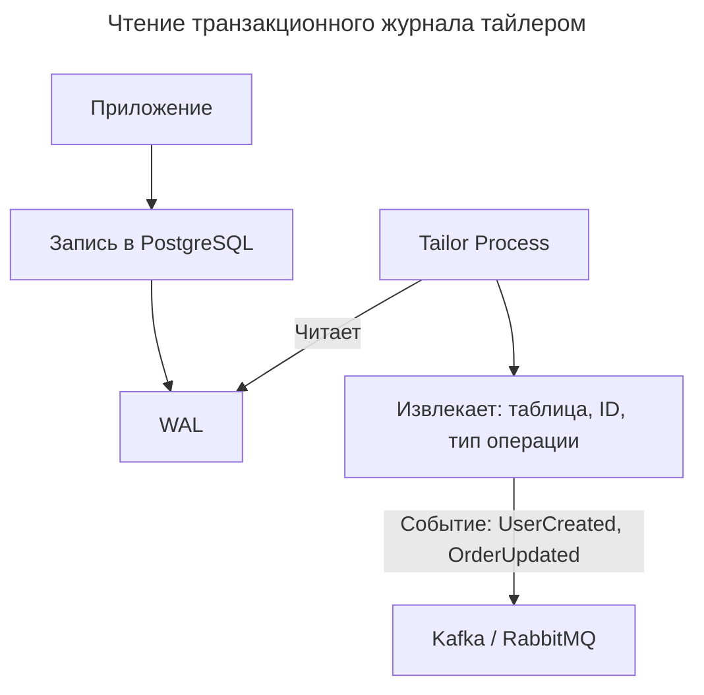
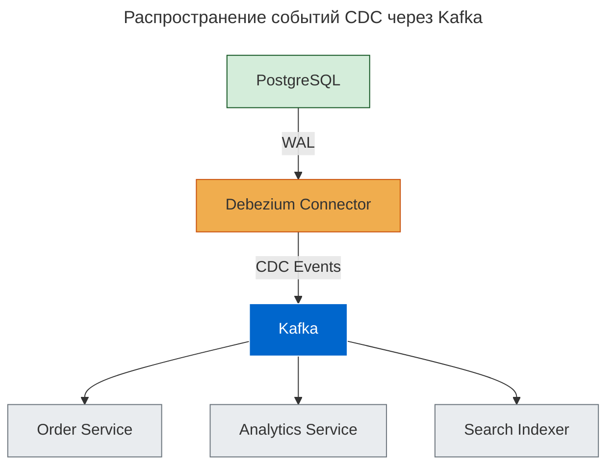

---
aliases:
  - CDC
  - Change Data Capture
  - Debezium
  - log tailing
  - tailer
  - tailing
  - Transaction log tailing
---

**Transaction Log Tailing (чтение транзакционного журнала)** — это паттерн, при котором вы **отслеживаете логи базы данных в реальном времени**, чтобы:

- реагировать на изменения;
- интегрировать микросервисы;
- строить события, не меняя код.

## Что такое Transaction Log?

> **Transaction Log (WAL — Write-Ahead Log)** — это журнал всех изменений БД: `INSERT`, `UPDATE`, `DELETE` — до того как они применены.

### Примеры

| СУБД | Журнал |
|------|--------|
| **PostgreSQL** | WAL (Write-Ahead Log) |
| **MySQL** | Binary Log (`binlog`) |
| **Oracle** | Redo Log |
| **SQL Server** | Transaction Log |
| **MongoDB** | Oplog |

## Что такое Log Tailing?

> **Log Tailing** — это процесс **постоянного чтения и анализа** этого журнала → для извлечения событий.



Это **не SQL-запросы**, а **прямое чтение журнала**.

## Как работает: пошагово

1. Приложение делает:

   ```sql
   INSERT INTO users (id, name) VALUES (123, 'Alice');
   ```

2. БД записывает это в **WAL**.
3. **Tailer (например, Debezium)** читает:
   - таблицу: `users`;
   - операцию: `INSERT`;
   - значения: `{"id": 123, "name": "Alice"}`.
4. Создаёт событие:

   ```json
   {
     "event_type": "CREATE",
     "table": "users",
     "data": { "id": 123, "name": "Alice" }
   }
   ```

5. Отправляет в Kafka.

## Преимущества Log Tailing

| Плюс                                            | Объяснение                             |
| ----------------------------------------------- | -------------------------------------- |
| **Нет нагрузки на бизнес-логику**               | Не нужно писать `publishEvent()`       |
| **Реальное время**                              | Изменения → за миллисекунды            |
| **Гарантия порядка**                            | [[rdbms\|WAL]] — упорядочен            |
| **Не пропускает события**                       | Если tailer жив — всё будет доставлено |
| **Подходит для [[CQRS]], [[event-sourcing]]**   | Автоматически генерирует события       |
| **Интеграция без изменения кода**               | Идеально для legacy                    |

## Log Tailing vs ручная публикация событий

| Метод               | Плюсы                                           | Минусы                                                |
| ------------------- | ----------------------------------------------- | ----------------------------------------------------- |
| **Log Tailing**     | Нет дублирования, гарантированный порядок       | Сложнее настроить, может быть задержка                |
| **Ручная отправка** | Проще понять                                    | Можно забыть, два шага = риск несогласованности       |

> _Log tailing turns your database into an event emitter._

## Инструменты

| Инструмент | Описание |
|-----------|----------|
| **Debezium** | Самый популярный CDC (Change Data Capture), интеграция с Kafka Connect |
| **pg_recvlogical (PostgreSQL)** | Встроенное средство репликации |
| **Maxwell's Daemon (MySQL)** | Читает binlog → JSON |
| **Canal (Alibaba)** | Для MySQL |
| **Kafka Connect + JDBC Source** | Альтернатива |
| **AWS DMS** | Database Migration Service |

## Пример: архитектура с Debezium



Любой сервис может подписаться на изменения.

## Ограничения

| Проблема | Решение |
|----------|---------|
| Формат сложный (LSN, offsets) | Используйте Debezium |
| Требует доступ к бинлогам | Настройка прав |
| Задержка (обычно < 1s) | Приемлемо |
| Нельзя фильтровать в БД | Фильтр на стороне Kafka |

## Когда использовать?

| Сценарий | Рекомендация |
|----------|--------------|
| Интеграция микросервисов | Да — идеален |
| Legacy-система без событий | Да — извлекайте через log |
| Нужны события для ML/аналитики | Да |
| Хотите Event Sourcing | Да |
| Маленькая система | Нет — хватит простого API |

**Итог:**

> **Log Tailing — это когда ваша БД говорит:** _«Я только что сохранил данные. Кто хочет знать?»_

Он превращает **любую реляционную БД в источник событий**.

Документация: Debezium Docs (debezium.io/documentation/).
