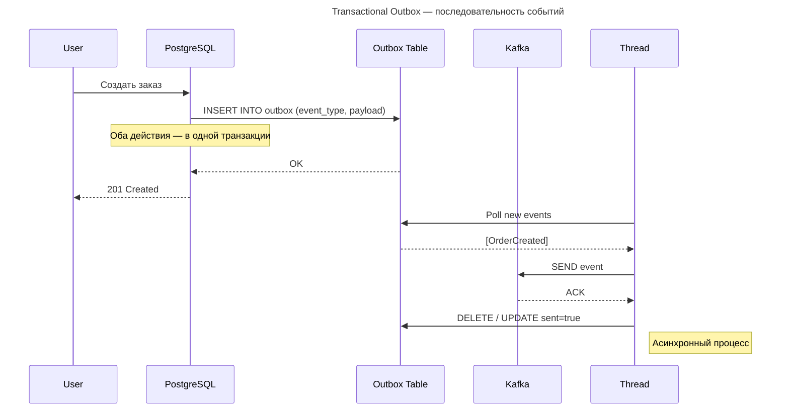
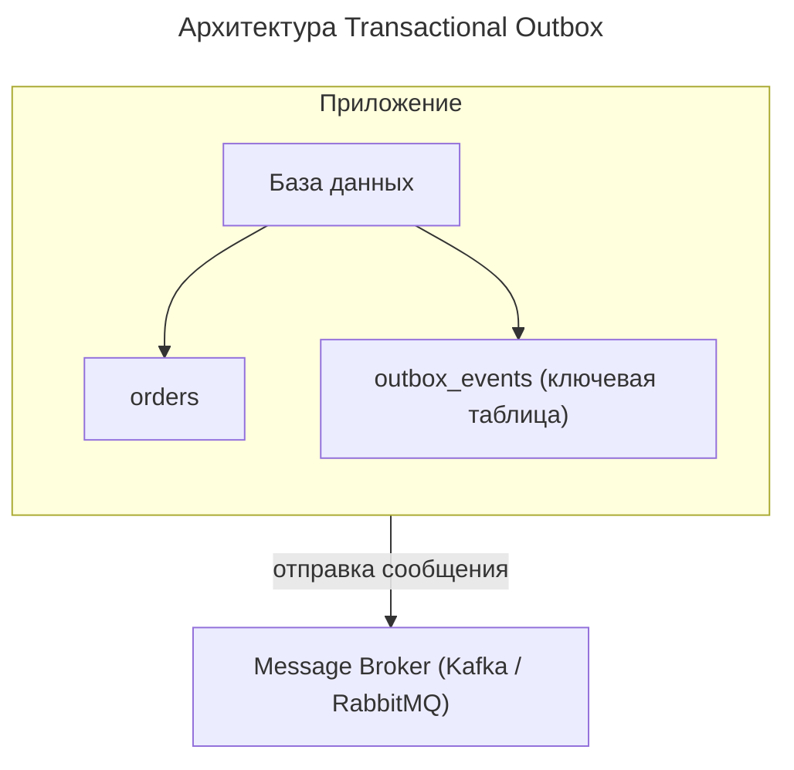

---
aliases:
  - CDC
  - Debezium
  - Outbox Pattern
  - Polling publisher
  - Transaction log tailing
  - Transactional Outbox
  - Транзакционный исходящий ящик
---

## Паттерн Transactional Outbox

**Transactional Outbox (Транзакционный исходящий ящик)** — это **ключевой паттерн в событийно-ориентированных и микросервисных системах**, который решает **проблему согласованности между базой данных и очередью сообщений**.

Передатчик сообщений может быть реализован 2 способами:

1. Polling publisher
2. [[transaction-log-tailing|Transaction log tailing]]
   - [[change-data-capture|Change Data Capture]] – Change Data Capture

Polling publisher, как правило, — компонент, который по расписанию запрашивает записи из Outbox-таблицы, на их основании формирует исходящее сообщение и кладёт его в брокер. После отправки записи из таблицы либо удаляются, либо проставляется новый статус, например «Отправлено».

Transaction log tailing, как правило, использует API-БД для отслеживания новых записей в транзакционном логе. На рынке существует ряд готовых решений класса CDC, которые предоставляют реализацию этого паттерна «из коробки».

---

## Проблема: согласованность БД и очереди

Пример: создание заказа

```java
// Шаг 1: Сохранить заказ в БД
orderRepository.save(order);

// Шаг 2: Отправить событие "OrderCreated"
eventPublisher.publish(new OrderCreatedEvent(order));
```

### Сценарии отказов

1. Записали в БД → но при сбое перед `publish()` → **событие потеряно**
2. Отправили событие → но запись в БД не прошла → **не согласовано**

> Это нарушает **[[acid-consistency|acid-consistency]]**: мы хотим, чтобы оба шага были в одной транзакции

## Решение: Transactional Outbox Pattern

**Идея**

- Сначала сохраните **само событие как часть транзакции в той же БД**
- Позже — **отправьте его в очередь (Kafka, [[rabbit-mq|RabbitMQ]])**
- Так что даже если сервис упадёт — событие останется

## Как работает



> [!info] Outbox — это API.
> Важно помнить, что Outbox-таблица, или таблица исходящих сообщений, несмотря на нестандартную реализацию, является API вашего приложения. Структура таблицы представляет собой контракт события. Поэтому при проектировании с использованием этого паттерна применимы и такие шаблоны, как API First и версионирование.

## Архитектура



### Таблица `outbox_events`

```sql
CREATE TABLE outbox_events (
    id BIGSERIAL PRIMARY KEY,
    aggregate_type VARCHAR(50), -- например: "ORDER"
    aggregate_id UUID,
    event_type VARCHAR(50), -- "OrderCreated"
    payload JSONB,
    created_at TIMESTAMP DEFAULT NOW(),
    processed BOOLEAN DEFAULT FALSE,
    sent_at TIMESTAMP NULL
);
```

**Преимущества**

| ✅/❌ | Плюс | Объяснение |
|------|------|------------|
| ✅ | **Гарантированная доставка** | Событие в БД → не потеряется |
| ✅ | **Согласованность** | Событие и данные меняются вместе |
| ✅ | **Интеграция с [[change-data-capture|Change Data Capture]]** | Debezium может читать из outbox |
| ✅ | **Поддержка [[CQRS|CQRS]] / [[event-sourcing|Event sourcing]]** | Основа для шины событий |

**Ограничения**

| Минус | Решение |
|-------|---------|
| ❌ Нужен отдельный поток | Выделенный thread / Quartz / Spring Scheduler |
| ❌ Задержка | Не realtime |
| ❌ Удаление/обновление записи | Можно помечать `sent=true`, а не удалять |
| ❌ Конкуренция при poll'инге | Row-level locking (`FOR UPDATE`) |

**Реализация (Java + Spring)**

**Сущность OutboxEvent**

```java
@Entity
public class OutboxEvent {
    @Id private Long id;
    private String eventType;
    private String payload;
    private boolean processed = false;
    private LocalDateTime createdAt;
    private LocalDateTime sentAt;
}
```

**Создание заказа (в одной транзакции)**

```java
@Transactional
public void createOrder(Order order) {
    orderRepository.save(order);

    OutboxEvent event = new OutboxEvent("OrderCreated", toJson(order));
    outboxRepository.save(event); // В той же транзакции!
}
```

**Рассылка событий (Scheduler)**

```java
@Scheduled(fixedDelay = 5_000)
public void sendEvents() {
    List<OutboxEvent> unsent = outboxRepo.findByProcessedFalse();
    for (OutboxEvent e : unsent) {
        try {
            kafkaTemplate.send("events", e.getPayload());
            e.markAsSent();
            outboxRepo.save(e);
        } catch (Exception ex) {
            log.error("Не удалось отправить", ex);
            break; // или retry
        }
    }
}
```

## Альтернатива: Change Data Capture (CDC)

Вместо ручного опроса:

- Используйте **Debezium**
- Он следит за логами БД → когда появляется новое событие в `outbox` → отправляет в Kafka
- Ещё надёжнее и масштабируемее

**Финальный вывод**

| Без Transactional Outbox | С Outbox            |
| ------------------------ | ------------------- |
| ❌ Риск потери события    | ✅ Гарантия доставки |
| ❌ Несогласованные данные | ✅ ACID-гарантии     |
| ❌ Сложно восстановить    | ✅ Легко перепослать |

> *“If you need to publish events and keep consistency — use the Outbox.”*

---
