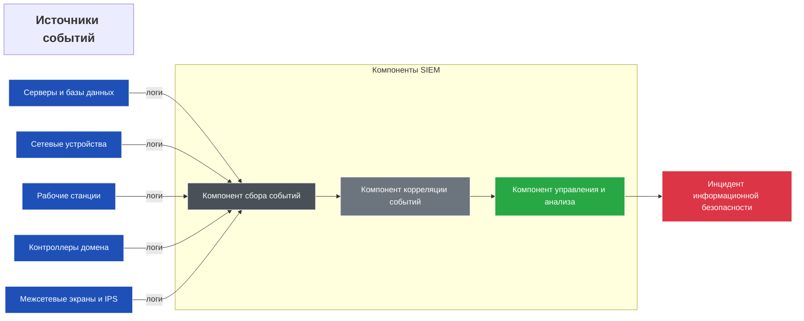

---
aliases:
  - Security Information and Event Management
  - SIEM
---
# Security Information and Event Management

Схема работы SIEM

```mermaid
graph LR
    %% ========== ЗАГОЛОВОК ==========
    title[Источники событий]

    %% ========== ИСТОЧНИКИ СОБЫТИЙ ==========
    A[Серверы и базы данных]:::server
    B[Сетевые устройства]:::network
    C[Рабочие станции]:::workstation
    D[Контроллеры домена]:::controller
    E[Межсетевые экраны и IPS]:::firewall

    %% ========== КОМПОНЕНТЫ SIEM ==========
    subgraph "Компоненты SIEM"
        direction BT
        F[Компонент сбора событий]:::collector
        G[Компонент корреляции событий]:::correlator
        H[Компонент управления и анализа]:::analyst
    end
    
    %% ========== ВЫХОД ==========
    I[Инцидент информационной безопасности]:::incident

    %% ========== СВЯЗИ ==========
    A -->|логи| F
    B -->|логи| F
    C -->|логи| F
    D -->|логи| F
    E -->|логи| F

    F --> G
    G --> H
    H --> I

    %% ========== СТИЛИ ==========
    classDef server fill:#1e50b7,stroke:#fff,color:#fff
    classDef network fill:#1e50b7,stroke:#fff,color:#fff
    classDef workstation fill:#1e50b7,stroke:#fff,color:#fff
    classDef controller fill:#1e50b7,stroke:#fff,color:#fff
    classDef firewall fill:#1e50b7,stroke:#fff,color:#fff
    classDef collector fill:#495057,stroke:#fff,color:#fff
    classDef correlator fill:#6c757d,stroke:#fff,color:#fff
    classDef analyst fill:#28a745,stroke:#fff,color:#fff
    classDef incident fill:#dc3545,stroke:#fff,color:#fff

    class A,B,C,D,E server
    class F collector
    class G correlator
    class H analyst
    class I incident

    %% ========== ПОДПИСИ ==========
    style title font-size:24px,font-weight:bold
```

