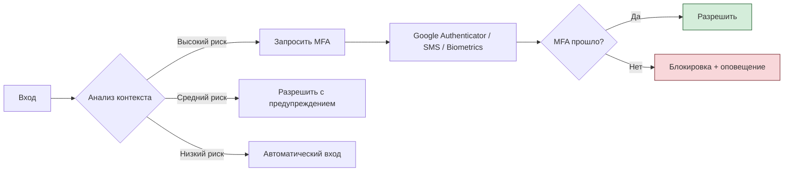

---
aliases:
  - Adaptive Authentication
  - адаптивная аутенификация
---

## ✅ 2. Что такое **Adaptive Authentication**?

> **Adaptive Authentication** — это **интеллектуальная система входа**, которая:
> - Анализирует контекст
> - Принимает решение: **пропустить, запросить MFA или заблокировать**

Она является **частью [[zero trust]]**, но фокусируется **на аутентификации**.

---

### 🔍 На каких сигналах основана?

| Сигнал | Зачем |
|--------|-------|
| **IP-адрес** | Неожиданный IP → подозрительно |
| **Местоположение** | Москва → Бразилия за 1 мин → невозможно |
| **Устройство** | Известное / неизвестное |
| **Время входа** | 3 AM — рискованнее, чем 9 AM |
| **Поведение** | Обычно читает почту → теперь хочет доступ к бухгалтерии |
| **Risk Score** | От 0 до 1 → кто-то пытается взломать |

---

### 🔄 Пример Adaptive Auth:

---

### ✅ Преимущества Adaptive Authentication

| Плюс | Объяснение |
|------|------------|
| ✅ **Умная защита** | Не мешает в офисе, но проверяет на подозрительных входах |
| ✅ **Лучший UX** | Не требует MFA каждый раз |
| ✅ **Снижает нагрузку на службу поддержки** | Люди реже теряют доступ |
| ✅ **Обнаруживает атаку в реальном времени** | Подозрительный вход → сразу блокировка |
| ✅ **Интеграция с SIEM/XDR** | Можно обучать ML-модели |

---