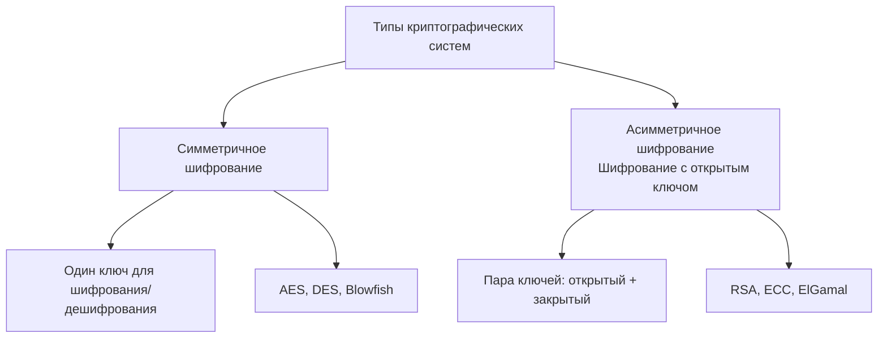
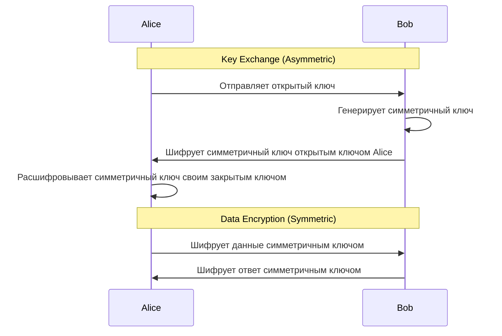

---
aliases:
  - Асимметричное шифрование
  - Шифрование с открытым ключом
  - Public-key cryptography
  - asymmetric cryptography
---
**Асимметричное шифрование = Шифрование с открытым ключом** — это одно и то же понятие, просто разные названия.

## Детальное объяснение



## Сравнительная таблица

| Аспект | **Симметричное шифрование** | **Асимметричное шифрование** |
|--------|----------------------------|-----------------------------|
| **Количество ключей** | 1 ключ | 2 ключа (открытый + закрытый) |
| **Скорость** | Быстрое | Медленнее (в 100-1000 раз) |
| **Безопасность** | Зависит от секретности ключа | Зависит от сложности математических задач |
| **Использование** | Шифрование больших данных | Key exchange, цифровые подписи |
| **Примеры** | AES, DES, ChaCha20 | RSA, ECC, ElGamal |

## 1. **Симметричное шифрование (Один ключ)**

### Принцип работы:
```python
# Один и тот же ключ для шифрования и дешифрования
secret_key = "my_secret_key_123"

# Шифрование
ciphertext = encrypt(plaintext, secret_key)

# Дешифрование  
decrypted_text = decrypt(ciphertext, secret_key)
```

### Примеры алгоритмов:
```python
# AES (Advanced Encryption Standard)
from Crypto.Cipher import AES

key = b'16byte_secret_key'
cipher = AES.new(key, AES.MODE_EAX)
ciphertext, tag = cipher.encrypt_and_digest(data)

# ChaCha20
from Crypto.Cipher import ChaCha20
key = b'32byte_key_for_chacha20_encryption'
cipher = ChaCha20.new(key=key)
ciphertext = cipher.encrypt(plaintext)
```

## 2. **Асимметричное шифрование = Шифрование с открытым ключом**

### Принцип работы:
```python
# Генерация пары ключей
private_key, public_key = generate_key_pair()

# Шифрование открытым ключом (может делать кто угодно)
ciphertext = encrypt(plaintext, public_key)

# Дешифрование закрытым ключом (только владелец)
decrypted_text = decrypt(ciphertext, private_key)
```

### Математическая основа:
```python
# RSA основан на сложности факторизации больших чисел
p = 61  # Простое число
q = 53  # Простое число
n = p * q  # 3233 - модуль
φ = (p-1)*(q-1)  # Функция Эйлера

# Открытый ключ: (e, n) где e взаимно простое с φ
e = 17  # Открытая экспонента

# Закрытый ключ: (d, n) где d ≡ e⁻¹ mod φ
d = mod_inverse(e, φ)  # 2753
```

## 3. **Практические примеры использования**

### Пример 1: Secure Communication (HTTPS)
```python
# Клиент получает открытый ключ сервера
server_public_key = get_server_certificate()

# Клиент генерирует симметричный ключ
symmetric_key = generate_random_key()

# Клиент шифрует симметричный ключ открытым ключом сервера
encrypted_key = rsa_encrypt(symmetric_key, server_public_key)

# Сервер расшифровывает симметричный ключ своим закрытым ключом
received_key = rsa_decrypt(encrypted_key, server_private_key)

# Дальнейшее общение через симметричное шифрование
encrypted_data = aes_encrypt(data, received_key)
```

### Пример 2: Цифровые подписи
```python
# Подписание документа
document = "Важный контракт"
signature = sign(document, private_key)

# Проверка подписи
is_valid = verify_signature(document, signature, public_key)
```

## 4. **Гибридные системы**

На практике используются комбинации:



### Реализация гибридного подхода:
```python
class HybridEncryption:
    def __init__(self):
        self.rsa_key = RSA.generate(2048)
    
    def encrypt_message(self, message, recipient_public_key):
        # Генерируем случайный симметричный ключ
        symmetric_key = os.urandom(32)
        
        # Шифруем сообщение симметричным ключом
        cipher = AES.new(symmetric_key, AES.MODE_GCM)
        ciphertext, tag = cipher.encrypt_and_digest(message.encode())
        
        # Шифруем симметричный ключ открытым ключом получателя
        encrypted_key = PKCS1_OAEP.new(recipient_public_key).encrypt(symmetric_key)
        
        return {
            'encrypted_key': encrypted_key,
            'ciphertext': ciphertext,
            'nonce': cipher.nonce,
            'tag': tag
        }
    
    def decrypt_message(self, encrypted_data):
        # Расшифровываем симметричный ключ
        symmetric_key = PKCS1_OAEP.new(self.rsa_key).decrypt(encrypted_data['encrypted_key'])
        
        # Расшифровываем сообщение
        cipher = AES.new(symmetric_key, AES.MODE_GCM, nonce=encrypted_data['nonce'])
        plaintext = cipher.decrypt_and_verify(encrypted_data['ciphertext'], encrypted_data['tag'])
        
        return plaintext.decode()
```

## 5. **Сравнение производительности**

```python
import time
from Crypto.PublicKey import RSA
from Crypto.Cipher import AES, PKCS1_OAEP

# Тестирование производительности
def benchmark():
    data = b"x" * 1024 * 1024  # 1MB данных
    
    # Симметричное шифрование
    aes_key = b"16byte_aes_key!!"
    start = time.time()
    cipher = AES.new(aes_key, AES.MODE_EAX)
    ciphertext, tag = cipher.encrypt_and_digest(data)
    aes_time = time.time() - start
    
    # Асимметричное шифрование
    rsa_key = RSA.generate(2048)
    start = time.time()
    cipher_rsa = PKCS1_OAEP.new(rsa_key.publickey())
    # RSA может шифровать только небольшие данные
    encrypted = cipher_rsa.encrypt(b"32byte_symmetric_key_data")
    rsa_time = time.time() - start
    
    print(f"AES: {aes_time:.4f} сек")
    print(f"RSA: {rsa_time:.4f} сек")
    print(f"RSA медленнее в {rsa_time/aes_time:.0f} раз")

# Результат:
# AES: 0.005 сек
# RSA: 0.015 сек  
# RSA медленнее в 3 раза (для маленьких данных)
```

## 6. **Области применения**

### Симметричное шифрование:
- ✅ Шифрование файлов
- ✅ SSL/TLS трафик (после handshake)
- ✅ Базы данных
- ✅ Дисковое шифрование

### Асимметричное шифрование:
- ✅ SSL/TLS handshake
- ✅ Цифровые подписи
- ✅ PGP/GPG шифрование
- ✅ Криптовалюты
- ✅ Аутентификация

## 7. **Ответ на вопрос**

**Асимметричное шифрование** и **шифрование с открытым ключом** — это термины-синонимы. Они описывают одну и ту же концепцию:

- **Асимметричное** — подчеркивает, что используются разные ключи для шифрования и дешифрования
- **С открытым ключом** — подчеркивает, что один из ключей может быть публичным

### Формальное определение:
```python
# Асимметричное шифрование = Шифрование с открытым ключом
class AsymmetricEncryption:
    def generate_keys(self):
        # Возвращает (private_key, public_key)
        pass
    
    def encrypt(self, plaintext, public_key):
        # Шифрует открытым ключом
        pass
    
    def decrypt(self, ciphertext, private_key):
        # Расшифровывает закрытым ключом
        pass
```

## Итог

- **✅ Асимметричное шифрование = Шифрование с открытым ключом** — одно и то же
- **🔑 Симметричное шифрование** — один ключ, быстрое, для данных
- **🔐 Асимметричное шифрование** — два ключа, медленное, для ключей и подписей
- **🔄 На практике** используются гибридные системы

Понимание этой разницы критически важно для проектирования безопасных систем и выбора правильных криптографических инструментов.