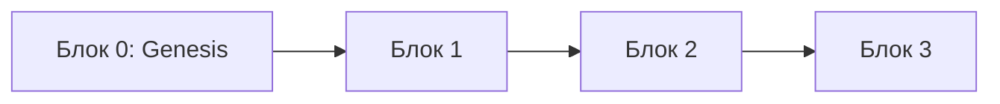
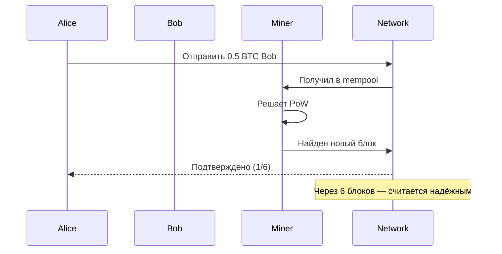
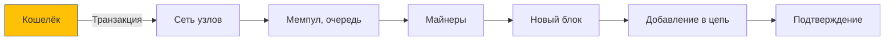

---
aliases:
  - блокчейн
---
Для систем с высокими требованиями к целостности и прозрачности данных может быть полезен подход на основе блокчейна. Например, к таким системам относятся сервисы финтеха и здравоохранения. В использовании блокчейна есть два плюса:

- **Непрерывный лог изменений.** Блокчейн позволяет хранить неизменяемую последовательность транзакций. Каждый блок содержит хеш предыдущего блока, что обеспечивает целостность всей цепочки данных.
- **Децентрализация.** Использование блокчейна исключает необходимость в центральном координаторе и тем самым повышает устойчивость системы к сбоям и атакам.

Отличный и очень важный вопрос!  
**Blockchain (блокчейн)** — это **революционная технология**, которая позволяет создавать **децентрализованные, неизменяемые и доверенные системы** без центрального органа.

---

## ✅ Что такое Blockchain?

> **Blockchain** — это **цепочка блоков**, где каждый блок содержит:
- Данные (например, транзакции)
- Хеш предыдущего блока
- Timestamp
- Nonce (в Proof-of-Work)

> 🔑 Главное:  
> Если изменить один блок — сломается вся цепь.  
> Это делает данные **неизменяемыми (immutable)**.

---

## 🧱 Как устроен блок

```plaintext
+------------------------+
| Блок #100              |
|                        |
| Транзакции:            |
|   - Alice → Bob: 1 BTC |
|   - Carol → Dave: 2    |
|                        |
| Предыдущий хеш:        |
|   a3b7c8...            |
|                        |
| Текущий хеш:           |
|   d9e2f5...            |
|                        |
| Timestamp: 2025-04-10  |
| Nonce: 123456          |
+------------------------+
```

> ❌ Изменили одну транзакцию → хеш изменился → следующие блоки становятся невалидными.

---

## 🔗 Как работает "цепочка"?



Каждый блок ссылается на **хеш предыдущего** — как в Git.

> ✅ Это гарантирует **историческую целостность**.

---

## ⛓️ Ключевые свойства Blockchain

| Свойство | Объяснение |
|--------|------------|
| **Децентрализация** | Нет единого сервера — сеть состоит из тысяч узлов |
| **Неизменяемость** | Данные нельзя изменить или удалить |
| **Прозрачность** | Все транзакции видны (в публичных блокчейнах) |
| **Надёжность** | Работает даже при частичном отказе сети |
| **Согласованность** | Узлы достигают консенсуса по состоянию |

---

## ✅ Консенсусные механизмы

Как узлы договариваются, какой блок следующий?

| Механизм | Описание | Пример |
|----------|----------|--------|
| **PoW (Proof of Work)** | Минеры решают сложную задачу → кто решил — добавляет блок | Bitcoin |
| **PoS (Proof of Stake)** | Чем больше стейк (BTC), тем выше шанс добавить блок | Ethereum (после The Merge) |
| **PBFT (Practical Byzantine Fault Tolerance)** | Узлы голосуют → мажоритарное решение | Hyperledger Fabric |
| **Raft / Paxos** | Для private blockchains — лидер выбирается | Corda |

---

## 💡 Где используется Blockchain?

| Отрасль | Пример |
|--------|--------|
| **Криптовалюты** | Bitcoin, Ethereum |
| **Smart Contracts** | DeFi, NFT |
| **Supply Chain** | Отслеживание товара от фабрики до покупателя |
| **Голосование** | Без подделки голосов |
| **Здравоохранение** | Электронные медицинские записи |
| **Финансы** | Мгновенные международные переводы |
| **Идентификация** | Цифровые паспорта, верифицированные аккаунты |

---

## 🔁 Типы Blockchain

| Тип | Описание | Кто может читать/писать |
|------|----------|-------------------------|
| **Публичный** | Любой может присоединиться | Все / Все (Bitcoin) |
| **Частный (Private)** | Закрытая сеть | Только разрешённые узлы |
| **Консорциумный** | Управляется группой организаций | По правам |
| **Гибридный** | Часть данных публична, часть — закрыта | Зависит от зоны |

---

## ✅ Преимущества

| Плюс | Объяснение |
|------|------------|
| ✅ **Устраняет посредников** | Переводы без банков |
| ✅ **Высокая безопасность** | Атаковать сеть дороже, чем выиграть |
| ✅ **Аудит без центра** | Все транзакции видны |
| ✅ **Автоматизация через Smart Contracts** | Логика выполняется сама |
| ✅ **Защита от цензуры** | Никто не может удалить запись |

---

## ❌ Недостатки

| Минус | Объяснение |
|-------|------------|
| ❌ **Медленно** | Bitcoin: 7 TPS, Visa: 24 000 TPS |
| ❌ **Высокое энергопотребление (PoW)** | Мининг → миллионы кВт·ч |
| ❌ **Масштабирование сложно** | Размер цепочки растёт |
| ❌ **Хранение данных дорого** | Весь узел должен хранить всю цепочку |
| ❌ **Сложность для пользователей** | Кошельки, seed-фразы, газовые комиссии |
| ❌ **Регуляторные риски** | Запрещён в некоторых странах |

---

## 🔄 Как работает: Пример (Bitcoin)



---

## 🏗️ Архитектура Blockchain



---

## ✅ Smart Contracts

> **Программы, которые работают на блокчейне**

```solidity
function transfer(address to, uint amount) public {
    require(balances[msg.sender] >= amount);
    balances[msg.sender] -= amount;
    balances[to] += amount;
}
```

→ Выполняется автоматически → никто не может остановить

---

## ✅ Финальный вывод

| Blockchain — это... | Это не... |
|--------------------|-----------|
| ✅ **Доверие без доверия** | ❌ Просто база данных |
| ✅ **Неизменяемая книга учёта** | ❌ Только для криптовалют |
| ✅ **Инструмент децентрализации** | ❌ Всемогущее решение |
| ✅ **Основа для Web3, DeFi, NFT** | ❌ Замена всем системам |

> 💬 _“Blockchain is the technology that lets you trust what someone else says about the past.”_  
> — **Kevin Werbach** #👨 
