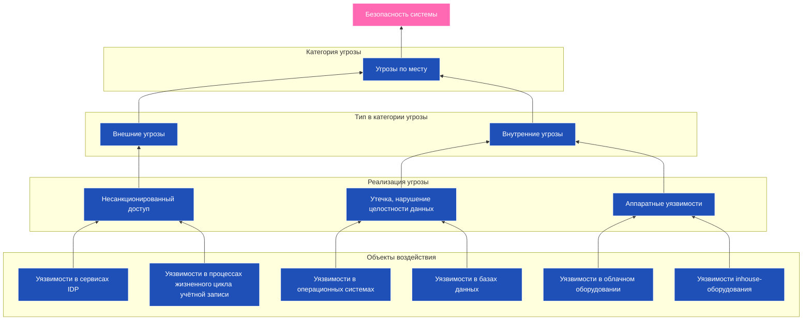

---
aliases:
  - кибератаки
  - киберугрозы
  - классификация киберугроз
  - Cross-Origin Resource Sharing Misconfiguration
  - CORSm
  - CORS
  - XML External Entities
  - XXE
  - Buffer Overflow
  - API Key Leaks
  - Account Takeover
  - MITB
  - Man-in-the-Browser
  - Supply Chain Attacks
  - Ransomware
  - Malware
  - Directory Traversal
  - Clickjacking
  - API Abuse
  - Zero-Day Exploit
  - Cache Poisoning
  - DNS Spoofing
  - File Inclusion
  - Remote Code Execution
  - RCE
  - SSRF
  - Server-Side Request Forgery
  - Session Hijacking
  - Credential Stuffing
  - digital threats
  - cyber threats
  - cyberthreats
  - cyberthreat
  - cyber risks
  - online threats
  - cybersecurity threats
  - IT threats
  - cyber vulnerabilitie
---
# киберугрозы
> киберугрозы
> cyberthreats
> cyber threats
> cyber risks;
> digital threats;
> online threats;
> cybersecurity threats;
> IT threats;
> cyber vulnerabilities.

**Внешние киберугрозы** — это атаки, исходящие **извне вашей сети**: от хакеров, ботнетов, конкурентов, государственных акторов.

Ниже — **полная классификация внешних угроз (кибератак)** по группам, с примерами и объяснением.

Классификация внешних киберугроз
1. Атаки на доступность
2. Атаки на конфиденциальность
3. Атаки на целостность
4. Атаки на подлинность (Authenticity)
5. Атаки на ресурсы
6. Атаки на цепочку поставок (Supply Chain Attacks)
7. Атаки на приложения и API
8. Атаки на инфраструктуру
9. Атаки на мобильные и IoT устройства
10. Государственные и APT-атаки

### 🔹 1. **Атаки на доступность**
> Цель: сделать сервис недоступным

| Тип                                      | Описание                                        | Пример                             |
| ---------------------------------------- | ----------------------------------------------- | ---------------------------------- |
| **DDoS (Distributed Denial of Service)** | Перегрузка сервера трафиком из тысяч источников | Cloudflare блокирует 20 Tbps-атаку |
| **DoS (Denial of Service)**              | Атака с одного источника                        | Старый `ping -f` flood             |
| **Application Layer DDoS**               | Запросы к `/login`, `/api` → перегружают CPU    | HTTP GET flood                     |
| **Volumetric DDoS**                      | UDP/TCP flood → заполняет канал                 | DNS amplification                  |

✅ **Защита:** CDN, WAF, Rate Limiting, Anycast

> [!info] Tbps
> **Tbps (Terabit per second)** — это единица измерения скорости передачи данных, равная одному триллиону бит в секунду. Она используется для оценки пропускной способности высокоскоростных сетей, магистральных интернет-каналов, центров обработки данных и облачной инфраструктуры.

---

### 🔹 2. **Атаки на конфиденциальность**
> Цель: украсть данные

| Тип                          | Описание                                     | Пример                          |
| ---------------------------- | -------------------------------------------- | ------------------------------- |
| **Phishing**                 | Поддельные письма/сайты → ввод логина/пароля | Письмо: «Срочно войдите в банк» |
| **Man-in-the-Middle (MITM)** | Перехват данных между клиентом и сервером    | Через небезопасный Wi-Fi        |
| **SSL Stripping**            | HTTPS → HTTP → перехват данных               | На публичных сетях              |
| **Credential Harvesting**    | Сбор логинов/паролей через скрипты           | Keyloggers, фишинговые формы    |
| **Data Exfiltration**        | Похищение данных после взлома                | Утечка базы пользователей       |

✅ **Защита:** mTLS, HSTS, 2FA, обучение, шифрование

---

### 🔹 3. **Атаки на целостность**
> Цель: изменить данные или поведение системы

| Тип | Описание | Пример |
|------|----------|--------|
| **SQL Injection (SQLi)** | Внедрение SQL-кода через форму | `' OR 1=1 --` |
| **Cross-Site Scripting (XSS)** | Выполнение JS в браузере жертвы | `<script>alert('hacked')</script>` |
| **Server-Side Request Forgery (SSRF)** | Форсирование сервера делать запросы | Чтение метаданных AWS (`169.254.169.254`) |
| **Remote Code Execution (RCE)** | Выполнение кода на сервере | Log4Shell, Spring4Shell |
| **File Inclusion (LFI/RFI)** | Включение файлов извне | `?page=../../etc/passwd` |

✅ **Защита:** Input validation, WAF, sandboxing, безопасные библиотеки

---

### 🔹 4. **Атаки на подлинность (Authenticity)**
> Цель: выдать себя за легального пользователя или систему

| Тип | Описание | Пример |
|------|----------|--------|
| **Session Hijacking** | Кража сессии (куки, JWT) | XSS → чтение localStorage |
| **Token Theft** | Угон OAuth2/JWT-токена | Через небезопасное хранение |
| **Impersonation** | Выдача себя за другого | Поддельный email от CEO |
| **DNS Spoofing** | Подмена DNS-записи | `bank.com → fake-ip` |
| **ARP Poisoning** | Ложное сопоставление IP ↔ MAC | В локальной сети |

✅ **Защита:** 2FA, short-lived tokens, certificate pinning, `HttpOnly` cookies

---

### 🔹 5. **Атаки на ресурсы**
> Цель: использовать ваши ресурсы для своих целей

| Тип                    | Описание                                    | Пример                               |
| ---------------------- | ------------------------------------------- | ------------------------------------ |
| **Cryptojacking**      | Использование вашего CPU для майнинга       | Заражённый JS на сайте               |
| **Resource Hijacking** | Использование облака для своих задач        | Взломали AWS → запустили GPU-майнинг |
| **Cloud Misuse**       | Нарушитель использует ваш аккаунт AWS/Azure | Запускает свои сервисы → вы платите  |
| **Bandwidth Abuse**    | Ваш сервер используется как прокси          | DDoS через ваш VPS                   |

✅ **Защита:** Мониторинг расходов, IAM, budget alerts, audit logs

---

### 🔹 6. **Атаки на цепочку поставок (Supply Chain Attacks)**
> Цель: заразить легальное ПО через его зависимости

| Тип                     | Описание                                      | Пример                                 |
| ----------------------- | --------------------------------------------- | -------------------------------------- |
| **Compromised Library** | Вредоносный npm/pip/maven-пакет               | `event-stream` → крадёт криптокошельки |
| **Malicious Update**    | Обновление содержит троян                     | Kaseya VSA — 2021                      |
| **Typosquatting**       | Ошибся в имени пакета → скачал злоумышленника | `lodash` vs `l0dash`                   |
| **Signed Malware**      | Поддельное ПО с валидной подписью             | Stuxnet, SolarWinds                    |

✅ **Защита:** SBOM, Sigstore, scanning (Snyk), signed artifacts

---

### 🔹 7. **Атаки на приложения и API**
> Цель: эксплуатировать уязвимости веб-приложений

| Тип                                          | Описание                           | Пример                                         |
| -------------------------------------------- | ---------------------------------- | ---------------------------------------------- |
| **API Abuse**                                | Слишком много вызовов API          | `GET /user?id=1..10000`                        |
| **Broken Authentication**                    | Слабые механизмы входа             | JWT без проверки подписи                       |
| **Security Misconfiguration**                | Открытые админки, дефолтные пароли | Redis без пароля                               |
| **Insecure Direct Object References (IDOR)** | Доступ к чужому объекту            | `GET /api/user/123` → если не проверяете права |
| **XML External Entities (XXE)**              | Чтение файлов через XML            | `<!ENTITY xxe SYSTEM "file:///etc/passwd">`    |

✅ **Защита:** OWASP Top 10, WAF, rate limiting, input validation

---

### 🔹 8. **Атаки на инфраструктуру**
> Цель: сломать сеть, DNS, серверы

| Тип               | Описание                                 | Пример                                        |
| ----------------- | ---------------------------------------- | --------------------------------------------- |
| **SYN Flood**     | Переполнение очереди соединений TCP      | DoS                                           |
| **Ping of Death** | Большой ICMP-пакет → переполнение буфера | Устаревшая, но опасная                        |
| **TTL Exploits**  | Изменение времени жизни пакета           | Для обхода фильтров                           |
| **BGP Hijacking** | Подмена маршрутов BGP                    | YouTube был недоступен из-за Pakistan Telecom |
| **DNS Tunneling** | Передача данных через DNS-запросы        | C2-коммуникация                               |

✅ **Защита:** Network policies, firewall, BGP security (RPKI), DNS monitoring

---

### 🔹 9. **Атаки на мобильные и IoT устройства**
> Цель: взлом смартфонов, камер, умного дома

| Тип | Описание | Пример |
|------|----------|--------|
| **Mobile Phishing** | Поддельное приложение | Fake WhatsApp |
| **IoT Botnet** | Взлом камеры → в ботнет | Mirai — 2016 |
| **Firmware Tampering** | Прошивка заменена | Умный холодильник шлёт спам |
| **Bluetooth/Wi-Fi Exploits** | BLE, KRACK, Evil Twin | |

✅ **Защита:** Secure boot, OTA updates, network segmentation

---

### 🔹 10. **Государственные и APT-атаки**
> Advanced Persistent Threats — долгосрочные, хорошо организованные атаки

| Тип                                  | Описание                               | Пример                        |
| ------------------------------------ | -------------------------------------- | ----------------------------- |
| **APT (Advanced Persistent Threat)** | Долгая разведка + внедрение            | APT28 (Fancy Bear)            |
| **Zero-Day Exploit**                 | Уязвимость, о которой никто не знает   | Log4Shell                     |
| **Watering Hole**                    | Заражение сайта, который посещают цели | Атака на сотрудников компании |
| **Spear Phishing**                   | Целевой фишинг                         | Email от HR с вирусом         |

✅ **Защита:** SIEM, EDR, Zero Trust, threat intelligence

---
# Типы атак на интернет-сервисы

> 💡 **Безопасность — это не про “защитить всё”. Это про “знать, что может быть атаковано”.**

## ✅ 1. DDoS (Distributed Denial of Service)  
> **Распределённая атака типа «отказ в обслуживании»**

🔹 Как работает:
- Злоумышленник использует **ботнет** (тысячи заражённых устройств)
- Отправляется **огромное количество запросов**
- Цель: **перегрузить сервер или канал** → сервис становится недоступен

📌 Примеры:

| Тип                        | Описание                                                         |
| -------------------------- | ---------------------------------------------------------------- |
| **Volumetric DDoS**        | Переполняет канал трафиком (например, UDP flood)                 |
| **Protocol Attack**        | Использует уязвимости протоколов (SYN flood, Ping of Death)      |
| **Application Layer DDoS** | Целится в приложение (HTTP flood: `GET /`, `POST` без остановки) |

⚠️ Влияние:
- Пользователи не могут зайти
- Сервер падает под нагрузкой
- Высокий трафик → резкий рост затрат в облаке

✅ Защита:
- **CDN (Cloudflare, Akamai)** — фильтруют ботов
- **Rate limiting** — ограничение запросов с одного IP
- **WAF (Web Application Firewall)** — блокирует подозрительные паттерны
- **Anycast + BGP** — распределяет трафик по миру
- **AWS Shield, Google Cloud Armor** — облачные решения

---

## ✅ 2. DoS (Denial of Service)  
> **Атака от одного источника**

🔹 Чем отличается от DDoS?
- **DoS**: один компьютер → перегружает цель
- **DDoS**: тысячи источников → намного мощнее

> ❌ DoS проще заблокировать (по IP),  
> ✅ DDoS — сложнее, потому что IP разные


---

### APT (Advanced Persistent Threat) 

Продолжительная подготовленная целенаправленная кибератака. В отличие от DDoS, APT — комплексная киберугроза, которая сочетает различные способы атак на корпоративную инфраструктуру.

---

### Exploits
Эксплойты — уязвимости в ПО и аппаратной части, которые могут использовать для взлома. К эксплойтам относятся программные и аппаратные бэкдоры.

---

## ✅ 3. SQL Injection  
> Внедрение SQL-кода через поля формы

🔹 Как работает:
```sql
-- Пользователь вводит:
username: admin'; DROP TABLE users; --
```

→ Становится:
```sql
SELECT * FROM users WHERE name = 'admin'; DROP TABLE users; --'
```

✅ Защита:
- **Prepared Statements**
- **ORM**
- **Input validation**
- **WAF**
- **Escaping**

---

## ✅ 4. XSS (Cross-Site Scripting)  
> Внедрение JavaScript-кода в страницу

📌 Типы:

| Тип | Описание |
|-----|----------|
| **Stored XSS** | Код сохраняется в БД (например, комментарий с `<script>`) |
| **Reflected XSS** | Через URL: `?search=<script>` → выводится без экранирования |
| **DOM-based XSS** | JS-код изменяет DOM на лету |

✅ Защита:
- Экранирование (`<` → `&lt;`)
- `Content-Security-Policy` (CSP)
- Не использовать `innerHTML`
- Валидация ввода

---

## ✅ 5. CSRF (Cross-Site Request Forgery)  
> Поддельный запрос от имени пользователя

🔹 Пример:
Пользователь вошёл в банк → его логин/сессия активна  
Злоумышленник отправляет ему ссылку:
```html

```

→ Браузер отправляет запрос с куками → деньги уходят

✅ Защита:
- **CSRF Tokens**
- `SameSite=Cookies`
- Проверка `Origin` / `Referer`
- POST вместо GET для действий

---

## ✅ 6. Phishing (фишинг)  
> Обман пользователя → ввести данные на поддельном сайте

🔹 Пример:
- Письмо: _«Ваш аккаунт заблокирован. Перейдите: login-bank.ru»_
- Сайт выглядит как настоящий → пользователь вводит пароль

✅ Защита:
- Обучение пользователей
- SPF/DKIM/DMARC для почты
- Двухфакторная аутентификация (2FA)
- Мониторинг доменов

---

## ✅ 7. MITM (Man-in-the-Middle)  
> Перехват данных между клиентом и сервером

🔹 Где возможно:
- Небезопасный Wi-Fi
- Устаревшие SSL-сертификаты
- Прокси-серверы

✅ Защита:
- **HTTPS (TLS)**
- **HSTS**
- **Certificate Pinning**
- **mTLS (mutual TLS)**

---

## ✅ 8. Brute Force (перебор паролей)  
> Автоматический подбор логина/пароля

🔹 Пример:
```bash
hydra -l admin -P passwords.txt bank.com http-post-form "/login:user=^USER^&pass=^PASS^:F=Invalid"
```

✅ Защита:
- **Rate Limiting**
- **Captcha**
- **2FA**
- **Account lock after N attempts**
- **JWT + short-lived tokens**

---

## ✅ 9. Credential Stuffing  
> Использование **утечённых паролей** из других сервисов

🔹 Пример:
- Утечка в LinkedIn → злоумышленник проверяет те же логины/пароли в вашем сервисе

✅ Защита:
- **Мониторинг утечек (Have I Been Pwned API)**
- **Обязательная смена пароля**
- **2FA**
- **Анализ поведения (аномалии входа)**

---

## ✅ 10. Session Hijacking  
> Кража сессии (cookies, JWT)

🔹 Как:
- XSS → получить `document.cookie`
- Network sniffing → если нет HTTPS
- Утечка в LocalStorage

✅ Защита:
- `HttpOnly`, `Secure`, `SameSite` для cookies
- Не хранить JWT в localStorage
- Короткие сроки жизни токена
- Refresh Token + Blacklist
- Обнаружение аномалий (IP, страна, устройство)

---

## ✅ 11. Server-Side Request Forgery (SSRF)  
> Форсирование сервера сделать запрос куда-то

🔹 Пример:
```http
POST /fetch-image
{ "url": "http://localhost/admin" }
```

→ Сервер запрашивает внутренний адрес → может прочитать метаданные AWS (`169.254.169.254`)

✅ Защита:
- Валидация URL
- Блокировка внутренних IP
- Sandboxing
- WAF правила

---

## ✅ 12. Remote Code Execution (RCE)  
> Выполнение произвольного кода на сервере

🔹 Пример:
- Уязвимость в CMS (WordPress плагин)
- Через загрузку файла `.php` с кодом
- Через десериализацию Java

✅ Защита:
- Актуальные версии
- Изоляция (container, sandbox)
- Минимальные права
- Безопасные библиотеки
- WAF

---

## ✅ 13. File Inclusion (LFI/RFI)  
> Локальное или удалённое включение файлов

🔹 Пример:
```php
include($_GET['page'] . '.php');
// ?page=../../etc/passwd
```

✅ Защита:
- Не использовать динамические include
- Валидация входа
- Sandbox

---

## ✅ 14. DNS Spoofing / Cache Poisoning  
> Подмена DNS-записи → трафик идёт на фальшивый сайт

✅ Защита:
- DNSSEC
- Использовать доверенные DNS-резолверы
- HTTPS

---

## ✅ 15. Zero-Day Exploits  
> Атака на **неизвестную уязвимость**

🔹 Пример:
- Уязвимость Log4Shell — до выпуска патча

✅ Защита:
- Регулярное обновление
- Инвентаризация зависимостей (SBOM)
- Сканеры: Snyk, Dependabot
- Минимальные привилегии

---

## ✅ 16. API Abuse  
> Злоупотребление API

🔹 Примеры:
- Слишком много вызовов `/api/users`
- Использование API ключа без авторизации
- Нарушение бизнес-логики

✅ Защита:
- **Rate Limiting**
- **API Gateway**
- **OAuth2 / JWT**
- **Audit Logs**
- **Schema Validation**

---

## ✅ 17. Clickjacking  
> Подложный iframe → пользователь нажимает, не зная

🔹 Пример:
```html
<iframe src="https://bank.com/transfer" style="opacity:0;z-index:999">
```

→ Пользователь кликает на кнопку → перевод денег

✅ Защита:
- `X-Frame-Options: DENY`
- `Content-Security-Policy: frame-ancestors 'none'`

---

## ✅ 18. Directory Traversal  
> Получение доступа к системным файлам

🔹 Пример:
```
GET /download?file=../../../etc/passwd
```

✅ Защита:
- Валидация путей
- Не использовать строковые пути напрямую
- Sandboxing

---

## ✅ 19. Malware & Ransomware  
> Вредоносное ПО, шифрующее данные

🔹 Пример:
- Файл Excel с макросом → шифрует диск → требует выкуп

✅ Защита:
- Антивирусы
- Backup
- Ограничение прав
- Обучение

---

## ✅ 20. Supply Chain Attacks  
> Атака через зависимость

🔹 Пример:
- npm-пакет `event-stream` был взломан → стал красть криптокошельки

✅ Защита:
- Сканеры зависимостей (Snyk, Dependabot)
- Подписанные пакеты (Sigstore)
- SBOM (Software Bill of Materials)

---

## ✅ 21. Man-in-the-Browser (MITB)  
> Вирус в браузере → меняет транзакции

🔹 Пример:
Вы отправляете $100 другу → MITB меняет реквизиты на свои

✅ Защита:
- mTLS
- Push-уведомления
- Подпись транзакций
- 2FA

---

## ✅ 22. Account Takeover  
> Полный контроль над чужой учётной записью

🔹 Причины:
- Утечка пароля
- Сессия украдена
- 2FA обойдена

✅ Защита:
- Strong password policy
- 2FA
- Device fingerprinting
- Anomaly detection

---

## ✅ 23. API Key Leaks  
> Ключ утек в GitHub, логах, Slack

🔹 Пример:
```javascript
const apiKey = "sk-live-abc123def456"; // УТЕКЛО!
```

✅ Защита:
- **Secrets Management** (Vault, AWS Secrets Manager)
- **Scanning** (GitGuardian, GitHub Secret Scanning)
- **Short-lived keys**
- **Key rotation**

---

## ✅ 24. Buffer Overflow  
> Переполнение буфера → выполнение кода

🔹 Где:
- C/C++ программы
- Embedded системы

✅ Защита:
- Использовать безопасные языки (Go, Rust, Java)
- Stack canaries
- ASLR, DEP

---

## ✅ 25. XML External Entities (XXE)  
> Загрузка внешних сущностей в XML

🔹 Пример:
```xml
<!DOCTYPE foo [ <!ENTITY xxe SYSTEM "file:///etc/passwd"> ]>
```

✅ Защита:
- Отключить внешние сущности
- Использовать JSON вместо XML
- Валидация

---

## ✅ 26. Cross-Origin Resource Sharing (CORS) Misconfiguration  
> Неправильные CORS-политики → утечка данных

🔹 Опасно:
```http
Access-Control-Allow-Origin: *
Access-Control-Allow-Credentials: true
```

→ Любой сайт может читать ваши API!

✅ Защита:
- Только нужные домены
- `credentials: false`, если не нужно
- Проверка `Origin` вручную

---

## ✅ Финальный вывод: Что делать?

| Атака                 | Как защититься                         |
| --------------------- | -------------------------------------- |
| **DDoS**              | CDN, Rate Limiting, WAF                |
| **SQLi**              | Prepared Statements                    |
| **XSS**               | CSP, escaping                          |
| **CSRF**              | CSRF Tokens                            |
| **Phishing**          | Обучение, 2FA                          |
| **MITM**              | HTTPS, HSTS                            |
| **Brute Force**       | Rate limiting, Captcha                 |
| **Session Hijacking** | Secure cookies, short TTL              |
| **SSRF**              | Блокировать localhost, 169.254.169.254 |
| **RCE**               | Обновления, sandbox, минимум прав      |
| **Supply Chain**      | Сканеры, SBOM, trusted repos           |

---
## 💬 Цитата:

> _“The only secure system is one that is turned off.”_  
> — Но мы всё равно можем сделать его **очень безопасным**

> 💡 **Безопасность — это процесс, а не опция.**