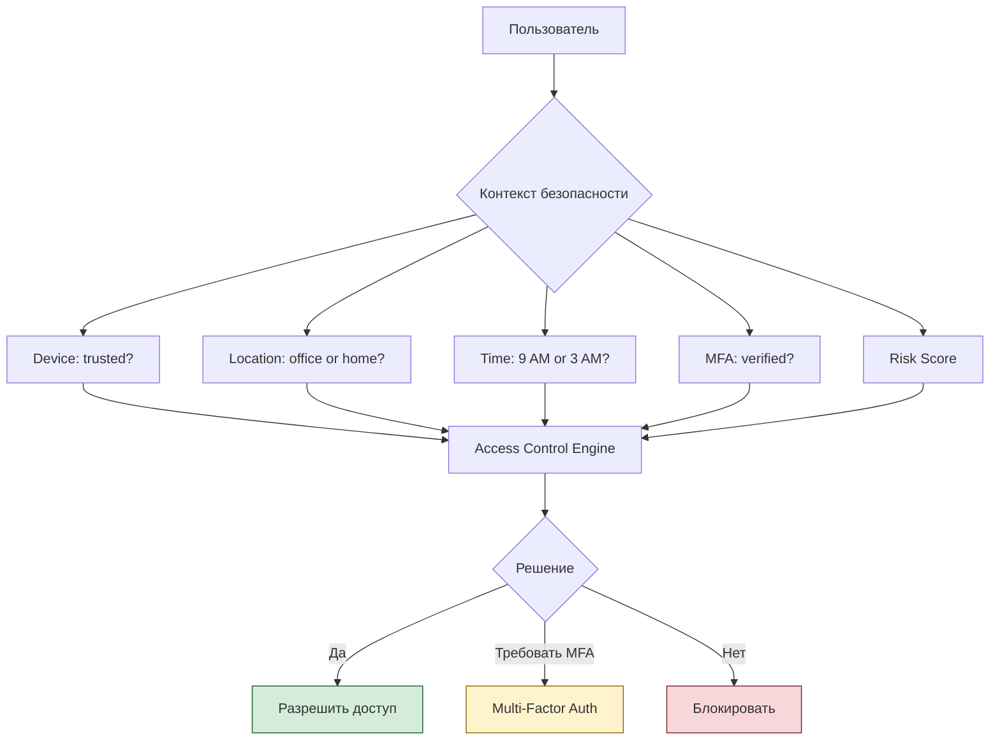
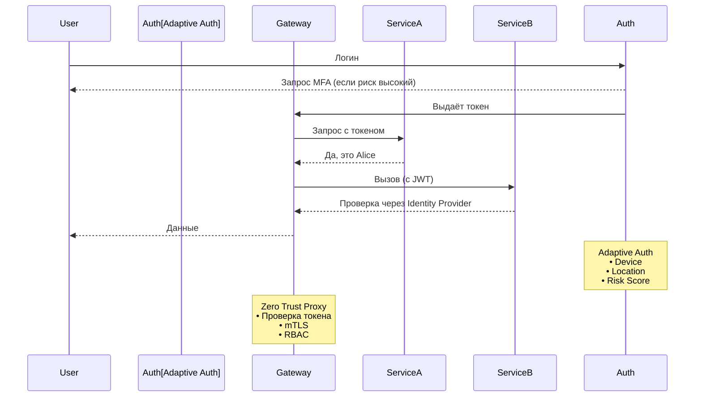

---
aliases:
  - Zero Trust
  - Adaptive Authentication
tags:
  - security
---
**Zero Trust (Ноль доверия)** и **Adaptive Authentication (Адаптивная аутентификация)** — это **современные подходы к безопасности**, которые заменяют устаревшую модель: _«Раз ты внутри сети — тебе можно»_.

---

## ✅ 1. Что такое **Zero Trust**?

> **Zero Trust** — это **философия безопасности**, которая говорит:
> > _**"Никому и ничему не доверяй — даже если они внутри сети."**_

### 🔹 Принцип:
> **Проверяй всё, что пытается получить доступ — каждый раз.**

> 💬 _“Never trust, always verify.”_  
> — Google BeyondCorp

---

### 🔧 Основные принципы Zero Trust:

| Принцип                    | Объяснение                                                                                            |
| -------------------------- | ----------------------------------------------------------------------------------------------------- |
| **Verify Explicitly**      | Аутентифицируй и авторизуй на основе всех данных: пользователь, устройство, местоположение, поведение |
| **Least Privilege Access** | Давай минимально необходимые права                                                                    |
| **Assume Breach**          | Веди себя так, как будто сеть уже скомпрометирована                                                   |

---

### 🔄 Как работает Zero Trust?

---

### ✅ Где применяется?
- Корпоративные сети
- Облако (AWS, Azure)
- Микросервисы (Istio, Linkerd)
- Удалёнка (не важно, где вы)

---

### ✅ Преимущества Zero Trust

| Плюс                             | Объяснение                                       |
| -------------------------------- | ------------------------------------------------ |
| ✅ **Защита от внутренних угроз** | Сотрудник → не значит «доверенный»               |
| ✅ **Гибкость**                   | Работает из любого места                         |
| ✅ **Снижение поверхности атаки** | Нет "внутренней сети" → нельзя проникнуть глубже |
| ✅ **Поддержка удалённой работы** | Без VPN, но безопасно                            |
| ✅ **Интеграция с CI/CD**         | Каждый сервис должен доказать свою легитимность  |

## 🆚 Сравнение: Zero Trust vs [[adaptive auth]]

| Характеристика | **Zero Trust** | **Adaptive Authentication** |
|----------------|--------------|----------------------------|
| **Область** | Вся сеть: доступ к данным, API, файлам | Только вход пользователя |
| **Фокус** | Все действия после входа | Только момент аутентификации |
| **Когда используется** | При каждом вызове | Только при логине |
| **Пример** | Микросервис B не может вызвать A без токена | Требует SMS, если вход с нового устройства |
| **Инструменты** | Istio, ZTNA, mTLS | Okta, Azure AD Conditional Access, Keycloak |

> ✅ **Adaptive Authentication — часть Zero Trust.**  
> Но **Zero Trust — это больше**: он контролирует **все** взаимодействия.

---

## ✅ Как они работают вместе?

> ✅ **Adaptive Auth** — решает: *«Можно ли войти?»*  
> ✅ **Zero Trust** — решает: *«Что можно делать после входа?»*

---

## ✅ Реальные примеры

### 1. **Google BeyondCorp**
- Нет корпоративной сети
- Каждое приложение — защищено
- Вход только с доверенного устройства
- Adaptive Auth по множеству факторов

### 2. **Microsoft Entra ID (Azure AD)**
- Conditional Access Policies
- Если устройство не в домене → требует MFA
- Если страна = Россия → блокировать

### 3. **Okta / Ping Identity**
- Adaptive MFA
- Интеграция с SIEM
- Risk-based authentication

---

## ✅ Финальный вывод

| Zero Trust                       | [[adaptive auth]]       |
| -------------------------------- | --------------------------------- |
| ✅ **Шире**: охватывает всю сеть  | ✅ **Узко**: только аутентификация |
| ✅ **Каждый вызов — проверяется** | ✅ **Только вход — анализируется** |
| ✅ **mTLS, service-to-service**   | ✅ **Пользователь → система**      |
| ✅ **Постоянный контроль**        | ✅ **Разовый контроль при входе**  |

> 🔑 **Adaptive Authentication — это первый щит.**  
> **Zero Trust — это весь город: стены, ворота, патрули.**

---

## 💬 Цитата:

> _“In a zero trust world, the network is untrusted. The only thing that matters is identity and policy.”_  
> — Microsoft Security

✅ **Zero Trust и Adaptive Authentication — это ответ на современные угрозы.**  
Когда хакеры используют **ваши же учетные данные**, нужно **проверять не только пароль — а всё**.

> 💡 **Не спрашивайте: "Это ты?"**  
> **Спрашивайте: "Почему ты сейчас здесь, с этого устройства, в 3 часа ночи?"**
