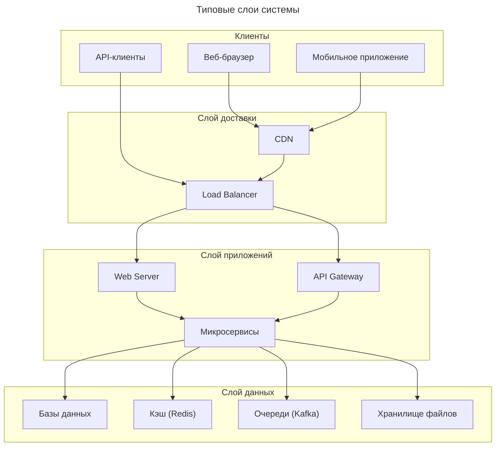

## 🧠 Что такое System Design?

**System Design** (проектирование систем) — это **дисциплина создания архитектуры программных систем**, которая определяет, как компоненты приложения будут взаимодействовать друг с другом и с внешним миром для решения конкретной бизнес-задачи.

> 💡 **Простыми словами**:  
> *«System Design — это план строительства цифрового здания: где будут стены, окна, лифты и как люди будут в нём перемещаться.»*

---


## 📋 Этапы проектирования системы

1. **Уточнение требований**
	- Какие функции должна выполнять система?
	- Сколько пользователей/запросов в секунду?
	- Какие данные хранить и как долго?

2. **Оценка масштаба**
	- QPS (Queries Per Second)
	- Хранилище данных (TB/год)
	- Пропускная способность сети

3. **Архитектурные решения**
	- Монолит vs микросервисы
	- Выбор баз данных (SQL vs NoSQL)
	- Стратегия кэширования
	- Подход к обработке ошибок

4. **Детализация компонентов**
	- API-контракты
	- Форматы данных
	- Алгоритмы обработки
	- Схемы баз данных

5. **Анализ рисков и оптимизация**
	- Узкие места (bottlenecks)
	- План масштабирования
	- Стратегия резервного копирования

---

## ⚖️ Trade-offs в System Design

| Решение               | Плюсы                          | Минусы                    |
| --------------------- | ------------------------------ | ------------------------- |
| **Репликация данных** | Высокая доступность            | Сложность согласованности |
| **Шардинг**           | Горизонтальное масштабирование | Сложные JOIN-запросы      |
| **Кэширование**       | Высокая скорость               | Риск устаревших данных    |
| **Микросервисы**      | Независимое развёртывание      | Сложность отладки         |
| **NoSQL**             | Гибкость схемы                 | Отсутствие транзакций     |

---

## 💬 Кратко

> **System Design — это искусство баланса между противоречивыми требованиями**:  
> - Скорость vs Надёжность  
> - Простота vs Масштабируемость  
> - Согласованность vs Доступность  

> 📌 **Главный принцип**:  
> *«Не проектируйте систему под миллион пользователей, если у вас их десять. Но проектируйте так, чтобы к миллиону можно было дойти без полной перестройки.»*

> ✅ **System Design — это не просто технологии, а мышление инженера, который видит систему целиком, а не только свой кусочек кода.**

## Слои системы


---

## 📊 Формулы для оценки нагрузки

### 1. **QPS (Queries Per Second)**
```
QPS = (Количество запросов в день) / (24 × 3600)
```
> Пример: 1 млн запросов/день → **~12 QPS**

### 2. **Пиковая нагрузка**
```
Пиковый QPS ≈ Средний QPS × 2–5
```
> Реальные системы редко имеют равномерную нагрузку.

### 3. **Требуемая пропускная способность**
```
Пропускная способность (бит/с) = QPS × Размер_ответа_в_байтах × 8
```
> Пример: 1000 QPS × 10 KB → **80 Gbps** — требует нескольких серверов.

---

### 4. **Размер хранилища**
```
Ежедневный рост = QPS × Размер_записи × 86400
Годовой объём = Ежедневный рост × 365
```
> Пример: 100 QPS × 1 KB → **~3 ТБ/год**

---

### 5. **Время чтения из базы данных**
```
Время = (Поиск по индексу) + (Чтение данных)
```
- Поиск по индексу B+Tree: **O(log N)** → ~10 сравнений для 1 млрд записей
- Последовательное чтение с диска: **100–200 MB/s**
- Случайное чтение с диска: **100–200 IOPS**

> 💡 **Индекс ускоряет поиск в 1000–10000 раз**, но замедляет запись.


---

## 🧮 Формулы масштабирования

### 1. **Количество серверов**
```
Серверы = ceil(Общая_нагрузка / Нагрузка_на_один_сервер)
```
> ceil – *«потолок»*, функция для округления числа вверх
### 2. **Репликация vs Шардинг**
- **Репликация**: решает проблему **чтения** (масштабирование по читателям)
- **Шардинг**: решает проблему **записи и хранения** (масштабирование по данным)

### 3. **Закон Аmdahl’s Law** (ограничение параллелизма)
```
Макс. ускорение = 1 / (1 - P + P/N)
```
где P — параллельная часть, N — количество ядер.

> 💡 Даже при N→∞, если 10% кода последовательно → максимум ускорение **10×**.

---

## 📈 Формулы надёжности

### 1. **SLA (Service Level Agreement)**
```
Доступность = (Время_работы / Общее_время) × 100%
```

### 2. **MTTR и MTBF**
- **MTBF** (Mean Time Between Failures) — среднее время между сбоями
- **MTTR** (Mean Time To Repair) — среднее время восстановления
- **Доступность = MTBF / (MTBF + MTTR)**

---

## 🎯 Практические правила-эвристики

### 📦 Хранилище
- **1 пользователь** ≈ 1–10 КБ метаданных
- **1 фото** ≈ 200–500 КБ (сжатое)
- **1 видео (1 мин)** ≈ 10–50 МБ

### 👥 Пользователи
- **Активных пользователей** ≈ 10–20% от общего числа
- **Пиковая нагрузка** ≈ 2–5× средней
- **Коэффициент возврата** ≈ 30–70% (retention)

### ⚡ Производительность
- **Время загрузки страницы** > 3 сек → 40% пользователей уходят
- **API latency** > 200 мс → заметное ухудшение UX
- **Кэш hit rate** > 90% → значительное ускорение

---