---
aliases:
  - ACID
  - AP
  - Application layer
  - Availability
  - BASE
  - CAP
  - CDN
  - CNAME
  - Consistency
  - CP
  - Denormalization
  - DNS
  - Domain name system
  - Eventual consistency
  - Fail-over
  - Federation
  - Horizontal scaling
  - Latency
  - Load balancer
  - Master-master
  - Master-slave
  - Microservices
  - MX
  - NoSQL
  - NS
  - Partition tolerance
  - Performance
  - Query Optimization
  - Replication
  - Reverse proxy
  - Scalability
  - Service Discovery
  - Sharding
  - Strong consistency
  - System Design
  - Throughput
  - Weak consistency
  - Аварийное переключение
  - Балансировщик нагрузки
  - Горизонтальное масштабирование
  - Денормализация
  - Доступность
  - Консистентность
  - Кэширование
  - Латентность
  - Масштабируемость
  - Микросервисы
  - Обнаружение сервисов
  - Производительность
  - Пропускная способность
  - Реверс прокси
  - Репликация
  - Сеть доставки контента
  - Сильная консистенция
  - Система доменных имен
  - Слабая консистенция
  - Согласованность
  - Устойчивость к разделению
  - Федерализация
  - Частичная консистенция
  - Шардирование
---
# System Design

**Суть**
> **System Design — это искусство баланса между противоречивыми требованиями**:
> - Скорость vs Надёжность
> - Простота vs Масштабируемость
> - Согласованность vs Доступность

> 📌 **Главный принцип**:
> *«Не проектируйте систему под миллион пользователей, если у вас их десять. Но проектируйте так, чтобы к миллиону можно было дойти без полной перестройки.»*

> ✅ **System Design — это не просто технологии, а мышление инженера, который видит систему целиком, а не только свой кусочек кода.**

---

## Performance vs Scalability

> Производительность (Performance) vs масштабируемость (Scalability)

Сервис является масштабируемым, если его производительность увеличивается пропорционально добавляемым ресурсам. В общей сложности, увеличение производительности увеличивает объём данных, которые может обработать сервис.

- Если у вас есть проблемы с производительностью, то ваша система является медленной для одного пользователя.
- Если у вас есть проблемы с масштабируемостью, то ваша система работает производительно для одного пользователя, но имеет проблемы при многопользовательском доступе.

## Latency vs Throughput

> Задержка (Latency) vs Пропускная способность (Throughput)

Латентность — это время, необходимое для выполнения какого-либо действия или для получения какого-либо результата.

Пропускная способность — это количество операций или результатов в единицу времени.

В общем случае следует стремиться достигнуть максимальной пропускной способности при допустимой латентности.

## Availability vs Consistency

> Доступность (Availability) vs Консистентность (Consistency)

### [[CAP-theorem]]

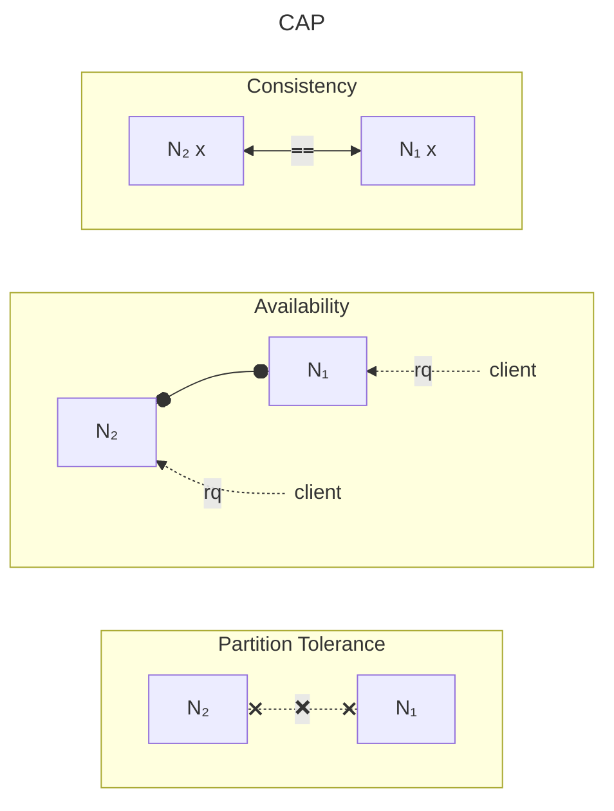
```mermaid
---
title: CAP
---
flowchart RL
  subgraph s1["Partition Tolerance"]
    direction RL
    N6["N₂"]
    N5["N₁"]
  end
  subgraph Availability["Availability"]
    direction RL
    N4["N₂"]
    N3["N₁"]
    n1["client"]
    n2["client"]
  end
  subgraph Consistency["Consistency"]
    direction RL
    N2["N₂ x"]
    N1["N₁ x"]
  end
  N5 x-. ❌ .-x N6
  N3 o--o N4
  N1 <-- ⩵ --> N2
  n1 -. rq .-> N3
  n2 -. rq .-> N4

  n1@{ shape: text}
  n2@{ shape: text}
```

В распределённых системах вы сможете гарантировать только две вещи из трёх:

- Консистентность — каждое чтение возвращает самые свежие данные или ошибку.
- Доступность — каждый запрос возвращает результат. Без гарантий, что результат содержит последние данные.
- Устойчивость к разделению — система должна функционировать несмотря на потери ресурсов, узлов или каких-либо других ошибок коммуникации между сервисами.

*Сеть не является надёжной, соответственно, вам необходимо поддерживать устойчивость к разделению. Следует делать компромиссы между консистентностью данных и доступностью данных.*

#### CP

> (consistency and partition tolerance) — Консистентность + устойчивость к разделению

В такой системе в результате ожидания ответа от ноды можно получить timeout (истечение времени ожидания). Такой подход отлично подходит для систем, в которых требуется соблюдение атомарности операций. Например, транзакций в банке. Нельзя купить что-то, не успев пополнить счёт.

#### AP

> (availability and partition tolerance) — Доступность + устойчивость к разделению

Ответы возвращают наиболее свежие данные, доступные ноде, но они могут быть не самыми свежими в целом. Запись данных в распределённых системах занимает некоторое время (необходимо сделать множество копий между несколькими базами данных), поэтому данные могут появиться не сразу.

Этот подход подходит системам, бизнес-логика которых допускает частичную консистенцию. Также этот подход хорош для систем, которые должны продолжать функционировать вне зависимости от внешних ошибок.

## Consistency patterns

> Паттерны консистенции

Поддерживая множество копий тех же данных, мы сталкиваемся с проблемой их синхронизации. Клиент всегда должен получать только самые свежие данные. Вспоминая CAP-теорему — каждое чтение должно возвращать самые свежие данные или ошибку.

### Weak consistency

> Слабая консистенция

После записи читатель может увидеть записанное, а может и не увидеть. Здесь применяется метод best effort.

Данный подход можно наблюдать в таких системах как **memcached**. Слабая консистенция отлично подходит для использования в real-time, например VoIP, видеочаты и мультиплеерные игры. Например, если вы разговариваете по телефону и потеряли связь на некоторое время, то вы не услышите то, что было сказано в этот момент времени.

### Eventual consistency

> Частичная консистенция

После записи чтение вполне себе вернёт последние данные, но, возможно, не сразу (обычно в течение нескольких миллисекунд). Данные реплицируются асинхронно.

Этот подход часто используется в системах DNS и Email. Частичная консистенция отлично подходит для системы с высокой доступностью.

### Strong consistency

> Сильная консистенция

Сразу после записи будет возможно считать самые актуальные данные. Но запись, разумеется, происходит синхронно, и это может влиять на доступность системы. Данные реплицируются по всей системе синхронно.

Данный подход используется в таких системах как RDBMS. Сильная консистенция отлично подходит для систем, в которых требуются транзакции.

## Паттерны доступности (Availability patterns)

Существует два главных паттерна для поддержки высокой доступности: Fail-over и Replication.

### Fail-over

> Аварийное переключение

**Активный-пассивный (Active-passive)**

С таким подходом происходит отправка пульса (heartbeats) между активным и пассивным серверами. Если пульс прекращается, то пассивный сервер берёт на себя обязанности активного сервера, переключая IP-адреса на себя.

Время простоя (downtime) зависит от того, как быстро пассивный сервер готов начать работу в качестве активного. Пассивный сервер может ожидать в горячем (hot) или холодном (cold) состоянии.

Пассивный сервер может убить активный сервер путём использования команды — shoot the other node in the head (STONITH), это метафорическая команда и может быть реализована как угодно. Делается это для того, чтобы в системе не функционировало одновременно два активных сервера, так как это может привести к ошибкам.

Активный-пассивный отказоустойчивый подход может также называться master-slave — мастер-раб.

**Активный-активный**

С активный-активный подходом оба сервера обрабатывают трафик, распределяя нагрузку между собой.

Если доступ к серверу выставлен наружу, то DNS должен знать IP-адреса обоих серверов. Если сервера выставлены для внутреннего использования, то логика на уровне приложения должна знать об обоих серверах.

Активный-активный может также называться master-master — мастер-мастер.

**Недостатки**

- Отказоустойчивость добавляет сложности и требует большего количества железа.
- Существует потенциальная возможность потери данных, если данные не успели реплицироваться с активного на пассивный сервер.

### Replication

> Репликация

**Master-slave vs master-master**

Мы рассмотрим эти два подхода в разделе про базы данных.

## DNS

> Система доменных имён (Domain name system)

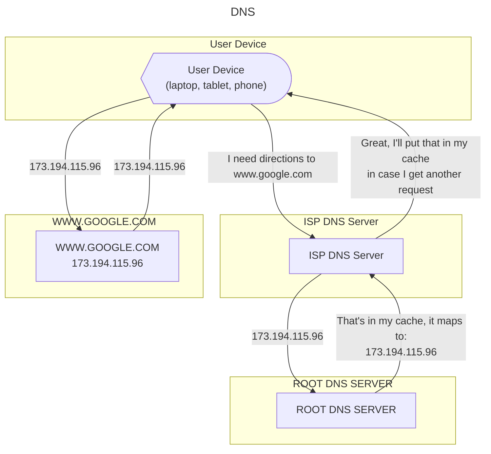
```mermaid
---
title: DNS
---
flowchart TB
  subgraph s1["User Device"]
    U["User Device\n(laptop, tablet, phone)"]
  end
  subgraph s2["ISP DNS Server"]
    ISP["ISP DNS Server"]
  end
  subgraph s3["ROOT DNS SERVER"]
    ROOT["ROOT DNS SERVER"]
  end
  subgraph s4["WWW.GOOGLE.COM"]
    GOOGLE["WWW.GOOGLE.COM\n173.194.115.96"]
  end
  U -- "I need directions to www.google.com" --> ISP
  ISP -- "173.194.115.96" --> ROOT
  ROOT -- "That's in my cache, it maps to:\n173.194.115.96" --> ISP
  ISP -- Great, I'll put that in my cache\nin case I get another request --> U
  U -- "173.194.115.96" --> GOOGLE
  GOOGLE -- "173.194.115.96" --> U

  U@{ shape: display}
```

1. Пользователь запрашивает у ISP DNS Server информацию о www.google.com.
2. ISP DNS Server запрашивает у ROOT DNS SERVER информацию.
3. ROOT DNS SERVER отвечает, что знает IP-адрес (173.194.115.96).
4. ISP DNS Server кэширует информацию и отвечает пользователю.
5. Пользователь использует полученный IP-адрес для подключения к серверу Google.

DNS преобразует доменное имя в IP-адрес. Например, www.example.com в 127.0.0.1.

DNS иерархичен и имеет несколько высокоуровневых серверов. Ваш роутер или провайдер предоставляет информацию о том, какой из DNS-серверов использовать. Низкоуровневые DNS-серверы кэшируют маппинг, который может устаревать из-за задержек обновлений. Также DNS может быть закеширован браузером или операционной системой.

- NS-запись (name server) — определяет DNS-сервер для вашего домена/субдомена.
- MX-запись (mail exchange) — определяет почтовый сервис для принятия почты.
- A-запись (address) — определяет IP-адрес в виде доменного имени.
- CNAME-запись (canonical) — определяет другое имя (example.com как www.example.com) или A-запись.

Такие сервисы как CloudFlare и Route 53 предоставляют управляемые DNS-сервисы. Некоторые DNS-сервисы могут направлять трафик, используя разные методы:

- Взвешенное распределение трафика.
- Предотвращает попадание трафика на сервера, которые не способны принять запрос.
- Балансирует трафик между серверами.
- Позволяет проводить A/B-тестирование.
- Распределение по задержке.
- Геораспределение.

**Недостатки DNS**

- Запрос на DNS-сервер добавляет некоторую задержку, но она вполне себе устраняется методами кеширования, описанными выше.
- DNS может быть сложен в настройке и управлении, но большинство DNS управляются государствами и крупными компаниями.
- DNS-серверы подвергаются атакам, и такие атаки могут нести всемирный характер.

## CDN

> Сеть доставки контента (Content delivery network)

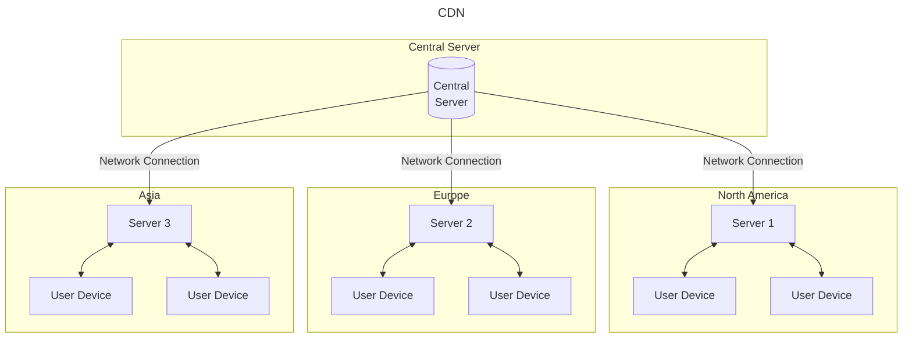
```mermaid
---
title: CDN
---
flowchart TB
  subgraph s1["Central Server"]
    CS[("Central\nServer")]
  end
  subgraph s2["North America"]
    NA_S1["Server 1"]
    NA_U1["User Device"]
    NA_U2["User Device"]
  end
  subgraph Europe["Europe"]
    EU_S1["Server 2"]
    EU_U1["User Device"]
    EU_U2["User Device"]
  end
  subgraph Asia["Asia"]
    AS_S1["Server 3"]
    AS_U1["User Device"]
    AS_U2["User Device"]
  end
  NA_S1 <--> NA_U1 & NA_U2
  EU_S1 <--> EU_U1 & EU_U2
  AS_S1 <--> AS_U1 & AS_U2
  CS -- Network Connection --> NA_S1 & EU_S1 & AS_S1
```

Content delivery network (CDN) — это глобальная и распределённая сеть прокси-серверов, предоставляющая контент пользователям в различных локациях по всему миру. Как правило, CDN хранит статичные файлы такие как HTML, CSS, JS, но есть сервисы, которые хранят и динамичный контент.

Использование CDN улучшает производительность двумя способами:

- Пользователи получают контент с ближайшего к ним CDN-сервера.
- Сервер с приложением не тратит усилия на обработку таких запросов.

**Push CDN**

Push CDN получают новый контент каждый раз, когда он обновляется на сервере. В данном случае пользователь CDN (разработчик) отвечает за обновление CDN-серверов актуальным контентом. Можно настроить время, по которому истекает актуальность контента, или обновлять его только тогда, когда появится новый.

Push CDN отлично подходит для сайтов с маленьким трафиком или для сайтов, контент которых меняется не часто. Лучше один раз загрузить контент на CDN, чем выкачивать его с сервера на постоянной основе.

**Pull CDN**

Pull CDN выкачивает новые данные при первом обращении пользователя. Такой первый запрос, как правило, медленней последующих, так как требует получения данных с сервера. Следующие запросы уже будут закешированы CDN-ном и будут происходить быстрей.

TTL — time-to-live, определяет, как долго контент будет храниться в кеше. Pull CDN позволяет уменьшить объём данных, который хранится на CDN, но тем самым может вызвать увеличение ненужного трафика на сервер, если данные на CDN устаревают раньше, чем они действительно становятся неактуальными на сервере.

Pull CDN отлично подходит сайтам с большим трафиком, так как количество обращений к закешированным данным гораздо больше.

**Недостатки CDN**

- Контент на CDN может устаревать, если он обновляется раньше удаления кеша.
- Необходимость изменения ссылок на новый контент.

## Load balancer

> Балансировщик нагрузки (Load balancer)

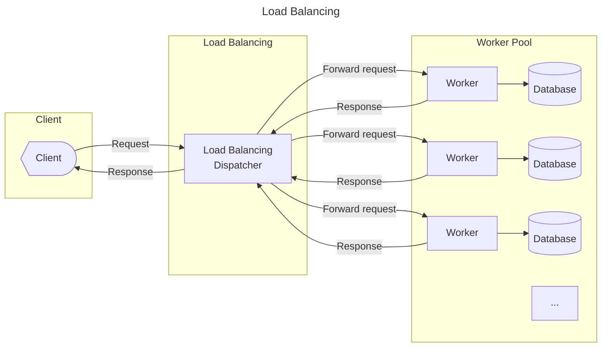
```mermaid
---
title: Load Balancing
---
flowchart LR
  subgraph Client["Client"]
    C["Client"]
  end
  subgraph Dispatcher["Load Balancing"]
    D@{ label: "<span style=\"padding-left:\">Load Balancing</span><br>Dispatcher" }
  end
  subgraph s2["Worker Pool"]
    DB1[("Database")]
    W1["Worker"]
    DB2[("Database")]
    W2["Worker"]
    DB3[("Database")]
    W3["Worker"]
    W4["..."]
  end
  W1 --> DB1
  W2 --> DB2
  W3 --> DB3
  C -- Request --> D
  D -- Forward request --> W1 & W2 & W3
  W1 -- Response --> D
  W2 -- Response --> D
  W3 -- Response --> D
  D -- Response --> C

  C@{ shape: display}
  D@{ shape: rect}
```

Балансировщики нагрузки распределяют входящий трафик между сервисами (приложениями, базами данных), каждый раз возвращая ответ клиенту, который делал изначальный запрос.

Балансиры эффективны:

- Когда нужно предотвратить обработку запроса неработающим сервером.
- Когда нужно защитить ресурсы от чрезмерной нагрузки.
- Когда нужно избежать единой точки отказа.

Балансиры могут быть реализованы с помощью железа (дорого) или программно, например с HAProxy.

Дополнительные плюсы использования:

- SSL-терминация — расшифровка входящих запросов и шифровка ответов.
  - Сервера не будут тратить свои ресурсы.
  - Нет необходимости ставить сертификаты X.509 на каждый сервер.
- Хранение сессий — выдает куки пользователям и пытается направлять одного и того же юзера на тот же сервер. Убирает необходимость хранить сессию на серверах, что в принципе и не должно происходить, учитывая горизонтальное масштабирование, где инстансы одного и того же приложения запущены на множестве серверов.

Для защиты от ошибок зачастую лучше иметь несколько инстансов балансеров в активный-активный или активный-пассивный режимах.

Способы распределения трафика балансировщиком:

- Случайно.
- Наименее загруженный.
- Сессии/куки.
- Round robin or weighted round robin.
- По слою 4 модели OSI.
- По слою 7 модели OSI.

**Недостатки**

- Балансиры могут быть узким местом системы, если сконфигурированы неверно или слишком слабые.
- Используя балансиры, система уменьшает риски, но повышается сложность всей системы.
- Один балансер представляет собой единственную точку отказа всей системы; конфигурирование нескольких балансиров только добавляет сложности всей системе.

### Layer 4 балансировка

Данная балансировка работает на транспортном уровне, определяя, как распределить запрос. Обычно используется IP-адрес и порт источника и получателя в заголовке пакетов, но не в их содержимом. Балансиры направляют трафик с помощью Network Address Translation (NAT).

### Layer 7 балансировка

Данная балансировка работает на уровне приложения; для распределения трафика могут быть задействованы и данные из хедеров, контента и кук.

Балансир делает выбор, на какой сервер отправить запрос, и открывает соединение с выбранным сервером.

Балансер 4-го уровня имеет меньшую гибкость, но более высокую скорость, так как распределение происходит без чтения контента. Но на современном железе это не сильно заметно.

## Horizontal scaling

> Горизонтальное масштабирование (Horizontal scaling)

Балансиры могут также помочь с горизонтальным масштабированием, улучшая производительность и доступность. Масштабирование с использованием простых серверов гораздо дешевле дорогих решений и дорогих мощных серверов (вертикальное масштабирование). Также гораздо проще и дешевле найти специалиста, умеющего работать с простым сервером, нежели с каким-либо проприетарным.

**Недостатки горизонтального масштабирования**

- Представляет собой непростую задачу.
  - Сервера не должны хранить какое-либо состояние, например сессии или изображения пользователей.
  - Сессии и прочее должно храниться отдельно в базах данных (SQL, NoSQL) или в кеше (Redis, Memcached).
- Кэширующие сервера должны обрабатывать большинство запросов.

## Reverse proxy

> Реверс прокси (веб-сервер) — Reverse proxy (web server)

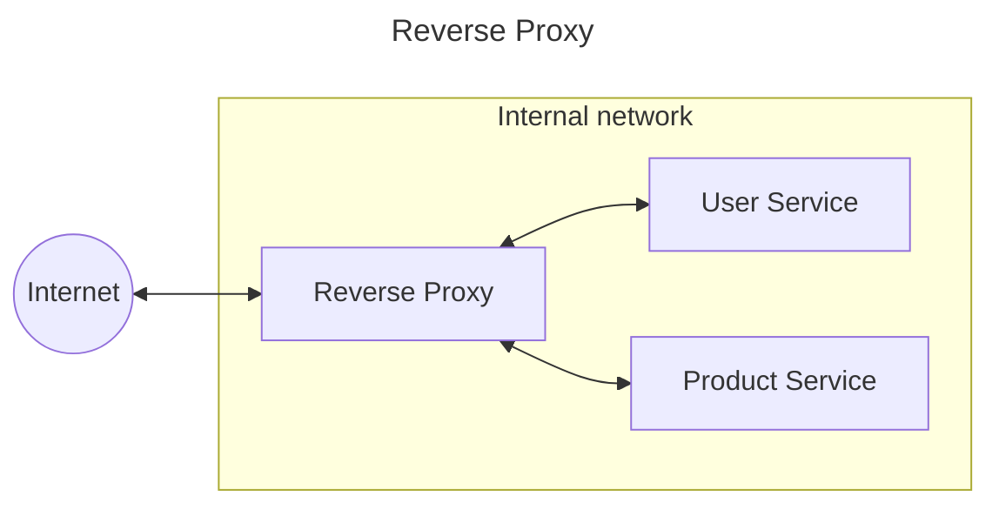
```mermaid
---
title: Reverse Proxy
---
flowchart LR
  subgraph s1["Internal network"]
    WebServer["User Service"]
    Proxy["Reverse Proxy"]
    n1["Product Service"]
  end
  Proxy <--> WebServer & n1
  Internet(("Internet")) <--> Proxy
```

Обратный прокси — это веб-сервер, который централизует внутренние сервисы и предоставляет унифицированный интерфейс наружу. Клиентские запросы пробрасываются к серверу, который способен их обработать, а затем возвращается ответ.

Дополнительные плюсы:

- Повышенная безопасность — прячет информацию о бекенд-серверах, блокирует IP-адреса, ограничивает количество соединений на клиента.
- Масштабируемость и гибкость — клиенты видят только прокси-сервер, а внутренняя конфигурация может быть любой.
- SSL-терминация — расшифровка входящих и шифровка исходящих пакетов в одном месте. Нет необходимости делать это на каждом сервере.
- Сжатие — сжатие ответов.
- Кеширование — возврат ответов на кэшированные запросы.
- Статический контент — отдает статический контент напрямую.
  - HTML/CSS/JS, фото, видео и т.д.

**Недостатки**

- Использование реверс-прокси увеличивает сложность системы.
- Использование одного реверс-прокси-сервера создаёт единую точку отказа.
  - Решение этой проблемы увеличивает сложность системы.

### Load balancer vs Reverse Proxy

> Балансировщик vs реверс-прокси

- Использование балансировщика полезно, когда у вас несколько серверов. Чаще всего балансировщики используются для распределения нагрузки между серверами, которые выполняют одну и ту же задачу.
- Реверс-прокси может быть полезным даже с одним сервером и предоставлять описанные выше полезные возможности.
- Такие решения как NGINX и HAProxy могут поддерживать layer 7 реверс-прокси и балансировку нагрузки.

## Application layer

> Слой приложения (Application layer)

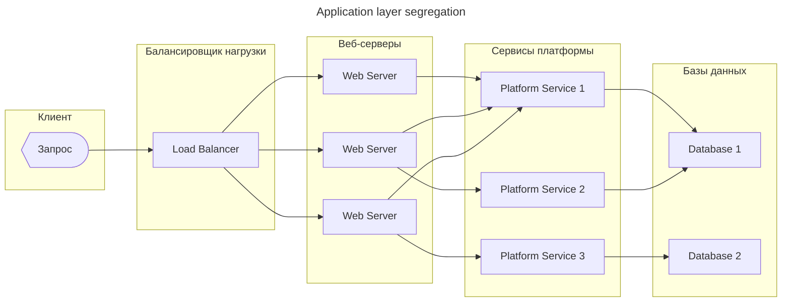
```mermaid
---
title: Application layer segregation
---
flowchart LR
  subgraph Client["Клиент"]
    R[Запрос]
  end
  subgraph LB["Балансировщик нагрузки"]
    L[Load Balancer]
  end
  subgraph Web["Веб-серверы"]
    W1[Web Server]
    W2[Web Server]
    W3[Web Server]
  end
  subgraph Platform["Сервисы платформы"]
    P1[Platform Service 1]
    P2[Platform Service 2]
    P3[Platform Service 3]
  end
  subgraph DB["Базы данных"]
    D1[Database 1]
    D2[Database 2]
  end

  R --> L
  L --> W1 & W2 & W3
  W1 --> P1
  W2 --> P1 & P2
  W3 --> P1 & P3
  P1 --> D1
  P2 --> D1
  P3 --> D2

  R@{ shape: display}
```

Разделение веб-уровня и уровня приложения позволяет масштабировать и конфигурировать оба уровня отдельно друг от друга. Добавление нового API не требует поднятия ещё одного веб-сервера.

Принцип единой ответственности позволяет писать маленькие автономные сервисы быстро и независимо друг от друга.

**Недостатки application layer**

- Добавление уровня приложения с разделёнными сервисами требует совершенно иного подхода в отличие от монолитного.
- Микросервисы добавляют сложности в деплоймент и развертку.

## Микросервисы (Microservices)

> Микросервисы — архитектурный стиль

Микросервисы — это набор независимых, модульных сервисов, выполняющих конкретные бизнес-задачи. Каждый сервис работает в отдельном процессе, общается через API (чаще всего HTTP) и развертывается независимо.

**Сравнение с монолитом**

- **Монолит**: единый процесс, пересборка всего приложения при любом изменении, сложное масштабирование (нужно масштабировать всё), нарушение модульности со временем.
- **Микросервисы**: физическая граница между сервисами, независимое развертывание и масштабирование, возможность использования разных языков и БД.

**Свойства микросервисной архитектуры**

1. Разбиение через сервисы
2. Организация вокруг бизнеса
3. Децентрализованные данные
4. Автоматизация инфраструктуры
5. Проектирование под отказ
6. Асинхронность
7. Размер сервисов — 2 пиццы
   - Нет строгого правила. Ориентир: сервис должен «помещаться в голове разработчика». Команды варьируются от «двух пицц» (до 12 человек) до одного разработчика на сервис.
8. Продукты, а не проекты
   - Команда владеет сервисом на протяжении всего жизненного цикла («Вы построили, вы поддерживаете»). Это повышает ответственность и связь с потребностями бизнеса.
9. Умные приёмники и глупые каналы
   - Логика находится в сервисах («умные endpoints»), а не в механизмах передачи данных («глупые каналы»). Используются простые протоколы (REST, легковесный мессенджинг), в отличие от сложных ESB.
10. Децентрализованное управление
    - Отказ от жёстких стандартов в пользу выбора лучшего инструмента для задачи (разные языки, разные БД).
      - Каждый сервис может использовать оптимальный стек технологий под свои задачи.
    - Децентрализованное управление данными
      - Каждый сервис владеет своей базой данных (Polyglot Persistence). Нет глобальных транзакций; используется итоговая согласованность (eventual consistency) и компенсирующие операции.
11. Автоматизация инфраструктуры
    - Критически важны CI/CD, автоматическое развертывание и мониторинг. Инструменты (как у Netflix) должны быть доступны всем командам.
12. Эволюционный дизайн
    - Сервисы проектируются так, чтобы их можно было легко заменить или удалить. Границы определяются частотой изменений (быстро меняющиеся части изолируются). Версионирование API минимизируется за счёт толерантности к изменениям.

**Выводы**

- Независимая разработка, развёртывание, масштабирование.
- Требуют децентрализации и автоматизации.
- Нужно проектировать под отказы.
- Подходят для сложных систем, но не универсальны.

### Разбиение через сервисы

Сервисы работают в отдельных процессах, общаются через лёгковесные механизмы (HTTP, RPC). Плюсы: независимое развертывание, явные интерфейсы, чёткие границы.

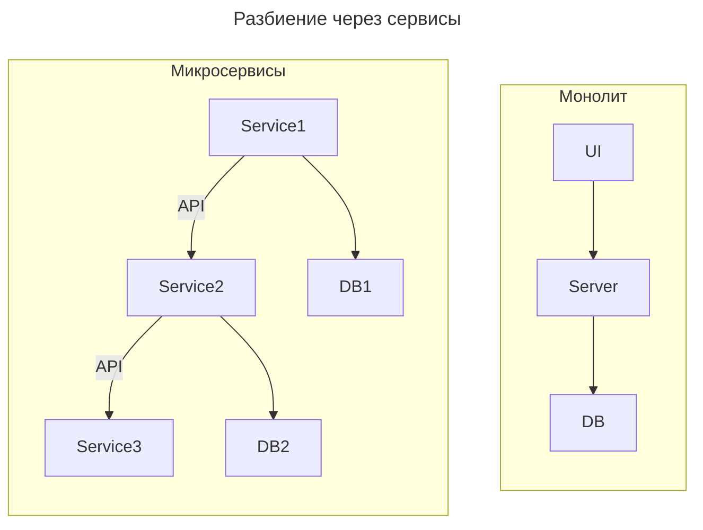
```mermaid
---
title: Разбиение через сервисы
---
flowchart TB
  subgraph "Монолит" [Монолит]
    direction TB
    UI --> Server --> DB
  end
  subgraph "Микросервисы" [Микросервисы]
    direction TB
    Service1 -->|API| Service2 -->|API| Service3
    Service1 --> DB1
    Service2 --> DB2
  end
```

### Организация вокруг бизнеса

Сервисы группируются по бизнес-потребностям, а не по технологиям. Формируются кросс-функциональные команды, отвечающие за полный цикл (от UX до БД), следуя закону Конвея.

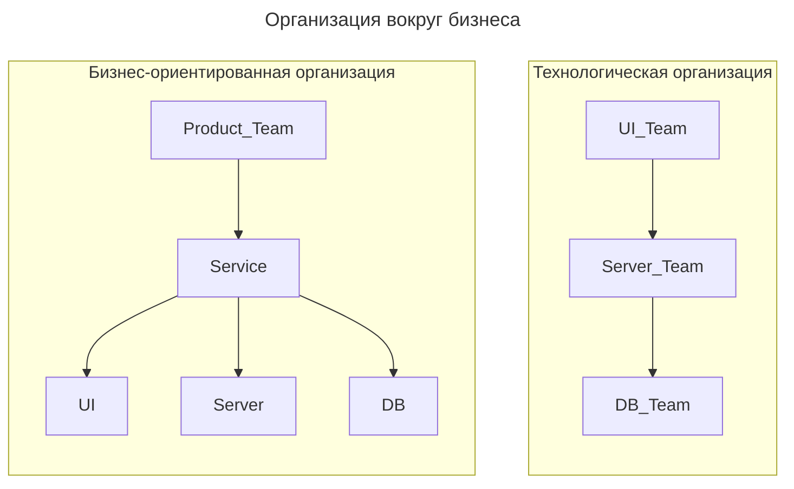
```mermaid
---
title: Организация вокруг бизнеса
---
flowchart TB
  subgraph "Технологическая организация"
    direction TB
    UI_Team --> Server_Team --> DB_Team
  end
  subgraph "Бизнес-ориентированная организация"
    direction TB
    Product_Team --> Service --> UI & Server & DB
  end
```

> [!info] Закон Конвея
> Закон Конвея — это управленческий принцип, гласящий, что архитектура любой разрабатываемой системы неизбежно копирует структуру коммуникаций и взаимодействия внутри создающей её организации.

### Децентрализованные данные

У каждого сервиса своя БД, можно выбирать оптимальную технологию хранения.

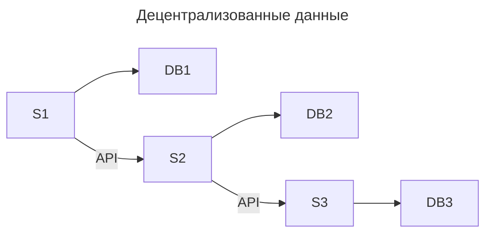
```mermaid
---
title: Децентрализованные данные
---
flowchart LR
  S1 --> DB1
  S2 --> DB2
  S3 --> DB3
  S1 -->|API| S2 -->|API| S3
```

### Автоматизация инфраструктуры

Высокая степень автоматизации нужна для развёртывания и управления.

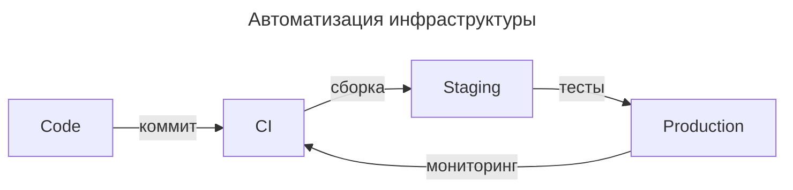
```mermaid
---
title: Автоматизация инфраструктуры
---
flowchart LR
  Code -->|коммит| CI -->|сборка| Staging -->|тесты| Production -->|мониторинг| CI
```

### Проектирование под отказ

> Проектирование под отказ (Design for failure)

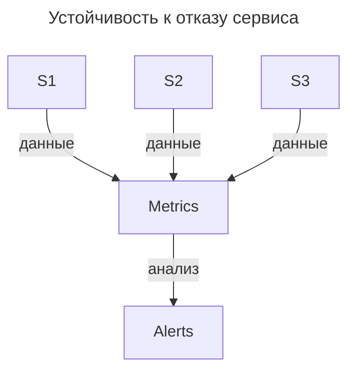
```mermaid
---
title: Устойчивость к отказу сервиса
---
flowchart TB
  S1 & S2 & S3 -->|данные| Metrics -->|анализ| Alerts
```

Сервисы должны работать даже при сбоях других сервисов. Архитектура должна быть отказоустойчивой (Circuit Breakers, Retries). Необходим интенсивный мониторинг и хаос-тестирование (например, Simian Army).

### Асинхронность

Синхронные вызовы считаются опасными (увеличивают риск простоя). Предпочтительны асинхронные с применением [[event-driven-architecture|событийно-ориентированной архитектуры]].

### Микросервисы vs SOA

Микросервисы — это эволюция SOA, но без тяжёлых ESB и централизованной оркестрации. Акцент на простых протоколах и независимости сервисов.

### Будущее микросервисов

Это зрелый подход для enterprise-систем (Amazon, Netflix, The Guardian), но не панацея. Требует высокой квалификации команд. Рекомендуется начинать с модульного монолита и переходить на микросервисы при возникновении проблем с масштабируемостью.

### Service Discovery

> Обнаружение сервисов (Service Discovery)

Инструменты: Consul, Etcd, ZooKeeper. Помогают сервисам находить адреса и порты друг друга. Health checks проверяют работоспособность.

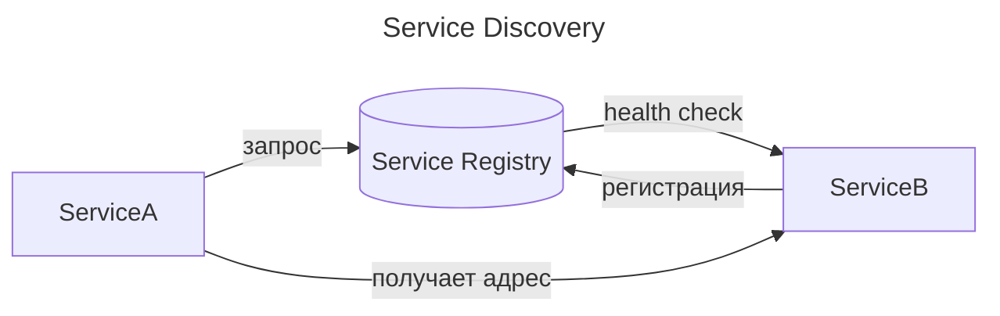
```mermaid
---
title: Service Discovery
---
flowchart LR
  ServiceA -->|запрос| Registry[(Service Registry)]
  ServiceB -->|регистрация| Registry
  Registry -->|health check| ServiceB
  ServiceA -->|получает адрес| ServiceB
```

## Базы данных

### Реляционные БД

> Реляционная система управления базами данных ([[rdbms]])

Реляционная база данных использует SQL и организует данные в таблицы.

**[[ACID]]** — набор свойств транзакций в базе данных:

- **Atomicity** — каждая транзакция выполняется целиком или не выполняется вовсе.
- **Consistency** — каждая транзакция переводит базу из одного стабильного состояния в другое.
- **Isolation** — параллельные транзакции приводят к одному результату.
- **Durability** — после выполнения транзакции изменения сохраняются.

#### Масштабирование реляционных баз данных

Способы масштабирования реляционных баз данных:

1. Replication
2. Federation / Sharding by Functionality
3. Sharding / Horizontal Partitioning
4. Denormalization
5. SQL Tuning / Query Optimization

#### Replication

> Репликация (Replication)

Создание копий данных на других серверах для распределения нагрузки и повышения доступности.

- **Master-slave**: один сервер (мастер) обрабатывает запись, а один или несколько реплик (слейвы) — только чтение.
- **Master-master**: несколько мастеров могут выполнять и чтение, и запись, что усложняет согласованность.

**Преимущества**: отказоустойчивость, масштабируемость чтения.
**Недостатки**: задержка репликации, сложность при записи.

##### Master-slave

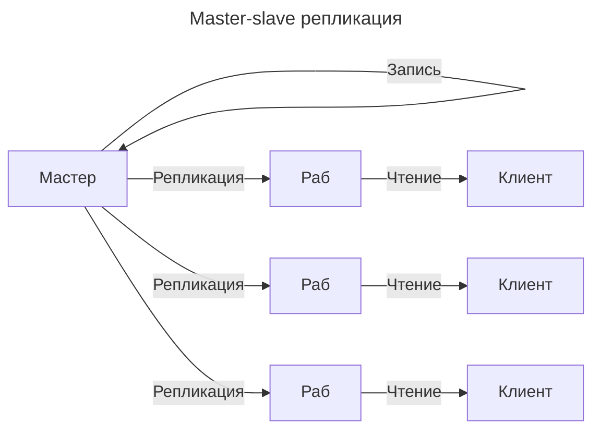
```mermaid
---
title: Master-slave репликация
---
graph LR
  Master[Мастер] -->|Запись| Master
  Master -->|Репликация| Slave1[Раб]
  Master -->|Репликация| Slave2[Раб]
  Master -->|Репликация| Slave3[Раб]
  Slave1 -->|Чтение| Client1[Клиент]
  Slave2 -->|Чтение| Client2[Клиент]
  Slave3 -->|Чтение| Client3[Клиент]
```

**Недостатки**

- Требуется дополнительная логика повышения раба в мастера.
- Сложность репликации.

##### Master-master

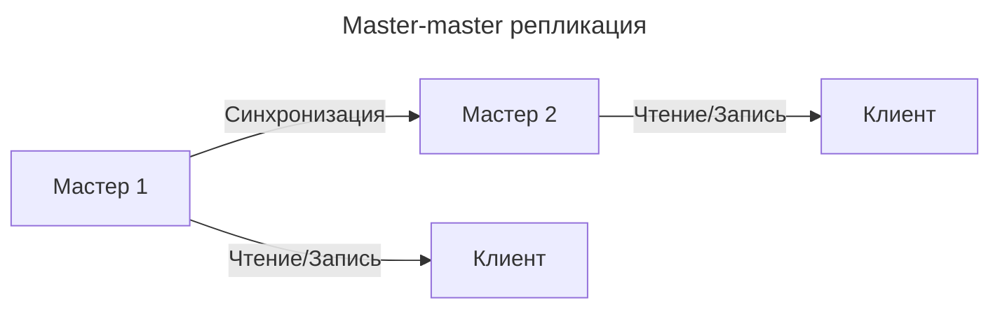
```mermaid
---
title: Master-master репликация
---
graph LR
  Master1[Мастер 1] -->|Синхронизация| Master2[Мастер 2]
  Master1 -->|Чтение/Запись| Client1[Клиент]
  Master2 -->|Чтение/Запись| Client2[Клиент]
```

**Недостатки**

- Требуется балансировщик нагрузки или логика определения точки записи.
- Большинство систем либо имеют слабую согласованность, либо увеличивают задержку синхронизации.
- Проблемы с разрешением конфликтов при увеличении количества узлов записи.

#### Federation

> Федерализация (Federation / Sharding by Functionality)

Разделение базы данных по функциональным модулям (например: пользователи, товары, заказы — в отдельные БД).

**Преимущества**: уменьшение нагрузки на каждый сервер, упрощение кэширования.
**Недостатки**: усложнённая логика приложения.

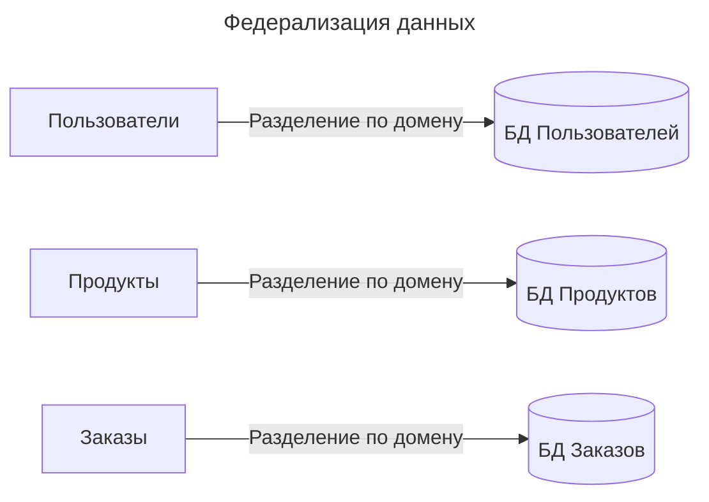
```mermaid
---
title: Федерализация данных
---
graph LR
  Users[Пользователи] -->|Разделение по домену| UsersDB[(БД Пользователей)]
  Products[Продукты] -->|Разделение по домену| ProductsDB[(БД Продуктов)]
  Orders[Заказы] -->|Разделение по домену| OrdersDB[(БД Заказов)]
```

Недостатки:

- Неэффективно при очень большой схеме таблиц.
- Требуется обновление логики приложения для выбора нужной БД.
- Сложность работы с несколькими БД одновременно.
- Добавляет сложность и железо системе.

#### Sharding

> Шардирование (Sharding / Horizontal Partitioning)

Горизонтальное разделение таблицы по строкам (например, по регионам или ID пользователя), данные распределяются по разным серверам.

**Преимущества**: эффективное масштабирование больших объёмов данных.
**Недостатки**: невозможность простых JOIN между шардами, сложность балансировки и управления.

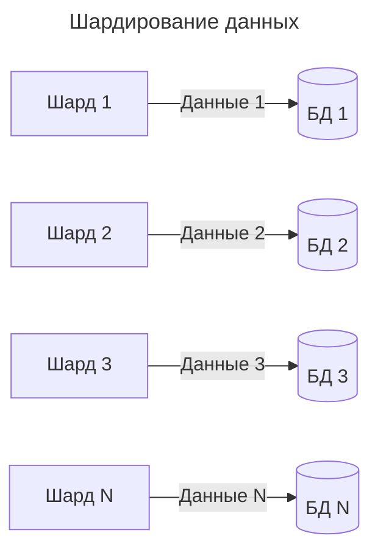
```mermaid
---
title: Шардирование данных
---
graph LR
  Shard1[Шард 1] -->|Данные 1| DB1[(БД 1)]
  Shard2[Шард 2] -->|Данные 2| DB2[(БД 2)]
  Shard3[Шард 3] -->|Данные 3| DB3[(БД 3)]
  ShardN[Шард N] -->|Данные N| DBN[(БД N)]
```

Недостатки:

- Более сложная логика.
- Неравномерное распределение данных может привести к перегрузке отдельных шардов.
- Сложность чтения из нескольких шардов.

#### Denormalization

> Денормализация (Denormalization)

Сознательное дублирование данных для ускорения операций чтения за счёт усложнения операций записи.

**Преимущества**: ускорение SELECT-запросов, особенно в системах с преобладанием чтения.
**Недостатки**: избыточность данных, риск несогласованности, увеличение объёма хранилища, неэффективна при частых операциях записи.

#### Query Optimization

> SQL-тюнинг (SQL Tuning / Query Optimization)

Оптимизация запросов и структуры базы данных для повышения производительности. Включает:

- Использование индексов.
- Анализ планов выполнения запросов.
- Оптимизацию схемы (тип полей, партиционирование и т.д.).
- Кеширование запросов.
- Партиционирование.

**Преимущества**: значительный прирост скорости без изменения архитектуры.
**Недостатки**: требует глубоких знаний СУБД, эффект ограничен при очень высокой нагрузке.

### NoSQL

NoSQL — коллекция хранилищ данных, представленных в виде ключ-значение, документов, колонок. Данные денормализованы, операции объединения обычно выполняются на уровне приложения. Большинство NoSQL БД не поддерживают ACID.

**[[BASE]]** — альтернатива ACID:

- **Basically available** — гарантирует доступность.
- **Soft state** — состояние системы может измениться без выполнения действий.
- **Eventual consistency** — система станет согласованной в течение периода без изменений.

#### Типы NoSQL

| Тип NoSQL           | Лучший для                           | Пример использования                 | Примеры БД                  |
| ------------------- | ------------------------------------ | ------------------------------------ | --------------------------- |
| KV, ключ-значение   | Быстрый доступ по ключу, кэширование | Сессии, кэши, очереди                | Redis, Memcached, DynamoDB  |
| Документная         | Гибкие структуры, изменяемые схемы   | CMS, профили, каталоги               | MongoDB, CouchDB            |
| Колоночная          | Аналитика больших данных, агрегация  | Логи, метрики, IoT                   | ClickHouse, Cassandra, HBase |
| Графовая            | Анализ связей и графов               | Соцсети, рекомендации, мошенничество | Neo4j, Neptune              |

##### Ключ-значение хранилище

**Особенности**

- Простая модель данных.
- Операции сложности O(1).
- Хорошо подходит для кешей.
- Высокая производительность.

**Практические сценарии**

- **Кэширование данных.** Redis используют для кэширования результатов частых запросов к БД, HTML-фрагментов страниц, сессий пользователей — это снижает нагрузку на основную базу данных.
- **Сессии пользователей.** Хранение сессий в веб-приложениях (например, в Django или Express.js) для быстрого доступа и масштабируемости.

##### Документная база данных

Хранят данные в виде документов (обычно JSON/BSON), где каждый документ — самодостаточная структура.

**Практические сценарии**

- **Каталоги товаров в e-commerce.** Каждый товар — документ с полями: название, цена, описание, характеристики, отзывы.
- **IoT-устройства.** Хранение конфигураций и данных с датчиков в виде JSON-документов.

##### Колоночные базы данных

Хранят данные по столбцам, оптимизированы для аналитических запросов (OLAP) и агрегации больших объёмов данных.

**Особенности**

- Используют колонки как базовую единицу данных.
- Хорошо масштабируются.
- Подходят для обработки больших массивов данных.

**Практические сценарии**

- **Аналитика веб-трафика.** ClickHouse используют Яндекс и другие компании для анализа логов: подсчёт просмотров, кликов, конверсий по разным срезам.
- **Мониторинг и логирование.** Хранение и анализ метрик серверов (CPU, память, сеть) и логов приложений.
- **Финансовые отчёты.** Агрегация транзакций по периодам, регионам, типам операций.
- **IoT и телеметрия.** Обработка данных с тысяч датчиков (температура, давление, GPS-координаты) в реальном времени.

##### Графовая база данных

Хранят данные как узлы и рёбра графа, оптимизированы для работы со связями между сущностями.

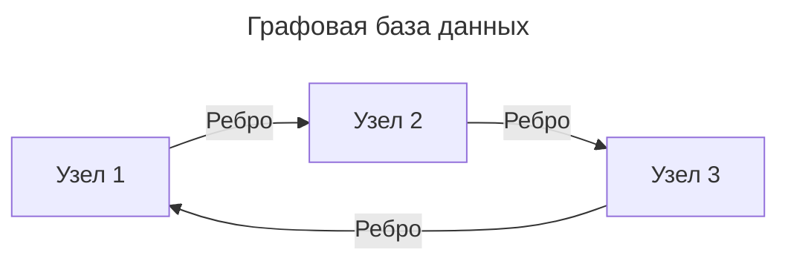
```mermaid
---
title: Графовая база данных
---
graph LR
  Node1[Узел 1] -->|Ребро| Node2[Узел 2]
  Node2 -->|Ребро| Node3[Узел 3]
  Node3 -->|Ребро| Node1[Узел 1]
```

**Особенности**

- Каждый узел — запись, рёбра — связи.
- Оптимизированы для представления сложных связей.
- Высокая производительность при работе с данными, имеющими множество связей.

**Практические сценарии**

- **Социальные сети.** Моделирование друзей, подписок, сообществ; поиск «друзей друзей», рекомендаций контактов.
- **Рекомендательные системы.** Анализ предпочтений пользователей для предложений товаров, фильмов, музыки (например, «покупатели также смотрели»).
- **Сетевые топологии.** Моделирование IT-инфраструктуры: серверы, маршрутизаторы, соединения; анализ уязвимостей.
- **Знания и семантические сети.** Построение графов знаний (например, Wikidata), где сущности связаны отношениями типа «является частью», «влияет на».

---

## Кэширование (Cache)

Кэш ускоряет загрузку, снижает нагрузку на БД и сглаживает пики трафика.

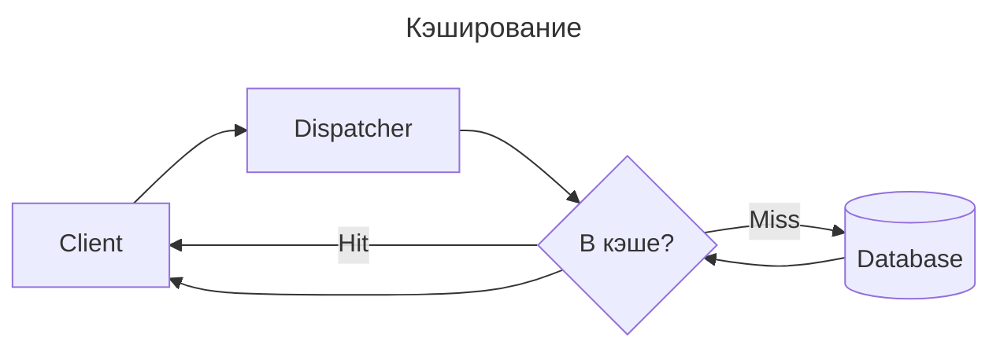
```mermaid
---
title: Кэширование
---
flowchart LR
  Client --> Dispatcher
  Dispatcher --> Cache{В кэше?}
  Cache -->|Hit| Client
  Cache -->|Miss| DB[(Database)]
  DB --> Cache
  Cache --> Client
```

### Виды кэша

| Уровень        | Примеры                  | Назначение                   |
| -------------- | ------------------------ | ---------------------------- |
| **Клиент**     | Browser, OS              | Повторные запросы без сети   |
| **CDN**        | Cloudflare, Akamai       | Статика ближе к пользователю |
| **Web-сервер** | Varnish, Nginx           | Кэш ответов без бэкенда      |
| **БД**         | Query cache, Buffer pool | Ускорение частых запросов    |
| **Приложение** | Redis, Memcached         | Объекты/сессии в RAM         |

## Кэширование запросов к БД

Хэш запроса → ключ, результат → значение. Проблемы: сложно удалить результат сложного запроса; изменение одной ячейки требует инвалидации всех кэшей, содержащих её.

## Кэширование объектов

Приложение само собирает данные из БД в объект. Если базовые данные меняются — объект удаляется из кэша. Позволяет асинхронную обработку.

Что кэшировать: пользовательские сессии, готовые веб-страницы, ленты активности, графы данных.

## Стратегии обновления кэша

### Cache-aside (Lazy Loading)

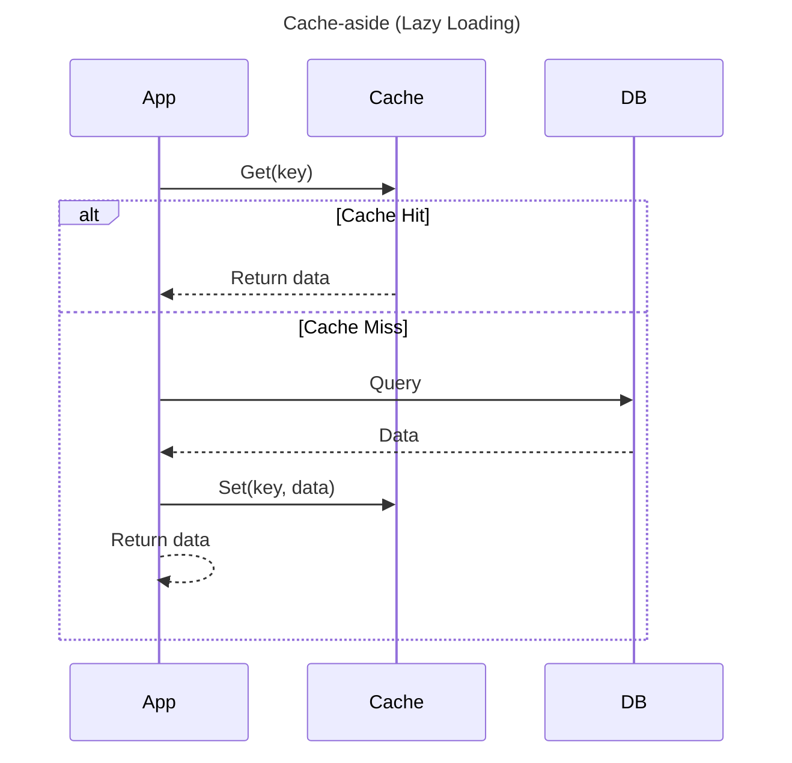
```mermaid
---
title: Cache-aside (Lazy Loading)
---
sequenceDiagram
  participant App
  participant Cache
  participant DB
  App->>Cache: Get(key)
  alt Cache Hit
    Cache-->>App: Return data
  else Cache Miss
    App->>DB: Query
    DB-->>App: Data
    App->>Cache: Set(key, data)
    App-->>App: Return data
  end
```

✅ Просто, кэшируется только запрошенное

❌ 3 обращения при промахе; риск устаревших данных (решение: TTL)

### Write-through

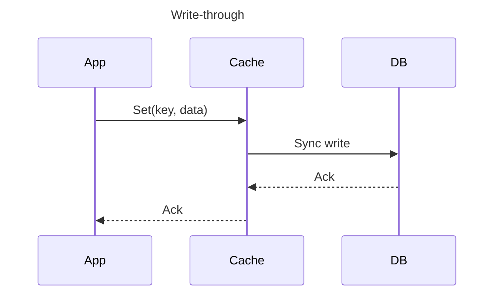
```mermaid
---
title: Write-through
---
sequenceDiagram
  participant App
  participant Cache
  participant DB
  App->>Cache: Set(key, data)
  Cache->>DB: Sync write
  DB-->>Cache: Ack
  Cache-->>App: Ack
```

✅ Данные в кэше актуальны

❌ Запись медленнее; новые узлы пустые до обновления

### Write-behind (Write-back)

```mermaid
---
title: Write-behind (Write-back)
---
sequenceDiagram
  participant App
  participant Cache
  participant DB
  App->>Cache: Set(key, data)
  Cache-->>App: Ack
  Cache->>DB: Async write (later)
```

✅ Быстрая запись

❌ Риск потери данных при сбое кэша; сложнее в реализации

### Refresh-ahead

```mermaid
---
title: Refresh-ahead
---
flowchart LR
  Access[Доступ к ключу] --> Predict{Прогноз повторного доступа?}
  Predict -->|Да| Refresh[Обновить до истечения TTL]
  Predict -->|Нет| Skip[Не обновлять]
  Refresh --> Cache[(Кэш)]
```

✅ Снижает задержку при точном прогнозе

❌ Неточный прогноз ухудшает производительность

> ⚠️ **Общие сложности**: инвалидация кэша, согласованность с БД, изменения в коде приложения.

## Недостатки кэширования

- Нужно поддерживать согласованность с источником истины (БД).
- Инвалидация кэша — сложная задача.
- Требуются изменения в приложении (добавление Redis/Memcached).

---

## Асинхронность (Asynchronism)

> Асинхронность (Asynchronism)

Асинхронные операции сокращают время ответа и выносят тяжёлую работу в фон.

**Недостатки асинхронности**

Простые вычисления и реальное время лучше делать синхронно — очереди добавляют задержки и сложность.

### Архитектура с очередями

```mermaid
---
title: Архитектура с очередями
---
flowchart LR
  Client --> App[Приложение]
  App --> Queue[Очередь<br/>RabbitMQ/Kafka/SQS]
  Queue --> Worker[Worker]
  Worker --> DB[(БД/Сервис)]
  Worker --> Notify[Уведомление клиента]
```

### Типы очередей

| Тип               | Инструменты          | Особенности                     |
| ----------------- | -------------------- | ------------------------------- |
| **Message Queue** | RabbitMQ, Redis, SQS | Доставка сообщений, decoupling  |
| **Task Queue**    | Celery, Sidekiq      | Выполнение задач с расписанием  |

Пример: твит мгновенно появляется в ленте, но рассылка подписчикам может занять время.

Инструменты: Redis (простой, но возможна потеря сообщений), RabbitMQ (популярный, требует AMQP), Amazon SQS (хостинг, возможны задержки и дублирование).

## Очереди задач (Task queues)

Принимают задачи с данными, выполняют, возвращают результат. Поддержка планирования. Celery (Python).

## Обратное давление (Back pressure)

Если очередь растёт, её размер может превысить память → замедление. Ограничение размера очереди и возврат клиенту статуса 503 (попробуй позже) помогает поддерживать пропускную способность. Клиент может повторять запросы с экспоненциальной задержкой.

```mermaid
---
title: Back Pressure (Обратное давление)
---
flowchart TD
  QueueSize{Размер очереди}
  QueueSize -->|< лимита| Accept[Принимать запросы]
  QueueSize -->|≥ лимита| Reject[HTTP 503 / Retry later]
  Reject --> Client[Клиент с exponential backoff]
```

✅ Предотвращает переполнение памяти и деградацию

✅ Сохраняет throughput для уже принятых задач

---

## Коммуникации (Communication)

### Уровни: HTTP → TCP/UDP → RPC/REST

#### HTTP-методы

| Метод    | Назначение           | Идемпотентный | Кэшируемый |
| -------- | -------------------- | ------------- | ---------- |
| `GET`    | Чтение               | ✅             | ✅          |
| `POST`   | Создание             | ❌             | ⚠️         |
| `PUT`    | Замена               | ✅             | ❌          |
| `PATCH`  | Частичное обновление | ❌             | ⚠️         |
| `DELETE` | Удаление             | ✅             | ❌          |

#### TCP vs UDP

```mermaid
---
title: TCP vs UDP
---
graph LR
  subgraph TCP
    T1[Гарантированная доставка]
    T2[Порядок пакетов]
    T3[Контроль перегрузок]
    T4[Медленнее, надёжнее]
  end
  subgraph UDP
    U1[Без гарантий доставки]
    U2[Нет порядка]
    U3[Нет congestion control]
    U4[Быстрее, для real-time]
  end
```

| Критерий | TCP | UDP |
|----------|-----|-----|
| **Когда использовать** | Веб, БД, файлы | VoIP, видео, игры |
| **Целостность данных** | Обязательна | Допустима потеря |
| **Задержка** | Вторична | Критична |

#### RPC (Remote Procedure Call)

```mermaid
---
title: RPC (Remote Procedure Call)
---
sequenceDiagram
  participant Client
  participant StubC as Client Stub
  participant Net as Network
  participant StubS as Server Stub
  participant Server
  Client->>StubC: Вызов функции
  StubC->>Net: Marshal(аргументы)
  Net->>StubS: Доставить
  StubS->>Server: Unmarshal + выполнить
  Server-->>StubS: Результат
  StubS-->>Net: Marshal(ответ)
  Net-->>StubC: Доставить
  StubC-->>Client: Вернуть результат
```

✅ Производительность, контроль, внутренний трафик

❌ Тесная связность, сложность отладки, меньше переиспользования

## REST

Архитектурный стиль: клиент действует над ресурсами, управляемыми сервером. Все взаимодействия stateless и кэшируемы. Четыре качества REST:

- Идентификация ресурсов (URI).
- Изменение через представления (глаголы HTTP).
- Самодостаточные сообщения об ошибках (статусы HTTP).
- HATEOAS (гиперссылки).

**Недостатки**: не всегда удобен для сложных иерархий (например, выборка обновлений за час по набору событий); ограниченный набор глаголов; множественные запросы для вложенных ресурсов; перегрузка ответов ненужными полями.

### Сравнение RPC и REST

| Операция | RPC | REST |
|----------|-----|------|
| Регистрация | POST /signup | POST /persons |
| Удаление | POST /resign { "personid": "1234" } | DELETE /persons/1234 |
| Чтение персоны | GET /readPerson?personid=1234 | GET /persons/1234 |
| Список вещей персоны | GET /readUsersItemsList?personid=1234 | GET /persons/1234/items |
| Добавить вещь | POST /addItemToUsersItemsList { "personid": "1234", "itemid": "456" } | POST /persons/1234/items { "itemid": "456" } |
| Обновить вещь | POST /modifyItem { "itemid": "456", "key": "value" } | PUT /items/456 { "key": "value" } |
| Удалить вещь | POST /removeItem { "itemid": "456" } | DELETE /items/456 |

---

## Безопасность (Security)

Краткий базовый минимум:

- Шифрование при передаче и на диске.
- Санация всех пользовательских входов (защита от XSS и SQL-инъекций).
- Использование параметризованных запросов.
- Принцип наименьших привилегий.
