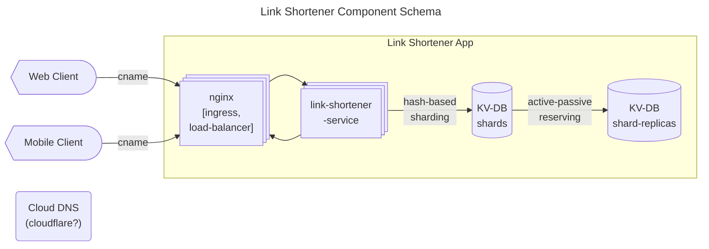

### Требования

#### уточненные требования
* DAU: `1000000`
* Av. write per user: 3
* Peak write request per user: 5
* Read to write request ratio per user: 10/1


#### ФТ
* POST /link, body {"long-link" : string}
	* если long-link - не ссылка –> error
	* если long-link - была добавлена ранее –> вернуть имеющийся результат
* GET /${short_link}

#### НФТ
* **Throughput**
	* RPS
		* $RPS(write) = DAU * a.w.p.u\ /\ 3600 * 24 = 60$
		* $RPS(read) = RPS(w) * r.t.w.r.r.p.u = 600$
		* $RPS(common) = RPS(w) + RPS(r) = 660$
	* Traffic
		* …
* Capacity
	* 1-link-size
		* $alphabet = 26+26+10 = 62$
		* $link\_length = 10$
			* links_limit = $8E17$
		* $one\_short\_link\_size = 10*1=10\ B$ 
		* $one\_long\_link\_size = 100*1=100\ B$ 
		* $one\_link\_junction\_size = 110\ B$ 
	* storage
		* links created per day: $5E6$
		* links created per year: $lkpd*365 ~= 2E9$
		* storage: $lcpy*oljs=2\ 000\ 000\ 000 * 110\ B=220\ GB\ per\ year$

### проектирование


### API

1. **добавить ссылку**
```bash
POST /link
	{"long_link" : string}

# RESPONSE
## 200, json
{
	"short_link": string,
	"long_link": string
}
## 400, problem-details
```
2. **получить ссылку**
```bash
GET /${short_link}
# RESPONSE
## 200, json
{
	"short_link": string,
	"long_link": string
}
## 400, problem-details
```
