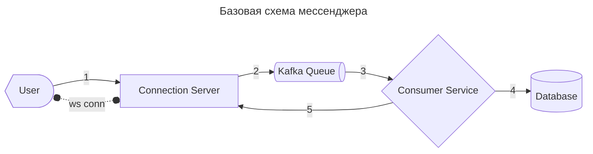
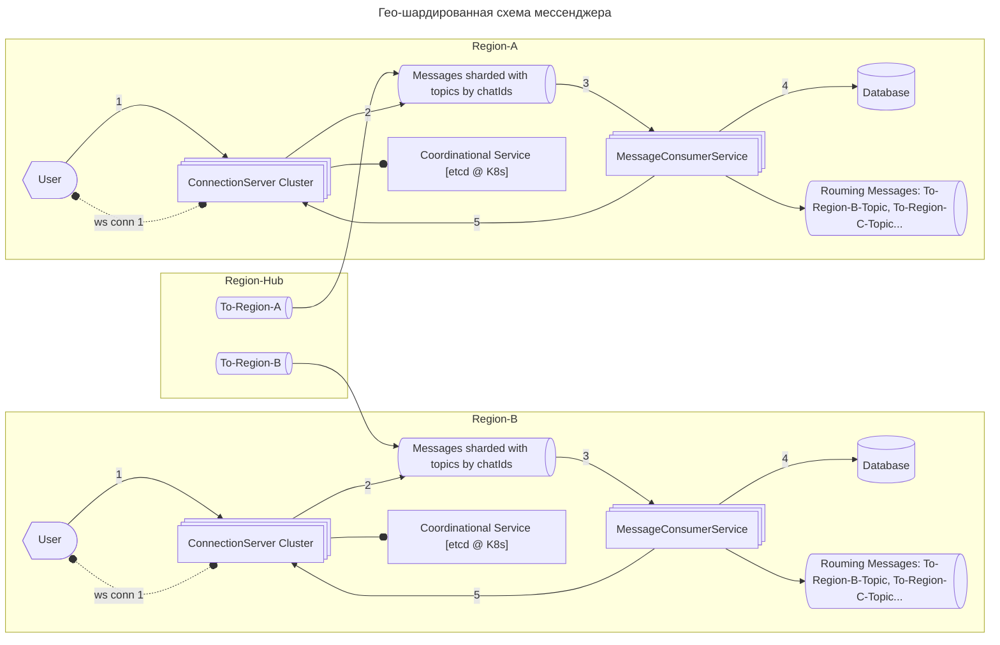

---
aliases:
  - Connection Server
  - Kafka
  - LoadBalancer
  - Messanger
  - Redis
  - WebSocket
  - мессенджер
  - чат
---

## Мессенджер

## Требования

### Уточнение параметров системы

**Исходные допущения**

| Параметр                        | Значение      | Комментарий                  |
| ------------------------------- | ------------- | ---------------------------- |
| **DAU** (Daily Active Users)    | 100 млн       | Активные пользователи в день |
| **Сообщений/пользователя/день** | 50            | Среднее, включая группы      |
| **Средний размер сообщения**    | 1 КБ          | Текст + метаданные           |
| **Медиа-контент**               | 10% сообщений | Фото/видео/файлы             |
| **Средний размер медиа**        | 500 КБ        | После сжатия                 |
| **Пиковый коэффициент**         | ×5            | Пик к среднему (вечер)       |

### ФТ
- создать чат
- добавитдь пользователя в чат
- удалить пользователя из чата
- отправить сообщение в чат
### НФТ
- **⚡ Throughput** – Расчёт пропускной способности
  - **RPS(write)**
    - Сообщений в секунду (среднее)
      - `100 млн пользователей × 50 сообщений / 86 400 сек ≈ 58 000 сообщений/сек`
    - Пиковая нагрузка (×5)
      - `58 000 × 5 ≈ 290 000 сообщений/сек (~300K RPS)`
  - **Traffic(write)**
    - Трафик текста (средний)
      - `58 000 сообщений/сек × 1 КБ ≈ 58 МБ/сек ≈ 464 Мбит/сек`
    - Трафик медиа (10% сообщений)
      - `58 000 × 10% × 500 КБ ≈ 2.9 ГБ/сек ≈ 23 Гбит/сек`
    - 💡 **Вывод**: медиа-трафик доминирует → выносим загрузку/скачивание в отдельный сервис + CDN.
- **💾 Capacity** – Расчёт хранилища
  - Текст сообщений в день
    - `100 млн × 50 сообщений × 1 КБ = 5 ТБ/день
      - → ~1.8 ПБ/год (только текст)`
  - Медиа в день (10% сообщений)
    - `100 млн × 5 сообщений × 500 КБ = 250 ТБ/день
      - → ~90 ПБ/год (медиа)

### Нефункциональные требования

- **Throughput (расчёт пропускной способности)**
    - **RPS (write)**
        - Сообщений в секунду (среднее): `100 млн пользователей × 50 сообщений / 86 400 сек ≈ 58 000 сообщений/сек`
        - Пиковая нагрузка (×5): `58 000 × 5 ≈ 290 000 сообщений/сек (~300K RPS)`
    - **Traffic (write)**
        - Трафик текста (средний): `58 000 сообщений/сек × 1 КБ ≈ 58 МБ/сек ≈ 464 Мбит/сек`
        - Трафик медиа (10% сообщений): `58 000 × 10% × 500 КБ ≈ 2.9 ГБ/сек ≈ 23 Гбит/сек`
        - **Вывод**: медиа-трафик доминирует → выносим загрузку/скачивание в отдельный сервис + CDN.
- **Capacity (расчёт хранилища)**
    - Текст сообщений в день: `100 млн × 50 сообщений × 1 КБ = 5 ТБ/день` → ~1.8 ПБ/год (только текст)
    - Медиа в день (10% сообщений): `100 млн × 5 сообщений × 500 КБ = 250 ТБ/день` → ~90 ПБ/год (медиа)

## Проектирование

**Базовый сценарий**

1. Пользователь отправляет сообщение: `sendMessage(chatID, text) --> Connection Server`
2. Сообщение сохраняется в Kafka
3. Consumer обрабатывает сообщение из Kafka
4. Сообщение сохраняется в базу:
    - Cassandra, т.к. безлидерная, более устойчивая база, адаптированная к асинхронным сценариям обработки.
    - В качестве генератора ID используем дату или офсет из Kafka. Офсет точнее, но следует учесть сценарий, когда упрёмся в лимит long (9E18). Вероятно, будем шардировать данные, где номер шарда добавит разрядность нумерации. Но этого, скорее всего, не придётся делать, т.к. запаса хватит на тысячи лет.
5. Рассылка по веб-сокетам: только после успешной записи в базу. Если после ретраев упали — вернуть отправителю отметку о том, что отправить не удалось.

**Масштабирование**

- Шардируем Kafka по `chatId`:
    - Проблема динамического масштабирования: при добавлении новой партиции один `chatId` может оказаться в разных партициях. Тогда Consumer должен слушать разные шарды, это снизит эффективность схемы.
    - Решение: заранее закладываем логику, по которой `chatId` однозначно отображается в `topicId`. Тем самым мы не будем зависеть от числа партиций, и система будет устойчивой к масштабированию Kafka.
- Масштабирование `Connection Server`:
    - Добавляем в схему `LoadBalancer`, который распределяет нагрузку между серверами подключений.
    - Добавляем в схему KV-хранилище `Redis`, где будут лежать сопоставления `userId -> connServerId`:
        - записи храним с TTL, если упадёт сервер;
        - `Connection Server` удаляет запись, если сервер упал;
        - `Consumer Service` находит `Connection Server` по записям в Redis.
        - Недостаток решения — дополнительная точка отказа в виде Redis.
            - Альтернатива: кастомное решение — кластер серверов перед `координационным сервисом`. Координатор знает, какие серверы подключений сейчас запущены. Все консьюмеры передают данные координационному серверу.
- Масштабирование по регионам:
    - Предполагаем, что большинство трафика крутится внутри одного региона.
    - Но иногда пользователь региона `A` может оказаться в чате региона `B`. Можно предложить два решения:
        - если таких ситуаций мало — пользователь подключается по `wss://` к двум регионам и получает сообщения из удалённого региона с приемлемой задержкой;
        - если таких ситуаций много — налаживаем пересылку сообщений между топиками Kafka во внешние регионы (`outgoing-topics`). Так пользователь получает внешние сообщения внутри своего региона, а каждое роуминговое сообщение отправляется во внешний регион всего один раз.
        - если регионов уже много и роуминговых пользователей много — горизонтальная связность «все-со-всеми» может стать источником избыточного трафика. Решение: hub-регион. У каждого региона есть свой топик, из которого он копирует сообщения в свою локальную Kafka. При отправке роумингового сообщения регион передаёт его в hub-регион пользователя-иностранца, а хаб понимает, в какой топик положить сообщение.

