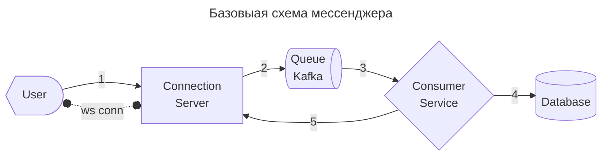
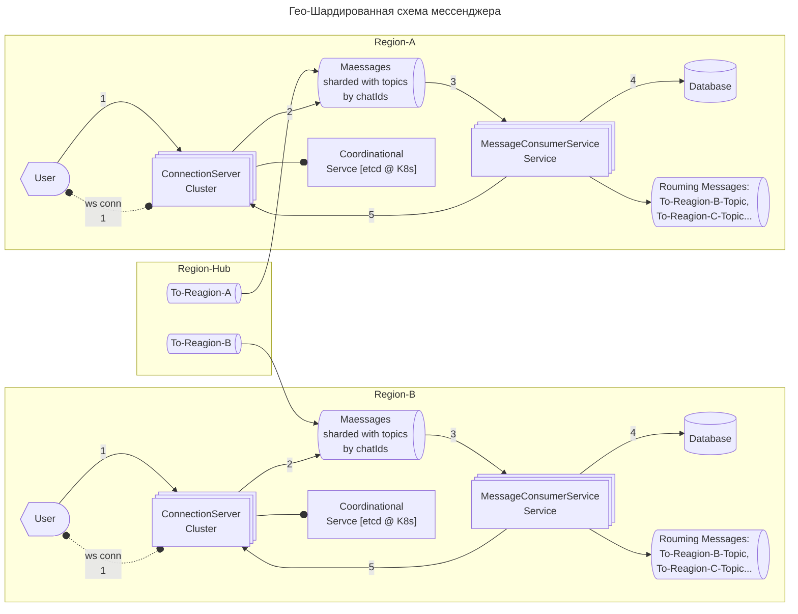

# требования

## уточнение параметров системы
> 🔢 1. Исходные допущения (вводим на собеседовании)

| Параметр                        | Значение      | Комментарий                  |
| ------------------------------- | ------------- | ---------------------------- |
| **DAU** (Daily Active Users)    | 100 млн       | Активные пользователи в день |
| **Сообщений/пользователя/день** | 50            | Среднее, включая группы      |
| **Средний размер сообщения**    | 1 КБ          | Текст + метаданные           |
| **Медиа-контент**               | 10% сообщений | Фото/видео/файлы             |
| **Средний размер медиа**        | 500 КБ        | После сжатия                 |
| **Пиковый коэффициент**         | ×5            | Пик к среднему (вечер)       |
## ФТ
* создать чат
* добавитдь пользователя в чат
* удалить пользователя из чата
* отправить сообщение в чат
## НФТ
* **⚡ Throughput** – Расчёт пропускной способности
	* **RPS(write)**
		* Сообщений в секунду (среднее)
			* `100 млн пользователей × 50 сообщений / 86 400 сек ≈ 58 000 сообщений/сек`
		* Пиковая нагрузка (×5)
			* `58 000 × 5 ≈ 290 000 сообщений/сек (~300K RPS)`
	* **Traffic(write)**
		* Трафик текста (средний)
			* `58 000 сообщений/сек × 1 КБ ≈ 58 МБ/сек ≈ 464 Мбит/сек`
		* Трафик медиа (10% сообщений)
			* `58 000 × 10% × 500 КБ ≈ 2.9 ГБ/сек ≈ 23 Гбит/сек`
		* 💡 **Вывод**: медиа-трафик доминирует → выносим загрузку/скачивание в отдельный сервис + CDN.
* **💾 Capacity** – Расчёт хранилища
	* Текст сообщений в день
		* `100 млн × 50 сообщений × 1 КБ = 5 ТБ/день
			* → ~1.8 ПБ/год (только текст)`
	* Медиа в день (10% сообщений)
		* `100 млн × 5 сообщений × 500 КБ = 250 ТБ/день
			* → ~90 ПБ/год (медиа)

# проектирование

**Базовый сценарий**
1. Пользователь отправляет сообщденрие
	1. `sendMessage(chatID, text) --> Connection Server`
2. Сообщение сохраняется в kafka
3. Consumer обработывает сообщение из kafka
4. сохраняем сообщение в базу
	1. Cassanda, т.к. безлидерная, более устойчивая база, адоптированная к асихнронным сценариям обработки.
	2. В качестве генератора ID можно использовать дату или оффсет из кафки. 
		* Оффсет точнее, но следует обработать сценарии, когда упремся в limit по long (9E18). Вероятно будем шардировать данные, где номер шарда добавит нам разрядность в нумерацию. Но это не придется делать, т.к. число сообщений может затянуться на тычячу лет.
5. рассылка по веб-сокетам
	1. рассылка по веб сокетам, только после успешной записи в базу. Если по ретраем упали - вернуть отправителю отметку о том что отправить не удалось.

**Масштабирование**
* Шардируем кафку по `chatId`
	* пробема динамического масштабирования – при добавлении новой партиции 1 `chatId` может оказаться в разных партициях. Тогда Consumer должен будет слушать разные шарды, это снизит эффективность схемы.
	* решение – заранее закладываем логику по которой `chatId` однозначно отображается в `topicId`. Тем самым мы не будем зависить от числа партиций и система будет устойчивой к масшрабированию кафки.
* Масштабирование `Connection-Server`
	* Добавляем в схему `LoadBalancer`, который распределяет нагрузку между серверами подключений
	* Добавляем в схему KV-хранилище, `Redis`, где будут лежать сопоставления `userId--connServerId`
		* записи храним с TTL если упадет сервер
		* `Connection-Server` удаляет запись, если сервер упал
		* `Consumer-Service` находит `Connection-Server` по записям в `Redis`
		* недостаток такого решения – дополнительная точка отказа форме редис.
			* Как решение можно предлоижить сценарий, с тем, чтобы сделать кастомное решение представляющее собой кластер серверов, перед которрыми будет `координационный сервис`. Координатор знает, какие серервера подключений сейчас запущены. Все конюмеры передают данные координационному серверу.
* Масштабируем по регионам
	* предполагаем, что большинство траффика крутится вынутри 1 региона.
	* но иногда бывает так, пользователь региона `A` может оказаться в чате региона `B`. Можно предложить 2 решения:
		* если таких ситуаций довольно мало, то пользователь просто подключатся по `wss://` к 2 регионам, и получает сообщения из удаленного региона с приемлемой задержкой
		* если таких ситуаций много, что можем наладить пересылку сообщений меду допиками кафки в топики с внешними регионами (`outgoing-topics`). Так пользователь будет получать внешние сообщения внутри своего региона. Таким образом каждое роуминговое сообщение надо будем отправить во внешний регион всего 1 раз.
		* если регионов уже много и роуминговый пользователей много, горизонтальная связанность регионов всех-со-всеми может стать источником избыточного трафика. Решение: hub-регион. У каждого региона есть свой топик с которого он копирует сообщения в свою локальную кафку. При отправке роуменгового сообщения, все регион передает в хаб регион пользователя - иностранца, хаб понимает в какой топик следует положить сообщение.

