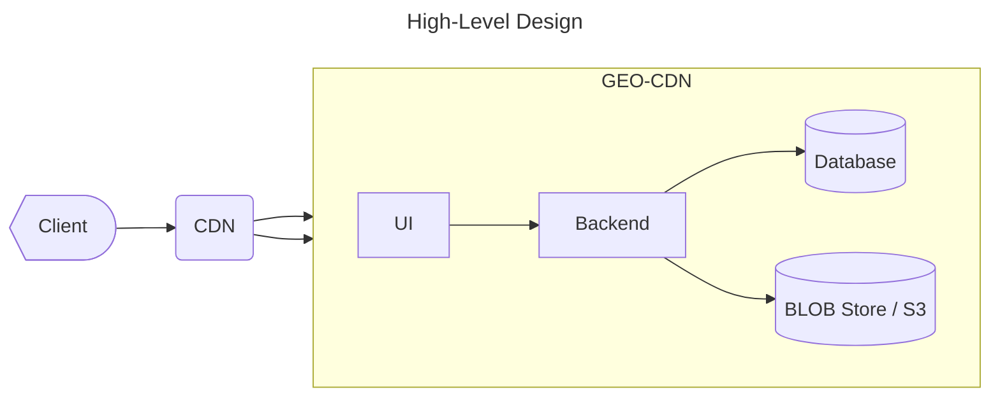
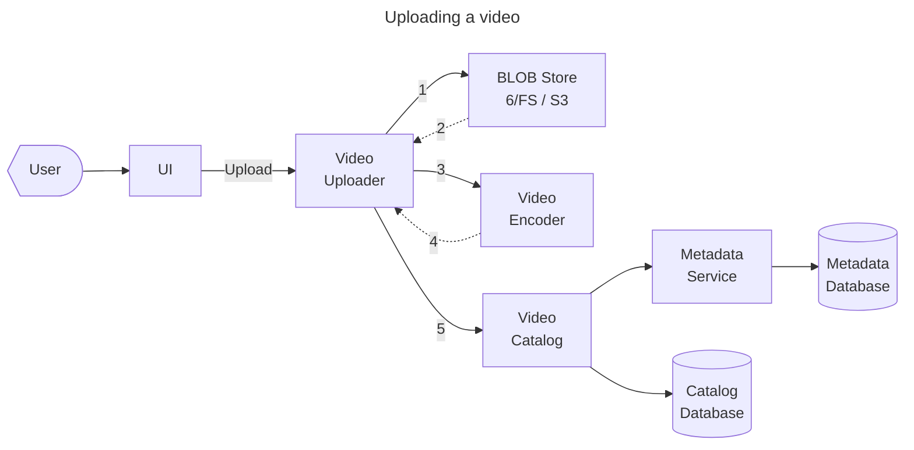
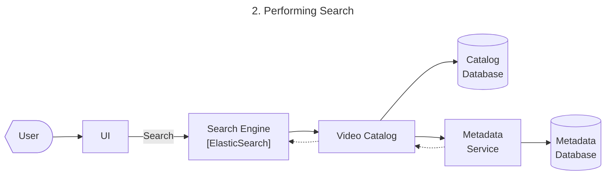
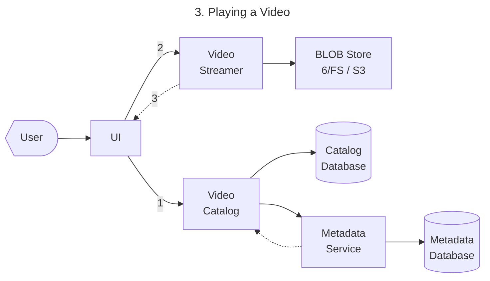

# требования

## уточнение параметров системы
Выяснить
* Какие ограничения на длину, размер видео?
* Есть ли ограничения на форматы видео, надо ли про это думать?
* Сколько пользователей, сколько видео загружают?
* Какое соотношение к количество загрузок, количество чтений?
* Надо ли проектировать систему 
	* комментариев
	* рекомендательную
Фиксировать
* 100 млн пользователей
* ср. размер видео 100 МБ, 10 минут
* 100 млн просмотров / день
* 1 млн загрузок / день
* пиковая нагрузка 10 млн просмотров/сек

## ФТ
* система загрузки видео
* поиск видео
* просмотры видео
## НФТ
* Throughput
	* **RPS(read)**
		* 100 млн просмотров / день
			* 1 просмотр ~ 1 запрос
		* `100Е6 / 86400 сек = 1200 RPS` 
			* расчет по средней а не пиковой нагр
	* **Traffic(read)**
		* `100 МB ~ * 8 * 100 000 000 B`
		* `1200 RPS * 100 B = 120 Tbps`
* Capacity
	* метаданные 1 видео = 1 КБ
	* хранение входящего траффика
	* в день по входному трафику: $(100\ 000 + 1)КБ * 1Е6 = 100 ТБ/день$ 
	* в день с учетом резервизования `3`:  $300 ТБ/день$
	* в год: $365000\ ТБ = 1200\ PB/год = 1\ EB/год$
* CPU-time
	* декодирование видео : $300\ 000\ Ггц*сек$
		* каждое видео в декодируется в 4 формата => 
			* $4E6*10\ мин*60\ сек*30\ FPS * 3\ Ггц / 86400 = 2E10\ = 20 млрд\ Ггц*сек/день$
			* $\ ~\ 300\ 000\ Ггц*сек$

# проектирование

диаграмма контеста

* UI: микрофронтенды через федерацию сервисов, например на основе React
* BackEnd
	* сервис загрузки видео
	* сервис метаданных
	* сервис пользовательских данных
	* сервис перекодирования видео
	* сервис просмотра
* Database хранит
	* метаданные видео – KV, напр. 
	* пользовательские данные – реляционное хранилище, т.к. tx.
* S3 – объектное хранилищец для blob
	* miniO + AWS Glue (метаданные)

диаграмма компонентов Backend

```mermaid
flowchart LR
 subgraph s1["API"]
    direction LR
    Upload["Upload API"]
    Search["Search API"]
    Streaming["Streaming API"]
  end
 subgraph s2["Micoservices"]
    direction LR
    User["UserService"]
    VideoUploader["VideoUploader"]
    VideoEncoder["VideoEncoder"]
    VideoStreamer["VideoStreamer"]
    SearchEngine["SearchEngine"]
    MetadataService["MetadataService"]
    VideoCatalog["VideoCatalog"]
  end

  s1 --> s2

    classDef red fill:#e74c3c,stroke:#c0392b,color:white
    classDef text fill:#333,stroke:none
```

**флоу загрузки видео**

 
 * **Video Catalog** Database хранит данные для поиска видео:
	 * название, описание, тэги, категорию видео, 
 * **Metadata** Database хранит данные для поиска информацию о доступных форматах, и ссылки для просмоотра

**флоу поиска видео**

 * Elasticsearch
	- распределённая поисковая и аналитическая база данных в реальном времени.

**флоу просмотра видео**
