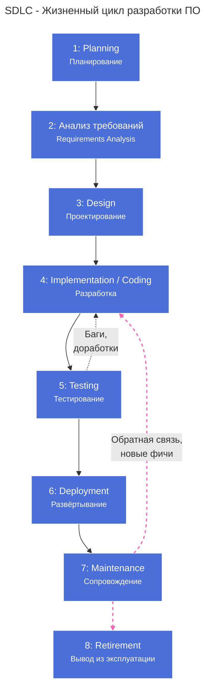

---
aliases:
  - SDLC
  - Software Development Life Cycle
---
Конечно! **SDLC** — это фундаментальная концепция в разработке программного обеспечения.

---

## 📌 Что такое SDLC?

**SDLC** (**Software Development Life Cycle** — **Жизненный цикл разработки программного обеспечения**) — это **структурированный процесс**, который описывает все этапы создания ПО: от первоначальной идеи до вывода из эксплуатации.

> 💡 Цель SDLC — **создавать качественное ПО предсказуемо, эффективно и с контролем затрат**.

---

## 🔄 Основные этапы SDLC

Хотя существуют разные модели (Waterfall, Agile, DevOps), базовые фазы остаются неизменными:

### 1. **Планирование (Planning)**
- Определение целей проекта
- Анализ требований заказчика
- Оценка ресурсов, сроков, рисков
- Выбор методологии (Agile, Waterfall и др.)

> 🔍 Результат: **Техническое задание (ТЗ)**, **дорожная карта**

---

### 2. **Анализ требований (Requirements Analysis)**
- Сбор функциональных и нефункциональных требований
- Взаимодействие с заинтересованными сторонами (stakeholders)
- Документирование требований (SRS — Software Requirements Specification)

> 🔍 Результат: **Спецификация требований**

---

### 3. **Проектирование (Design)**
- Архитектурное проектирование (высокоуровневое)
- Детальное проектирование (низкоуровневое)
- Выбор технологий, баз данных, API
- Создание диаграмм (UML, C4, ERD)

> 🔍 Результат: **Архитектурный документ**, **макеты интерфейсов**

---

### 4. **Реализация / Разработка (Implementation / Coding)**
- Написание кода
- Code review
- Модульное тестирование (unit tests)
- Интеграция компонентов

> 🔍 Результат: **Рабочее ПО**, **исходный код**

---

### 5. **Тестирование (Testing)**
- Функциональное тестирование
- Тестирование производительности, безопасности, совместимости
- Исправление багов
- Подтверждение соответствия требованиям

> 🔍 Результат: **Отчёт о тестировании**, **стабильная версия ПО**

---

### 6. **Развёртывание (Deployment)**
- Установка ПО в production-среду
- Миграция данных
- Обучение пользователей
- Поддержка первых дней эксплуатации

> 🔍 Результат: **ПО в продакшене**

---

### 7. **Сопровождение и поддержка (Maintenance)**
- Исправление ошибок
- Обновления и патчи
- Добавление новых функций
- Мониторинг и оптимизация

> 🔁 Этот этап может длиться годами.

---

### 8. **Вывод из эксплуатации (Retirement)** *(не всегда выделяется отдельно)*
- Замена устаревшей системы
- Миграция данных
- Архивирование
- Уведомление пользователей

---

## 🧩 Модели SDLC

| Модель | Особенности | Когда использовать |
|--------|-------------|-------------------|
| **Waterfall** | Последовательные этапы, строгая документация | Чёткие требования, регулируемые отрасли (медицина, авиация) |
| **Agile** | Итеративная разработка, гибкость, частые релизы | Неопределённые требования, стартапы, digital-продукты |
| **DevOps** | Непрерывная интеграция и доставка (CI/CD) | High-load системы, облачные сервисы |
| **V-Model** | Каждому этапу разработки соответствует этап тестирования | Системы с высокими требованиями к надёжности |

---

## 🛡️ Современный SDLC = Secure SDLC (SSDLC)

В условиях роста киберугроз в SDLC интегрируют **безопасность на всех этапах**:

- **Планирование**: threat modeling
- **Проектирование**: secure architecture
- **Разработка**: SAST, code review
- **Тестирование**: DAST, penetration testing
- **Эксплуатация**: мониторинг уязвимостей

> 🔐 Принцип: **«Security by design»** и **«Shift left security»**

---

## 🎯 Зачем нужен SDLC?

- **Снижает риски** провала проекта
- **Повышает качество** ПО
- **Упрощает управление** командой и сроками
- **Обеспечивает предсказуемость** бюджета
- **Упрощает поддержку** и развитие

---

## 💡 Заключение

> **SDLC — это "дорожная карта" для создания ПО.**  
> Без него разработка превращается в хаотичный процесс с высоким риском перерасхода бюджета, срывов сроков и низкого качества.

Современные подходы (Agile + DevOps + Security) делают SDLC **гибким, автоматизированным и безопасным**.

---

Хочешь пример **SDLC в стартапе** или **чек-лист для каждого этапа**? Напиши — подготовлю! 😊