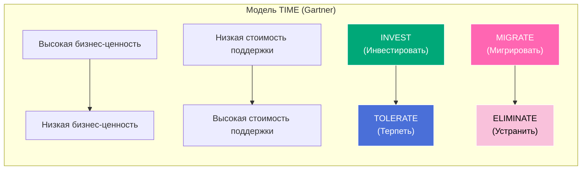
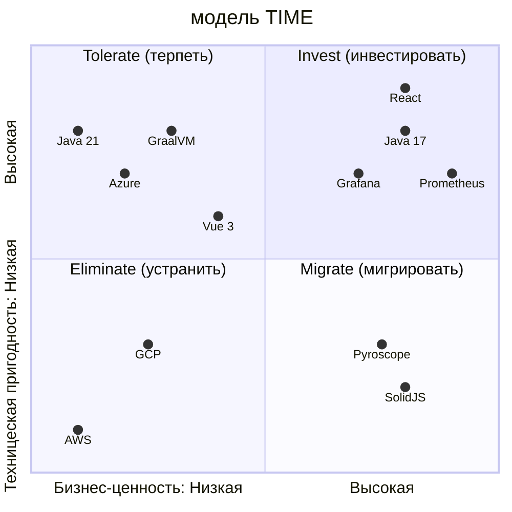

---
aliases:
  - TIME
---
Конечно! **TIME** — это стратегическая модель от аналитической компании **Gartner**, предназначенная для **оценки и управления техническим долгом ([[Technical Debt]])** в ИТ-организациях.

> 💡 Аббревиатура **TIME** расшифровывается как:  
> **T**olerate (Терпеть)  
> **I**nvest (Инвестировать)  
> **M**igrate (Мигрировать)  
> **E**liminate (Устранить)

---

## 🎯 Цель модели TIME

Помочь компаниям **принимать осознанные решения** о том, **как поступать с устаревшими или проблемными системами**, вместо того чтобы слепо «переписывать всё» или «игнорировать проблемы».

Модель классифицирует каждый компонент ИТ-ландшафта по двум осям:

| Ось | Описание |
|-----|----------|
| **Стоимость поддержки** | Насколько дорого/сложно поддерживать систему? |
| **Бизнес-ценность** | Насколько система важна для бизнеса? |

На основе этого — выбирается одна из четырёх стратегий (**TIME**).

---

## 🧩 Четыре стратегии TIME

### 1. **Tolerate (Терпеть / Принять)**
- **Когда**: Система **низкой бизнес-ценности**, но **дешёвая в поддержке**.
- **Что делать**: Оставить как есть, не тратить ресурсы на улучшение.
- **Пример**: Внутренний скрипт для экспорта отчётов, который работает стабильно.

> ⚠️ Не трогать, пока не станет проблемой.

---

### 2. **Invest (Инвестировать)**
- **Когда**: Система **высокой бизнес-ценности**, даже если **дорогая в поддержке**.
- **Что делать**: Инвестировать в модернизацию, рефакторинг, автоматизацию.
- **Пример**: CRM-система, через которую проходят все продажи.

> 💰 Это ваш «золотой гусь» — улучшайте его!

---

### 3. **Migrate (Мигрировать)**
- **Когда**: Система **высокой бизнес-ценности**, но **слишком дорогая/рискованная в поддержке**.
- **Что делать**: Перенести функциональность в более современную платформу.
- **Пример**: Устаревшее mainframe-приложение → облачный микросервис.

> 🔄 Заменить, а не чинить.

---

### 4. **Eliminate (Устранить)**
- **Когда**: Система **низкой бизнес-ценности** и **дорогая в поддержке**.
- **Что делать**: Полностью выключить или заменить минимальным решением.
- **Пример**: Дублирующий инструмент, который никто не использует.

> 🗑️ Избавляйтесь без сожалений.

---

## 📊 Визуализация модели TIME

ss

> 🔍 **Оси**:  
> - Горизонталь: **Бизнес-ценность** (слева → низкая, справа → высокая)  
> - Вертикаль: **Стоимость поддержки** (снизу → низкая, сверху → высокая)

---

## 💡 Как применять модель TIME?

1. **Составьте инвентарь** всех систем/сервисов.
2. **Оцените** каждую по двум критериям:
   - Бизнес-ценность (1–5)
   - Стоимость поддержки (1–5)
3. **Нанесите на матрицу TIME**.
4. **Примите решение** по каждой системе:
   - Инвестировать?
   - Мигрировать?
   - Удалить?

> ✅ Результат: **стратегический план модернизации ИТ-ландшафта**.

---

## 🆚 TIME vs другие модели

| Модель | Фокус |
|--------|------|
| **TIME (Gartner)** | Технический долг + бизнес-ценность |
| **ICE** (Impact, Confidence, Ease) | Приоритизация задач |
| **MoSCoW** | Классификация требований |
| **SWOT** | Стратегический анализ |

> 💡 TIME — **единственная модель**, которая явно связывает **технические решения** с **бизнес-ценностью**.

---

## ⚠️ Важные нюансы

- **Бизнес-ценность ≠ прибыль**. Это может быть соответствие регуляторам, репутационный риск, стратегическое значение.
- **Стоимость поддержки** включает:  
  - Затраты на лицензии  
  - Время инженеров  
  - Риски сбоев  
  - Сложность масштабирования

---

## 🎯 Итог

> **Модель TIME — это "дорожная карта" для борьбы с техническим долгом**.  
> Она помогает ответить на главный вопрос:  
> **«Во что инвестировать, а от чего избавиться?»**

Без такой модели компании часто:
- Тратят миллионы на поддержку никому не нужных систем (**Eliminate → Tolerate**)
- Игнорируют критически важные, но "грязные" сервисы (**Invest → Ignore**)

---

Хочешь шаблон **матрицы TIME в Excel** или пример **оценки системы по критериям**? Напиши — подготовлю! 😊