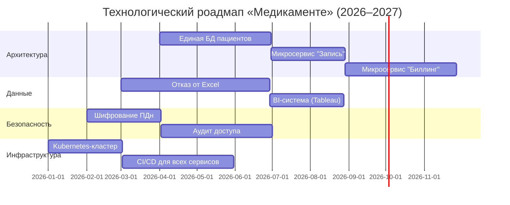
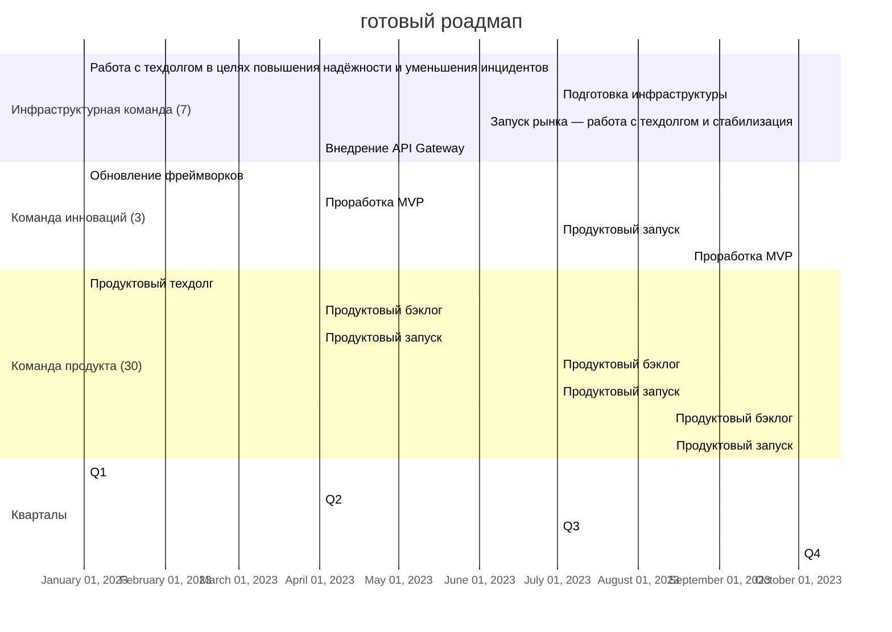

---
aliases:
  - Technology Roadmap
  - технологический роадмап
  - Roadmap
---
Конечно!

---

## **Что такое технологический роадмап (Technology Roadmap) в контексте управления технологическим ландшафтом?**

**Технологический роадмап** — это **стратегический план**, который описывает, **как организация будет развивать свою технологическую базу во времени**, чтобы поддерживать бизнес-цели, устранять устаревшие компоненты, внедрять инновации и управлять рисками.

Он отвечает на ключевые вопросы:
- **Куда мы движемся?**  
- **Какие технологии нам нужны?**  
- **Когда и в каком порядке их внедрять?**  
- **Какие зависимости и риски существуют?**

---

## **Чем отличается от Технического радара?**

| Инструмент | Фокус | Временной горизонт | Цель |
|-----------|-------|---------------------|------|
| **Технический радар** | **Что использовать** (оценка технологий) | Текущий момент | Классификация: Adopt/Trial/Assess/Hold |
| **Технологический роадмап** | **Как и когда менять** (эволюция ландшафта) | 6–36 месяцев | Планирование переходов, миграций, модернизаций |

> 💡 **Радар — это карта. Роадмап — это маршрут по этой карте.**

---

## **Основные компоненты технологического роадмапа**

### 1. **Цели и драйверы изменений**
- Бизнес-требования (новые продукты, масштабирование)
- Технические причины (устаревание, security debt, производительность)
- Регуляторные требования (GDPR, HIPAA, PCI DSS)

### 2. **Текущее состояние (As-Is)**
- Архитектурная диаграмма текущего ландшафта
- Список устаревших систем (legacy), технического долга
- Узкие места (например, монолит, Excel-учёт)

### 3. **Целевое состояние (To-Be)**
- Желаемая архитектура (микросервисы, облако, event-driven)
- Ключевые технологии (Kubernetes, Kafka, Snowflake и т.д.)
- Принципы: отказоустойчивость, безопасность, observability

### 4. **Этапы эволюции (дорожные карты по направлениям)**
Обычно разбивается на **дорожки (tracks)**:

| Дорожка | Примеры инициатив |
|--------|------------------|
| **Архитектура** | Миграция с монолита → микросервисы |
| **Данные** | Переход от Excel → централизованное хранилище + BI |
| **Безопасность** | Внедрение RBAC, шифрования, DLP |
| **Инфраструктура** | Переход на Kubernetes, CI/CD, IaC |
| **Наблюдаемость** | Внедрение логирования, метрик, трассировки |

### 5. **Временные вехи (milestones)**
- Q2 2026: Запуск единой БД пациентов  
- Q3 2026: Миграция биллинга на микросервис  
- Q1 2027: Полный отказ от Excel в пользу Patient Portal

### 6. **Зависимости и риски**
- «Миграция лаборатории невозможна без единой системы идентификации пациентов»
- «Требуется обучение команды до запуска Kubernetes»

---

## **Пример: Роадмап для «Медикаменте»**

Пример 2: более канонический

---

## **Зачем нужен технологический роадмап?**

### ✅ **1. Связывает бизнес и ИТ**
- Показывает, **как технологии поддерживают рост**, открытие филиалов, новые услуги.

### ✅ **2. Управляет сложностью**
- Разбивает гигантскую задачу («переписать всё») на **управляемые этапы**.

### ✅ **3. Обеспечивает приоритизацию**
- Помогает ответить: **что делать первым?**  
  → Например, сначала — единая БД, потом — микросервисы.

### ✅ **4. Упрощает коммуникацию**
- Стейкхолдеры (руководство, инвесторы, команды) видят **единый план развития**.

### ✅ **5. Снижает риски**
- Позволяет **планировать откаты**, тестировать на пилотах, избегать «Big Bang».

---

## **Как создать эффективный роадмап?**

1. **Начните с бизнес-целей** (не с технологий!).
2. **Оцените текущий ландшафт** (проведите аудит).
3. **Определите ключевые инициативы** (максимум 5–7 за год).
4. **Установите реалистичные сроки** (с учётом ресурсов и зависимостей).
5. **Сделайте его живым документом** — обновляйте каждые 3–6 месяцев.

> ⚠️ **Не делайте роадмап на 5 лет вперёд** — мир меняется слишком быстро.

---

## **Итог**

> **Технологический роадмап — это мост между сегодняшним хаосом и завтрашней стабильной архитектурой.**

Он превращает абстрактные цели в **конкретные шаги**, а технические решения — в **бизнес-ценность**.

> 💬 _«A roadmap is not a promise. It’s a plan to learn, adapt, and deliver value.»_

---

📌 **Совет**: Используйте роадмап совместно с **Техническим радаром** — так вы будете знать не только **куда идти**, но и **на чём ехать**.