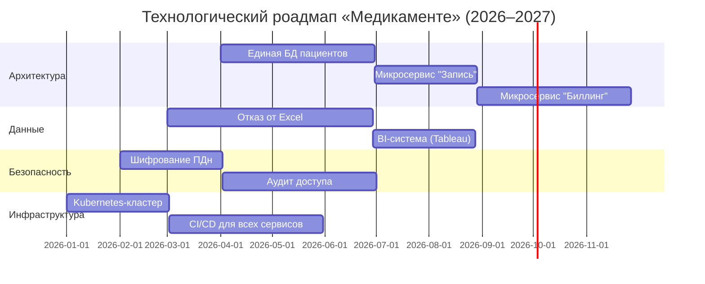
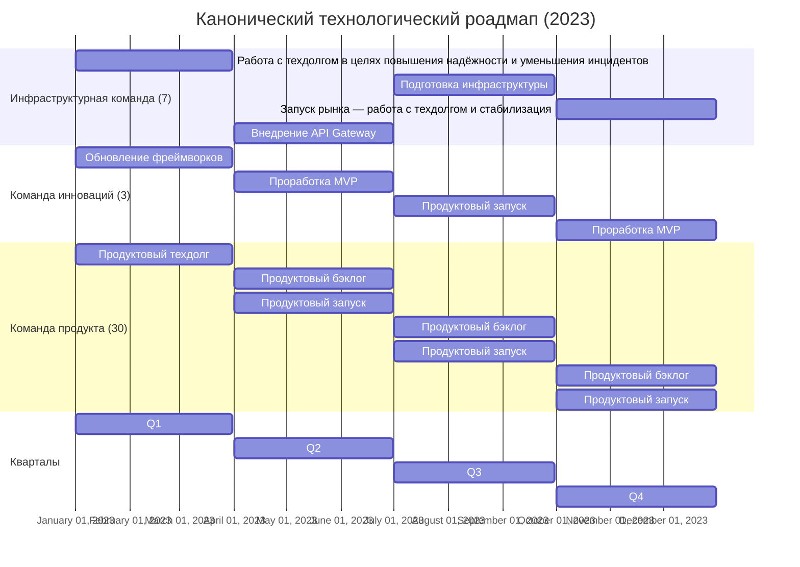

---
aliases:
  - Roadmap
  - Technical Radar
  - Technology Roadmap
  - Технический радар
  - технологический роадмап
---

## Технологический роадмап: стратегический план развития

**Технологический роадмап** — это **стратегический план**, который описывает, **как организация будет развивать свою технологическую базу во времени**, чтобы поддерживать бизнес-цели, устранять устаревшие компоненты, внедрять инновации и управлять рисками.

Он отвечает на ключевые вопросы:

- **Куда движется организация?**
- **Какие технологии нужны?**
- **Когда и в каком порядке их внедрять?**
- **Какие зависимости и риски существуют?**

---

## Отличие от технического радара

| Инструмент | Фокус | Временной горизонт | Цель |
|-----------|-------|---------------------|------|
| **Технический радар** | **Что использовать** (оценка технологий) | Текущий момент | Классификация: Adopt/Trial/Assess/Hold |
| **Технологический роадмап** | **Как и когда менять** (эволюция ландшафта) | 6–36 месяцев | Планирование переходов, миграций, модернизаций |

> 💡 **Радар — это карта. Роадмап — это маршрут по этой карте.**

---

## Компоненты технологического роадмапа

### Цели и драйверы изменений

- Бизнес-требования (новые продукты, масштабирование);
- технические причины (устаревание, security debt, производительность);
- регуляторные требования (GDPR, HIPAA, PCI DSS).

### Текущее состояние (As-Is)

- Архитектурная диаграмма текущего ландшафта;
- список устаревших систем (legacy), технического долга;
- узкие места (например, [[microservice|монолит]], Excel-учёт).

### Целевое состояние (To-Be)

- Желаемая архитектура (микросервисы, облако, event-driven);
- ключевые технологии (Kubernetes, Kafka, Snowflake и т.д.);
- принципы: отказоустойчивость, безопасность, observability.

### Этапы эволюции (дорожные карты по направлениям)

Обычно разбивается на **дорожки (tracks)**:

| Дорожка | Примеры инициатив |
|--------|------------------|
| **Архитектура** | Миграция с монолита → микросервисы |
| **Данные** | Переход от Excel → централизованное хранилище + BI |
| **Безопасность** | Внедрение RBAC, шифрования, DLP |
| **Инфраструктура** | Переход на Kubernetes, CI/CD, IaC |
| **Наблюдаемость** | Внедрение логирования, метрик, трассировки |

### Временные вехи (milestones)

- Q2 2026: запуск единой БД пациентов;
- Q3 2026: миграция биллинга на микросервис;
- Q1 2027: полный отказ от Excel в пользу Patient Portal.

### Зависимости и риски

- «Миграция лаборатории невозможна без единой системы идентификации пациентов»;
- «Требуется обучение команды до запуска Kubernetes».

---

## Пример: роадмап для «Медикаменте»

**Более канонический вариант (gantt с `axisFormat`):**

---

## Преимущества технологического роадмапа

### Связь бизнеса и ИТ

- Показывает, **как технологии поддерживают рост**, открытие филиалов, новые услуги.

### Управление сложностью

- Разбивает гигантскую задачу («переписать всё») на **управляемые этапы**.

### Приоритизация

- Помогает ответить: **что делать первым?**
  → Например, сначала — единая БД, потом — микросервисы.

### Коммуникация

- Стейкхолдеры (руководство, инвесторы, команды) видят **единый план развития**.

### Снижение рисков

- Позволяет **планировать откаты**, тестировать на пилотах, избегать «Big Bang».

---

## Создание эффективного роадмапа

1. **Начните с бизнес-целей** (не с технологий!).
2. **Оцените текущий ландшафт** (проведите аудит).
3. **Определите ключевые инициативы** (максимум 5–7 за год).
4. **Установите реалистичные сроки** (с учётом ресурсов и зависимостей).
5. **Сделайте его живым документом** — обновляйте каждые 3–6 месяцев.

> ⚠️ **Не делайте роадмап на 5 лет вперёд** — мир меняется слишком быстро.

---

**Итог**

> **Технологический роадмап — это мост между сегодняшним хаосом и завтрашней стабильной архитектурой.**

Он превращает абстрактные цели в **конкретные шаги**, а технические решения — в **бизнес-ценность**.

> 💬 _«A roadmap is not a promise. It’s a plan to learn, adapt, and deliver value.»_

**Совет**: используйте роадмап совместно с **техническим радаром** — тогда будет известно не только **куда идти**, но и **на чём ехать**.
