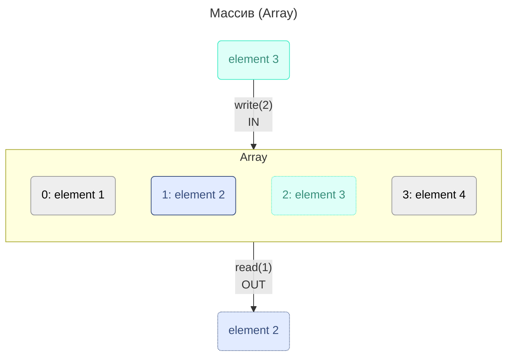
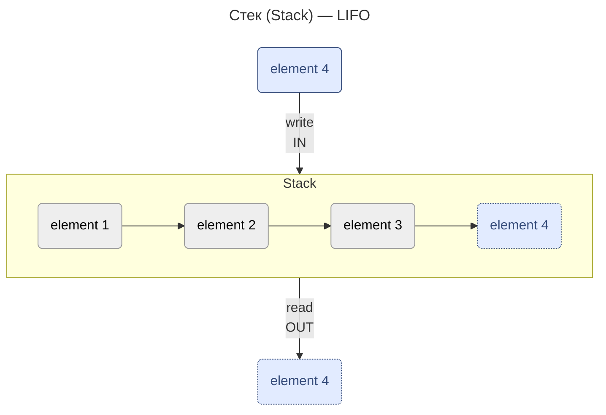
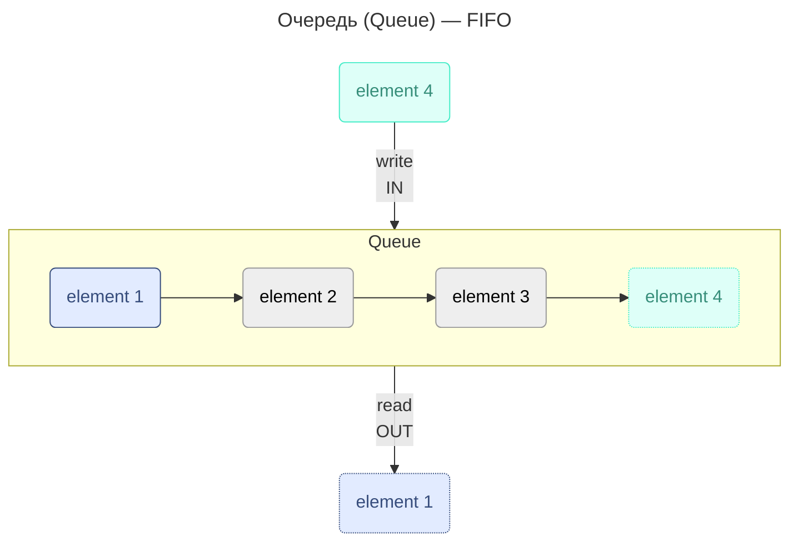
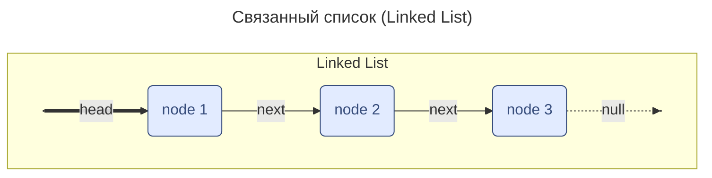
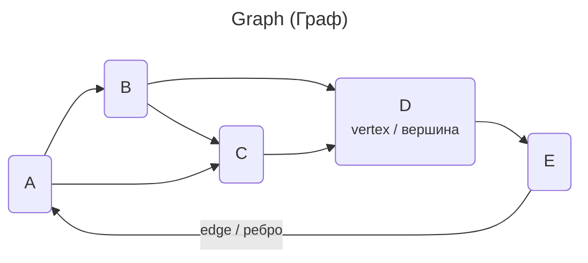
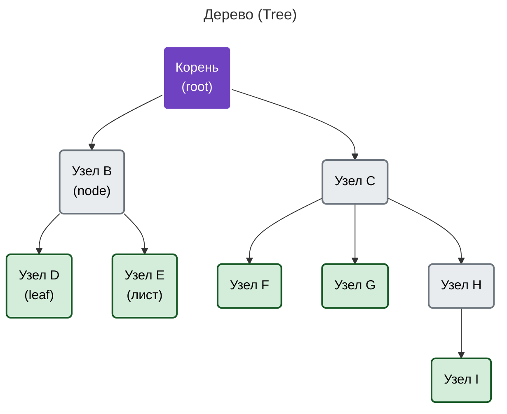
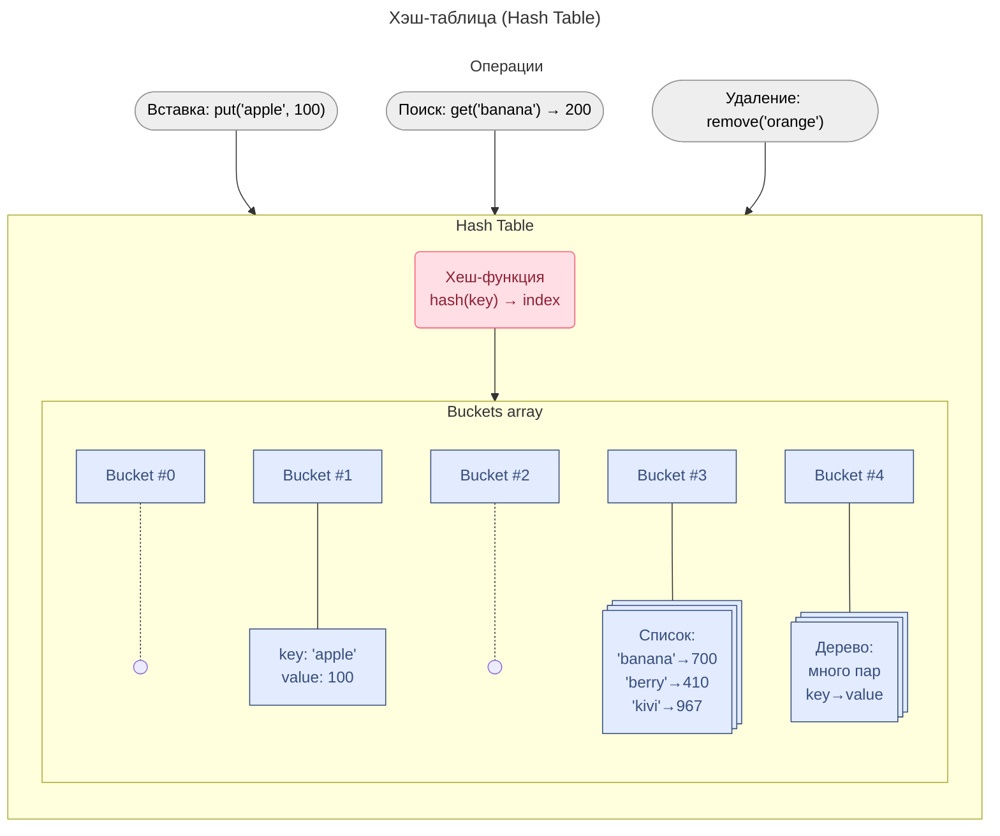

---
aliases:
  - Algorithm
  - Array
  - AVL
  - BFS
  - Big O notation
  - Big Omega
  - Big Theta
  - Binary Search Tree
  - BST
  - DFS
  - Graph
  - Hash Function
  - Hash Table
  - Linked List
  - Queue
  - RBTree
  - Red-Black Tree
  - Stack
  - Tree
  - Алгоритм
  - Алгоритмическая сложность
  - Б-дерево
  - Бинарное дерево поиска
  - Большое О
  - Граф
  - Декартово дерево
  - Дерево
  - Красно-чёрное дерево
  - Куча
  - Массив
  - Нотация асимптотического роста
  - Очередь
  - Связанный список
  - Сложность алгоритма
  - Сортировка
  - Стек
  - Хеш-функция
  - Хеш-таблица
  - Хэширование
---

## Хэширование

Хэширование — это процесс преобразования объекта в целочисленную форму.

**[[Хеш-функция]]** берёт на вход любые данные и возвращает значение — **хэш** данных. Не существует обратной функции для восстановления данных по хэшу.

$$h = H(m)$$

## Структуры данных

Структура данных — это контейнер, который хранит данные в определённом макете. Этот «макет» позволяет структуре данных быть эффективной в одних операциях и неэффективной в других.

- **Линейные** — элементы образуют последовательность или линейный список, обход узлов линеен. Примеры: массивы, связанный список, стеки и очереди.
- **Нелинейные** — обход узлов нелинейный, данные не последовательны. Пример: графы и деревья.

### Линейные структуры

#### Массив

Хранение: объекты данных хранятся в единой области памяти.

Каждой ячейке соответствует индекс. Основные операции: `insert()`, `get()`, `delete()`, `size()`.

#### Стек

Стек можно представить как банку чипсов Pringles: первый положенный элемент достаётся последним.

Стек — абстрактный тип данных, представляющий собой список элементов, организованных по принципу LIFO (англ. last in — first out, «последним пришёл — первым вышел»).

Основные операции:

- Push — вставляет элемент сверху
- Pop — возвращает верхний элемент после удаления из стека
- isEmpty — возвращает true, если стек пуст
- Top — возвращает верхний элемент без удаления из стека

#### Очередь

Queue (очередь) — хранит элементы последовательным образом. Существенное отличие от стека — использование FIFO (First In First Out) вместо LIFO.

Основные операции:

- Enqueue — вставляет элемент в конец очереди
- Dequeue — удаляет элемент из начала очереди
- isEmpty — возвращает значение true, если очередь пуста
- Top — возвращает первый элемент очереди

#### Связанный список

Коллекция элементов, в которой каждый элемент включает как минимум 2 поля — данные и ссылку на следующий узел.

Принципиальное преимущество перед массивом — возможность фрагментации структуры в физической памяти.

- **Однонаправленный список:** каждый узел хранит адрес или ссылку на следующий узел, последний узел имеет следующий адрес или ссылку NULL. `1->2->3->4->NULL`
- **Двунаправленный список:** две ссылки у каждого узла — одна на следующий узел, одна на предыдущий. `NULL<-1<->2<->3->NULL`
- **Круговой список:** все узлы соединяются, образуя круг, в конце нет NULL. Циклический связанный список может быть одно- или двунаправленным циклическим. `1->2->3->1`

Основные операции:

- InsertAtEnd — вставка заданного элемента в конец списка
- InsertAtHead — вставка элемента в начало списка
- Delete — удаление заданного элемента из списка
- DeleteAtHead — удаление первого элемента списка
- Search — возвращает заданный элемент из списка
- isEmpty — возвращает true, если связанный список пуст

### Нелинейные структуры

#### Граф

Граф — это набор узлов (вершин, VERTEX), которые соединены в сеть рёбрами (дугами, EDGE).

- **Ориентированный граф** — рёбра направленные, существует только одно доступное направление между двумя связными вершинами.
- **Неориентированный граф** — по каждому ребру можно переходить в обоих направлениях.
- **Смешанный граф**

#### Деревья

Дерево — это иерархическая структура данных, состоящая из узлов (вершин) и рёбер (дуг). Деревья по сути связные графы без циклов.

Виды деревьев:

- **Бинарное дерево** — у каждого узла не более 2 потомков.
  - **Бинарное дерево поиска (BST)** — ключи всех левых потомков ≤ ключей всех правых потомков. Сложность поиска от O(log n) до O(n); O(n) — если дерево несбалансированное.
  - **Рандомизированные деревья поиска**
  - **Сбалансированные деревья** — длина от корня до любого из потомков отличается не более чем на 1. Это гарантирует сложность поиска до O(log n), но усложняет добавление и удаление элементов.
    - **Красно-чёрное дерево (RBTree)** — каждый узел промаркирован красным или чёрным цветом:
      - Корень и конечные узлы (листья, NULL, `nil-node`) дерева — чёрные
      - У красного узла родительский узел — чёрный
      - Все простые пути из любого узла x до листьев содержат одинаковое количество чёрных узлов (`black height`)
      - Чёрный узел может иметь чёрного родителя
    - **AVL-дерево** — по первым буквам фамилий авторов алгоритма. Накладная реализация: в каждом узле надо хранить высоту, при манипуляциях проверять `balance factor` и выполнять балансировку — 4 операции: малый/большой правый/левый поворот дерева.
- **Декартово дерево**
- **Б-дерево**
- **[[trie]] (префиксное дерево)** — пример: хранение данных для Т9

#### Хеш-таблица

Хеш-таблица — это словарь: объект хранится в виде пары «ключ-значение».

Хэширование — это процесс, используемый для уникальной идентификации объектов и хранения каждого объекта в заранее рассчитанном уникальном индексе (ключе).

Объект хранится в виде пары «ключ-значение», а коллекция таких элементов называется «словарём». Каждый объект можно найти с помощью этого ключа.

По сути это массив, в котором ключ представлен хеш-функцией.

## Оценка сложности алгоритмов

| 🟩 хорошо | 🟨 приемлемо | 🟥 плохо |
| --------- | ------------ | -------- |

### Алгоритмы поиска

| Алгоритм | Структура данных | Временная сложность в среднем | Временная сложность в худшем | Сложность по памяти в худшем |
| ----------------------------------------------------------- | ------------------------------------------ | ------------------------------------ | ---------------------------------------- | ---------------------------- |
| Поиск в глубину (DFS) | Граф с $\|V\|$ вершинами и $\|E\|$ ребрами | $-$ | $O(\|E\| + \|V\|)$ 🟩 | $O(\|V\|)$ 🟩 |
| Поиск в ширину (BFS) | Граф с $\|V\|$ вершинами и $\|E\|$ ребрами | $-$ | $O(\|E\| + \|V\|)$ 🟩 | $O(\|V\|)$ 🟩 |
| Бинарный поиск | Отсортированный массив из $n$ элементов | $O(log(n))$ 🟩 | $O(log(n))$ 🟩 | $O(1)$ 🟩 |
| Линейный поиск | Массив | $O(n)$ 🟥 | $O(n)$ 🟥 | $O(1)$ 🟩 |
| Кратчайшее расстояние по алгоритму Дейкстры (двоичная куча) | Граф с $\|V\|$ вершинами и $\|E\|$ ребрами | $O((\|V\| + \|E\|) log \|V\|)$ 🟨 | $O((\|V\| + \|E\|) log \|V\|)$ 🟨 | $O(\|V\|)$ 🟨 |
| Кратчайшее расстояние по алгоритму Дейкстры (массив) | Граф с $\|V\|$ вершинами и $\|E\|$ ребрами | $O(\|V\|^2)$ 🟨 | $O(\|V\|^2)$ 🟨 | $O(\|V\|)$ 🟨 |
| Кратчайшее расстояние (Беллман–Форд) | Граф с $\|V\|$ вершинами и $\|E\|$ ребрами | $O(\|V\| \|E\|)$ 🟨 | $O(\|V\| \|E\|)$ 🟨 | $O(\|V\|)$ 🟨 |

### Сортировка

**Временная сложность:**

| Алгоритм | Структура данных | Лучшее | В среднем | В худшем | Память (в худшем) |
| ------------------------ | ---------------- | -------------------- | -------------------- | -------------------- | ------------------------------- |
| Быстрая сортировка | Массив | $O(n\ log\ n)$ 🟨 | $O(n\ log\ n)$ 🟩 | $O(n^2)$ 🟥 | $O(n)$ 🟨 |
| Сортировка слиянием | Массив | $O(n\ log\ n)$ 🟨 | $O(n\ log\ n)$ 🟩 | $O(n\ log\ n)$ 🟩 | $O(n)$ 🟥 |
| Пирамидальная сортировка | Массив | $O(n\ log\ n)$ 🟨 | $O(n\ log\ n)$ 🟩 | $O(n\ log\ n)$ 🟩 | $O(1)$ 🟩 |
| Пузырьковая сортировка | Массив | $O(n)$ 🟩 | $O(n^2)$ 🟥 | $O(n^2)$ 🟥 | $O(1)$ 🟩 |
| Сортировка вставками | Массив | $O(n)$ 🟩 | $O(n^2)$ 🟥 | $O(n^2)$ 🟥 | $O(1)$ 🟩 |
| Сортировка выбором | Массив | $O(n^2)$ 🟥 | $O(n^2)$ 🟥 | $O(n^2)$ 🟥 | $O(1)$ 🟩 |
| Блочная сортировка | Массив | $O(n+k)$ 🟩 | $O(n+k)$ 🟩 | $O(n^2)$ 🟥 | $O(nk)$ 🟨 |
| Поразрядная сортировка | Массив | $O(nk)$ 🟩 | $O(nk)$ 🟩 | $O(nk)$ 🟩 | $O(n+k)$ 🟨 |

### Структуры данных

**Временная сложность:**

| Структура данных | Индексация (в среднем) | Поиск (в среднем) | Вставка (в среднем) | Удаление (в среднем) | Индексация (в худшем) | Поиск (в худшем) | Вставка (в худшем) | Удаление (в худшем) | Сложность по памяти (в худшем) |
| ---------------------- | ----------------- | ----------------- | ----------------- | ----------------- | ----------------- | ----------------- | ----------------- | ----------------- | ------------------- |
| Обычный массив | $O(1)$ 🟩 | $O(n)$ 🟥 | $-$ | $-$ | $O(1)$ 🟩 | $O(n)$ 🟥 | $-$ | $-$ | $O(n)$ 🟨 |
| Динамический массив | $O(1)$ 🟩 | $O(n)$ 🟥 | $O(n)$ 🟥 | $O(n)$ 🟥 | $O(1)$ 🟩 | $O(n)$ 🟥 | $O(n)$ 🟥 | $O(n)$ 🟥 | $O(n)$ 🟨 |
| Односвязный список | $O(n)$ 🟥 | $O(n)$ 🟥 | $O(1)$ 🟩 | $O(1)$ 🟩 | $O(n)$ 🟥 | $O(n)$ 🟥 | $O(1)$ 🟩 | $O(1)$ 🟩 | $O(n)$ 🟨 |
| Двусвязный список | $O(n)$ 🟥 | $O(n)$ 🟥 | $O(1)$ 🟩 | $O(1)$ 🟩 | $O(n)$ 🟥 | $O(n)$ 🟥 | $O(1)$ 🟩 | $O(1)$ 🟩 | $O(n)$ 🟨 |
| Список с пропусками | $O(log n)$ | $O(log n)$ 🟩 | $O(log n)$ 🟩 | $O(log n)$ 🟩 | $O(n)$ 🟥 | $O(n)$ 🟥 | $O(n)$ 🟥 | $O(n)$ 🟥 | $O(n log n)$ 🟥 |
| Хеш-таблица | $-$ | $O(1)$ 🟩 | $O(1)$ 🟩 | $O(1)$ 🟩 | $-$ | $O(n)$ 🟥 | $O(n)$ 🟥 | $O(n)$ 🟥 | $O(n)$ 🟨 |
| Бинарное дерево поиска | $O(log n)$ 🟨 | $O(log n)$ 🟩 | $O(log n)$ 🟩 | $O(log n)$ 🟩 | $O(n)$ 🟥 | $O(n)$ 🟥 | $O(n)$ 🟥 | $O(n)$ 🟥 | $O(n)$ 🟨 |
| Декартово дерево | $-$ | $O(log n)$ 🟩 | $O(log n)$ 🟩 | $O(log n)$ 🟩 | $-$ | $O(n)$ 🟥 | $O(n)$ 🟥 | $O(n)$ 🟥 | $O(n)$ 🟨 |
| B-дерево | $O(log n)$ 🟨 | $O(log n)$ 🟩 | $O(log n)$ 🟩 | $O(log n)$ 🟩 | $O(log n)$ 🟨 | $O(log n)$ 🟩 | $O(log n)$ 🟩 | $O(log n)$ 🟩 | $O(n)$ 🟨 |
| Красно-чёрное дерево | $O(log n)$ 🟨 | $O(log n)$ 🟩 | $O(log n)$ 🟩 | $O(log n)$ 🟩 | $O(log n)$ 🟨 | $O(log n)$ 🟩 | $O(log n)$ 🟩 | $O(log n)$ 🟩 | $O(n)$ 🟨 |
| Расширяющееся дерево | $-$ | $O(log n)$ 🟩 | $O(log n)$ 🟩 | $O(log n)$ 🟩 | $-$ | $O(log n)$ 🟩 | $O(log n)$ 🟩 | $O(log n)$ 🟩 | $O(n)$ 🟨 |
| АВЛ-дерево | $O(log n)$ 🟨 | $O(log n)$ 🟩 | $O(log n)$ 🟩 | $O(log n)$ 🟩 | $O(log n)$ 🟨 | $O(log n)$ 🟩 | $O(log n)$ 🟩 | $O(log n)$ 🟩 | $O(n)$ 🟨 |

### Кучи

| Куча | Преобразование к куче | Поиск максимума | Извлечение максимума | Увеличить ключ | Вставить | Удалить | Слияние |
| ----------------------------------- | --------------------- | ----------------- | -------------------- | ----------------- | ----------------- | ------------------- | -------------- |
| Связный список (отсортированный) | $-$ | $O(1)$ 🟩 | $O(1)$ 🟩 | $O(n)$ 🟥 | $O(n)$ 🟥 | $O(1)$ 🟩 | $O(m+n)$ 🟥 |
| Связный список (не отсортированный) | $-$ | $O(n)$ 🟥 | $O(n)$ 🟥 | $O(1)$ 🟩 | $O(1)$ 🟩 | $O(1)$ 🟩 | $O(1)$ 🟩 |
| Бинарная куча | $O(n)$ 🟨 | $O(1)$ 🟩 | $O(log\ n)$ 🟨 | $O(log\ n)$ 🟨 | $O(log\ n)$ 🟨 | $O(log\ n)$ 🟨 | $O(m+n)$ 🟥 |
| Биномиальная куча | $-$ | $O(log\ n)$ 🟨 | $O(log\ n)$ 🟨 | $O(log\ n)$ 🟨 | $O(log\ n)$ 🟨 | $O(log\ n)$ 🟨 | $O(log\ n)$ |
| Фибоначчиева куча | $-$ | $O(1)$ 🟩 | $O(log\ n)$ 🟨 | $O(1)$ 🟩 | $O(1)$ 🟩 | $O(log\ n)^*$ 🟨 | $O(1)$ 🟩 |

### Представление графов

> Пусть дан граф с $|V|$ вершинами и $|E|$ ребрами, тогда:

| Способ представления | Память | Добавление вершины | Добавление ребра | Удаление вершины | Удаление ребра | Проверка смежности вершин |
| --------------------- | -------------------------- | -------------------------- | -------------------------- | -------------------------- | -------------------------- | ------------------------- |
| Список смежности | $O(\|E\|+\|V\|)$ 🟨 | $O(1)$ 🟩 | $O(1)$ 🟩 | $O(\|E\|+\|V\|)$ 🟨 | $O(\|E\|)$ 🟨 | $O(\|V\|)$ 🟨 |
| Список инцидентности | $O(\|E\|+\|V\|)$ 🟨 | $O(1)$ 🟩 | $O(1)$ 🟩 | $O(\|E\|)$ 🟨 | $O(\|E\|)$ 🟨 | $O(\|E\|)$ 🟨 |
| Матрица смежности | $O(\|V\|^2)$ 🟥 | $O(\|V\|^2)$ 🟥 | $O(1)$ 🟩 | $O(\|V\|^2)$ 🟥 | $O(1)$ 🟩 | $O(1)$ 🟩 |
| Матрица инцидентности | $O(\|E\|\cdot\|V\|)$ 🟥 | $O(\|E\|\cdot\|V\|)$ 🟥 | $O(\|E\|\cdot\|V\|)$ 🟥 | $O(\|E\|\cdot\|V\|)$ 🟥 | $O(\|E\|\cdot\|V\|)$ 🟥 | $O(\|E\|)$ 🟨 |

## Нотация асимптотического роста

| Обозначение | Граница | Рост |
| ------------------------ | ----------------------------------------- | ---------------- |
| $\Theta$ — тэта | Нижняя и верхняя границы, точная оценка | Равно |
| $O$ — большое о | Верхняя граница, точная оценка неизвестна | Меньше или равно |
| $o$ — малое о | Верхняя граница, не точная оценка | Меньше |
| $\Omega$ — большое омега | Нижняя граница, точная оценка неизвестна | Больше или равно |
| $\omega$ — малое омега | Нижняя граница, не точная оценка | Больше |
