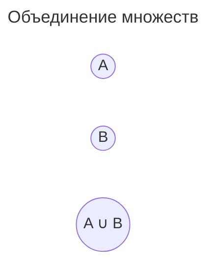
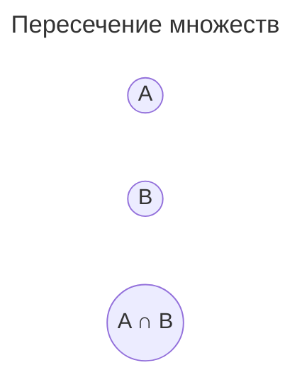

---
aliases:
  - Binary Relation
  - Boole algebra
  - Boolean algebra
  - Cartesian Product
  - De Morgan's laws
  - Order Relation
  - Predicate
  - Propositional Logic
  - Relation
  - Set
  - Бинарное отношение
  - Булева алгебра
  - Декартово произведение
  - Законы де Моргана
  - Квантор общности
  - Квантор существования
  - Логика высказываний
  - Логика предикатов
  - Множество
  - Отношение
  - Отношение порядка
  - Предикат
---

## Формальная логика

**Формальная логика** изучает **формы мышления** (понятия, суждения, умозаключения) и их **законы**. В информатике она лежит в основе алгоритмов, баз данных и верификации программ.

## Введение

Для математики и программирования важны два раздела логики:

- **Логика высказываний** — оперирует суждениями, истинными или ложными.
- **Логика предикатов** — оперирует свойствами и отношениями объектов, использует кванторы.

Вклад в развитие формальной логики внес **Август де Морган** — его законы двойственности используются и сейчас.

## Логика высказываний

**Высказывание** — утверждение, которое является истинным или ложным (закон исключённого третьего).

Множество истинности высказывания: $\{0, 1\}$ (ложь, истина).

| Высказывание | Значение |
|--------------|----------|
| «2 < 3» | истина ($1$) |
| «5 — простое число» | истина ($1$) |
| «7 < 5» | ложь ($0$) |
| «x + 1 = x» | ложь при любом x |

Высказывания бывают **простыми** и **составными** (соединёнными связками: «и», «или», «не»).

## Логика предикатов

**Предикат** — это функция, возвращающая истину или ложь в зависимости от аргументов. Область истинности предиката — множество $M$, для элементов которого предикат истинен.

- Пример: предикат $P(x)$ = «x чётное число».
- Область истинности $P$ на множестве натуральных чисел — все чётные числа.

| Символ | Читается |
|--------|----------|
| $P(x)$ | предикат от одной переменной |
| $P(x, y)$ | предикат от двух переменных (бинарное отношение) |
| $R(x, y)$ | отношение: пары $(x, y)$, для которых предикат истинен |

## Предикат сравнения

| Предикат | Читается |
|----------|----------|
| $= $ | равно |
| $\neq$ | не равно |
| $<$ | меньше |
| $>$ | больше |
| $\leq$ | меньше или равно |
| $\geq$ | больше или равно |

## Предикаты в языках программирования

| Оператор программы | Значение |
|--------------------|----------|
| `==` | равенство |
| `!=` | неравенство |
| `<` | меньше |
| `>` | больше |
| `<=` | меньше или равно |
| `>=` | больше или равно |

Результат такого предиката в коде — булево значение `true` / `false`.

## Кванторы

**Квантор общности** $\forall$ — «для всех»:

$$\forall x\, P(x)$$

читается «для всех $x$ выполняется $P(x)$». Например, «все простые числа больше 1»:

$$\forall x\, (x \text{ — простое} \Rightarrow x > 1)$$

**Квантор существования** $\exists$ — «существует»:

$$\exists x\, P(x)$$

читается «существует $x$, для которого $P(x)$ истинно». Например, «есть чётные числа»:

$$\exists x\, (x \text{ — чётное})$$

### Особенности кванторов

- Переменная под квантором **связана**: её нельзя подставить.
- Переменная без квантора **свободна** (в коде — константа).
- Порядок кванторов важен при нескольких переменных:
  - $\forall x\, \exists y\, R(x, y)$ и $\exists y\, \forall x\, R(x, y)$ — разные утверждения.

### Двойственность кванторов

$$\lnot (\forall x\, P(x)) \equiv \exists x\, \lnot P(x)$$

$$\lnot (\exists x\, P(x)) \equiv \forall x\, \lnot P(x)$$

## Свойства предикатов (отношений)

### Антирефлексивность

Свойство: для любого $x$ неверно $R(x, x)$.

$$R \text{ антирефлексивно} \iff \forall x: \lnot R(x, x)$$

- Пример: $<$ — никакое число не меньше самого себя.

### Рефлексивность

Свойство: для любого $x$ верно $R(x, x)$.

$$R \text{ рефлексивно} \iff \forall x: R(x, x)$$

- Пример: $\leq$ — каждое число меньше или равно самому себе.

### Антисимметричность

Свойство: если $R(x, y)$ и $R(y, x)$, то $x = y$.

$$R \text{ антисимметрично} \iff \forall x, y: (R(x, y) \land R(y, x)) \Rightarrow x = y$$

- Пример: $\leq$.

### Симметричность

Свойство: если $R(x, y)$, то $R(y, x)$.

$$R \text{ симметрично} \iff \forall x, y: R(x, y) \Rightarrow R(y, x)$$

- Пример: равенство $=$.

### Транзитивность

Свойство: если $R(x, y)$ и $R(y, z)$, то $R(x, z)$.

$$R \text{ транзитивно} \iff \forall x, y, z: (R(x, y) \land R(y, z)) \Rightarrow R(x, z)$$

- Пример: $\leq$, $<$, $=$.

## Отношение порядка

- **Частичный порядок** — отношение, одновременно рефлексивное, антисимметричное и транзитивное (например, $\leq$).
- **Строгий порядок** — отношение, антирефлексивное и транзитивное (например, $<$).
- **Трихотомия:** для любых $x, y$ на вещественных числах выполняется ровно одно из соотношений $x < y$, $x = y$, $x > y$.

## Операции с множествами

| Операция | Обозначение | Результат |
|----------|-------------|-----------|
| **Объединение** | $A \cup B$ | элементы, принадлежащие A или B |
| **Пересечение** | $A \cap B$ | элементы, принадлежащие A и B |
| **Разность** | $A \setminus B$ | элементы A без элементов B |
| **Дополнение** | $\overline{A}$ | элементы универсума вне A |

Пример:

- $A = \{1, 2, 3\}$, $B = \{3, 4\}$
- $A \cup B = \{1, 2, 3, 4\}$
- $A \cap B = \{3\}$
- $A \setminus B = \{1, 2\}$

## Множества чисел

| Множество | Название | Примеры |
|-----------|----------|---------|
| $\mathbb{N}$ | натуральные | $1, 2, 3, \dots$ |
| $\mathbb{Z}$ | целые | $\dots, -2, -1, 0, 1, 2, \dots$ |
| $\mathbb{Q}$ | рациональные | $\frac{1}{2}, 0.75, 3$ |
| $\mathbb{R}$ | вещественные | $\pi, \sqrt{2}, -1.5$ |
| $\mathbb{C}$ | комплексные | $2 + 3i$ |

Отношения включения: $\mathbb{N} \subset \mathbb{Z} \subset \mathbb{Q} \subset \mathbb{R} \subset \mathbb{C}$.

## Декартово произведение

**Декартово произведение** множеств $A$ и $B$ — множество всех упорядоченных пар:

$$A \times B = \{(a, b) \mid a \in A,\, b \in B\}$$

**Бинарное отношение** — подмножество декартова произведения $A \times B$.

Пример: если $A = \{1, 2\}$, $B = \{x, y\}$, то

$$A \times B = \{(1, x), (1, y), (2, x), (2, y)\}$$

## Законы де Моргана

Для высказываний и множеств:

$$\lnot (A \land B) \equiv \lnot A \lor \lnot B$$

$$\lnot (A \lor B) \equiv \lnot A \land \lnot B$$

Для множеств:

- $\overline{A \cup B} = \overline{A} \cap \overline{B}$
- $\overline{A \cap B} = \overline{A} \cup \overline{B}$

## Булева алгебра

| Операция | Обозначение | Математическое имя |
|----------|-------------|--------------------|
| **Логическое И** | $A \land B$ | конъюнкция |
| **Логическое ИЛИ** | $A \lor B$ | дизъюнкция |
| **НЕ** | $\lnot A$ | отрицание |
| **Исключающее ИЛИ** | $A \oplus B$ | XOR |

Таблица истинности основных операций:

| $A$ | $B$ | $A \land B$ | $A \lor B$ | $A \oplus B$ |
|-----|-----|-------------|------------|--------------|
| 0 | 0 | 0 | 0 | 0 |
| 0 | 1 | 0 | 1 | 1 |
| 1 | 0 | 0 | 1 | 1 |
| 1 | 1 | 1 | 1 | 0 |

## Побитовые операции

| $a$ | $b$ | `a & b` | `a \| b` | `a ^ b` |
|-----|-----|---------|----------|---------|
| 0 | 0 | 0 | 0 | 0 |
| 0 | 1 | 0 | 1 | 1 |
| 1 | 0 | 0 | 1 | 1 |
| 1 | 1 | 1 | 1 | 0 |

- `&` — битовое И (побитовая конъюнкция)
- `|` — битовое ИЛИ (побитовая дизъюнкция)
- `^` — битовое исключающее ИЛИ (XOR)

## Диаграммы Венна

## Итог

| Понятие | Суть |
|---------|------|
| **Высказывание** | Утверждение со значением истины ($0$ или $1$) |
| **Предикат** | Функция, возвращающая значение истины |
| **Отношение** | Множество пар, удовлетворяющих предикату |
| **Кванторы** | $\forall$ (для всех), $\exists$ (существует) |
| **Порядок** | Частичный ($\leq$) и строгий ($<$) |
| **Операции множеств** | $\cup$, $\cap$, $\setminus$, $\overline{\cdot}$ |
| **Законы де Моргана** | Двойственность отрицания над $\land$/$\lor$ |

Формальная логика — фундамент алгоритмов, типов данных и баз данных: проверка условий, булева алгебра, теория отношений.
