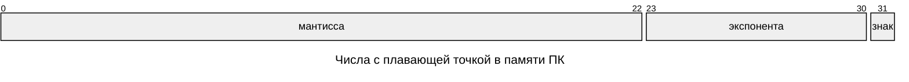

---
aliases:
  - Addressing
  - bin
  - binary
  - Byte
  - Byte addressing
  - Computer memory
  - E notation
  - E-нотация
  - Exp notation
  - Exponent
  - Floating point numbers
  - hex
  - hexadecimal
  - IEEE 754
  - Java primitive types
  - Mantissa
  - Memory addressing
  - Negative numbers
  - Octet
  - Primitive types
  - Scientific notation
  - Sign bit
  - Two's complement
  - Word addressing
  - Адресация
  - Адресация памяти
  - Байт
  - Байтовая адресация
  - Бит знака
  - Дополнительный код
  - Мантисса
  - Научная нотация
  - Октет
  - Отрицательные числа
  - Память ЭВМ
  - Примитивные типы
  - Примитивные типы Java
  - Словесная адресация
  - Числа с плавающей точкой
  - Экспонента
  - Экспоненциальная запись
  - Экспоненциальная нотация
---

## Виды физической памяти

| Тип памяти                 | Скорость | Размер  |
| -------------------------- | -------- | ------- |
| регистры ядра (процессора) | ⭐⭐⭐⭐      | ⭐       |
| кэш ядра (процессора)      | ⭐⭐⭐       | ⭐⭐      |
| ОЗУ (RAM)                  | ⭐⭐        | ⭐⭐⭐     |
| ПЗУ (HDD, flash)           | ⭐         | ⭐⭐⭐⭐    |

## Октет и байт

Минимальная ячейка памяти, к которой обращается [[multithreading|процесс]]. Чаще всего 8 бит = байт, поэтому boolean чаще всего занимает 1 байт.

Байт мог быть любого размера. Исторически сложилось, что он равен 8 бит, так как большинство задач на ПК связаны с текстом, а для кодировки текста используются 8-битные кодировки (UTF-8, ASCII).

### Адресация памяти

Представляет собой номер октета, к которому обращается процесс.

### Байтовая адресация

Используется, если минимальный октет на ядре = 1 байт. Лучше подходит для работы с текстом, так как текст состоит из букв фиксированного размера в кодировке.

### Словесная адресация

Используется, если минимальный октет другой, например 32 или 64 бита. Лучше подходит для работы с числами.

### Префиксы систем счисления

- `0x` — префикс записи числа в 16-ричном представлении (hex = hexadecimal). Пример: `0xFF`.
- `0b` — префикс записи числа в двоичном представлении (binary). Пример: `0b10101`.

Тип данных byte, short, int, long и т.д. определяет, какой размер памяти будет выделен под переменную.

### Отрицательные числа

- `unsigned byte`: 0..255 — не поддерживается в Java
- `byte`: -128..127

Чтобы представить в двоичной системе отрицательное число:

1. Берём двоичное представление числа.
2. Добавляем бит знака (обычно 1 для обозначения минуса).
   - Бит знака ставится перед числом и во все предшествующие (левые) разряды.
   - Половина области памяти, выделяемой под хранение числа, заполняется битами знака: обычно 0 для положительных и 1 для отрицательных.
3. Инвертируем двоичное представление числа (то, что после битов знака): 0 → 1 и 1 → 0.
4. К полученному результату добавляем 1.

Такое представление удобно, так как позволяет корректно складывать положительные и отрицательные числа в двоичной системе.

## Хранение чисел с плавающей точкой

Согласно стандарту `IEEE 754` обычный float занимает в памяти 4 байта, которые делятся на 3 блока:

1. S — бит знака
2. M — мантисса
   - **Мантисса** — это, по сути, число, записанное без точки.
3. E — экспонента числа
   - **Экспонента** — это степень, в которую нужно возвести некое число N (как правило, N = 2), чтобы при перемножении на мантиссу получить искомое число. Максимальная степень может быть 255.



![[Pasted image 20250201011334.png]]

**Формулы перевода**

$FloatNum = (-1)^S \cdot 2^{E-127} \cdot (1+M/2^{23})$

$DoubleNum = (-1)^S \cdot 2^{E-1023} \cdot (1+M/2^{52})$

![[Pasted image 20250201011429.png]]

### Пример перевода IEEE 754 в десятичное число

**Представление числа в формате с плавающей точкой**

- **Знак** — 1 бит
- **Экспонента (порядок)** — 11 бит
- **Мантисса** — 52+1 бит

**Визуализация структуры**

```text
[Знак][Экспонента (11 бит)][Мантисса (52+1 бит)]
0000000000001.00000000000000000000000000000000000000000000000000
```

Пример расчёта для числа `0100000010111011011011010010111100011010100111110111110011110111`:

1. **Порядок (экспонента):**
   Двоичное значение: `10000000101₂`
   Переводим в десятичную систему: `1029₁₀`
   Вычитаем смещение (1023): `1029₁₀ − 1023₁₀ = 6₁₀`
   Порядок = 6.
2. **Мантисса:**
   Двоичное значение: `1.1110110111010010111100011010100111111011111101111₂`
   Переводим в десятичную систему: ≈ 1.929.
   Мантисса = 1.929.
3. **Итоговое число:**
   Формула: мантисса × 2^(порядок) = 1.929 × 2⁶ = 1.929 × 64 = 123.456.

## Сколько памяти используют примитивные типы Java

| **Название** | **Размер, байт** | **Диапазон значений**             | **Описание**                        | **Пример**                   |
| ------------ | ---------------- | --------------------------------- | ----------------------------------- | ---------------------------- |
| `byte`       | 1                | $-128\ ..\ 127$                   | целое число                         | `byte b = -5`                |
| `short`      | 2                | $-32\ 768\ ..\ 32\ 767$           | целое число                         | `short s = 42`               |
| `int`        | 4                | $-2\ * 10^{9}\ ..\ 2\ * 10^{9}$   | целое число                         | `int i = -12345`             |
| `long`       | 8                | $-9\ * 10^{18}\ ..\ 9\ * 10^{18}$ | целое число                         | `long l = 1122334455`        |
| `float`      | 4                | $±1.4E–45\ .. \ ±3.4E+38$         | вещественное число                  | `float f = 3.141592f`        |
| `double`     | 8                | $±4.5E–324\ .. ±1.8E+308$         | вещественное число двойной точности | `double d = 3.141592653589d` |
| `char`       | 2                | $0\ ..\ 65\ 535$                  | символ                              | `char c = 'Z'`               |
| `boolean`    | 1 бит            | `true` или `false`                | логическое значение                 | `boolean b = true`           |

### Точные диапазоны

| **Название** | **Размер, байт** | **Диапазон значений**                                                                                      |
| ------------ | ---------------- | ---------------------------------------------------------------------------------------------------------- |
| `int`        | 4                | $-2^{31}\ ..\ 2^{31}\ -\ 1$<br>$-2\ 147\ 483\ 648\ ..\ 2\ 147\ 483\ 647$                                   |
| `long`       | 8                | $-2^{63}\ ..\ 2^{63}-1$<br>$-9\ 223\ 372\ 036\ 854\ 775\ 808\ ..$<br>$9\ 223\ 372\ 036\ 854\ 775\ 807$     |
| `float`      | 4                | $±1.4E–45\ .. \ ±3.4028235E+38$                                                                            |
| `double`     | 8                | $±4.49E–324\ ..$<br>$±1.7976931348623157E+308$                                                             |

## E-нотация

Буква «E» (или «e») в записи типа `4.49E–324` — это сокращение от «exponent» (показатель степени). Она используется в E-нотации (экспоненциальной записи) — удобной для компьютеров форме научной нотации.

**Суть E-нотации**

- Вместо записи «умножить на 10 в степени» (например, 3,5 × 10⁸) пишут `3.5E8` или `3.5e8`.
- Формат: `aEn` или `aeN`, где:
  - `a` — коэффициент (мантисса), число, для которого 1 ≤ |a| < 10;
  - `n` — показатель степени (целое число);
  - E/e означает «умножить на 10 в степени».

**Пример разбора `4.49E–324`**

- `4.49` — коэффициент (мантисса);
- E — означает «× 10^» (умножить на 10 в степени);
- `–324` — показатель степени (отрицательный);
- Итого: `4.49E–324 = 4.49 × 10^(-324)` — очень маленькое число (почти нулевое, но не ноль).

**Где используется E-нотация**

- языки программирования (Python, JavaScript, C++);
- электронные таблицы (Excel, Google Таблицы);
- научное ПО и калькуляторы;
- компактная запись очень больших или малых чисел (физика, химия, астрономия).

**Примеры других записей**

- `6.022E23` = 6.022 × 10²³ (число Авогадро);
- `1.6E–19` = 1.6 × 10^(-19) (заряд электрона);
- `2.998E8` = 2.998 × 10⁸ (скорость света, м/с).

**Вывод**

E — способ кратко записать степень числа 10, делая запись чисел компактной и удобной для вычислений.
