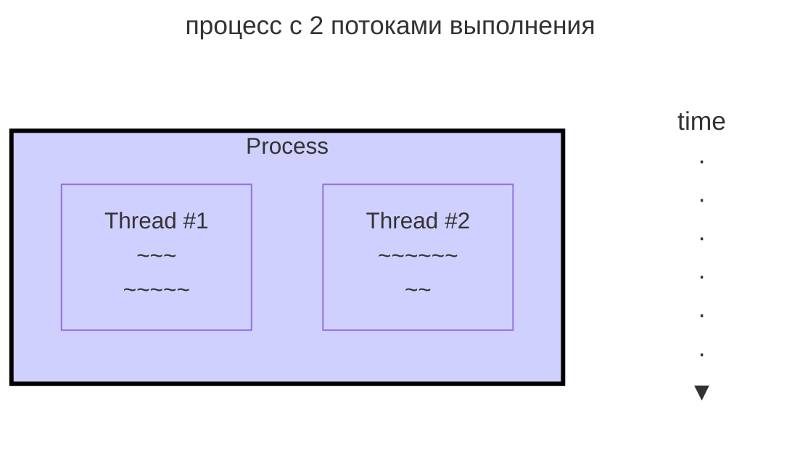

---
aliases:
  - Atomic operation
  - Atomicity
  - Callable
  - CAS
  - CMPXCHG
  - Compare-and-swap
  - Condition variable
  - Critical section
  - Data race
  - Deadlock
  - Dining philosophers
  - Futex
  - Livelock
  - Lock-free
  - Monitor
  - Multitasking
  - Multithreading
  - Mutex
  - Mutual exclusion
  - Obstruction-free
  - Parallelism
  - Process
  - Race condition
  - Runnable
  - Semaphore
  - Spinlock
  - Starvation
  - Thread
  - Thread class
  - Thread synchronization
  - Visibility
  - Wait-free
  - Атомарная операция
  - Атомарность
  - Без блокировок
  - Без ожиданий
  - Без препятствий
  - Взаимная блокировка
  - Видимость
  - Голодание
  - Гонка данных
  - Динамический тупик
  - Задача об обедающих философах
  - Критическая секция
  - Многозадачность
  - Многопоточность
  - Монитор
  - Мьютекс
  - Параллелизм
  - Поток выполнения
  - Процесс
  - Семафор
  - Синхронизация потоков
  - Состояние гонки
  - Спин-блокировка
  - Условная переменная
  - Фьютекс
---

## Концепции параллелизма

Параллелизм (Parallelism) — это стремление к тому, чтобы процессы протекали в системе одновременно.

Когда несколько потоков либо процессов работают одновременно, возникают проблемы параллелизма, из которых проистекает необходимость в синхронизации потоков.

## Многозадачность (multitasking)

Многозадачность — свойство среды выполнения обеспечивать возможность параллельной (или псевдопараллельной) обработки нескольких задач.

Истинная многозадачность операционной системы возможна только в распределённых вычислительных системах. Бывают процессорная и потоковая многозадачность.

### Процесс

Процесс — идентифицируемая абстракция совокупности взаимосвязанных системных ресурсов на основе отдельного и независимого виртуального адресного пространства, в контексте которой организуется выполнение потоков.

Компьютерная программа сама по себе — лишь пассивная последовательность инструкций, в то время как процесс — непосредственное выполнение этих инструкций.

![[Untitled 9.png|200]]

Процесс с двумя потоками выполнения:



### Многопоточность (multithreading)

Многопоточность — свойство среды или приложения, состоящее в том, что процесс, порождённый в операционной системе, может состоять из нескольких потоков выполнения, выполняющихся «параллельно», то есть *без предписанного порядка во времени*. Для некоторых задач такое разделение достигает более эффективного использования ресурсов вычислительной машины.

### Поток выполнения

Поток выполнения (thread, нить) — наименьшая единица обработки, исполнение которой может быть назначено ядром операционной системы.

В Java поток — это единица реализации программного кода: последовательность данных, которая может работать параллельно с другими своими «аналогами».

- Объект класса `Thread` представляет механизм для работы с потоками.
- Основной поток может создавать другие потоки с помощью функциональных интерфейсов `Callable` и `Runnable`.

#### class Thread

`implements Runnable`, `java.lang.Thread`

Класс [[java-thread]] служит для создания потоков и работы с ними.

#### interface Callable

`import java.util.concurrent.Callable`

`V call() throws Exception;`

Интерфейс, аналог Runnable. Возвращает результат либо исключение. Предназначен для создания сущностей, которые могут быть вызваны разными потоками.

#### interface Runnable

`@FunctionalInterface`, `package java.lang.Runnable`

`void run();`

## Синхронизация потоков

Синхронизация потоков — механизм, который гарантирует, что два или более параллельных потока одновременно не выполнят некоторый программный сегмент, известный как критический раздел (critical section). Доступ процессов к критической секции контролируется с помощью методов синхронизации. Когда один поток начинает выполнение критической секции, другой поток должен дождаться завершения первого.

Для потокозащищённого выполнения кода необходимо решение трёх основных проблем параллелизма:

- **видимость** разделяемого ресурса для конкурирующих потоков
- **атомарность** операций критической секции кода
- сохранение **порядка** выполнения инструкций

### Visibility — видимость разделяемых объектов

Видимость общих объектов: условия, при которых один поток немедленно видит изменения, сделанные другим потоком.

### Critical section — критическая секция кода

Критическая секция — участок исполняемого кода, в котором производится доступ к общему ресурсу, который не должен быть одновременно использован более чем одним потоком выполнения. При нарушении этого правила возникает состояние гонки (race condition).

### Race condition — состояние гонки

Если не применяются методы синхронизации потоков, это может вызвать состояние гонки (race condition), при котором значения переменных могут быть непредсказуемыми и меняться в зависимости от времени переключения контекста процессов или потоков.

Состояние гонки (race condition), также конкуренция, — ошибка проектирования многопоточной системы, при которой работа системы зависит от того, в каком порядке выполняются части кода.

Во избежание данной ситуации необходимо выполнение четырёх условий:

1. Два потока не должны одновременно находиться в одной критической области.
2. В программе не должно быть предположений о скорости или количестве процессоров.
3. Поток, находящийся вне критической области, не может блокировать другие потоки.
4. Невозможна ситуация, в которой поток вечно ждёт попадания в критическую область.

### Data race — гонка данных

Гонка данных (data race) возникает, когда два или более потока пытаются получить доступ к одной и той же не финальной переменной без синхронизации.

В состоянии гонки данных могут возникнуть изменения, которые не будут видны другим потокам: чтение устаревших данных, бесконечные циклы, повреждённые структуры данных или неточные вычисления.

### Deadlock — взаимная блокировка

Взаимная блокировка (deadlock) — ситуация в многозадачной среде, при которой несколько процессов находятся в состоянии ожидания ресурсов, занятых друг другом, и ни один из них не может продолжать своё выполнение. Может возникнуть, когда есть два и более потоков, которым для прогресса необходимо более одного общего ресурса.

> Классический пример — задача об обедающих философах: 5 философов, 5 тарелок с рисом, 5 палочек для еды. Каждому философу (потоку), чтобы кушать (прогрессировать), одновременно требуются 2 палочки. Можно решить при помощи официанта (семафора), который будет следить, чтобы одновременно ели не более 2 философов. В противном случае может сложиться ситуация, когда у каждого в руках окажется 1 палочка, каждый будет ждать вторую палочку и все умрут с голода.

Другой типовой способ исключения дедлоков — разработка иерархии блокировок: вводится правило о запрете захвата «большей» блокировки в состоянии, когда уже захвачена «меньшая».

### Livelock — динамический тупик

Livelock заключается в том, что потоки внешне как бы живут, но не могут ничего сделать: условия, по которым они пытаются продолжить работу, не могут выполниться. Livelock похож на deadlock, но потоки не «зависают» на системном ожидании монитора, а что-то вечно делают.

> Пример livelock — два человека встречаются лицом к лицу в коридоре, и оба отодвигаются в сторону, чтобы пропустить другого. Они заканчивают тем, что двигаются из стороны в сторону, не делая никакого прогресса, поскольку двигаются одним и тем же способом в одно и то же время.

#### Deadlock vs livelock

Deadlock возникает, когда два и более процессов не могут прогрессировать и завершиться, так как оба ждут взаимоисключающего условия перехода в активное состояние.

Livelock возникает, когда два процесса не могут прогрессировать, находясь уже в активном состоянии, так как выполняют действия, взаимоисключающие прогресс друг друга.

### Starvation — голодание

Голодание возникает, когда процесс долго не может прогрессировать из-за отсутствия доступа к общему ресурсу, а общий ресурс заблокирован «жадными» потоками с более высоким приоритетом.

> Starvation describes a situation where a thread is unable to gain regular access to shared resources and is unable to make progress. This happens when shared resources are made unavailable for long periods by "greedy" threads. For example, suppose an object provides a synchronized method that often takes a long time to return. If one thread invokes this method frequently, other threads that also need frequent synchronized access to the same object will often be blocked.

### Atomic operation — атомарная операция

Атомарная (греч. άτομος — неделимое) операция — операция, которая либо выполняется целиком, либо не выполняется вовсе; операция, которая не может быть частично выполнена.

Например, `count++` не является атомарной операцией, так как состоит из трёх атомарных операций: прочитать, увеличить, записать.

```java
public class Counter {
  int count;

  public void increment() {
    count++;
  }
}
```

Несколько потоков, вызвавших данный метод, могут привести к некорректному результату из-за того, что атомарные операции будут выполняться в непредсказуемой очередности. Чтобы решить эту проблему, необходимо использовать методы синхронизации потоков. Выделяют следующие подходы:

1. Блокировка ресурса для доступа параллельным потоком при помощи примитивов синхронизации.
2. Написание специализированных под задачу алгоритмов неблокирующей синхронизации потока.

### CAS — инструкция compare-and-swap

Операция сравнение с обменом (compare-and-swap) — низкоуровневая атомарная инструкция процессора. Поддерживается на многих архитектурах, включая x86, IA64, ARM.

Инструкция выполняет сравнение значения в памяти с одним из аргументов и в случае успеха записывает второй аргумент в память.

```c
/* Псевдокод работы инструкции, возвращающей булево значение в синтаксисе языка C */
int cas(int* addr, int old, int new) {
  if (*addr != old) return 0;
  *addr = new;
  return 1;
}
```

Инструкция compare-and-swap применяется для синхронизации между параллельными потоками. Основное применение CAS — реализация спинлоков и неблокирующих алгоритмов.

Инструкция для сравнения с обменом в процессорах x86 называется `CMPXCHG`.

CAS лучше всего иллюстрирует разница между наивной и атомарной последовательностями:

```java
читаем значение переменной;
производим некоторую обработку;
записываем новое значение переменной;
```

```text
читаем значение переменной;
производим некоторую обработку;
производим cmpxchg нового значения переменной в предположении, что значение все еще равно старому;
если значение было изменено другим потоком -> повторяем обработку;
```

Так как CAS поддерживается на уровне инструкций процессора, мы получаем выполнение трёх операций в одной (получить значение, сравнить, обновить). Когда многопоточное приложение обращается к переменной и пытается обновить её c применением CAS, один из потоков получит её и сможет обновить. Остальные потоки получат ошибки о том, что им не удалось обновить значение.

Поэтому логика усложняется: нужно обработать ситуацию, когда операция CAS не отработала успешно. Код моделируется таким образом, чтобы он не двигался дальше, пока операция не произойдёт успешно.

## Блокировка ресурса в Java

Можно решить проблему параллельного доступа к ресурсу при помощи модификатора метода `synchronized` и модификатора поля `volatile`.

```java
public class SynchronizedCounterWithLock {
  private volatile int count;
  public synchronized void increment() {
    count++;
  }
}
```

Такое решение создаст блокировку и заставит прочие потоки ждать, пока текущий поток не освободит ресурс. Недостаток решения в том, что блокировка ресурса — дорогостоящая операция и заставит другие процессы зависнуть.

### Монитор синхронизации потоков

Монитор — высокоуровневый механизм взаимодействия и синхронизации процессов, обеспечивающий доступ к разделяемым ресурсам. При управлении синхронизацией, основанном на мониторах, компилятор или интерпретатор прозрачно для программиста вставляет код блокировки-разблокировки в оформленные соответствующим образом процедуры, избавляя программиста от явного обращения к примитивам синхронизации.

Монитор состоит из:

1. набора процедур, взаимодействующих с общим ресурсом
2. мьютекса
3. переменных, связанных с этим ресурсом
4. инварианта, который определяет условия, позволяющие избежать состояние гонки

Процедура монитора захватывает мьютекс перед началом работы и держит его либо до выхода из процедуры, либо до момента ожидания условия. Если каждая процедура гарантирует, что перед освобождением мьютекса инвариант истинен, то никакая задача не может получить ресурс в состоянии, ведущем к гонке.

Для блоков кода, защищённых `synchronized`, **javac** создаёт мониторы синхронизации, которые обеспечивают защиту выполнения от состояния гонки в этих секциях кода.

```java
public class Main {
  private Object obj = new Object();
  public void doSomething() {
    //...какая-то логика, доступная для всех потоков
    //логика, которая одновременно доступна только для одного потока:
    synchronized (obj) {
      /*выполнить важную работу, при которой доступ к объекту
      должен быть только у одного потока*/
      obj.someImportantMethod();
    }
  }
}
```

Аналог с ручным управлением мьютексом:

```java
public class Main {
  private Object obj = new Object();
  public void doSomething() throws InterruptedException {
    //...какая-то логика, доступная для всех потоков
    //логика, которая одновременно доступна только для одного потока:
    while (obj.getMutex().isBusy()) {
      Thread.sleep(1);
    }
    //пометить мьютекс объекта как занятый
    obj.getMutex().isBusy() = true;
    /*выполнить важную работу, при которой доступ к объекту
    должен быть только у одного потока*/
    obj.someImportantMethod();
    //освободить мьютекс объекта
    obj.getMutex().isBusy() = false;
  }
}
```

### Модификатор synchronized

Закрывает доступ к методу сторонним потокам, пока первый поток не освободит ресурс.

### Модификатор volatile

Если поток обращается к `volatile` переменной, он получит её значение из памяти, а не из кэша.

Запись работает как освобождение монитора, а чтение — как захват монитора.

`volatile` переменные атомарны: при чтении такой переменной используется такой же эффект, как и при получении блокировки — данные в памяти объявляются недействительными или некорректными, и значение volatile переменной снова читается из памяти. При записи используется эффект для памяти, как и при освобождении блокировки — volatile-поле записывается в память.

### Методы wait(), notify(), notifyAll()

Тип `Object` предоставляет методы, которые позволяют потокам выполнения приостанавливаться и продолжать выполнение по требованию параллельных потоков:

- `wait()` освобождает монитор и переводит вызывающий поток в состояние ожидания до тех пор, пока другой поток не вызовет метод `notify()`.
- `notify()` продолжает работу потока, у которого ранее был вызван метод `wait()`.
- `notifyAll()` возобновляет работу всех потоков, у которых ранее был вызван метод `wait()`.
- Эти методы работают только внутри мониторов — `synchronized` блоков кода.

```java
public class WaitNotifyEx {
  public static void main(String[] args) {
    Store store = new Store();
    Producer producer = new Producer(store);
    Consumer consumer = new Consumer(store);
    new Thread(producer).start();
    new Thread(consumer).start();
  }
}
// Класс Магазин, хранящий произведенные товары
class Store {
  private int product = 0;
  public synchronized void get() {
    while (product < 1) {
      try {
        wait();
      } catch (InterruptedException e) {
      }
    }
    product--;
    System.out.println("Покупатель купил 1 товар");
    System.out.println("Товаров на складе: " + product);
    notify();
  }
  public synchronized void put() {
    while (product >= 3) {
      try {
        wait();
      } catch (InterruptedException e) {
      }
    }
    product++;
    System.out.println("Производитель добавил 1 товар");
    System.out.println("Товаров на складе: " + product);
    notify();
  }
}
// класс Производитель
class Producer implements Runnable {
  Store store;
  Producer(Store store) {
    this.store = store;
  }

  public void run() {
    for (int i = 1; i < 6; i++) {
      store.put();
    }
  }
}
// Класс Потребитель
class Consumer implements Runnable {
  Store store;
  Consumer(Store store) {
    this.store = store;
  }
  public void run() {
    for (int i = 1; i < 6; i++) {
      store.get();
    }
  }
}
```

## Примитивы блокирующей синхронизации потоков

Примитив синхронизации — программное или аппаратное средство высокого уровня для решения задач синхронизации потоков. Примитивы синхронизации обычно реализованы как объекты ядра ОС и применяются в системах параллельного вычисления для взаимного исключения исполнения критических секций кода конкурирующими потоками.

### Мьютекс (mutual exclusion)

Мьютекс (mutex — mutual exclusion — взаимное исключение) — примитив синхронизации, обеспечивающий взаимное исключение исполнения критических участков кода. Классический мьютекс отличается от двоичного семафора наличием эксклюзивного владельца, который и должен освобождать его (переводить в незаблокированное состояние).

Классический мьютекс можно представить в виде переменной, которая может находиться в заблокированном и разблокированном состоянии. При входе в критическую секцию поток вызывает функцию перевода мьютекса в заблокированное состояние; ресурс блокируется до освобождения мьютекса, если другой поток уже владеет им. При выходе из критической секции поток вызывает функцию перевода мьютекса в незаблокированное состояние.

==Аналог мьютекса в реальной жизни — туалет:== замок является мьютексом, пользователь туалета — активным потоком, а очередь людей снаружи — потоками, ожидающими выполнения. Мьютекс — это одноместный семафор: только 1 поток может иметь единовременный доступ к ресурсу.

### Семафор (semaphore)

Семафор — примитив синхронизации работы процессов и потоков, в основе которого лежит счётчик, над которым можно производить две атомарные операции: увеличение и уменьшение на единицу. Операция уменьшения до нулевого значения счётчика является блокирующейся. Служит для построения более сложных механизмов синхронизации параллельно работающих потоков.

Смысл семафора в том, что это счётчик, который ограничивает количество потоков, одновременно получающих доступ к ресурсу. Семафоры в Java представлены классом `Semaphore`.

> Семафор — механическое средство сигнализации для подвижного состава на железных дорогах; предшественник светофора.

### Спин-блокировка (spinlock)

Спин-блокировка или спинлок (spinlock — циклическая блокировка) — примитив синхронизации, применяемый в многопроцессорных системах для реализации взаимного исключения исполнения критических участков кода с использованием цикла активного ожидания. Применяется в случаях, когда ожидание захвата блокировки предполагается недолгим либо если контекст выполнения не позволяет переходить в заблокированное состояние.

Спин-блокировки являются аналогом мьютекса. Типовой реализацией спин-блокировки является простая циклическая проверка переменной спин-блокировки на доступность.

### Фьютекс (futex)

Фьютекс (futex — сокращение от fast userspace mutex) — низкоуровневый легковесный примитив синхронизации, на основе которого реализуются другие примитивы и механизмы: мьютексы, семафоры и условные переменные.

Фьютекс — это очередь, управляемая ядром ОС. Она позволяет пользовательскому коду запросить ядро приостановить выполнение потока до наступления некоторого события, а другому потоку в то же время просигнализировать это событие и разбудить все ожидающие его потоки. Фьютекс лучше спинлоков, так как позволяет исключить массу лишних запросов доступа к ресурсу.

### Условная переменная

Условная переменная — примитив синхронизации, обеспечивающий блокирование одного или нескольких потоков до момента поступления сигнала от другого потока о выполнении некоторого условия или до истечения максимального промежутка времени ожидания. Условные переменные используются вместе с ассоциированным мьютексом и являются элементом некоторых видов мониторов.

## Неблокирующая синхронизация потоков

Неблокирующая синхронизация — подход в параллельном программировании, в котором отходят от традиционных примитивов блокировки (семафоры, мьютексы, события). Разделение доступа между потоками идёт за счёт атомарных операций и специальных, разработанных под конкретную задачу, механизмов блокировки.

Преимущество неблокирующих алгоритмов — в лучшей масштабируемости по количеству процессоров. Если ОС прервёт один из потоков фоновой задачей, остальные выполнят свою работу, не простаивая, а то и возьмут невыполненную работу на себя.

Выделяют три уровня алгоритмов неблокирующей синхронизации потоков.

### Обструкция (obstruction-free)

Без препятствий (obstruction-free) — самая слабая из гарантий. Поток совершает прогресс, если не встречает препятствий со стороны других потоков.

При условии, что выполнение препятствующих потоков приостановлено, алгоритм работает без препятствий, если поток гарантированно завершит свою работу за детерминированное количество шагов.

Синхронизация с помощью мьютексов не отвечает даже этому требованию: если поток остановится, захватив мьютекс, то остальные потоки, которым этот мьютекс нужен, будут простаивать.

### Без блокировок (lock-free)

Для алгоритмов без блокировок гарантируется системный прогресс по крайней мере одного потока. Например, поток, выполняющий операцию CAS («сравнение с обменом») в цикле, теоретически может выполняться бесконечно, но каждая его итерация означает, что какой-то другой поток совершил прогресс, то есть система в целом совершает прогресс.

### Без ожиданий (wait-free)

Самая строгая гарантия прогресса. Алгоритм работает без ожиданий, если каждая операция выполняется за определённое количество шагов, не зависящее от других потоков.
