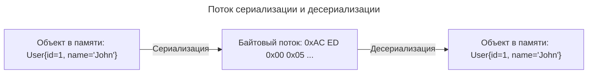

---
aliases:
  - "@JsonAutoDetect"
  - "@JsonIgnore"
  - "@JsonProperty"
  - Avro
  - Deserialization
  - Jackson
  - Java serialization
  - JSON serialization
  - Kryo
  - Marker interface
  - ObjectInputStream
  - ObjectMapper
  - ObjectOutputStream
  - Protobuf
  - Record
  - Serializable
  - Serialization
  - serialVersionUID
  - transient
  - writeValueAsString
  - Десериализация
  - Маркерный интерфейс
  - Сериализация
---
> `java.io.Serializable`

## interface Serializable

**Суть**

`Serializable` — это маркерный интерфейс (без методов), который указывает [[jvm|JVM]], что объекты класса можно сериализовать (преобразовать в байтовый поток) и десериализовать (восстановить из байтов).

**Сериализация** — это процесс сохранения состояния объекта в последовательность байт.

**Десериализация** — это процесс восстановления объекта из этих байт.

Любой Java-объект может быть преобразован в последовательность байт:



---

**Назначение**

| Сценарий | Пример |
|----------|--------|
| Сохранение состояния | Сериализация объекта в файл для восстановления позже |
| Передача по сети | Отправка объектов через RMI, sockets, JMS |
| Кэширование | Сохранение объектов в Redis/Memcached (в бинарном виде) |
| HTTP-сессии | Сериализация атрибутов сессии при кластеризации |
| Deep copy | Клонирование через сериализацию/десериализацию |

---

**Ключевые моменты**

**serialVersionUID**

```java
public class User implements Serializable {
    private static final long serialVersionUID = 1L; // Рекомендуется
    // ...
}
```

> **Зачем:** контроль совместимости версий. Если изменить класс без `serialVersionUID`, десериализация старой версии может упасть с `InvalidClassException`.

**transient — исключение поля из сериализации**

```java
public class User implements Serializable {
    private String name;

    private transient String password; // Не сохранится при сериализации
    private transient Logger logger;   // Не сериализуемые поля
}
```

**Наследование**

```java
// Если родитель сериализуем, дети тоже
public class BaseEntity implements Serializable { ... }
public class User extends BaseEntity { ... } // Автоматически Serializable

// Если родитель НЕ сериализуем, его поля не сохранятся
public class NonSerializableBase { private String secret; }
public class User extends NonSerializableBase implements Serializable {
    // secret не сериализуется, при десериализации будет null
}
```

---

**Пример использования**

```java
// Сериализация
User user = new User(1L, "John");
try (ObjectOutputStream oos = new ObjectOutputStream(
        new FileOutputStream("user.dat"))) {
    oos.writeObject(user);
}

// Десериализация
try (ObjectInputStream ois = new ObjectInputStream(
        new FileInputStream("user.dat"))) {
    User loaded = (User) ois.readObject();
}
```

---

**Важные предостережения**

| Проблема | Решение |
|----------|---------|
| Безопасность | Сериализованные данные можно подделать, поэтому валидируйте при десериализации |
| Хрупкость | Изменение класса может сломать десериализацию, поэтому указывайте `serialVersionUID` |
| Производительность | Стандартная сериализация медленная, поэтому используйте JSON/Protobuf |
| Размер | Бинарный формат громоздкий, поэтому используйте сжатие или альтернативы |

---

**Современные альтернативы**

| Формат | Плюсы | Минусы |
|--------|-------|--------|
| `Serializable` | ✅ Встроен в Java, простота | ❌ Медленно, небезопасно, хрупко |
| JSON (Jackson/[[gson|Gson]]) | ✅ Читаемо, кросс-платформенно | ❌ Нет сохранения ссылок/циклов |
| Protobuf / Avro | ✅ Быстро, компактно, схема | ❌ Требует генерации кода |
| Kryo | ✅ Быстрее стандартной сериализации | ❌ Внешняя зависимость |

---

**Особенности**

- ✅ Маркерный интерфейс для сериализации
- ✅ Используется для: сохранения, передачи по сети, кэширования
- ✅ Всегда добавляйте `private static final long serialVersionUID = 1L`
- ✅ `transient` исключает поле из сериализации
- ❌ Не используйте для публичных API, долгосрочного хранения
- ❌ Избегайте при нужде в кросс-языковой совместимости

---

**Итог**

| Вопрос | Ответ |
|--------|-------|
| Что делает Serializable? | Разрешает сериализацию объекта в байты |
| Когда использовать? | Внутреннее сохранение, кластеризация сессий, RMI |
| Когда не использовать? | Публичные API, долгосрочное хранение, кросс-платформенный обмен |
| Что обязательно? | `serialVersionUID`, осторожность с `transient` |
| Современная альтернатива? | JSON (Jackson), Protobuf, Avro |

---

## Serializable vs ObjectMapper

`Serializable` и `ObjectMapper.writeValueAsString()` — два независимых механизма сериализации.

**Сравнение механизмов**

| Характеристика | `Serializable` | Jackson `writeValueAsString()` |
|----------------|----------------|--------------------------------|
| Формат | Бинарный (Java-специфичный) | JSON (текстовый, кросс-платформенный) |
| Интерфейс | Требуется `implements Serializable` | ❌ Не требуется |
| Механизм | JVM internal (`ObjectOutputStream`) | [[reflection-api|Reflection]] + аннотации (`@JsonProperty`) |
| Читаемость | ❌ Нечитаемо (байты) | ✅ Человекочитаемо |
| Кросс-языковой | ❌ Только Java | ✅ Любой язык с JSON-парсером |
| `transient` | Исключает поле из сериализации | ❌ Игнорируется (используйте `@JsonIgnore`) |
| `serialVersionUID` | Обязателен для совместимости | ❌ Не используется |

---

**Пример: один класс, два способа**

```java
// Класс БЕЗ Serializable
public class User {
    private Long id;
    private String name;

    @JsonIgnore  // Jackson-аннотация
    private String password;

    // getters/setters
}
```

**Jackson (работает без Serializable)**

```java
ObjectMapper mapper = new ObjectMapper();
User user = new User(1L, "John", "secret123");

String json = mapper.writeValueAsString(user);
// Результат: {"id":1,"name":"John"}
// password исключён через @JsonIgnore
// Serializable не нужен
```

**Стандартная сериализация (упадёт без Serializable)**

```java
User user = new User(1L, "John", "secret123");

// NotSerializableException, если класс не реализует Serializable
try (ObjectOutputStream oos = new ObjectOutputStream(
        new FileOutputStream("user.dat"))) {
    oos.writeObject(user); // Exception!
}
```

```java
// Чтобы работало, нужно добавить:
public class User implements Serializable {
    private static final long serialVersionUID = 1L;
    // ...
}
```

---

**Как Jackson на самом деле работает**

1. Reflection: читает поля/геттеры.
2. Аннотации: `@JsonProperty`, `@JsonIgnore`, `@JsonFormat`.
3. Конвертация: Java-объект → JSON-дерево.
4. Сериализация: дерево → строка.

Jackson не проверяет `Serializable` и не использует `ObjectOutputStream`.

---

**Когда механизмы могут пересекаться**

**Класс реализует оба интерфейса**

```java
public class User implements Serializable {
    private static final long serialVersionUID = 1L;

    private Long id;

    @JsonIgnore  // для Jackson
    private transient String password;  // для Serializable

    // password не попадёт ни в JSON, ни в бинарную сериализацию
}
```

**Кэширование с разными стратегиями**

```java
@Service
public class UserService {

    // Кэш в памяти через Jackson
    private final Map<String, String> jsonCache = new ConcurrentHashMap<>();

    // Кэш на диск через бинарную сериализацию
    private final Map<String, byte[]> binaryCache = new ConcurrentHashMap<>();

    public void save(User user) {
        // JSON для быстрого доступа
        jsonCache.put(user.getId(), mapper.writeValueAsString(user));

        // Бинарный для долгосрочного хранения
        binaryCache.put(user.getId(), serializeBinary(user)); // требует Serializable
    }
}
```

**Миграция с Serializable на JSON**

```java
// Старый код (бинарная сериализация)
public class LegacyUser implements Serializable { ... }

// Новый код (JSON)
public class User { ... } // без Serializable

// Плавная миграция: поддерживаем оба формата
public class UserAdapter {
    public static User fromBinary(byte[] data) {
        // десериализация через ObjectInputStream
    }

    public static User fromJson(String json) {
        // десериализация через ObjectMapper
    }
}
```

---

**Выбор механизма**

- HTTP API: JSON (Jackson).
- Сохранение объекта в файл/БД для чтения в другой системе: JSON (Jackson) / Protobuf.
- Java RMI / старые системы: Serializable.
- Кэширование в Redis с кросс-языковым доступом: JSON (Jackson).
- Кэширование только для Java-приложений: можно Serializable, но JSON предпочтительнее.
- Нужна человекочитаемость / отладка: только JSON.

---

**Особенности**

| Параметр | Serializable | Jackson (ObjectMapper) |
|----------|--------------|------------------------|
| Формат | Бинарный, Java-специфичный | JSON, кросс-платформенный |
| Требование | `implements Serializable` | Не требуется |
| Исключение полей | `transient`, `serialVersionUID` | `@JsonIgnore`, `@JsonProperty` |
| Независимость | Можно использовать оба независимо в одном классе |

---

**Итог**

| Вопрос | Ответ |
|--------|-------|
| Нужен ли `Serializable` для `writeValueAsString()`? | ❌ Нет |
| Может ли Jackson сериализовать класс без `Serializable`? | ✅ Да |
| Что использовать для новых проектов? | ✅ Jackson (JSON) |
| Когда ещё нужен `Serializable`? | RMI, кластеризация сессий, легаси |
| Можно ли использовать оба? | ✅ Да, для разных целей |

---

## ObjectMapper serialization criteria

Для успешной сериализации через `ObjectMapper.writeValueAsString()` класс или [[record-type|record]] должен быть инстанцируемым и иметь доступные для чтения свойства (геттеры, публичные поля или конструктор с `@JsonProperty`). `Serializable` не требуется.

**Основные требования**

| Требование | Класс | Record | Зачем нужно |
|------------|-------|--------|-------------|
| Конструктор | ✅ No-arg или `@JsonProperty` | ✅ Канонический (авто) | Создание экземпляра при десериализации |
| Геттеры / поля | ✅ `getXxx()`, `isXxx()` или public field | ✅ Компоненты записи (авто) | Чтение значений при сериализации |
| Не абстрактный | ✅ Конкретный класс | ✅ (запись не может быть абстрактной) | Возможность инстанцирования |
| Вложенные типы | ✅ Также должны быть сериализуемы | ✅ Также должны быть сериализуемы | Рекурсивная обработка |
| Нет циклических ссылок | ⚠️ Или обработать аннотациями | ⚠️ Или обработать аннотациями | Избежать `StackOverflowError` |

---

**Примеры**

**Минимальный рабочий класс**

```java
public class User {
    private Long id;
    private String name;

    // No-arg конструктор (для десериализации)
    public User() {}

    public User(Long id, String name) {
        this.id = id;
        this.name = name;
    }

    // Геттеры (для сериализации)
    public Long getId() { return id; }
    public String getName() { return name; }
}

// Использование:
ObjectMapper mapper = new ObjectMapper();
String json = mapper.writeValueAsString(new User(1L, "John"));
// {"id":1,"name":"John"}
```

**Immutable класс с @JsonProperty**

```java
public class User {
    private final Long id;
    private final String name;

    // Конструктор с @JsonProperty для десериализации
    public User(
        @JsonProperty("id") Long id,
        @JsonProperty("name") String name
    ) {
        this.id = id;
        this.name = name;
    }

    // Геттеры для сериализации
    public Long getId() { return id; }
    public String getName() { return name; }
}
```

**Record (Java 14+, Jackson 2.12+)**

```java
// Record работает из коробки (Jackson 2.12+)
public record User(Long id, String name) {}

// Сериализация:
String json = mapper.writeValueAsString(new User(1L, "John"));
// {"id":1,"name":"John"}

// Десериализация:
User user = mapper.readValue(json, User.class);
```

---

**Как Jackson читает свойства**

**Стандартная видимость по умолчанию**

```java
MapperFeature.DEFAULT_VIEW_INCLUSION = true
```

| Элемент | Сериализуется? |
|---------|---------------|
| `public` поле | ✅ Да |
| `public` геттер (`getXxx()`, `isXxx()`) | ✅ Да |
| `private` поле без геттера | ❌ Нет |
| `protected` / `package-private` | ❌ Нет (по умолчанию) |

**Изменение видимости через `@JsonAutoDetect`**

```java
@JsonAutoDetect(
    fieldVisibility = JsonAutoDetect.Visibility.ANY,      // все поля
    getterVisibility = JsonAutoDetect.Visibility.NONE     // игнорировать геттеры
)
public class User {
    private Long id;   // будет сериализовано напрямую
    // без геттеров — ок
}
```

**Явное указание через `@JsonProperty`**

```java
public class User {
    @JsonProperty("user_id")  // переименование в JSON
    private Long id;

    @JsonIgnore               // исключить из сериализации
    private String password;

    @JsonInclude(JsonInclude.Include.NON_NULL)  // пропускать null
    private String email;
}
```

---

**Распространённые ошибки и решения**

**Ошибка 1: нет геттеров и нет публичных полей**

```java
public class User {
    private Long id;  // private, нет геттера
    private String name;
}

// Результат: {} — поля не видны для Jackson
```

**Решение:** добавить геттеры или `@JsonAutoDetect`

```java
// Вариант 1: геттеры
public Long getId() { return id; }

// Вариант 2: изменить видимость
@JsonAutoDetect(fieldVisibility = JsonAutoDetect.Visibility.ANY)
public class User { ... }
```

---

**Ошибка 2: нет конструктора для десериализации**

```java
public class User {
    private final Long id;  // final без конструктора

    public User(Long id) { this.id = id; }  // есть конструктор
    public Long getId() { return id; }
}

// Десериализация упадёт, если нет no-arg или @JsonProperty
```

**Решение:**

```java
// Вариант 1: добавить no-arg конструктор
public User() { this.id = null; }

// Вариант 2: использовать @JsonProperty на параметрах
public User(@JsonProperty("id") Long id) { this.id = id; }

// Вариант 3: включить настройку
mapper.configure(MapperFeature.ACCEPT_CASE_INSENSITIVE_CONSTRUCTORS, true);
```

---

**Ошибка 3: циклические ссылки**

```java
public class User {
    public List<Order> orders;  // Order имеет поле user → цикл!
}
public class Order {
    public User user;  // обратно к User
}

// StackOverflowError при сериализации
```

**Решение:**

```java
// Вариант 1: @JsonIgnore
public class Order {
    @JsonIgnore
    public User user;
}

// Вариант 2: @JsonManagedReference / @JsonBackReference
public class User {
    @JsonManagedReference
    public List<Order> orders;
}
public class Order {
    @JsonBackReference
    public User user;
}

// Вариант 3: @JsonIdentityInfo (по ID)
@JsonIdentityInfo(generator = ObjectIdGenerators.PropertyGenerator.class, property = "id")
public class User { ... }
```

---

**Ошибка 4: null в результате**

```java
public class User {
    private String email;  // null по умолчанию
    // геттер есть
}

// Результат: {"email":null}
```

**Решение:**

```java
// Глобально для ObjectMapper:
mapper.setSerializationInclusion(JsonInclude.Include.NON_NULL);

// Или локально на поле:
@JsonInclude(JsonInclude.Include.NON_NULL)
private String email;
```

---

**Record vs Class**

| Критерий | Class | Record |
|----------|-------|--------|
| Конструктор | Нужен no-arg или `@JsonProperty` | ✅ Канонический авто |
| Геттеры | Нужны `getXxx()` | ✅ Авто (метод с именем компонента) |
| Мутабельность | Может быть mutable | ✅ Всегда [[immutable|immutable]] |
| Jackson поддержка | ✅ Всегда | ✅ С версии 2.12+ |
| Код | Больше (боилерплейт) | ✅ Минимум кода |
| Десериализация | ⚠️ Требует настройки | ✅ Работает из коробки |

**Пример: минимальный record**

```java
// Всё, что нужно:
public record Order(Long id, String product, BigDecimal price) {}

// Сериализация:
mapper.writeValueAsString(new Order(1L, "Laptop", new BigDecimal("999.99")));
// {"id":1,"product":"Laptop","price":999.99}

// Десериализация:
Order order = mapper.readValue(json, Order.class);
```

---

**Настройка ObjectMapper для гибкости**

```java
ObjectMapper mapper = new ObjectMapper();

// Принимать private поля
mapper.setVisibility(PropertyAccessor.FIELD, JsonAutoDetect.Visibility.ANY);

// Игнорировать неизвестные свойства при десериализации
mapper.configure(DeserializationFeature.FAIL_ON_UNKNOWN_PROPERTIES, false);

// Не сериализовать null
mapper.setSerializationInclusion(JsonInclude.Include.NON_NULL);

// Форматировать даты
mapper.registerModule(new JavaTimeModule());
mapper.disable(SerializationFeature.WRITE_DATES_AS_TIMESTAMPS);

// Красивый вывод (для отладки)
mapper.enable(SerializationFeature.INDENT_OUTPUT);
```

---

**Чек-лист: работает ли класс с Jackson**

- Класс не абстрактный.
- Есть public no-arg конструктор или `@JsonProperty` на параметрах.
- Есть геттеры (`getXxx`/`isXxx`) или публичные поля.
- Вложенные объекты тоже сериализуемы.
- Нет циклических ссылок (или обработаны).
- Для record: Jackson ≥ 2.12.

Если всё выполнено, `writeValueAsString()` сработает.

---

**Особенности**

- ✅ Класс: no-arg конструктор + геттеры.
- ✅ Immutable: `@JsonProperty` на конструкторе.
- ✅ Record: работает из коробки (Jackson 2.12+).
- ✅ Поля: public или геттеры или `@JsonAutoDetect`.
- ❌ Не нужно: `implements Serializable`.
- ❌ Не нужно: public fields (если есть геттеры).
- ⚠️ Осторожно: циклические ссылки, null-значения.

---

**Итог**

| Вопрос | Ответ |
|--------|-------|
| Нужен ли `Serializable`? | ❌ Нет, не требуется |
| Минимальные требования для класса? | No-arg конструктор + геттеры |
| Работают ли records? | ✅ Да, с Jackson 2.12+ |
| Как сериализовать приватные поля? | `@JsonAutoDetect` или публичные геттеры |
| Что делать с циклическими ссылками? | `@JsonIgnore`, `@JsonBackReference`, `@JsonIdentityInfo` |
