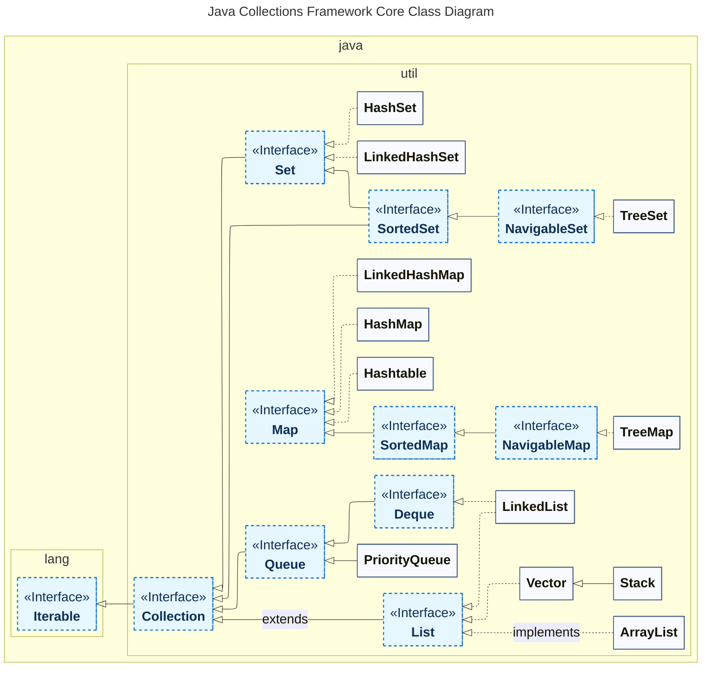
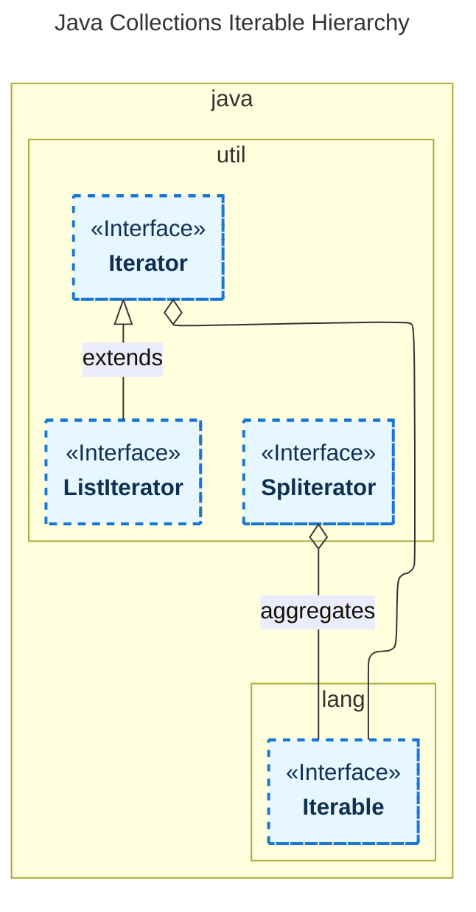

---
aliases:
  - ArrayDeque
  - ArrayList
  - buckets
  - Collection
  - Collection Framework
  - Collections
  - Comparator
  - Deque
  - Dequeue
  - Entry
  - Enumeration
  - HashMap
  - HashSet
  - Hashtable
  - initial capacity
  - Iterable
  - Iterator
  - java.util.Collection
  - LinkedHashMap
  - LinkedHashSet
  - LinkedList
  - List
  - ListIterator
  - load factor
  - Map
  - NavigableMap
  - NavigableSet
  - PriorityQueue
  - Queue
  - RBTree
  - Red-Black Tree
  - Set
  - SortedMap
  - SortedSet
  - Spliterator
  - Stack
  - TreeMap
  - TreeSet
  - Vector
  - Итератор
  - Коллекции
  - Коллекция
  - Красно-чёрное дерево
  - Множество
  - Очередь
  - Список
---
> `java.util.Collection`

## Структура Java Collection Framework

**Java Collection** — это фреймворк, который обеспечивает унифицированную архитектуру для управления групповыми структурами данных.

- Java Collection Framework включена в [[jdk-jls-jni|JDK]].
- Java Collection Framework представляет собой иерархию интерфейсов и классов.



`Collection` и `Map` разделяют все коллекции фреймворка по типу хранения данных: линейные наборы данных и наборы вида «ключ — значение» (словари).

![[Untitled 12 3.png|Untitled 12 3.png]]

## interface Map

Определяет базовые методы для работы с данными вида «ключ — значение», выраженными через интерфейс `Entry<K, V>`.

**Основные методы**

```java
V get(Object key);
V put(K key, V value);
V remove();
void putAll();
void clear();
Set<K> keySet();
Collection<V> values();
Set<Map.Entry<K, V>> entrySet(); // set view of the mappings contained in this map
boolean equals(Object o);
V getOrDefault(Object key, V defaultValue);
void forEach(BiConsumer<? super K, ? super V> action);
void replaceAll(BiFunction<? super K, ? super V, ? extends V> function); // replaces each entry's value
V putIfAbsent(K key, V value);
boolean replace(K key, V oldValue, V newValue);
V replace(K key, V value);
computeIfAbsent();
computeIfPresent();
compute(); // attempts to compute a mapping for the specified key and its current mapped value
merge();
of();
ofEntries();
entry();
```

### class HashMap

`extends AbstractMap<K, V>` `implements Map<K, V>, Cloneable, Serializable`

Обеспечивает константное время для базовых операций (get и put). Не синхронизирован и допускает null.

- Операции поиска и модификации выполняются за константное время при условии, что распределение по бакетам **buckets** близко к равномерному.
- Элементы хранятся в случайном порядке.
- Небезопасная структура для потоков. Можно обернуть в `Collections.synchronizedMap(...)`, чтобы решить проблему.
  - `Map m = Collections.synchronizedMap(new HashMap(...));`
- Производительность зависит от **initial capacity** и **load factor**:
  - конструктор `HashMap(int initialCapacity, float loadFactor)`
  - `loadFactor` — показатель того, сколько должно быть элементов, прежде чем размер (capacity) увеличится. По умолчанию равен `0,75`
  - когда количество объектов `Entry<K, V>` превышает произведение `loadFactor * capacity`, [[hash-table|хэш-таблица]] повторно хэшируется примерно в два раза больше сегментов
- В основе структуры лежит массив, разделённый на ячейки — **buckets**.

**Как происходит добавление `Entry<K, V>`**

1. Берём хэшкод ключа объекта Entry: `int K.hashCode()`.
2. По хэшкоду берём хэш при помощи `int HashMap.hash(Object key)`.
   - Это нужно для более равномерного распределения по бакетам.
   - Если `key == null`, вручную возвращаем `0`. Объекты с null-ключом гарантированно попадают в бакет 0.
3. Вычисляем индекс бакета по хэшу: логическое И значения хэша и (количество бакетов - 1).
   - если в бакете пусто, кладём туда `Entry<K, V>`
   - если в бакете до 8 элементов, они структурируются в `LinkedList<Entry<K, V>>`
     - начиная с 8 элементов коллекция в бакете преобразуется в красно-чёрное дерево

**Как происходит поиск по ключу**

1. Вычисляем индекс бакета: хэшкод ключа пропускаем через `int HashMap.hash(Object key)`, применяем логическое И к значению хэша и (количество бакетов - 1).
   - если в бакете пусто — возвращаем null
   - если в бакете список или дерево, рекурсивно обходим и сравниваем `hashCode()`. Если `hashCode()` совпал, сравниваем ключи по `equals()`. Если в бакете один элемент — проводим такое же сравнение

**HashMap vs Hashtable**

| Параметр | HashMap | Hashtable |
|----------|---------|-----------|
| Потокобезопасность | ❌ Нет | ✅ Да |

### class LinkedHashMap

`extends HashMap<K, V>` `implements Map<K, V>`

Обеспечивает константное время для базовых операций (add, contains, remove), если хэш-функция равномерно распределяет элементы по бакетам.

- Элементы хранятся в порядке добавления.
- Операции поиска и модификации выполняются за константное время.

### interface SortedMap

`extends Map<K, V>`

В интерфейсе появился компаратор.

```java
Comparator<? super K> comparator();
```

### interface NavigableMap

`extends SortedMap<K, V>`

Появились методы работы с последовательностью.

```java
lowerEntry()
lowerKey()
floorEntry()
floorKey()
ceilingEntry()
ceilingKey()
higherEntry()
higherKey()
firstEntry()
lastEntry()
pollFirstEntry()
pollLastEntry()
descendingMap()
navigableKeySet()
descendingKeySet()
subMap()
headMap()
tailMap()
```

### class TreeMap

`extends AbstractMap<K, V>` `implements NavigableMap<K, V>, Cloneable, Serializable`

Основные операции (`containsKey()`, `get()`, `put()`, `remove()`) работают за логарифмическое время. Алгоритмы адаптированы из «Introduction to Algorithms» #📘 (Cormen #👨, Leiserson, Rivest).

Элементы хранятся в заданном порядке. Должны быть `Comparable` либо `Comparator`.

### class Hashtable

`extends Dictionary<K, V>` `implements Map<K, V>, Cloneable, Serializable`

На производительность влияют два параметра: `initialCapacity` и `loadFactor`.

Load factor (0.75) обеспечивает хороший баланс между затратами времени и памяти. Большие значения уменьшают накладные расходы памяти, но увеличивают время поиска записи.

Начальная ёмкость определяет баланс между расходом памяти и необходимостью рехэширования, которое затратно по времени.

```java
Hashtable()
Hashtable(int initialCapacity, float loadFactor)
```

## interface Collection

`extends Iterable<E>` `import java.util.Collection`

Корневой интерфейс для последовательных коллекций.

**Включает методы**

```java
boolean add(E e)
boolean addAll(Collection c) // добавить к одной коллекции другую
void clear()
boolean contains(Object e)
boolean containsAll(Collection c) // одна коллекция содержит другую
boolean equals(Object o)
int hashCode()
boolean isEmpty()
Iterator iterator()
Stream parallelStream()
boolean remove(Object e)
boolean removeAll(Collection c) // удалить из одной коллекции другую
boolean removeIf(Predicate filter)
boolean retainAll(Collection c) // оставить только общие элементы
int size()
Stream stream()
Spliterator spliterator()
Object[] toArray()
T[] toArray(T[] a) // Convert collection into an array
```

**Пример использования**

```java
Collection<String> stringCollection = new ArrayList<>();
stringCollection.add("hello");
stringCollection.add("world");
System.out.println("Number of elements: " + stringCollection.size());
```

### interface List

`interface List<E> extends Collection<E>`

Упорядоченная коллекция элементов.

У всех элементов коллекции есть индекс, поэтому появились методы, позволяющие обращаться через индекс.

```java
E set(int index, E element)
E get(int index)
int indexOf(Object o)
void add(int index, E element)
boolean addAll(int index, Collection<? extends E> c)
List<E> subList(int fromIndex, int toIndex)
E remove(int index)
ListIterator<E> listIterator()
```

#### class LinkedList

`extends AbstractSequentialList<E>` `implements List<E>, Deque<E>, Cloneable, Serializable`

Основан на двунаправленном связном списке. Добавление и удаление выполняются за константу, поиск — за линейное время. Связный список состоит из сущностей с полями: значение, ссылка на следующую сущность. Позволяет хранить фрагментированные данные.

#### class ArrayList

`extends AbstractList<E>` `implements List<E>, RandomAccess, Cloneable, Serializable`

Основан на массиве. Поиск — за константное время. При заполнении массива создаётся новый примерно в полтора раза больше. Объект массива хранится в памяти единым блоком, поэтому плохой вариант при дефиците памяти.

| Операция | Поиск | Добавление | Удаление |
|----------|-------|------------|----------|
| LinkedList | O(n) | O(1) | O(1) |
| ArrayList | O(1) | O(n) | O(n) |

#### class Vector

`extends AbstractList` `implements List, RandomAccess, Cloneable, Serializable`

Потокобезопасный `ArrayList`. Блокирует объект для других потоков при обращении. Добавление и удаление объектов медленнее. Устарел.

#### class Stack

`extends Vector` `java.util.Stack`

Реализация стека («стопка бумаг», модель LIFO). Добавились методы:

```java
E push(E item) // добавить в голову
E peek() // показать верхний элемент без удаления из стека
E pop() // выдать верхний элемент с удалением из стека
```

Устарел. Рекомендуется использовать `Deque`.

### interface Queue

`extends Collection<E>`

Очередь FIFO.

```java
boolean add(E e)
boolean offer(E e) // добавить элемент, если возможно
E remove() // получить элемент из головы и удалить его из очереди
E poll() // то же, что и remove(), только null вместо NoSuchElementException
E element() // получить элемент из головы, но не удалять из очереди
E peek() // то же, что и element(), только null вместо NoSuchElementException
```

#### class PriorityQueue

`extends AbstractQueue implements Queue, Serializable`

- Позволяет сортировать элементы.
  - все элементы должны быть comparable
- Добавление и удаление элементов за логарифмическое время (balanced binary heap)
- Чтение за константу, так как реализация основана на массиве

#### interface Deque

`extends Queue<E>`

Двусторонняя очередь, позволяющая реализовать LIFO и FIFO. Рекомендуется использовать вместо устаревшего `Stack`. Добавились методы:

```java
void addFirst(E e)
void addLast(E e)
boolean offerFirst(E e)
boolean offerLast(E e)
E removeFirst()
E removeLast()
E pollFirst()
E pollLast()
E getFirst()
E getLast()
E peekFirst()
E peekLast()
boolean removeFirstOccurrence(Object o)
boolean removeLastOccurrence(Object o)
Iterator<E> iterator()
Iterator<E> descendingIterator() // элементы от хвоста к голове
```

#### class LinkedList (как Queue)

См. также: [[java-collection-framework|java-collection-framework]].

```java
Queue<String> que = new LinkedList<>();
que.offer("first");
que.offer("second");
System.out.println(que.peek()); // first
System.out.println(que.poll()); // first
System.out.println(que.poll()); // second
System.out.println(que.poll()); // null
```

#### class ArrayDeque

`extends AbstractCollection<E>` `implements Deque<E>, Cloneable, Serializable`

Реализация двусторонней очереди на основе массива.

- Быстрее, чем `Stack`, если используется как LIFO.
- Быстрее, чем `LinkedList`, если используется как FIFO.

### interface Set

`extends Collection<E>`

Неупорядоченное множество элементов. Дубли запрещены. Аналог математического множества. Получать объекты можно только через `Iterator`.

```java
Object[] toArray()
<E> Set<E> of() // Returns an unmodifiable set containing zero elements
```

#### class HashSet

`extends AbstractSet<E>` `implements Set<E>, Cloneable, Serializable`

Основные операции (add, remove, contains, size) выполняются за константное время.

```java
static <T> HashSet<T> newHashSet(int numElements)
HashSet(int initialCapacity, float loadFactor)
```

#### class LinkedHashSet

`extends HashSet<E>` `implements Set<E>, Cloneable, Serializable`

Множество, в котором сохраняется порядок элементов согласно очерёдности добавления. Базовые операции (add, contains, remove) выполняются за константное время.

```java
LinkedHashSet(int initialCapacity, float loadFactor)
```

#### interface SortedSet

`extends Set<E>`

Упорядоченное множество элементов. Элементы реализуют интерфейс `Comparable` или указан `Comparator`.

```java
E first() // наименьший элемент множества
E last() // наибольший элемент множества
SortedSet<E> subSet(E fromElement, E toElement) // элементы из диапазона [fromElement, toElement)
SortedSet<E> headSet(E toElement) // элементы меньше toElement
SortedSet<E> tailSet(E fromElement) // элементы больше или равны fromElement
```

#### interface NavigableSet

`extends SortedSet<E>`

Упорядоченное множество с возможностью менять направление сортировки.

```java
E floor(E e) // наибольший элемент <= e
E ceiling(E e) // наименьший элемент >= e
E pollFirst() // извлечение и удаление наименьшего элемента
E pollLast() // извлечение и удаление наибольшего элемента
NavigableSet<E> descendingSet() // вид в обратном порядке
Iterator<E> descendingIterator()
```

`descendingSet()` возвращает вид (view), то есть не копию множества, а ссылки на объекты множества в обратном порядке. При изменении элементов вида меняются элементы множества.

#### class TreeSet

`extends AbstractSet<E>` `implements NavigableSet<E>, Cloneable, Serializable`

В основе лежат [[algorithm|красно-чёрные деревья]] (RBTree): логарифмическая сложность для основных операций (add, remove, contains).

```java
@Test
public void whenUsingTailSet_shouldReturnTailSetElements() {
    NavigableSet<Integer> treeSet = new TreeSet<>(Arrays.asList(1, 2, 3, 4, 5, 6));
    Set<Integer> subSet = treeSet.tailSet(3);
    assertEquals(subSet, treeSet.subSet(3, true, 6, true));
}
```

## Iterator vs ListIterator vs Spliterator

Сравнительная таблица:

| Характеристика | Iterator | ListIterator | Spliterator |
|----------------|----------|--------------|-------------|
| Направление обхода | Вперёд | Вперёд и назад | Вперёд |
| Модификация коллекции | Удаление (`remove()`) | Добавление, удаление, замена | Нет |
| Работа с индексами | Нет | Да (`nextIndex()`, `previousIndex()`) | Нет |
| Параллельная обработка | Нет | Нет | Да (`trySplit()`) |
| Тип коллекций | Любые `Iterable` | Только `List` | Любые `Iterable`, массивы, потоки |
| Fail-fast | Да (обычно) | Да (обычно) | Да (при изменении источника) |
| Основное применение | Общий обход коллекций | Детальная работа со списками | Параллельные потоки, большие данные |

Итераторы являются частью любой коллекции.



### Iterator

**Назначение:** базовый инструмент для однопроходного обхода любой коллекции (List, Set, Map.values и др.).

**Ключевые методы:**

- `hasNext()` — есть ли следующий элемент
- `next()` — вернуть следующий элемент
- `remove()` — удалить текущий элемент (опционально)

**Особенности:**

- Однонаправленный обход — только вперёд (`next()`).
- Минимальные возможности — чтение и удаление (не всегда поддерживается).
- Fail-fast — вызывает `ConcurrentModificationException` при изменении коллекции во время итерации (если реализация поддерживает).
- Универсальность — работает с любой коллекцией, реализующей интерфейс `Iterable`.

**Пример:**

```java
List<String> list = Arrays.asList("a", "b", "c");
Iterator<String> it = list.iterator();
while (it.hasNext()) {
    String item = it.next();
    System.out.println(item);
    // it.remove(); // можно удалить текущий элемент
}
```

### ListIterator

**Назначение:** расширенный итератор для списков (`ArrayList`, `LinkedList` и др.), поддерживающий двунаправленный обход и модификацию.

**Ключевые методы** (дополнительно к `Iterator`):

- `hasPrevious()` — есть ли предыдущий элемент
- `previous()` — вернуть предыдущий элемент
- `add(E e)` — вставить элемент перед текущим
- `set(E e)` — заменить текущий элемент
- `nextIndex()` / `previousIndex()` — получить индекс текущего положения

**Особенности:**

- Двунаправленный обход — вперёд и назад.
- Полная модификация — добавление, удаление, замена элементов во время итерации.
- Работа с индексами — можно отслеживать позицию в списке.
- Только для списков — не работает с `Set`, `Map` и др.
- Fail-fast — аналогично `Iterator`.

**Пример:**

```java
List<String> list = new ArrayList<>(Arrays.asList("a", "b", "c"));
ListIterator<String> lit = list.listIterator();
while (lit.hasNext()) {
    String item = lit.next();
    if ("b".equals(item)) {
        lit.set("B");  // заменить "b" на "B"
        lit.add("X");  // вставить "X" после "B"
    }
}
// Список станет: ["a", "B", "X", "c"]
```

### Spliterator

**Назначение:** итератор для параллельной обработки больших коллекций и потоков (`Stream`). Введён в Java 8.

**Ключевые методы:**

- `tryAdvance(Consumer<? super T> action)` — обработать следующий элемент (если есть)
- `forEachRemaining(Consumer<? super T> action)` — обработать все оставшиеся элементы
- `trySplit()` — разделить на две части для параллельной обработки
- `estimateSize()` — оценить количество оставшихся элементов

**Особенности:**

- Параллелизм — поддерживает разбиение (`trySplit()`) для обработки в нескольких потоках.
- Внутренняя итерация — управление обходом берёт на себя `Spliterator`, а не вызывающий код.
- Работа с потоками — основное применение в [[stream-api|Stream API]] (`parallelStream()`).
- Только чтение — не поддерживает модификацию коллекции во время обхода.
- Гибкая оценка размера — `estimateSize()` может возвращать приблизительное значение.
- Потокобезопасность — при корректном использовании может работать в многопоточной среде.

**Пример** (низкоуровневое использование):

```java
List<String> list = Arrays.asList("a", "b", "c", "d");
Spliterator<String> spliterator = list.spliterator();

// Разделить на две части
Spliterator<String> part1 = spliterator.trySplit();
Spliterator<String> part2 = spliterator;

// Обработать части в разных потоках
part1.forEachRemaining(System.out::println);  // "a", "b"
part2.forEachRemaining(System.out::println);  // "c", "d"
```

### Enumeration

Устаревший интерфейс, заменён на `Iterator`.

> **Примечание:** в большинстве случаев для обхода коллекций достаточно `for-each` или Stream API, которые внутренне используют `Iterator`/`Spliterator`. Явное применение этих интерфейсов нужно при реализации кастомных коллекций или низкоуровневой оптимизации.
