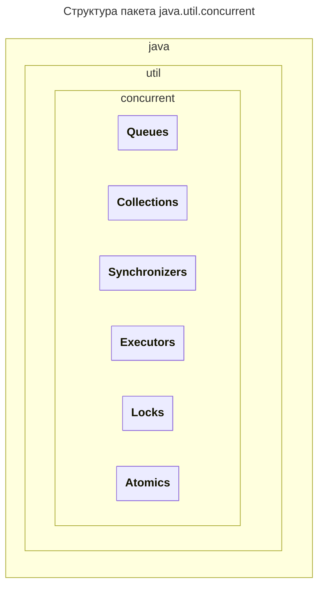
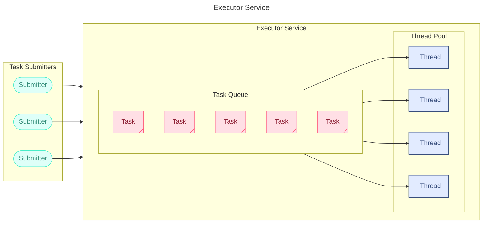

---
aliases:
  - Atomic
  - AtomicInteger
<<<<<<< HEAD
=======
  - Atomic operations
  - Atomics
>>>>>>> 8667d92 (stashing)
  - Callable
  - CAS
  - Compare-And-Swap
  - compareAndSet
  - Condition
<<<<<<< HEAD
=======
  - Condition queue
  - Concurrent
  - concurrency
>>>>>>> 8667d92 (stashing)
  - CountDownLatch
  - CyclicBarrier
  - DelayQueue
  - Exchanger
  - Executor
  - Executors
  - ExecutorService
  - ForkJoinPool
  - Future
  - Java Concurrency Utilities
  - java.util.concurrent
  - Lock
  - LockSupport
  - LongAdder
<<<<<<< HEAD
  - Phaser
  - PriorityBlockingQueue
  - ReadWriteLock
=======
  - Mutex
  - parallelism
  - Parallel computing
  - Phaser
  - PriorityBlockingQueue
  - ReadWriteLock
  - Reentrant lock
>>>>>>> 8667d92 (stashing)
  - ReentrantLock
  - ReentrantReadWriteLock
  - Runnable
  - ScheduledExecutorService
  - Semaphore
  - Synchronizers
  - SynchronousQueue
<<<<<<< HEAD
  - Thread pool
  - ThreadPoolExecutor
  - Атомарные классы
  - Блокирующая очередь
  - Пул потоков
  - Семафор
  - Синхронизаторы
---


## Структура пакета concurrent
> `java.util.concurrent`
> *concurrent ≅ параллельный*
=======
  - Thread
  - Thread pool
  - ThreadPoolExecutor
  - Virtual threads
  - атомарные классы
  - атомарные операции
  - Атомарные классы
  - Барьерная синхронизация
  - Блокирующая очередь
  - блокировка чтения-записи
  - Защёлка с обратным отсчётом
  - Кража работы
  - конкурентность
  - Многопоточность
  - Мьютекс
  - оптимистическая блокировка
  - Очередь условия
  - Параллелизм
  - Параллельные вычисления
  - Поток
  - Потоки
  - Пул потоков
  - повторно используемая блокировка
  - повторно используемая блокировка чтения-записи
  - Повторно используемая блокировка
  - Повторно используемая блокировка чтения-записи
  - Семафор
  - синхронизация
  - Синхронизаторы
  - справедливость
  - Циклический барьер
---

## Структура пакета concurrent

`java.util.concurrent`

*concurrent ≅ параллельный*
>>>>>>> 8667d92 (stashing)



Пакет concurrent включает в себя блоки:

1. `Collections` — набор коллекций, работающих в многопоточной среде эффективнее стандартных из пакета java.util.
2. `Queues` — создание блокирующих и неблокирующих очередей с поддержкой многопоточности.
3. `Synchronizers` — объекты синхронизации, позволяющие управлять и/или ограничивать работу нескольких потоков.
4. `Atomics` — набор атомарных классов, использующих принцип оптимистической блокировки для выполнения атомарных операций.
5. `Locks` — механизмы синхронизации потоков, альтернативы базовым `synchronized`, `wait`, `notify`, `notifyAll`.
6. `Executors` — механизмы создания пулов потоков и планирования работы асинхронных задач.

## Concurrent Collections

`java.util.concurrent.*`

Реализации интерфейсов List, Set и Map в Collection Framework стабильно работают только в монопоточном режиме.

Виды реализаций [[java-concurrent-collections|Concurrent collections]]:

- `CopyOnWrite*` — коллекции для интерфейсов Set, List
- `Concurrent*` — коллекции для интерфейсов Queue, Set, Map
- `BlockingQueue` — коллекции для интерфейса Queue
<<<<<<< HEAD
=======

>>>>>>> 8667d92 (stashing)
## Синхронизаторы (Synchronizers)

Мьютекс встроен в класс Object и, следовательно, имеется у каждого объекта.

Пакет `java.util.concurrent` содержит пять объектов синхронизации, позволяющих накладывать определённые условия для синхронизации потоков.

<<<<<<< HEAD
1. **Semaphore** («семафор») — ограничивает одновременный доступ к общему ресурсу нескольким потокам с помощью счётчика. При запросе разрешения и значении счётчика больше нуля доступ предоставляется, а счётчик уменьшается; в противном случае доступ запрещается. При освобождении ресурса значение счётчика увеличивается. Количество разрешений определяется в конструкторе. Второй конструктор добавляет параметр «справедливости», определяющий порядок предоставления разрешения ожидающим доступа потокам.
=======
1. **Semaphore** («семафор») — ограничивает одновременный доступ к общему ресурсу нескольким потокам с помощью счётчика. При запросе разрешения и значении счётчика больше нуля доступ предоставляется, а счётчик уменьшается; в противном случае доступ запрещается. При освобождении ресурса значение счётчика увеличивается. Количество разрешений определяется в конструкторе. Второй конструктор добавляет параметр справедливости, определяющий порядок предоставления разрешения ожидающим доступа потокам.
>>>>>>> 8667d92 (stashing)
2. **CountDownLatch** («защёлка с обратным отсчётом») — блокирует один или несколько потоков, пока не будут выполнены определённые условия. Количество условий задаётся счётчиком. При обнулении счётчика блокировки снимаются, и потоки продолжают выполнение. Счётчик одноразовый и не может быть инициализирован заново.
3. **CyclicBarrier** («циклический барьер») — используется, как правило, в распределённых вычислениях. Барьерная синхронизация останавливает участника (поток) в определённом месте в ожидании остальных потоков группы. Как только все потоки достигли барьера, он снимается, и выполнение продолжается. В отличие от `CountDownLatch`, барьер можно использовать повторно (в цикле).
4. **Phaser** — объект синхронизации типа «барьер», но, в отличие от `CyclicBarrier`, может иметь несколько барьеров (фаз), и количество участников на каждой фазе может быть разным.
5. **Exchanger** — объект синхронизации для двустороннего обмена данными между двумя потоками. Допускаются null-значения, что позволяет использовать класс для односторонней передачи объекта или просто как синхронизатор. Обмен выполняется вызовом метода `exchange`, сопровождающимся самоблокировкой потока.

### class Semaphore

`implements Serializable` `package java.util.concurrent`

Основные методы: создать семафор, задать количество одновременных разрешений для потоков, получать разрешения и возвращать их назад. Конкурирующие потоки будут ожидать, пока число разрешений не станет больше 0.

<<<<<<< HEAD
```java
=======
Конструкторы и методы Semaphore:

```text
>>>>>>> 8667d92 (stashing)
public void acquire() throws InterruptedException // получает разрешение, блокируя поток, пока оно недоступно
public void release() // возвращает разрешение семафору
public Semaphore(int permits)
public Semaphore(int permits, boolean fair) // если fair = true, семафор гарантирует FIFO-предоставление
```

![[Untitled 5.gif|Untitled 5.gif]]

### class CountDownLatch

`import java.util.concurrent.CountDownLatch`

Объект синхронизации потоков `CountDownLatch`, блокирующий один или несколько потоков до тех пор, пока не будут выполнены определённые условия. Количество условий задаётся счётчиком. При обнулении счётчика, то есть при выполнении всех условий, блокировки снимаются, и потоки продолжают выполнение. Пример: экскурсовод, собирающий группу из заданного количества туристов; как только группа собрана, она отправляется на экскурсию. Счётчик одноразовый и не может быть инициализирован заново.

![[Untitled 1 2.gif|Untitled 1 2.gif]]

### class CyclicBarrier

`import java.util.concurrent.CyclicBarrier`

Объект синхронизации `CyclicBarrier` представляет собой барьерную синхронизацию, используемую, как правило, в распределённых вычислениях. Эффективно использование барьеров при циклических расчётах. Алгоритм расчёта делят на несколько потоков; с помощью барьера организуют точку сбора частичных результатов, в которой подводится итог этапа вычислений.

Барьер для группы потоков означает, что каждый поток должен остановиться в определённом месте и ожидать прихода остальных. Как только все потоки достигли барьера, их выполнение продолжается.

![[Untitled 2 2.gif|Untitled 2 2.gif]]

### class Phaser

`import java.util.concurrent.Phaser`

Параллельный алгоритм делится на фазы синхронизации. Каждая фаза представляет собой циклический барьер.

- `Phaser` может иметь несколько фаз (барьеров). Если количество фаз равно 1, он сводится к `CyclicBarrier` (остаётся только остановить исполнительные потоки у барьера).
- Каждая фаза (цикл синхронизации) имеет свой номер.
- Количество участников-потоков для каждой фазы жёстко не задано и может меняться. Поток может регистрироваться в качестве участника и отменять своё участие.
- Исполнительный поток не обязан ожидать, пока все остальные участники соберутся у барьера, — достаточно сообщить о своём прибытии.

![[Untitled 3 2.gif|Untitled 3 2.gif]]

### class Exchanger

`import java.util.concurrent.Exchanger`

Класс `Exchanger` (обменник) предназначен для упрощения процесса обмена данными между двумя потоками. Принцип действия связан с ожиданием того, что два потока вызовут метод `exchange()`. Как только это произойдёт, Exchanger произведёт обмен данными, предоставляемыми обоими потоками.

![[Untitled 4 2.gif|Untitled 4 2.gif]]

## Атомарные классы (Atomic)

`java.util.concurrent.atomic`

Пакет включает атомарные классы, поддерживающие выполнение атомарных операций.

Операция является **атомарной**, если её можно безопасно выполнять при параллельных вычислениях в нескольких потоках, не используя блокировки или синхронизацию synchronized.

Атомарный класс включает метод `compareAndSet`, реализующий механизм оптимистической блокировки и позволяющий изменить значение только в том случае, если оно равно ожидаемому значению. Если значение было изменено в другом потоке, оно не будет равно ожидаемому, и `compareAndSet` не позволит изменить значение.

Ряд архитектур процессоров имеют инструкцию **Compare-And-Swap (CAS)**, реализующую операцию `compareAndSet`. Таким образом, на уровне инструкций процессора имеется поддержка необходимой атомарной операции. В архитектурах, где инструкция не поддерживается, операции реализованы иными низкоуровневыми средствами.

Пакет включает классы: `AtomicBoolean`, `AtomicInteger`, `AtomicIntegerArray`, `AtomicIntegerFieldUpdater`, `AtomicLong`, `AtomicLongArray`, `AtomicLongFieldUpdater`, `AtomicMarkableReference`, `AtomicReference`, `AtomicReferenceArray`, `AtomicReferenceFieldUpdater`, `AtomicStampedReference`, `DoubleAccumulator`, `DoubleAdder`, `LongAccumulator`, `LongAdder`, `Striped64`.

<<<<<<< HEAD
=======
Описание метода compareAndSet:

>>>>>>> 8667d92 (stashing)
```java
public final boolean compareAndSet(int expectedValue, int newValue)
```

**Основные классы**

| Классы | Назначение |
|--------|------------|
<<<<<<< HEAD
| `AtomicBoolean`, `AtomicInteger`, `AtomicLong`, `AtomicReference` | Atomic-классы для boolean, integer, long и ссылок на объекты. Содержат метод `compareAndSet`, а также `getAndSet`, который безусловно устанавливает новое значение и возвращает старое. `AtomicInteger` и `AtomicLong` имеют методы инкремента, декремента и добавления нового значения. |
=======
| `AtomicBoolean`, `AtomicInteger`, `AtomicLong`, `AtomicReference` | Atomic-классы для boolean, integer, long и ссылок на объекты. Содержат метод `compareAndSet`, а также `getAndSet`, который безусловно устанавливает новое значение и возвращает старое. `AtomicInteger` и `AtomicLong` имеют методы инкремента (+, ++, +=), декремента (-, --, -=) и добавления нового значения. |
>>>>>>> 8667d92 (stashing)
| `AtomicIntegerArray`, `AtomicLongArray`, `AtomicReferenceArray` | Atomic-классы для массивов. Элементы массивов могут быть изменены атомарно. |
| `AtomicIntegerFieldUpdater`, `AtomicLongFieldUpdater`, `AtomicReferenceFieldUpdater` | Atomic-классы для обновления полей по их именам с использованием reflection. Смещения полей для CAS операций определяются в конструкторе и кэшируются. Сильного падения производительности из-за reflection не наблюдается. |
| `AtomicStampedReference`, `AtomicMarkableReference` | Atomic-классы для реализации некоторых алгоритмов. |

### class AtomicInteger

`extends Number` `implements java.io.Serializable`

`java.util.concurrent.atomic.AtomicInteger`

<<<<<<< HEAD
=======
Пример использования AtomicInteger в многопоточном контексте:

>>>>>>> 8667d92 (stashing)
```java
AtomicInteger atomicInt = new AtomicInteger(0);
ExecutorService executor = Executors.newFixedThreadPool(6);
IntStream.range(0, 10).forEach(i -> executor.submit(
        () -> {
            System.out.println(atomicInt.getAndSet(atomicInt.get() + 10));
        }
    )
);
executor.close();
System.out.printf("======%n%s", atomicInt.get());
```

### class LongAdder

<<<<<<< HEAD
=======
Пример использования LongAdder с пулом потоков:

>>>>>>> 8667d92 (stashing)
```java
ExecutorService executor = Executors.newFixedThreadPool(4);
LongAdder adder = new LongAdder();
IntStream.range(0, 5)
        .forEach(i -> executor.submit(
            () -> {
                adder.increment();
                System.out.println(adder);
            }
        )
    );
executor.close();
```

## Блокираторы (Locks)

`import java.util.concurrent.locks`

Блокировка объектами интерфейса `Lock` заменяет `synchronized`-блоки, а `Condition` — методы монитора `wait()`, `notify()`, `notifyAll()`. При этом получаем более высокую гибкость инструментов управления потоком и потенциально более высокую производительность.

### interface Lock

Интерфейс `Lock` — абстракция, допускающая выполнение блокировок, которые реализуются как классы Java, а не как возможность языка. Это расширяет возможности применения блокировок по сравнению с synchronized-блоками.

<<<<<<< HEAD
=======
Пример использования Lock с try-finally:

>>>>>>> 8667d92 (stashing)
```java
Lock lk = ...;
lk.lock();
try {
   // доступ к защищённому блокировкой ресурсу
} finally {
    // освобождение блокировки
    lk.unlock();
}
```

#### class ReentrantLock

«Повторно используемая блокировка».

`implements Lock, java.io.Serializable` `import java.util.concurrent.locks.ReentrantLock`

`ReentrantLock` реализует интерфейс `Lock`. Аналогично `synchronized` обеспечивает многопоточность, но имеет дополнительные возможности: опрос о блокировании (lock polling), ожидание блокирования в течение определённого времени и прерывание ожидания блокировки.

`ReentrantLock` предлагает более высокую эффективность в условиях жёсткой состязательности: когда несколько потоков пытаются получить доступ к совместно используемому ресурсу, виртуальной машине JVM потребуется меньше времени на установление очерёдности потоков.

<<<<<<< HEAD
=======
Пример использования ReentrantLock с прерыванием:

>>>>>>> 8667d92 (stashing)
```java
Lock l = new ReentrantLock();
try {
    l.lockInterruptibly();
    try {
        // работа с защищённым ресурсом
    } finally {
        l.unlock();
    }
} catch (InterruptedException e) {
    System.err.println("Interrupted wait");
}
```

### interface Condition

`Condition` в сочетании с блокировкой `Lock` позволяет заменить методы монитора/мьютекса (`wait`, `notify`, `notifyAll`) на интерфейсные методы `await()`, `signal()`, `signalAll()`.

Условие `Condition`, иначе именуемое очередью условия, предоставляет средство управления для одного потока: приостановить его выполнение, пока он не будет уведомлён другим потоком. Объект `Condition` связывают с блокировкой.

Готовых реализаций нет. Интерфейс реализуется для каждого типа отдельно.

<<<<<<< HEAD
=======
Пример использования Condition с ReentrantLock:

>>>>>>> 8667d92 (stashing)
```java
// Чтобы получить Condition для блокировки Lock, используют метод newCondition().
ReentrantLock locker = new ReentrantLock();
Condition condition = locker.newCondition();

// Чтобы перевести поток в ожидание, если условие не выполняется, используют await():
while (условие) {
    condition.await();
}

// После завершения действий в потоке подаётся сигнал другим потокам:
condition.signalAll();
```

### interface ReadWriteLock

«Блокировка чтения-записи».

`ReadWriteLock` — интерфейс создания read/write блокировок, который реализует единственный класс `ReentrantReadWriteLock`. Подразумевается разделение блокировки чтения и блокировки записи ресурса.

#### class ReentrantReadWriteLock

«Повторно используемая блокировка чтения-записи».

<<<<<<< HEAD
Блокировку чтение-запись следует использовать при длительных и частых операциях чтения и редких операциях записи. Тогда при доступе к защищённому ресурсу используются разные методы блокировки:
=======
Блокировку чтение-запись следует использовать при длительных и частых операциях чтения и редких операциях записи. Тогда при доступе к защищённому ресурсу используются разные методы блокировки.

Пример раздельных блокировок чтения и записи:
>>>>>>> 8667d92 (stashing)

```java
ReadWriteLock rwl = new ReentrantReadWriteLock();
Lock  readLock    = rwl.readLock();
Lock  writeLock   = rwl.writeLock();
```

### class LockSupport

`java.util.concurrent.locks`

Basic thread blocking primitives for creating locks and other synchronization classes. Класс позволяет манипулировать потоками методами `park()`, `unpark()`.

Без конструктора. Все методы — `static`.

<<<<<<< HEAD
=======
Статические методы LockSupport:

>>>>>>> 8667d92 (stashing)
```java
static Object getBlocker(Thread t) // возвращает объект блокировки последнего вызова park, который ещё не разблокирован
static void park() // отключает текущий поток, если permit недоступен
static void park(Object blocker) // отключает текущий поток, если permit недоступен
static void parkNanos(long nanos) // отключает текущий поток на указанное время ожидания, если permit недоступен
static void parkNanos(Object blocker, long nanos) // отключает текущий поток на указанное время ожидания, если permit недоступен
static void parkUntil(long deadline) // отключает текущий поток до указанного дедлайна, если permit недоступен
static void parkUntil(Object blocker, long deadline) // отключает текущий поток до указанного дедлайна, если permit недоступен
static void unpark(Thread thread) // делает permit доступным для данного потока
```

## Сервисы исполнения (Executors)

### ThreadPool — пулы потоков

Модель пула потоков помогает экономить ресурсы в многопоточных приложениях: чем больше потоков генерируется, тем меньше времени каждый поток тратит на работу.

<<<<<<< HEAD
=======
Модель ExecutorService:

>>>>>>> 8667d92 (stashing)


Пул потоков служит для:

- контроля количества созданных потоков
- жизненного цикла потока
- планирования выполнения задач и сохранения предстоящих заданий в очереди

### interface Future

`import java.util.concurrent.Future`

Интерфейс `Future` служит для получения результата асинхронного вычисления. Предусмотрены методы для проверки завершения вычисления, ожидания завершения и получения результата.

<<<<<<< HEAD
=======
Методы интерфейса Future:

>>>>>>> 8667d92 (stashing)
```java
boolean cancel(boolean mayInterruptIfRunning) // отменить выполнение
Throwable exceptionNow() // возвращает исключение, брошенное задачей
V get() // возвращает вычисленный результат
V get(long timeout, TimeUnit unit)
boolean isCancelled()
boolean isDone()
V resultNow() // возвращает результат без ожидания, когда задание заведомо выполнено
State state() // ENUM текущего состояния выполнения
```

### interface Callable

`import java.util.concurrent.Callable`

Функциональный интерфейс описывает задание, которое возвращает результат.

<<<<<<< HEAD
=======
Исходный код интерфейса Callable:

>>>>>>> 8667d92 (stashing)
```java
public interface Callable<V> {
    // Computes a result, or throws an exception if unable to do so.
    // @return computed result
    // @throws Exception if unable to compute a result
    V call() throws Exception;
}
```

### interface Runnable

`import java.lang.Runnable` `@FunctionalInterface`

Функциональный интерфейс, позволяющий выполнять процедуру без параметров.

<<<<<<< HEAD
=======
Исходный код интерфейса Runnable:

>>>>>>> 8667d92 (stashing)
```java
@FunctionalInterface
public interface Runnable {
    // Runs this operation.
    void run();
}
```

<<<<<<< HEAD
## class Executors
=======
### class Executors
>>>>>>> 8667d92 (stashing)

`import java.util.concurrent.Executors`

Набор public static методов для создания пулов потоков типов `ExecutorService` либо `ScheduledExecutorService`.

class Executors также содержит методы для создания и выполнения заданий типа `Callable` и фабрику потоков выполнения.

Все методы класса Executors — **public static**.

<<<<<<< HEAD
=======
Список фабричных методов:

>>>>>>> 8667d92 (stashing)
```java
ExecutorService newCachedThreadPool()
ExecutorService newCachedThreadPool(ThreadFactory threadFactory)
ExecutorService newFixedThreadPool(int nThreads)
ExecutorService newFixedThreadPool(int nThreads, ThreadFactory threadFactory)
ExecutorService newSingleThreadExecutor()
ExecutorService newSingleThreadExecutor(ThreadFactory threadFactory)
ExecutorService newThreadPerTaskExecutor(ThreadFactory threadFactory)
ExecutorService newVirtualThreadPerTaskExecutor()
ExecutorService newWorkStealingPool()
ExecutorService newWorkStealingPool(int parallelism)
ExecutorService unconfigurableExecutorService(ExecutorService executor)
ScheduledExecutorService newScheduledThreadPool(int corePoolSize)
ScheduledExecutorService newScheduledThreadPool(int corePoolSize, ThreadFactory threadFactory)
ScheduledExecutorService newSingleThreadScheduledExecutor()
ScheduledExecutorService newSingleThreadScheduledExecutor(ThreadFactory threadFactory)
ScheduledExecutorService unconfigurableScheduledExecutorService(ScheduledExecutorService executor)
Callable callable(Runnable task) // выполняет Runnable-задания и возвращает результат
ThreadFactory defaultThreadFactory() // возвращает фабрику потоков по умолчанию
```

### Executors.newSingleThreadExecutor()

Метод класса Executors, который позволяет запустить выполнение в один поток.

<<<<<<< HEAD
=======
Пример однопоточного исполнения:

>>>>>>> 8667d92 (stashing)
```java
Executor executor = Executors.newSingleThreadExecutor();
executor.execute(() -> System.out.println("Hello World"));
```

### Executors.newFixedThreadPool(int n)

Создаёт `ThreadPoolExecutor` с `corePoolSize` и `maximumPoolSize` равными и `keepAliveTime` равным 0, что означает, что потоки в пуле всегда активны.

<<<<<<< HEAD
=======
Пример пула из двух потоков:

>>>>>>> 8667d92 (stashing)
```java
ThreadPoolExecutor executor = (ThreadPoolExecutor) Executors.newFixedThreadPool(2);
executor.submit(() -> {
    Thread.sleep(1000);
    return null;
});
executor.submit(() -> {
    Thread.sleep(1000);
    return null;
});
executor.submit(() -> {
    Thread.sleep(1000);
    return null;
});
```

<<<<<<< HEAD
## interface ExecutorService
=======
### interface ExecutorService
>>>>>>> 8667d92 (stashing)

`extends Executor, AutoCloseable` `import java.util.concurrent.ExecutorService`

Интерфейс предназначен для запуска потоков и получения результата выполнения метода в потоке.

Метод `submit()` принимает задачу через функциональный интерфейс `Runnable` или `Callable` и возвращает объект `Future`.

<<<<<<< HEAD
=======
Сигнатуры метода submit():

>>>>>>> 8667d92 (stashing)
```java
Future<?> submit(Runnable task)
<T> Future<T> submit(Runnable task, T result)
<T> Future<T> submit(Callable<T> task)
```

Метод `execute()` запускает выполнение потока.

<<<<<<< HEAD
=======
Сигнатура метода execute():

>>>>>>> 8667d92 (stashing)
```java
void execute(Runnable command)
```

Метод `invokeAll()` работает со списками задач, блокируя поток до завершения всех задач в переданном списке или до истечения заданного времени.

Метод `invokeAny()` блокирует вызывающий поток до завершения любой из переданных задач. Реализация интерфейса включает метод `shutdown()`, позволяющий завершить все принятые задачи и блокирующий поступление новых.

### class ThreadPoolExecutor

`extends AbstractExecutorService` `import java.util.concurrent.ThreadPoolExecutor`

Реализация пула потоков с множеством параметров и хуков для настройки. Основные параметры конфигурации: `corePoolSize`, `maximumPoolSize`, `keepAliveTime`.

Пул состоит из фиксированного числа основных потоков.

- **`corePoolSize`** — общее количество основных потоков, которые необходимо создать и сохранить в пуле.
- **`keepAliveTime`** — интервал времени, в течение которого избыточные потоки (превышающие corePoolSize) существуют в состоянии ожидания.

### class ForkJoinPool

`extends AbstractExecutorService` `import java.util.concurrent.ForkJoinPool`

`ForkJoinPool` является основной частью платформы fork/join. Она решает общую проблему генерации нескольких задач в рекурсивных алгоритмах. С простым `ThreadPoolExecutor` можно быстро исчерпать потоки, потому что для каждой задачи или подзадачи требуется собственный поток. В каркасе fork/join любая задача может разветвляться на множество подзадач и использовать метод join для ожидания их завершения. Преимущество структуры fork/join в том, что она не создаёт новые потоки для каждой задачи или подзадачи, а реализует алгоритм кражи работы.

<<<<<<< HEAD
=======
Пример запуска задачи в ForkJoinPool:

>>>>>>> 8667d92 (stashing)
```java
SimpleClass simpleClass = new SimpleClass();
ForkJoinPool forkJoinPool = new ForkJoinPool();
System.out.println(forkJoinPool.invoke(simpleClass));
```

<<<<<<< HEAD
## interface ScheduledExecutorService
=======
### interface ScheduledExecutorService
>>>>>>> 8667d92 (stashing)

`extends ExecutorService`

Расширяет `ExecutorService` добавлением периодичности выполнения задач через запуск заданий по истечении задержки.

### class ScheduledThreadPoolExecutor

`extends ThreadPoolExecutor` `implements ScheduledExecutorService`

Класс реализует интерфейс `ScheduledExecutorService`, расширяя его методами, связанными с управлением расписанием.
