---
aliases:
  - ArrayBlockingQueue
  - Blocking queue
  - BlockingDeque
  - BlockingQueue
  - CAS
  - Collection
  - Compare and Swap
  - Compare-And-Swap
  - Concurrent collections
  - ConcurrentHashMap
  - ConcurrentHashMap KeySetView
  - ConcurrentLinkedDeque
  - ConcurrentLinkedQueue
  - ConcurrentMap
  - ConcurrentModificationException
  - ConcurrentNavigableMap
  - ConcurrentSkipListMap
  - ConcurrentSkipListSet
  - Copy On Write
  - Copy-on-write
  - Copy-on-write collections
  - CopyOnWrite
  - CopyOnWriteArrayList
  - CopyOnWriteArraySet
  - Java Concurrency Collections
  - Java Concurrency Utilities
  - java-concurrent
  - java-concurrent-collections
---
## Java's Concurrent Collections

> `java.util.concurrent`

```mermaid
---
title: Java's Concurrent Collections
---
classDiagram
    class Collection {
        <<interface>>
        java.util
    }
    class Queue {
        <<interface>>
        java.util
    }
    class List {
        <<interface>>
        java.util
    }
    class Set {
        <<interface>>
        java.util
    }
    class NavigableSet {
        <<interface>>
        java.util
    }
    class Map {
        <<interface>>
        java.util
    }
    class NavigableMap {
        <<interface>>
        java.util
    }
    class BlockingQueue {
        <<interface>>
        java.util.concurrent
    }
    class TransferQueue {
        <<interface>>
        java.util.concurrent
    }
    class BlockingDeque {
        <<interface>>
        java.util.concurrent
    }
    class ArrayBlockingQueue {
        <<class>>
        java.util.concurrent
    }
    class DelayQueue {
        <<class>>
        java.util.concurrent
    }
    class LinkedBlockingQueue {
        <<class>>
        java.util.concurrent
    }
    class PriorityBlockingQueue {
        <<class>>
        java.util.concurrent
    }
    class SynchronousQueue {
        <<class>>
        java.util.concurrent
    }
    class LinkedTransferQueue {
        <<class>>
        java.util.concurrent
    }
    class LinkedBlockingDeque {
        <<class>>
        java.util.concurrent
    }
    class CopyOnWriteArrayList {
        <<class>>
        java.util.concurrent
    }
    class CopyOnWriteArraySet {
        <<class>>
        java.util.concurrent
    }
    class ConcurrentMap {
        <<interface>>
        java.util.concurrent
    }
    class ConcurrentNavigableMap {
        <<interface>>
        java.util.concurrent
    }
    class ConcurrentHashMap {
        <<class>>
        java.util.concurrent
    }
    class ConcurrentHashMapKeySetView["ConcurrentHashMap.KeySetView"] {
        <<class>>
        java.util.concurrent
    }
    class ConcurrentSkipListMap {
        <<class>>
        java.util.concurrent
    }
    class ConcurrentSkipListSet {
        <<class>>
        java.util.concurrent
    }
    class ConcurrentLinkedQueue {
        <<class>>
        java.util.concurrent
    }
    class ConcurrentLinkedDeque {
        <<class>>
        java.util.concurrent
    }
    Collection <|-- Queue
    Collection <|-- List
    Collection <|-- Set
    Queue <|-- BlockingQueue
    BlockingQueue <|-- TransferQueue
    BlockingQueue <|-- BlockingDeque
    BlockingQueue <|.. ArrayBlockingQueue
    BlockingQueue <|.. DelayQueue
    BlockingQueue <|.. LinkedBlockingQueue
    BlockingQueue <|.. PriorityBlockingQueue
    BlockingQueue <|.. SynchronousQueue
    TransferQueue <|.. LinkedTransferQueue
    BlockingDeque <|.. LinkedBlockingDeque
    BlockingDeque <|.. LinkedTransferQueue
    Queue <|.. ConcurrentLinkedQueue
    Queue <|.. ConcurrentLinkedDeque
    List <|.. CopyOnWriteArrayList
    Set <|.. CopyOnWriteArraySet
    Set <|-- NavigableSet
    Set <|.. ConcurrentHashMapKeySetView
    NavigableSet <|.. ConcurrentSkipListSet
    Map <|-- ConcurrentMap
    Map <|-- NavigableMap
    ConcurrentMap <|.. ConcurrentHashMap
    ConcurrentMap <|.. ConcurrentNavigableMap
    ConcurrentHashMap <-- ConcurrentHashMapKeySetView
    NavigableMap <|-- ConcurrentNavigableMap
    ConcurrentNavigableMap <|.. ConcurrentSkipListMap
    class ConcurrentLinkedDeque:::Concurrent
    class ConcurrentLinkedQueue:::Concurrent
    class ConcurrentSkipListSet:::Concurrent
    class ConcurrentSkipListMap:::Concurrent
    class ConcurrentHashMap:::Concurrent
    class ConcurrentNavigableMap:::Concurrent
    class ConcurrentMap:::Concurrent
    class ConcurrentHashMapKeySetView:::Concurrent
    class CopyOnWriteArraySet:::Copy
    class CopyOnWriteArrayList:::Copy
    class LinkedTransferQueue:::Blocking
    class LinkedBlockingDeque:::Blocking
    class SynchronousQueue:::Blocking
    class PriorityBlockingQueue:::Blocking
    class LinkedBlockingQueue:::Blocking
    class DelayQueue:::Blocking
    class ArrayBlockingQueue:::Blocking
    class BlockingQueue:::Blocking
    class BlockingDeque:::Ash
    class TransferQueue:::Ash
    class NavigableMap:::Ash
    class Map:::Ash
    class NavigableSet:::Ash
    class Set:::Ash
    class List:::Ash
    class Queue:::Ash
    class Collection:::Ash
    classDef Ash :,stroke-width:1px,stroke-dasharray:none,stroke:#999999,fill:#EEEEEE,color:#000000
    classDef Concurrent :,stroke-width:1px,stroke-dasharray:none,stroke:#FF5978,fill:#FFDFE5,color:#8E2236
    classDef Copy :,stroke-width:1px,stroke-dasharray:none,stroke:#46EDC8,fill:#DEFFF8,color:#378E7A
    classDef Blocking :,stroke-width:1px,stroke-dasharray:none,stroke:#374D7C,fill:#E2EBFF,color:#374D7C
```

**Основные различия**

| Характеристика            | Copy-on-write              | Concurrent                |
| ------------------------- | -------------------------- | ------------------------- |
| Модификация               | Копирование всей коллекции | Прямая модификация        |
| Производительность записи | Низкая                     | Высокая                   |
| Производительность чтения | Высокая                    | Средняя                   |
| Итератор                  | Consistent                 | Weakly consistent         |
| Thread-safe               | Да (immutable)             | Да (lock-free algorithms) |

---

### BlockingQueues

**Интерфейсы:**
- `java.util.concurrent.BlockingQueue`
  - `java.util.concurrent.TransferQueue`
    - `LinkedTransferQueue`
  - `java.util.concurrent.BlockingDeque`
    - `LinkedBlockingDeque`

**Классы:**
- `ArrayBlockingQueue`
- `DelayQueue`
- `LinkedBlockingQueue`
- `PriorityBlockingQueue`
- `SynchronousQueue`

**Характеристики:**
- Shared collection used to exchange data between two threads.
- Provide methods that block until a point of time when data can be exchanged (e.g. when the queue is not empty).
- Useful for producer-consumer patterns. Better than [[object|wait/notify]].
- `take()` — blocks until object is available.
- `put(E e)` — blocks until space is available in queue.
- Методы блокировки и снятия блокировки работают быстрее, чем `wait()`, `notify()` класса `Object`.
- `LinkedTransferQueue` is new in Java 7 and is generally more efficient than all the others.
- `SynchronousQueue` is a fixed-size (bounded) blocking queue with zero capacity; blocks until both a producer and a consumer are ready to write/read from the queue.

**Описание классов:**
- `extends Queue<E>` — `java.util.concurrent.BlockingQueue` — очередь, которая дополнительно поддерживает операции, ожидающие, пока очередь станет пустой или пока в очереди освободится место для элемента.
- `extends AbstractQueue<E> implements BlockingQueue<E>, Serializable` — `LinkedBlockingQueue` — реализация очереди с блокировками на основе связанных элементов. FIFO.
- `extends AbstractQueue<E> implements BlockingQueue<E>, Serializable` — `ArrayBlockingQueue` — FIFO.
- `extends AbstractQueue<E> implements BlockingQueue<E>, Serializable` — `PriorityBlockingQueue` — массив-based binary heap: добавление и удаление за логарифмическое время, все элементы comparable.
- `class DelayQueue<E extends Delayed> extends AbstractQueue<E> implements BlockingQueue<E>` — очередь, в которой можно взаимодействовать с объектами только по истечении периода задержки (`interface Delayed extends Comparable<Delayed>`).
- `extends AbstractQueue<E> implements BlockingQueue<E>, Serializable` — `SynchronousQueue` — каждая операция вставки должна дождаться соответствующей операции удаления другим потоком, и наоборот. Не имеет внутренней ёмкости, даже равной единице. Нельзя выполнить peek, итерировать или вставить элемент, пока другой поток не пытается его удалить.
- `extends BlockingQueue<E>, Deque<E>` — `BlockingDeque` — двусторонняя очередь, которая дополнительно поддерживает операции, ожидающие, пока очередь не станет непустой или пока в очереди освободится место для элемента.
- `extends AbstractQueue<E> implements BlockingDeque<E>, Serializable` — `LinkedBlockingDeque` — двунаправленная очередь с блокировками ожидания освобождения места, на основе связанных элементов.

---

### CopyOnWrite-коллекции

**Классы:**
- `CopyOnWriteArrayList`
- `CopyOnWriteArraySet`

**Характеристики:**
- During modification (add/set/remove/etc), entire contents is copied to a new collection which replaces the original.
- Being [[immutable|immutable]] means they are thread-safe.
- Modifications to collection are expensive. Reads are inexpensive.
- Consistent iterator — means iterator always represents what is in the collection (unlike ConcurrentHashMap which uses weakly consistent iterators).
- Any mutating methods called on the copy-on-write-based iterator (add/set, remove, etc) result in an `UnsupportedOperationException`.
- Use with enhanced for loop, not traditional, to make use of consistent iterator (or use `iterator()`).

**Описание классов:**
- `CopyOnWriteArrayList` реализует алгоритм CopyOnWrite и является потокобезопасным аналогом `ArrayList`. Содержит изменяемую ссылку на неизменяемый массив, обеспечивая потокобезопасность без блокировок. При операции модификации создаётся новая копия списка, и его итераторы возвращают состояние на момент создания итератора и не вызывают `ConcurrentModificationException`.
- `CopyOnWriteArraySet` выполнен на основе `CopyOnWriteArrayList` с реализацией интерфейса Set.

---

### Concurrent-коллекции

**Интерфейсы:**
- `java.util.concurrent.ConcurrentMap`
  - `java.util.concurrent.ConcurrentNavigableMap`

**Классы:**
- `ConcurrentHashMap`
  - `ConcurrentHashMap.KeySetView`
- `ConcurrentSkipListMap`
- `ConcurrentSkipListSet`
- `ConcurrentLinkedQueue`
- `ConcurrentLinkedDeque`

**Характеристики:**
- Can be read and modified by multiple threads.
- Does **NOT** copy on writes, so the iterator is weakly consistent.
- As such the iterator may return objects from the time the iterator was created or later; you may experience elements being added or removed.
- Similarly the `size()` method may produce inaccurate results.
- More efficient writes than the copy-on-write collections, but at the cost that the reading is less predictable.
- При операциях модификации копия коллекции не создаётся; операции модификации выполняются быстрее, чем у CopyOnWrite.
- Слабоконсистентный итератор — данные в итераторе могут быть неактуальными, в состоянии на момент создания итератора. `size()` может быть неактуальным; возможны неточные данные при чтении.
- Итераторы не вызывают `ConcurrentModificationException`.

**Описание классов:**
- `extends AbstractQueue implements Queue<E>, Serializable` — `ConcurrentLinkedQueue` — размер очереди не ограничен. Имплементация использует **wait-free алгоритм**, адаптированный для работы с garbage collector'ом. Алгоритм эффективен и быстр, так как построен на операции CAS (Compare-And-Swap).
- `ConcurrentHashMap<K, V>` реализует интерфейс `java.util.concurrent.ConcurrentMap` и отличается от `HashMap` и `Hashtable` внутренней структурой хранения пар key-value. Использует несколько сегментов, поэтому класс можно рассматривать как группу HashMap'ов. По умолчанию количество сегментов равно 16. Доступ к данным определяется по сегментам, а не по объекту. Итераторы фиксируют структуру данных на момент начала его использования.
- `ConcurrentLinkedDeque` — следует использовать, когда необходимо реализовать LIFO, поскольку за счёт двунаправленности класс проигрывает по производительности очереди `ConcurrentLinkedQueue`.
- Интерфейс `ConcurrentNavigableMap` расширяет возможности `NavigableMap` для использования в многопоточных приложениях; итераторы декларируются как потокобезопасные и не вызывают `ConcurrentModificationException`.
- `ConcurrentSkipListMap` — аналог коллекции `TreeMap` с сортировкой данных по ключу и поддержкой многопоточности.
- `ConcurrentSkipListSet` — выполнен на основе `ConcurrentSkipListMap` с реализацией интерфейса Set.
