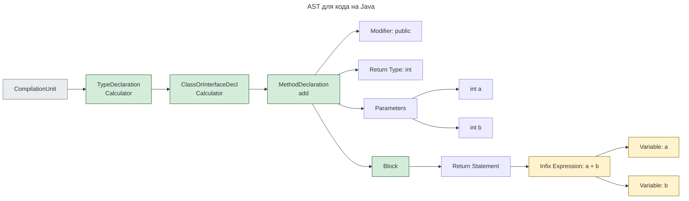

---
aliases:
  - Abstract Syntax Tree
  - AST
  - syntax tree
  - абстрактное синтаксическое дерево
  - дерево разбора
  - синтаксическое дерево
---

## Определение AST

> **Abstract Syntax Tree (AST)** — это дерево, представляющее структуру исходного кода, которое компилятор или IDE используют для:
- Анализа
- Проверки ошибок
- Рефакторинга
- Генерации байт-кода

---

## Пример AST для кода на Java

```java
public class Calculator {
    public int add(int a, int b) {
        return a + b;
    }
}
```

**Как выглядит AST**

Дерево:

```text
CompilationUnit
  TypeDeclaration [Calculator]
    Modifier: public
    ClassOrInterfaceDeclaration [Calculator]
      MethodDeclaration [add]
        Modifier: public
        Type: int
        Name: add
        Parameters
          Parameter [a: int]
          Parameter [b: int]
        BlockStatement
          ReturnStatement
            InfixExpression (+)
              VariableAccess: a
              VariableAccess: b
```

**Визуализация в Mermaid**



---

## Построение AST

1. Лексический анализ → разбивка на токены:
   - `public`, `class`, `Calculator`, `{`, `return`, `+`, `;`
2. Синтаксический анализ → построение дерева
3. Анализ семантики → проверка типов, ссылок
4. Генерация байт-кода

---

## Применение AST

| Инструмент | Использование |
|-----------|----------------|
| IDEA / Eclipse | Подсветка, автодополнение |
| Checkstyle / PMD | Поиск плохого кода |
| Lombok | Модификация AST при компиляции |
| Spring Annotation Processing | Генерация классов |
| ByteBuddy / ASM | Манипуляция байт-кодом |

---

## AST при обработке аннотаций

На примере Lombok:

```java
@Data
public class User {
    private String name;
    private int age;
}
```

→ [[lombok]] читает AST → добавляет геттеры и сеттеры → модифицирует дерево → генерирует новый класс

---

**Вывод**

AST — это внутреннее представление исходного кода, как его видит компилятор.

| Исходный код | AST |
|--------------|------|
| Текст, который пишет разработчик | Дерево, которое читает компилятор |

Без AST не работают:

- Компиляторы
- Линтеры
- Рефакторинг
- Генерация кода

---
