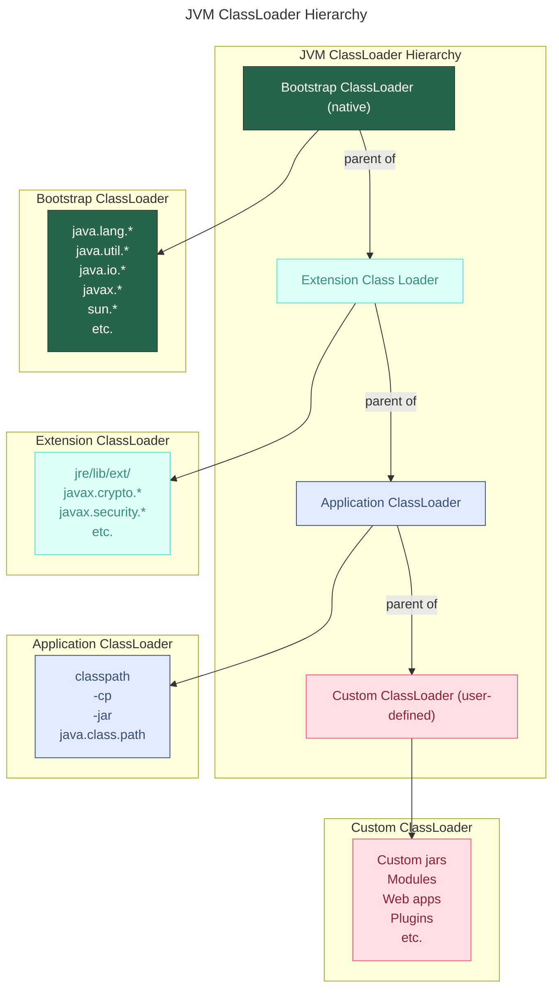

---
aliases:
  - Application ClassLoader
  - Bootstrap ClassLoader
  - ClassLoader
  - classloader hierarchy
  - ClassNotFoundException
  - CLASSPATH
  - Delegation Hierarchy
  - delegation model
  - dynamic class loading
  - Extension ClassLoader
  - java.lang.ClassLoader
  - Platform ClassLoader
  - Primordial ClassLoader
  - System ClassLoader
  - Uniqueness
  - UserDefined ClassLoader
  - Visibility
  - Видимость
  - Динамическая загрузка классов
  - загрузчик классов
  - Иерархия загрузчиков классов
  - Модель делегирования
  - Уникальность
---

> [!info] `java.lang.ClassLoader`

## Загрузчики классов

`ClassLoader` обеспечивает загрузку классов Java. Точнее, его наследники, так как `java.lang.ClassLoader` — абстрактный класс. Каждый раз, когда загружается какой-либо `.class`-файл, например вследствие обращения к конструктору или статическому методу класса, это действие выполняет один из наследников `ClassLoader`.

Системный загрузчик классов используется при запуске приложения командой `java <имя_класса>`:
- загружает все JAR из CLASSPATH;
  - из переменной среды либо параметра `-cp` утилиты `java`;
- вместо системного можно использовать собственного наследника `ClassLoader`.

Загрузчик классов выполняет две основные функции:
1. Загрузка классов — встроенные и пользовательские загрузчики классов загружают классы. Можно расширить `abstract class java.lang.ClassLoader` для реализации собственного загрузчика.
2. Поиск ресурсов, где ресурс — это данные: файл `.class`, информация о конфигурации, изображение и т. п.

### Динамическая загрузка классов

`ClassLoader` загружает классы динамически, то есть в процессе выполнения программы. С помощью `ClassLoader` можно загрузить класс, которого не было в момент компиляции. Виртуальная машина загрузит только файлы классов, необходимые для выполнения программы.

### Иерархия загрузчиков классов

Основные загрузчики в порядке иерархии:

1. **Bootstrap ClassLoader**
   - загружает основные библиотеки из папки `<JAVA_HOME>/jre/lib`;
   - также называется Primordial ClassLoader.
2. **Platform ClassLoader**
   - загружает платформозависимые расширения из модульной системы JDK;
   - загружает модули, указанные в системном свойстве `java.platform` или параметре `--module-path`;
   - загружает расширения из `<JAVA_HOME>/jre/lib/ext`;
   - до Java 9 назывался Extension ClassLoader.
3. **Application ClassLoader** — загружает классы приложения, зависящие от classpath.
   - загружает файлы из переменной среды classpath либо из опций командной строки `-classpath` или `-cp`;
   - также называется System ClassLoader.
4. \[UserDefined ClassLoader\] — может быть унаследован от системного.

> [!info] CLASSPATH
> Параметр в виртуальной машине Java или компиляторе Java, который определяет расположение пользовательских классов и пакетов. Параметр может быть задан либо в командной строке, либо через переменную среды.

### Модель делегирования загрузки класса

Когда происходит загрузка класса, системный загрузчик делегирует задачу платформенному, тот — бутстрап-загрузчику. Только если класс не был найден бутстрап-загрузчиком, а затем платформенным, выполняется попытка загрузки класса системным загрузчиком.

Следствие модели делегирования: любой загрузчик знает классы, которые были загружены им и его родителем.

Диаграмма иерархии загрузчиков:

### Принципы работы загрузчиков класса

- Видимость (_Visibility_): дочерний `ClassLoader` может видеть классы, загруженные его родителем, но не наоборот, что обеспечивает инкапсуляцию.
- Уникальность (_Uniqueness_): класс, загруженный родителем, не будет повторно загружен его дочерним классом, что повышает эффективность.
- Иерархия делегирования (_Delegation Hierarchy_): Application ClassLoader (дочерний) передает запрос на загрузку класса родителям — загрузчикам Platform и Bootstrap. Если они не могут найти класс, запрос передается обратно по цепочке, пока класс не будет найден или не будет выброшен `ClassNotFoundException`.
