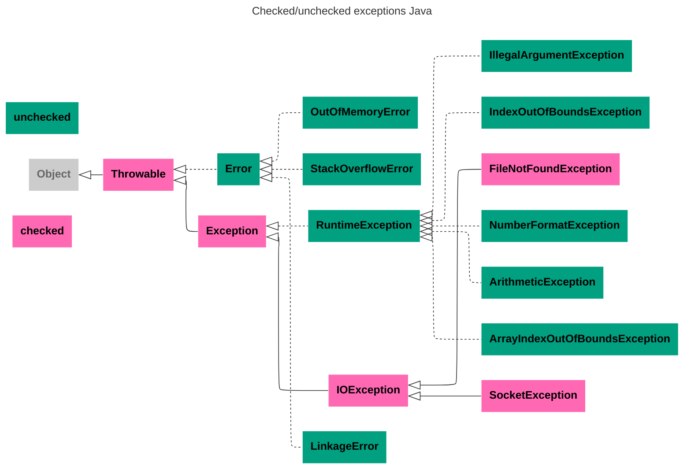

---
aliases:
  - addSuppressed
  - ArithmeticException
  - ArrayIndexOutOfBoundsException
  - AutoCloseable
  - catch
  - checked exception
  - checked exceptions
  - Error
  - Exception
  - exception hierarchy
  - exceptions
  - FileNotFoundException
  - finally
  - getSuppressed
  - IllegalArgumentException
  - IndexOutOfBoundsException
  - IOException
  - LinkageError
  - NumberFormatException
  - OutOfMemoryError
  - RuntimeException
  - SocketException
  - stack trace
  - StackOverflowError
  - StackTrace
  - Suppressed Exception
  - suppressed exceptions
  - throw
  - Throwable
  - throws
  - try
  - try-with-resources
  - unchecked exception
  - unchecked exceptions
  - иерархия исключений
  - исключения
  - непроверяемые исключения
  - подавленные исключения
  - проверяемые исключения
  - трассировка стека
---

## Иерархия исключений

Исключения бывают проверяемые и непроверяемые.

Диаграмма иерархии исключений:


## Класс Throwable

`java.lang.Throwable` реализует `Serializable`. В `throw`, `catch` и `throws` могут стоять исключительно `Throwable` или его наследники. Это «право» находиться в `throw`, `catch` и `throws` никак не отражено в исходном коде.

## Проверяемые исключения

Проверяемые (`checked`) исключения — те, которые можно обработать. Например:
- `IOException` — ввод некорректных данных;
- `FileNotFoundException`;
- `SocketException`.

Проверяемые исключения должны быть явно пойманы в теле метода или объявлены в секции `throws`.

## Непроверяемые исключения

Непроверяемые (`unchecked`) исключения могут быть выброшены в любой момент (во время выполнения), поэтому методы не обязаны явно ловить или объявлять их.

Непроверяемые исключения вызваны проблемами, которые не могут быть обработаны и обращены. Например, «закончилась память» — `OutOfMemoryError`. Мы не можем увеличить объем памяти в JVM — это необратимое событие.

- `RuntimeException` — базовый класс ошибок, которые возникают во время работы многих методов:
  - `ArithmeticException`, `IndexOutOfBoundsException`, `IllegalArgumentException`, `NumberFormatException` и т. д.
- `Error` — базовый класс непроверяемых событий, которые происходят во внешней среде:
  - `java.lang.StackOverflowError` — в стеке вызовов потока хранится больше информации, чем выделено под нее памяти;
  - `OutOfMemoryError`;
  - `java.lang.LinkageError` — возникает как проблема связывания, как правило на уровне `ClassLoader`, когда в системе несколько версий одного класса или несколько ClassLoader.

## Правила выбрасывания исключений `throw`

1. В сигнатуре метода надо указывать только `checked`-типы выбрасываемых исключений.
   - Допускается перечисление нескольких типов в `throws` через запятую.
2. Пессимистичный механизм: для всех проверяемых исключений надо предупреждать `throws` в сигнатуре о возможном исключении. Можно предупреждать о более высоком (родительском) исключении, чем выбрасываемое, и даже о том, чего нет. Не предупреждать либо предупреждать о меньшем — недопустимо.
3. Переопределение (overriding) методов с `throws` возможно только путем уточнения к более нижним типам выбрасываемых исключений, но не вверх к общим, так как нижние методы не смогут обработать более общие исключения, чем заявлены изначально.
4. Свойство `checked` / `unchecked` для пользовательских типов наследуется от родителя.
   - Обычно наследуется от типов `Throwable`, `Error`, `Exception`, `RuntimeException`.

### Конструирование исключений

- `try` — определяет блок кода, в котором может произойти исключение.
- `catch` — определяет блок кода, в котором происходит обработка исключения.
- `finally` — определяет необязательный блок кода, который выполняется в любом случае независимо от результатов выполнения блока `try`.
- `throw` — используется для возбуждения исключения.
- `throws` — используется в сигнатуре метода для предупреждения о том, что метод может выбросить исключение.

**Пример метода с обработкой исключений**

```java
public String input() throws MyException {
    // предупреждаем с помощью throws,
    // что метод может выбросить исключение MyException
    BufferedReader reader = new BufferedReader(new InputStreamReader(System.in));
    String s = null;
    // в блок try заключаем код, в котором может произойти исключение, в данном
    // случае компилятор нам подсказывает, что метод readLine() класса
    // BufferedReader может выбросить исключение ввода/вывода
    try {
        s = reader.readLine();
        // в блок catch заключаем код по обработке исключения IOException
    } catch (IOException e) {
        System.out.println(e.getMessage());
        // в блоке finally закрываем поток чтения
    } finally {
        // при закрытии потока тоже возможно исключение, например, если он не был
        // открыт, поэтому «оборачиваем» код в блок try
        try {
            reader.close();
            // пишем обработку исключения при закрытии потока чтения
        } catch (IOException e) {
            System.out.println(e.getMessage());
        }
    }
    if (s.equals("")) {
        // мы решили, что пустая строка может нарушить в дальнейшем работу нашей
        // программы, поэтому вынуждены прервать выполнение программы с генерацией
        // своего типа исключения MyException с помощью throw
        throw new MyException("String can not be empty!");
    }
    return s;
}
```

## Трассировка стека исключений

`StackTrace` — инструмент отладки. Показывает стек вызовов, то есть стек функций, которые были вызваны до возникновения исключения.

**Пример StackTrace**

```java
Exception in thread "main" java.lang.NullPointerException
  at com.example.myproject.Book.getTitle(Book.java:16)
  at com.example.myproject.Author.getBookTitles(Author.java:25)
  at com.example.myproject.Bootstrap.main(Bootstrap.java:14)
  ...
```

## try-with-resources

Порядок обработки в try-with-resources:
1. Выполняется основной блок `try` → возникает исключение.
2. Закрываются ресурсы в обратном порядке создания (LIFO).
3. Исключения из `close()` добавляются как подавленные (suppressed) к основному исключению.
4. Пробрасывается основное исключение со всеми подавленными.

## Подавленные исключения

**Suppressed Exception** (подавленное, дополнительное исключение) — это механизм в Java, который позволяет связать несколько исключений, возникших в разных частях кода, особенно в конструкциях try-with-resources.

**Сценарий возникновения**
Когда в блоке try-with-resources возникают исключения в основном блоке `try` и в одном или нескольких методах `close()` ресурсов.

**Методы для работы**
- `Throwable[] getSuppressed()` — возвращает массив подавленных исключений.
- `void addSuppressed(Throwable)` — добавляет подавленное исключение.

**Зачем это нужно**
- Не теряется информация об ошибках закрытия ресурсов.
- Сохраняется контекст всех возникших проблем.
- Упрощается отладка — видна полная картина ошибок.
- Основное исключение остается основным.

**Важные особенности**
- Ресурсы закрываются в обратном порядке создания.
- Только первое исключение из блока `try` считается основным.
- Все исключения из `close()` становятся подавленными.
- Если в `try` исключения нет, но есть в `close()`, исключение из `close()` становится основным.

**Пример**

```java
public class SuppressedExceptionExample {
    public static void main(String[] args) {
        try (Resource1 res1 = new Resource1();
             Resource2 res2 = new Resource2()) {
            throw new IOException("Ошибка в основном блоке try!");
        } catch (Exception e) {
            System.out.println("Поймано исключение: " + e.getMessage());
            // Получаем suppressed exceptions
            Throwable[] suppressed = e.getSuppressed();
            for (Throwable t : suppressed) {
                System.out.println("Suppressed: " + t.getMessage());
            }
        }
    }
}

class Resource1 implements AutoCloseable {
    @Override
    public void close() throws Exception {
        throw new Exception("Ошибка при закрытии Resource1");
    }
}

class Resource2 implements AutoCloseable {
    @Override
    public void close() throws Exception {
        throw new Exception("Ошибка при закрытии Resource2");
    }
}

/* Вывод:
Поймано исключение: Ошибка в основном блоке try!
Suppressed: Ошибка при закрытии Resource2
Suppressed: Ошибка при закрытии Resource1
*/
