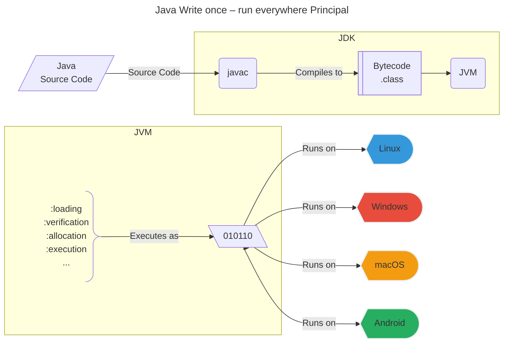
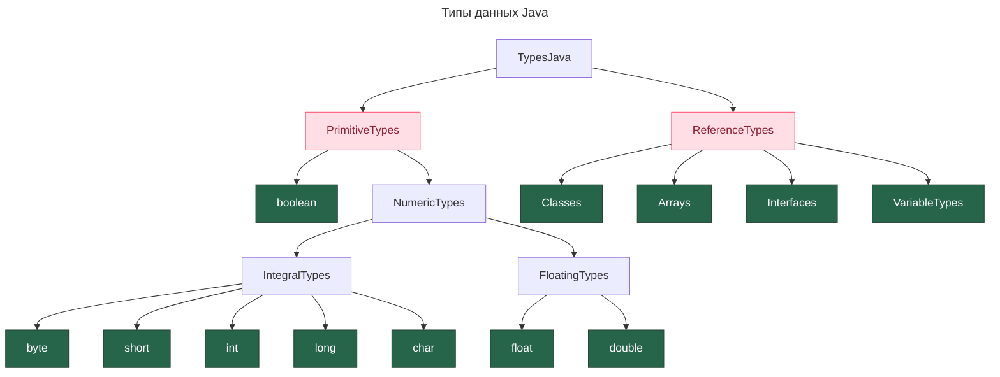

---
aliases:
  - assert
  - bitwise operators
  - boxing
  - break
  - casting
  - checked exception
  - continue
  - control flow statements
  - data types
  - do-while
  - Enum
  - exceptions
  - final
  - for
  - for-each
  - instanceof
  - Java core
  - Java keywords
  - lambda
  - lambda function
  - native
  - operators
  - primitive types
  - reference types
  - Runnable
  - Scanner
  - sealed
  - switch
  - synchronized
  - syntactic sugar
  - Thread
  - threads
  - Threads
  - transient
  - unboxing
  - unchecked exception
  - varargs
  - volatile
  - Write once, run everywhere
  - исключения
  - ключевые слова Java
  - лямбда-функция
  - операторы
  - побитовые операторы
  - потоки
  - приведение типов
  - примитивные типы
  - синтаксический сахар
  - ссылочные типы
  - типы данных
  - управляющие структуры
  - ядро Java
---

## Основы Java

### Write once, run everywhere

Девиз Java: между исходным кодом и исполнением стоит компиляция в байт-код, который передается в виртуальную машину Java (JVM), взаимодействующую с ОС. JVM можно адаптировать под любую ОС, что гарантирует работу одного кода на разных платформах.

Диаграмма платформенной независимости:


### Структура проекта

- Все методы всегда внутри класса — ООП, строгая типизация.
  - Статические методы можно вызывать, не создавая экземпляр класса.
  - `.class`-файлы могут содержать класс, абстрактный класс или интерфейс.
    - Инициализировать можно только класс.
    - Класс расширяет \[абстрактный\] класс.
    - Интерфейс может быть имплементирован в \[абстрактном\] классе.
- Типы файлов в проекте:
  - `.class` — бинарный код, который получается в результате компиляции `.java`;
  - `.java` — исходный код в `src/main/java` (папка проекта);
  - `.class` — байткод, скомпилированный из `.java`, в папке `target/`;
  - `MANIFEST.MF`.
- `public static void main(String[] args)` — точка входа в приложение.
  - если в проекте несколько классов с таким методом:
    1. можно указать явно при запуске: `java -cp jar-file-name main-class-name [args …]`;
    2. можно объявить явно в файле `MANIFEST.MF`: `Main-Class: org.sample.HelloWorldApp`.
- Пакет `java.lang` — база языка. Импортируется в каждый класс по умолчанию, поэтому нет необходимости импортировать его отдельно. Содержит, например, `Thread`, `String`.
- `null` — специальное значение, означающее отсутствие ссылки на объект.

## Управляющие структуры

### Операторы

#### Операторы перехода

- `break` — прерывает цикл.
- `continue` — переходит к началу следующей итерации, пропуская все операторы ниже.
- `return` — возвращает значение вызывающему методу.

**Пример операторов перехода**

```java
int i = 0;
while(i<=99){
    i += 3;
    System.out.println(i);
    if (i>60)
        break; // прервать весь цикл
    if(0==i%2){
        continue; // прервать текущую итерацию цикла
    }
    System.out.println("this number is odd");
}
```

#### Операторы цикла

`do...while` гарантирует, что тело цикла будет выполнено минимум один раз, независимо от условия выхода из цикла, так как итерация выполняется до проверки условия выхода.

**Пример циклов**

```java
// FOREACH
String[] strArrOne = {"один", "два", "три"};
for (String str:strArrOne) {
    System.out.println(str);
}
for (int j=5; j>=0; j--)
    System.out.println(j);
int i = 1;
while (i<5){
    i++;
    System.out.println(i);
}
int userInput;
do{
    System.out.println("give me int five");
    userInput = input.nextInt();
}while (5 != userInput );
```

#### Условный оператор

**Пример условного оператора и switch**

```java
// Условный оператор
if( i > 10 )
    System.out.println("var i is over 10");
else if( i > 50 )
    System.out.println("var i is over 50");
else{
    i = 50;
    System.out.println("var i is equal to 50");
}
int day = 4;
switch (day) {
    case 6:
        System.out.println("Today is Saturday");
        break;
    case 7:
        System.out.println("Today is Sunday");
        break;
    default:
        System.out.println("Looking forward to the Weekend");
}
```

#### Специальные операторы

##### Оператор проверки утверждений `assert`

Оператор проверяет утверждение, выбрасывает `AssertionError` и прекращает выполнение. Чтобы ассерты работали, при запуске VM нужна директива `-ea` или `-enableassertions`.

**Пример assert**

```java
public static void main(String[] args)
 {
    int x = -1;
    assert x >= 0;
    assert x >= 0 : "var x is more than expected";
 }
```

##### Проверка принадлежности к классу `instanceof`

`instanceof` проверяет, является ли объект экземпляром указанного класса.

**Пример instanceof**

```java
if (account instanceof Account){...}
```

#### Простые операторы

`+, -, *, /, %` — арифметические операторы; `%` — остаток от целочисленного деления.

#### Инкремент и декремент

`++i`, `--i` — префиксная запись; `i++`, `i--` — постфиксная запись.

Разница в том, что в постфиксной записи инкремент выполняется после того, как значение переменной будет считано (передано).

#### Операторы присваивания

| Оператор | Описание |
| -------- | -------- |
| `=` | Простой оператор присваивания: присваивает значение из правой части операндов левому операнду |
| `+=` | Присваивание со сложением: прибавляет правый операнд к левому и присваивает результат левому |
| `-=` | Присваивание с вычитанием: вычитает правый операнд из левого и присваивает результат левому |
| `*=` | Присваивание с умножением: умножает правый операнд на левый и присваивает результат левому |
| `/=` | Присваивание с делением: делит левый операнд на правый и присваивает результат левому |
| `%=` | Присваивание с остатком: присваивает левому операнду остаток от деления левого на правый |
| `<<=` | Присваивание со сдвигом влево |
| `>>=` | Присваивание со сдвигом вправо |
| `&=` | Присваивание с побитовым «И» (AND) |
| `^=` | Присваивание с побитовым исключающим «ИЛИ» (XOR) |
| `\|=` | Присваивание с побитовым «ИЛИ» (OR) |

#### Логические операторы

`&&`, `||`, `!` — И, ИЛИ, НЕ.

#### Операторы сравнения

`==`, `!=`, `>`, `<`, `>=`, `<=`.

#### Побитовые операторы

- `&` — побитовое И;
- `|` — побитовое ИЛИ;
- `^` — побитовое исключающее ИЛИ;
- `~` — побитовое дополнение;
- `<<` — сдвиг влево;
- `>>` — сдвиг вправо;
- `>>>` — сдвиг вправо с заполнением нулями (без знака).

**Пример побитовых операторов**

```java
public static void main(String args[]) {
   int a = 60;    /* 60 = 0011 1100 */
   int b = 13;    /* 13 = 0000 1101 */
   int c = 0;
   c = a & b;     /* 12 = 0000 1100 */
   System.out.println("a & b = " + c );
   c = a | b;     /* 61 = 0011 1101 */
   System.out.println("a | b = " + c );
   c = a ^ b;     /* 49 = 0011 0001 */
   System.out.println("a ^ b = " + c );
   c = ~a;        /*-61 = 1100 0011 */
   System.out.println("~a = " + c );
   c = a << 2;    /* 240 = 1111 0000 */
   System.out.println("a << 2 = " + c );
   c = a >> 2;    /* 215 = 1111 */
   System.out.println("a >> 2  = " + c );
   c = a >>> 2;   /* 215 = 0000 1111 */
   System.out.println("a >>> 2 = " + c );
}
```

### Потоки

Для создания потока класс должен наследоваться от `Thread` [[java-thread]].

У всех потоков есть приоритет, он задается в диапазоне 1–10. Приоритет по умолчанию — 5.

**Пример наследования Thread**

```java
class Loader extends Thread {
    public void run() {
        System.out.println("Hello");
    }
}
class MyClass {
    public static void main(String[ ] args) {
        Loader obj = new Loader();
        obj.start();
    }
}
```

- `void run()` — описывает действия в потоке;
- `.start()` — запускает поток;
- `.sleep(int delay)` — ставит поток на паузу;
- `.setPriority(int priority)` — устанавливает приоритет потока.

Другой способ создания потока — имплементация интерфейса `Runnable`. Он подходит, когда класс с потоком нужно наследовать от родителя.

**Пример Runnable**

```java
class Loader implements Runnable {
    public void run() {
        System.out.println("Hello");
    }
}
class MyClass {
    public static void main(String[ ] args) {
        Thread t = new Thread(new Loader());
        t.start();
    }
}
```

### Исключения

Исключения бывают контролируемые (`checked`) и неконтролируемые (`unchecked`, runtime). Разница в том, что контролируемые исключения проверяются на этапе компиляции, а неконтролируемые — на этапе выполнения.

[[exception]]

**Перехват исключения**

```java
public class MyClass {
    public static void main(String[ ] args) {
        try {
            int a[ ] = new int[2];
            System.out.println(a[5]);
        } catch (Exception e) {
            System.out.println("An error occurred");
        } catch (InputMismatchException e) {
            System.out.println("Mistake: wrong value type");
        }
    }
}
```

**Выбрасывание исключения**

```java
public class Program {
    static int div(int a, int b) throws ArithmeticException {
        if(b == 0) {
            throw new ArithmeticException("Division by Zero");
        } else {
            return a / b;
        }
    }
    public static void main(String[] args) {
        System.out.println(div(42, 0));
    }
}
```

### Приведение типов — casting

**Пример приведения типов**

```java
public static void main(String[] args) {
    double a = 42.571;
    int b = (int) a;
    System.out.println(b); // 42
}
```

#### Boxing и unboxing

**Boxing** — создание объекта-оболочки из переменной примитивного типа. Обратная операция — получение значения примитивного типа из объекта-оболочки — называется **unboxing**.

**Пример boxing/unboxing**

```java
int a = 5; // Integer a = 5; -- упакованный вариант переменной boxed
ArrayList list = new ArrayList();
String s = a.toString(); // ERROR, когда unboxed
list.add(a)             // OK, но произойдет автоупаковка
                        // и в коллекцию будет помещен Integer
```

Компилятор по необходимости делает автоупаковку и автораспаковку.

**Пример автоматической упаковки**

```java
int a = 5;
Integer b = 10;
a = b;             // OK, автораспаковка
b = a * 123;       // OK, автоупаковка
```

Все объекты-оболочки — неизменяемые (`immutable`) типы: при присваивании нового значения фактически создается новый объект на замену прежнего.

## Типы данных

Примитивные типы данных всегда хранят в себе значение. Ссылочные типы всегда начинаются с большой буквы, так как являются классами.

Диаграмма иерархии типов:


### Примитивные типы

- `byte`, `short`, `int`, `long` — целочисленные типы;
- `float`, `double` — вещественные типы;
- `boolean` — логический тип;
- `char` — символьный тип;
- `\[ref\]` — ссылка.

Объем памяти, занимаемый примитивными типами Java, описан в заметке [[computer-memory|computer-memory]].

### Ссылочные типы

К ним относятся все классы, интерфейсы, массивы, а также тип `String`. Они не хранят значение, а являются ссылкой на объект заданного типа.

- Enum type:
  - `Enum` — специальный тип для определения коллекций констант.

**Пример Enum**

```java
public class Program {
   enum Rank {
      SOLDIER,
      SERGEANT,
      CAPTAIN
   }
   public static void main(String[] args) {
      Rank a = Rank.SOLDIER;
      switch(a) {
         case SOLDIER:
             System.out.println("Soldier says hi!");
             break;
         case SERGEANT:
             System.out.println("Sergeant says Hello!");
             break;
         case CAPTAIN:
             System.out.println("Captain says Welcome!");
             break;
      }
   }
}
```

[[record-type]]

### Ссылки на объекты

[[java-reference]]

## Hello World

**Пример Hello World**

```java
public class HelloWorld {
    public static void main(String [] args){
        System.out.println("hello world");
    }
}
```

## Файлы

### Чтение файлов

```java
import java.io.File;
import java.util.Scanner;

public class MyClass {
    public static void main(String[] args) {
        String pathname = "C:\\sololearn\\test.txt";
        File x = new File(pathname);
        if (x.exists()) {
            System.out.println(x.getName() + " exists!");
        } else {
            System.out.println("The file does not exist");
            try {
                Scanner sc = new Scanner(x);
                while (sc.hasNext()) {
                    System.out.println(sc.next());
                }
                sc.close();
            } catch (FileNotFoundException e) {
                System.out.println(e);
            }
        }
    }
}
```

### Запись в файл

Запись в файл методом из пакета `java.io`.

```java
import java.io.File;
import java.io.IOException;

try {
    FileUtils.writeStringToFile(new File("1.txt"), "test", StandardCharsets.UTF_8, true);
} catch (IOException e) {
    System.out.println(e);
}
```

Стандартные утилиты для записи файлов находятся в пакете `java.util.Formatter`.

**Пример записи через Formatter**

```java
import java.io.File;
import java.util.Scanner;
import java.util.Formatter;
public class MyClass {
    public static void main(String[ ] args) {
        try {
            Formatter f = new Formatter("test.txt");
            f.format("%s %s %s", "1","John", "Smith \r\n");
            f.format("%s %s %s", "2","Amy", "Brown");
            f.close();
            File x = new File("test.txt");
            Scanner sc = new Scanner(x);
            while(sc.hasNext()) {
                System.out.println(sc.next());
            }
            sc.close();
        } catch (Exception e) {
            System.out.println("Error");
        }
    }
}
```

Буферизованная запись в файл.

**Пример буферизованной записи**

```java
FileWriter fw = null;
try {
    fw = new FileWriter(fileName);
    BufferedWriter bw = new BufferedWriter(fw);
    bw.write("looong data");
    bw.flush();
} catch (IOException e) {
    e.printStackTrace();
} finally {
    try {
        if (fw != null) {
            fw.close();
        }
    } catch (IOException e) {
        e.printStackTrace();
    }
}
```

## Ввод данных

**Пример ввода через Scanner**

```java
import java.util.Scanner;

Scanner input = new Scanner(System.in);
System.out.println(input.next());
```

## Ключевые слова Java

### Метод `default`

Используется в интерфейсах. Позволяет описать реализацию метода, которая будет автоматически унаследована потомками (имплементаторами). Это позволяет владельцу интерфейса расширять возможности реализаций без изменения самих реализаций.

### Поле `transient`

Поле, помеченное ключевым словом `transient`, не сериализуется.

### Метод `native`

Указывает, что программная сущность реализована на другом языке (платформозависимый код).

### Метод `synchronized`

Метод, который может быть заблокирован для других потоков, пока первый поток его использует.

### Поле `volatile`

Говорит о том, что данное поле используется методами блокирующей синхронизации. Модификатор обозначает поле, видимое для потоков.

### Поле и метод `static`

`static`-поле — общее для всех экземпляров класса. `static`-метод можно вызвать без инициализации класса.

### Класс `final`

Класс, который не может быть расширен (унаследован).

### Поле `final`

Поле, которое не может быть изменено, — константа.

### Класс `sealed`, `non-sealed`, `permits`

`sealed` («запечатанный») класс запрещает расширение (наследование) для любых субклассов, кроме указанных в модификаторе `permits`. Наследник запечатанного класса всегда должен быть `final`, `sealed` либо `non-sealed`.

**Пример sealed класса**

```java
public sealed class Device permits Computer, Mobile {
    //...
}
public final class Computer extends Device {
    //...
}
```

Запечатанными могут быть интерфейсы и записи. Фича поддерживается с JDK 17.

### Класс `abstract`

Класс, который не требует полной реализации и не может создавать экземпляры.

### Метод `abstract`

Метод, который не требует реализации. Если в классе есть хотя бы один `abstract`-метод, класс должен быть `abstract`.

## Синтаксический сахар

### Троеточие в типе параметра (varargs)

Означает, что на вход может поступить любое количество объектов заданного типа либо массив; в теле метода они доступны как массив объектов.

**Пример varargs**

```java
public static void dotsParameterType(String... strings) {
    System.out.println("input is " + String.join(", ", strings));
}
public static void main(String[] args) {
    dotsParameterType();
    dotsParameterType("one", "two", "three");
    dotsParameterType("solo");
    dotsParameterType(new String[]{"a", "b", "c"});
}
```

### Троичный оператор

**Пример троичного оператора**

```java
//variable = (condition) ? expressionTrue :  expressionFalse;
var x = 10;
Boolean isEven = (0==x%2) ? true : false;
System.out.println(isEven);
```

### Объявление нескольких переменных через запятую

**Пример объявления**

```java
int a=1, b=2, c=3;
System.out.println(a+b+c);
```

### Стрелочный оператор `->`

Служит для обозначения стрелочной функции — лямбда-выражения.

**Пример стрелочного оператора**

```java
BiFunction<Integer, Integer, Integer> sum = (a, b) -> Math.abs(a + b);
System.out.println(sum.apply(-722, -55));
```

#### Лямбда-функция

Лямбда-выражения (анонимные функции) — блоки кода с параметрами, которые можно вызвать из другого места программы. Они называются анонимными, потому что, в отличие от функций, не имеют имен.

## Ссылки

- [[class]]
- [[generic]]
- [[record-type]]
- [[exception]]
- [[jdk-jls-jni]]
